# 【第044天 银川（二）】羊与牛与面与酒

- 原文链接: https://mp.weixin.qq.com/s?__biz=MzA3MTM2Mjk3NA==&mid=2247503816&idx=1&sn=12505207116cdc2fbc915ae93354a533&chksm=9f2c3f39a85bb62fa77c96a542c9669dd874c9feedec4b562e53eaaa8d962293c9ff5c3f6263&scene=21
- 作者: 宇哥食行记
- 发布时间: 未知
- 图片数量: 16

怀着一肚子的肉香睡去，又在一脑子的吃肉念想中醒来。纵使塞上江南的八月与真正江南的八月一般暑气逼人，也抹杀不了来到宁夏对肉的狂热。所以今日之食，仍各个与肉有关。

其实热一点又有何不好呢？吃进去的热量都随着汗水排除体外蒸发掉了。我想，只要汗出得厉害一些，卡路里就追不上我。

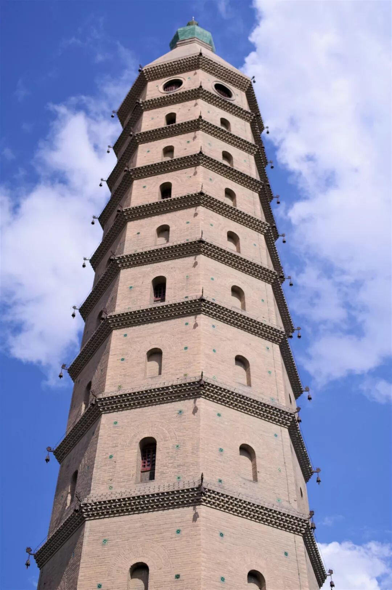

（西塔 / 承天寺塔）

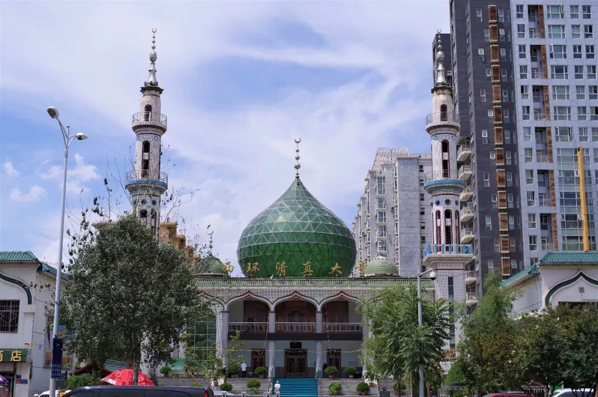

（西环清真大寺）

（1）

羊棒骨

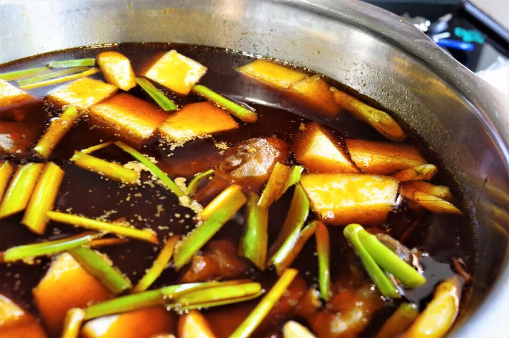

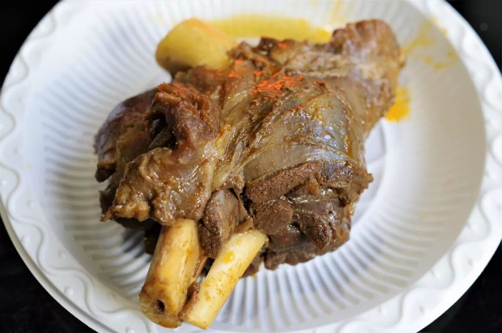

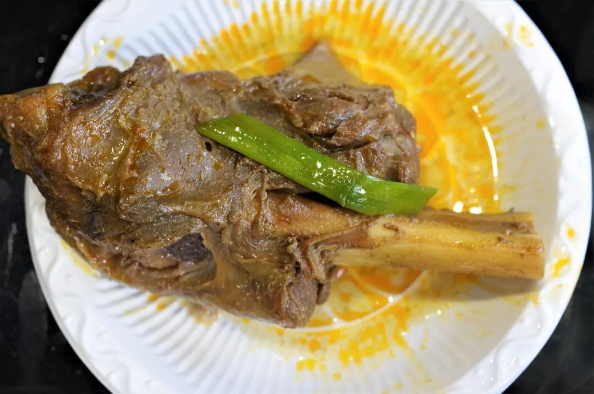

如果清蒸羊肉、手抓羊肉之余，仍旧对羊肉意犹未尽，那不妨来试试更有种大口吃肉、快意人生之感的羊棒骨吧。常见的羊棒骨吃法一为酱制、二为炖煮，羊棒骨火锅便属于这第二种。

与其他部位的羊肉不同，羊棒骨上百分之九十九是纯瘦肉，剩下百分之一是包裹其上的筋，想要体验吃纯肉的快感，羊棒骨是再好不过的选择。抓起一块羊棒骨，咬上一口，轻轻一挪动嘴和手就可顺着纤维之势剥离下一大块纯瘦肉，富有韧劲而不柴，汤汁深入肉纤维的缝隙之中，味道也绝不寡淡。要是有这爱好，不妨试着吸吸这骨筒中的骨髓，若是成功，就又能获得另一种味觉体验了呢。

（2）

牛肉馅饼

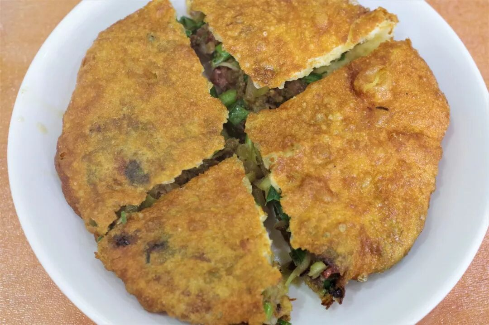

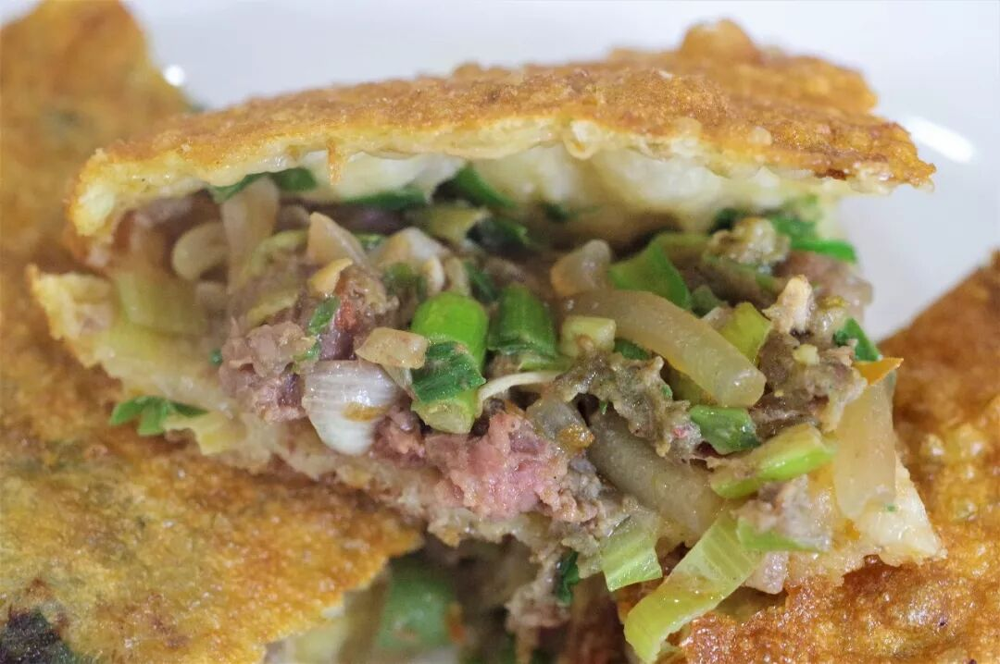

馅饼是中国北方极为常见的面食种类之一，牛肉馅饼则是北方回民的拿手好戏。炸得焦酥的饼皮薄而脆，内里则是充实饱满的牛肉、羊葱、蒜苗、粉条混合而成的馅儿。咬上一大口，嘴唇瞬间油光发亮，口腔内则充溢着油香，各种食材碰撞出多重口感，吃上一个顶饱一上午。不过，馅饼普遍油气较大，配上一碗粥或是一碗豆浆等可以有效地缓解油腻之感。

（3）

羊肉搓面

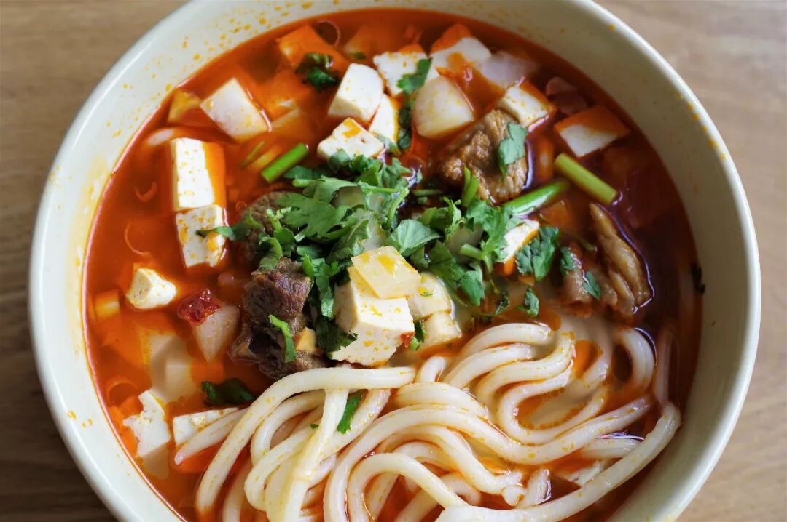

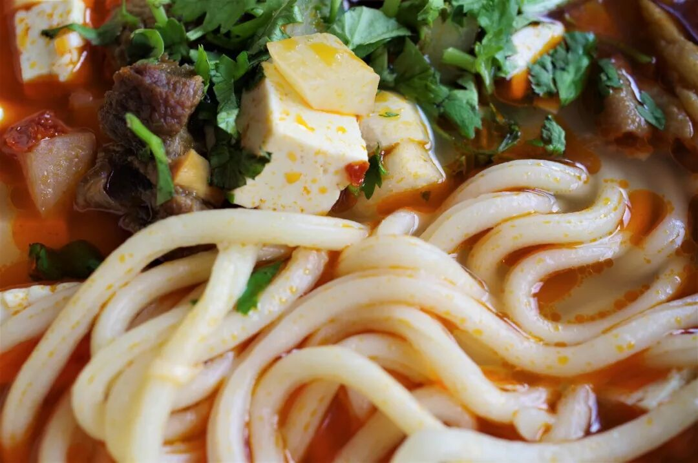

搓面，顾名思义，是将扁平的面在案板上搓圆而成的面条，粗如筷子，与西北常见的拉条子在形状上较为相似。搓面的口感十分劲道，是银川乃至整个宁夏人的心头好之一。

羊肉搓面在银川最为普遍。羊骨熬制的汤底，加上土豆丁、豆腐丁、羊肉丁等组成的臊子，最后再浇上一勺点睛之笔——羊油辣子，便是一碗香气逼人的羊肉搓面。油辣咸香的汤，爽脆饱满的臊子，配上爽滑劲道的搓面，够得上一碗西北面条的顶配。

（4）

卤羊蹄、烤羊肉、西夏啤酒

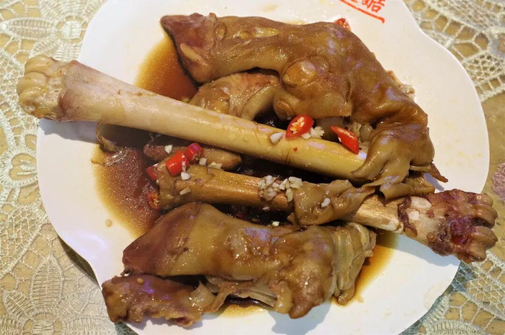

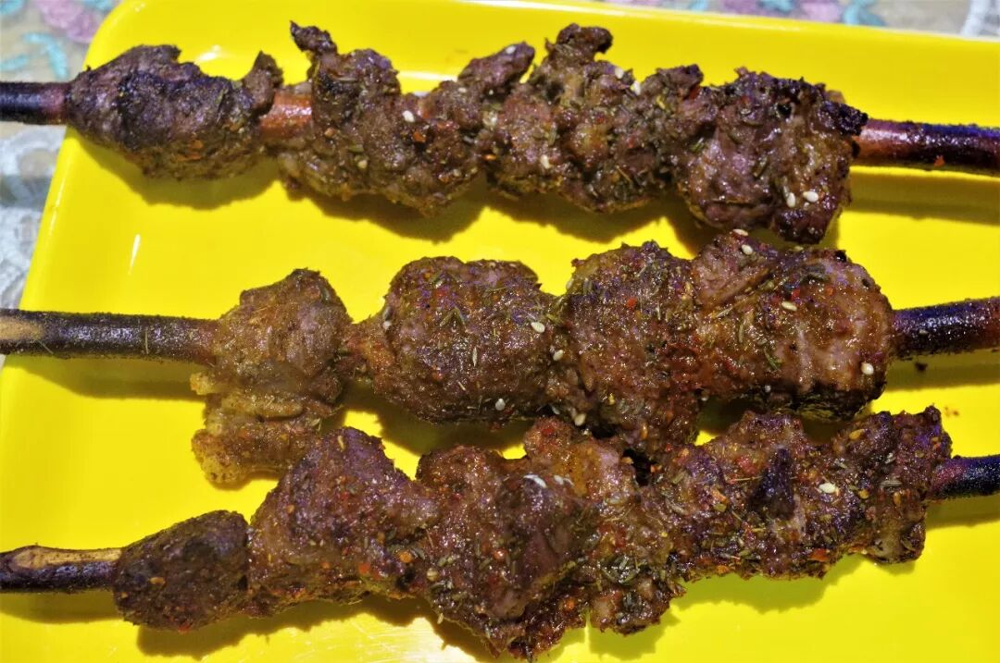

在如此以羊肉为豪的宁夏，几乎每一个城市都有成片的烧烤夜市，满足这里的人对肉无穷无尽的狂欢。无论是酸辣酱香的卤羊蹄，还是肉嫩味厚的烤羊肉，无需花上太多钱便可大饱口福。

当然，在宁夏撸串，又怎少得了宁夏的“夺命两瓶”西夏啤酒呢。

至于烤羊宝之类，就不放上来了，羞。

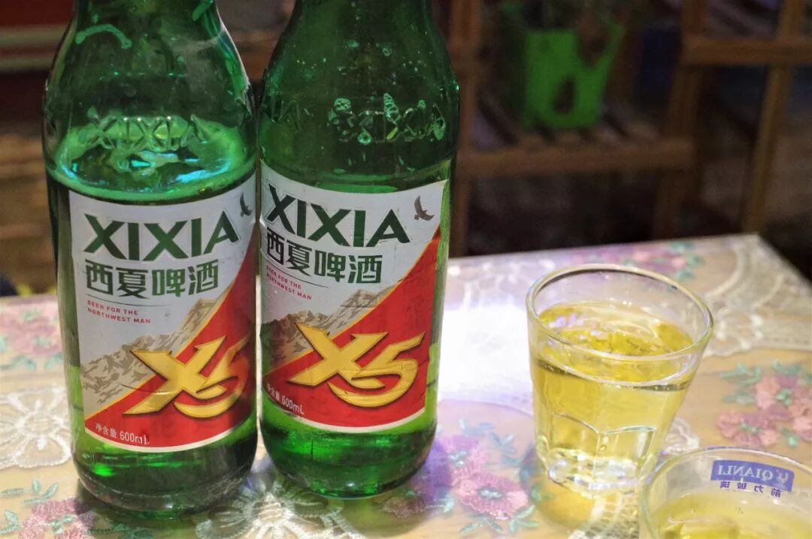

还记得昨天的迎宾楼冷饮吗？实在拗不过其强烈的诱惑，今天又去冰爽了一番，只恨自己不是常住银川呐。

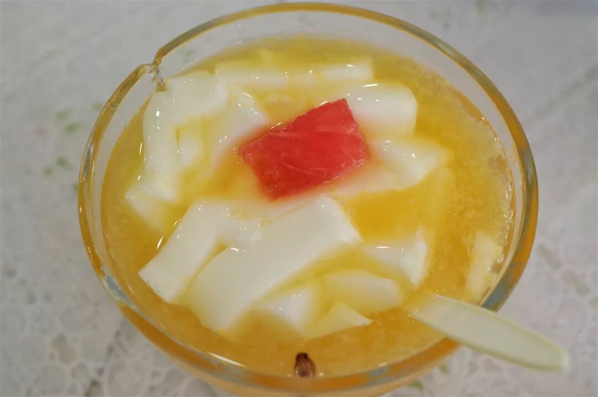

（奶豆腐）

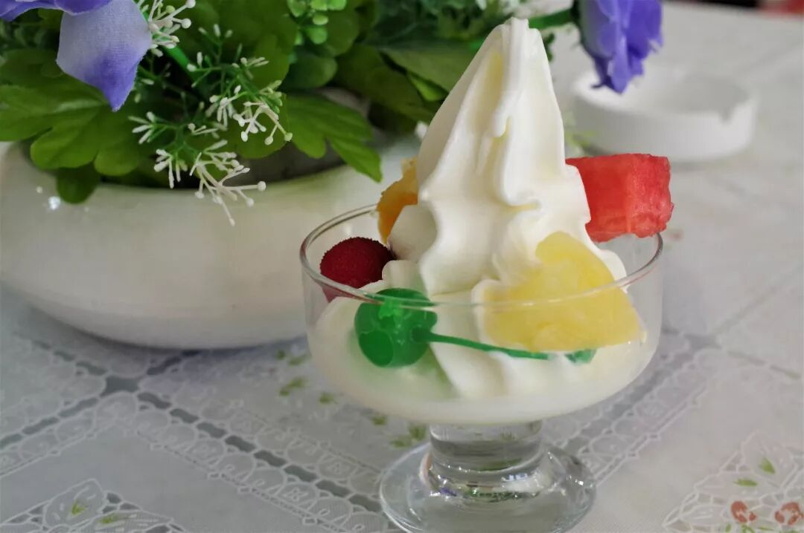

（水果冰淇淋）

两天的时间很短暂，借我一千个熊胆也不敢说我把银川之味悉数收入了囊中。但仅仅两天，我仍敢说是嘴满胃满。面条还可以有更多变化，羊肉也还有更多变化，这些更多更多，我想要交给以后的自己，再行探索了。

不过银川，我记住你了。对一个吃货而言，味道的记忆，总是最深的。即使五年八年后，你已改头换面、街楼翻新，只要一入口，今天的每一个脚步、每一次咀嚼，一定会跃然眼前，就像昨天。

想知道我在干啥，请点这个链接：吃货的决心——555天中国饮食探索之行

想知道我要去哪，请点这个链接：555天行程计划（2018-07-26更新）

再，再喝一瓶吧。

（长按识别二维码点击关注哦）

 var first_sceen__time = (+new Date()); if ("" == 1 && document.getElementById('js_content')) { document.getElementById('js_content').addEventListener("selectstart",function(e){ e.preventDefault(); }); }

 if ("0" == 1) { document.addEventListener("keydown",function(e){ if ((e.metaKey || e.ctrlKey) && (e.key === 'c' || e.key === 'C' || e.key === 'x' || e.key === 'X' || e.key === 'a' || e.key === 'A')) { if (e.target.tagName === 'INPUT' || e.target.tagName === 'TEXTAREA') { return; } e.preventDefault(); } }); document.addEventListener("copy",function(e){ var sel = window.getSelection(); var content = document.getElementById('js_content'); if (sel && sel.rangeCount > 0 && content && content.contains(sel.getRangeAt(0).commonAncestorContainer)) { e.preventDefault(); } }); }

预览时标签不可点

微信扫一扫

关注该公众号

知道了 (javascript:;)
