# 【第045天 石嘴山·平罗&大武口】为爆炒羊羔肉与凉皮而来

- 原文链接: https://mp.weixin.qq.com/s?__biz=MzA3MTM2Mjk3NA==&mid=2247503815&idx=1&sn=c1337a8c83135b4d91d52ed9c86c8b63&chksm=9f2c3f36a85bb620d01ff18fcb506d7974800c7121e1e7bc8f4be8fa1a155b88e140572d7d9f&scene=21
- 作者: 宇哥食行记
- 发布时间: 未知
- 图片数量: 17

认识石嘴山，已经有很多年了，当年的地理课上所传授的知识，不知道如今是否还在高中课本之中？尽管石嘴山与煤矿，已然辉煌不再。

其实在宁夏，鲜有人会直呼石嘴山市之名，若是指代其城区，往往是叫做大武口。我也入乡随俗，将其单独列出来，与平罗县并列。大武口乃建国后才建设的城市，与其他移民城市一样，几乎没有自己独特的饮食文化，除了一种在宁夏家喻户晓的食物。而平罗，则拥有着比大武口长得多的历史，也有着在宁夏相对独特的一些地方饮食。

一日两城，奔波的劳累更加凸显。但事实证明，是值得的。

（平罗钟鼓楼）

（大武口区）

（1）

黄渠桥爆炒羊羔肉

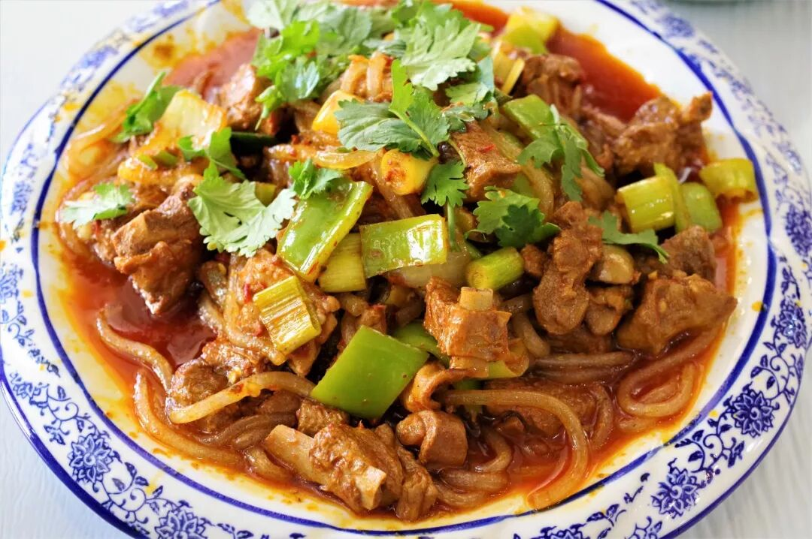

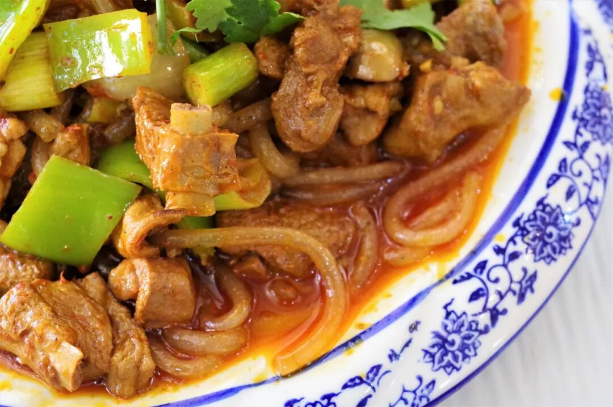

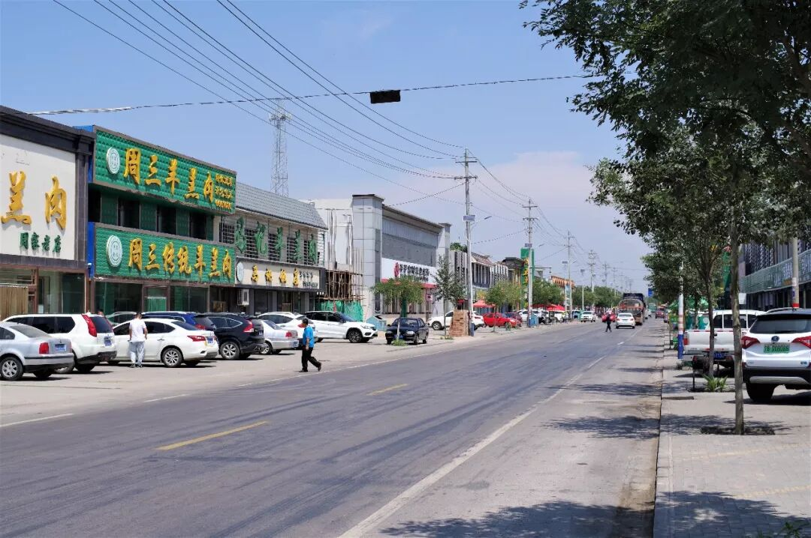

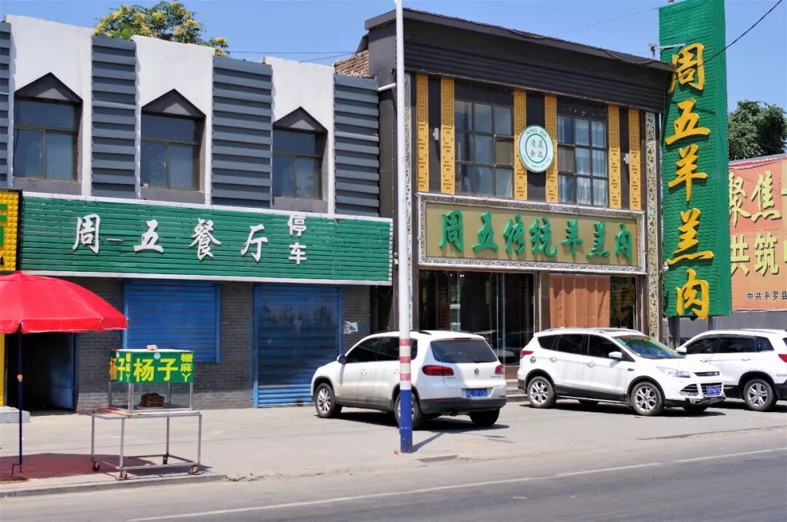

要致富，先修路。要吃饭，还是路。这是又一种诞生在国道旁的美食，即使直到今天，宁夏人仍然相信平罗县黄渠桥镇G109国道旁的爆炒羊羔肉才是最地道的。所以这一次，我也专程前往黄渠桥镇，寻找这一盘火辣的味道。

随着大巴车进入黄渠桥镇，这种吃羊羔肉的阵势毫无掩饰地展露出来，沿街一家又一家挂着“羊羔肉”招牌的餐厅依次排开，没有吆喝也没有拉客，只待路过的车辆与食客驻足光顾。好在心里有谱，走进了计划中的那一家，若是毫无准备而来，恐怕要对着这一堆门脸相似的食肆面露难色了。

“来上一斤爆炒，再来一碗八宝茶。”熟练地点上菜后便坐下了。没过一会儿，一碗硕大而油量的羊羔肉便被端了上来，这凌乱的食材、粘在盘边的油点，尽显西北饮食不拘小节的作风。口水已经在舌尖打转，赶紧夹上一块羊羔肉放入嘴中，咸香油辣之味已完全渗入肉中，再加上羊羔肉嫩而韧的口感，大口吃肉的斗志立马被激发出来。最后的姿态便是，吃几口菜喝一口茶，吃几口菜喝一口茶，面对这样一盘粗而不简的菜，我也顾不上吃相了。

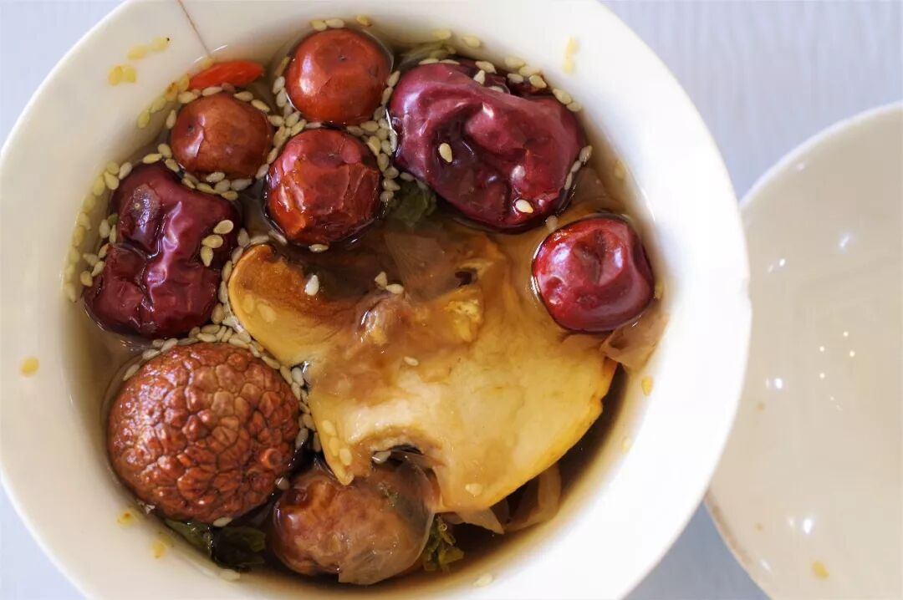

（2）

糖麻丫

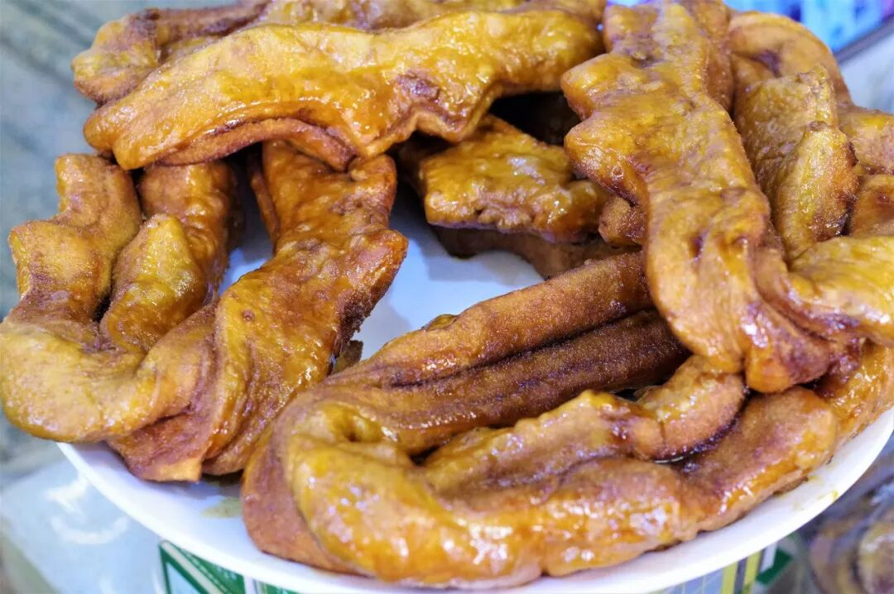

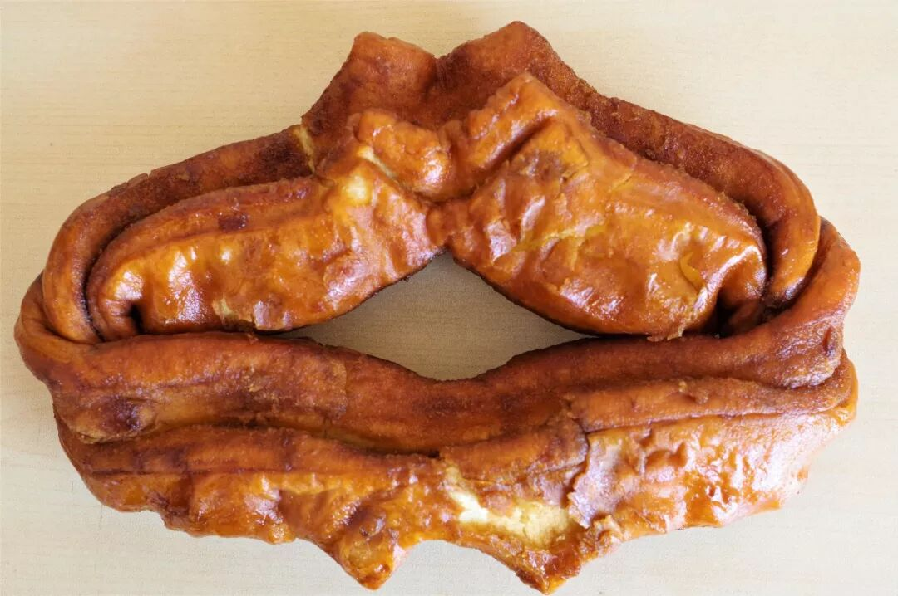

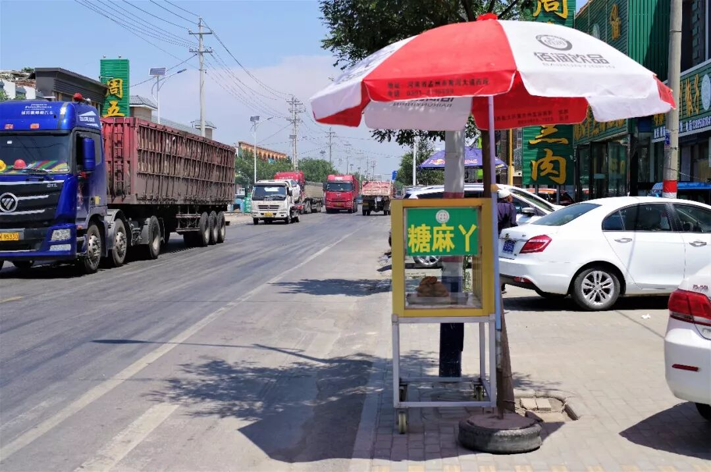

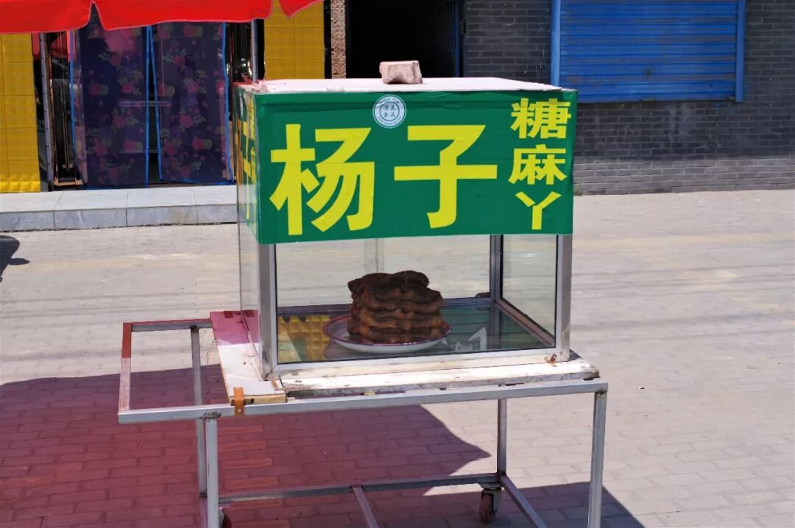

在黄渠桥镇，除了爆炒羊羔肉外，还能频繁见到一种叫做“糖麻丫”的甜食，是当地极富特色的清真油点。说这糖麻丫，光是听到这俏皮的名字就不免让人对其产生好奇，再一看到这可爱的外形，就更让人跃跃欲试。实际上，糖麻丫并非什么复杂的玩意儿，仍是一种油炸的面点，类似于回民常制的油香裹上了一层糖衣。吃起来外壳粘、内里绵，味道油润香甜，比起没有味道的油香、馓子、麻花等更能迅速抓住食客的舌尖。

（3）

驴肉调和

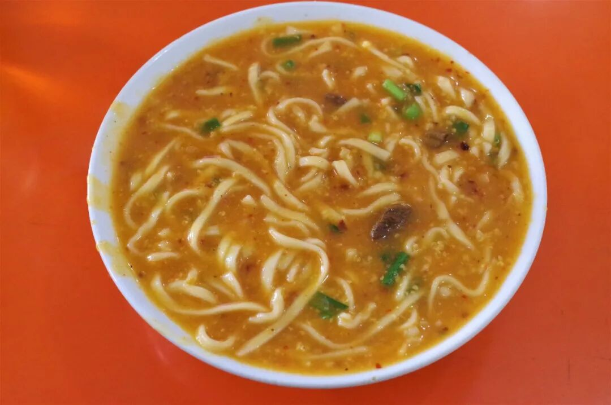

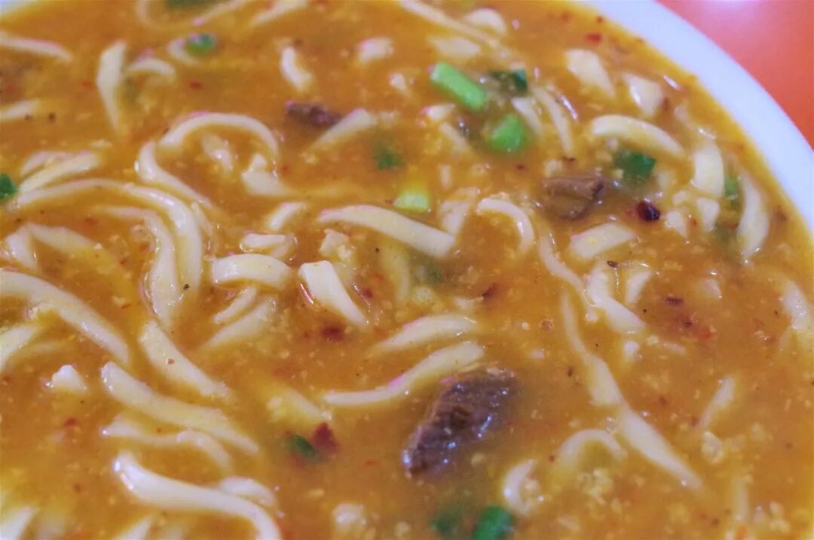

驴肉调和？可能没有人能仅通过这个名字猜出这是一种什么食物。其实，调和是平罗县特有的一种面食的名称，类似于糊糊面、糊涂面等，面汤是糊状的卤汁，而面条则短而细，十分软糯，入口即化，与西北常见的各类面条截然不同。由于这种特殊的口感，食用时甚至无需筷子而直接用勺子舀食即可，一口口酸辣浓稠下肚，不消多时便发热出汗，身心舒爽。

（4）

大武口凉皮

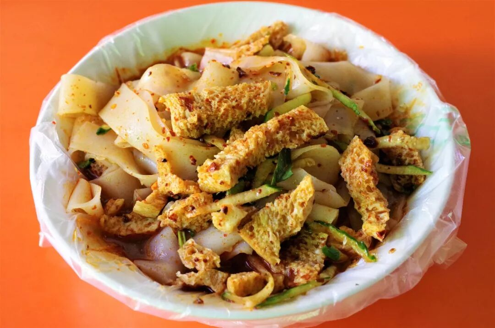

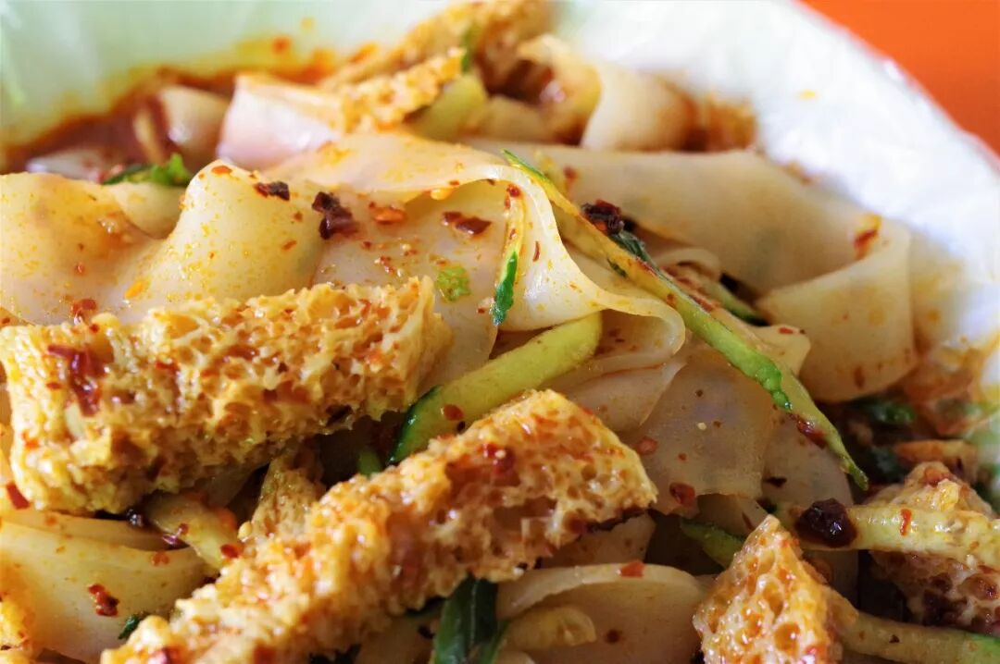

我不知道这是巧合还是规律，仿佛北方的移民型城市特别容易发展出凉皮这一类的特色饮食，看到大武口凉皮很自然便联想到了石河子凉皮。我并未吃遍北方的凉皮，所以不能去比较大武口凉皮去其他凉皮孰优孰劣，但至少在宁夏，大武口凉皮就是凉皮中的头牌。

如牛肉面之于兰州，热干面之于武汉，今天的大武口，已经彻底被凉皮所占领，不顾方向随便走上几步，便是一家凉皮店。从外观上说，大武口凉皮与西北常见的凉皮并无显著区别，仍是凉皮、面筋、黄瓜丝的组合，但吃上一口，就发现其独特之处了。除了基本的蒜香味、醋酸味和辣子味，这儿的凉皮还有一种说不出的特殊味道，仿佛是从辣子中发出又仿佛又不是。但这种微妙的差距，或许只有自己亲自品味过才能知晓，又或许就是这微妙的差距，让大武口凉皮在宁夏人心中占据了那一方不可撼动的位置。

除了常规的凉皮外，现在还有一种裹凉皮可供选择，吃起来会具有层次感。

（5）

炒烩肉

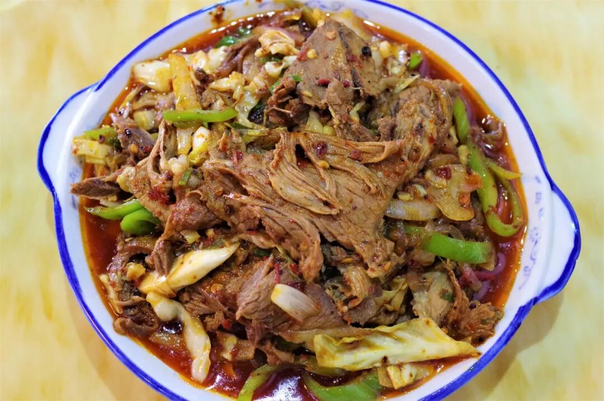

炒烩肉并非大武口或平罗的特色，只是一道宁夏极为普遍的家常菜，但我想以它作为宁夏的最后一餐，结束宁夏9天的饮食之行。

羊肉、酸菜、粉条、青椒，光是这种组合就透露着浓浓的西北之气，至于真正吃上一口，那种咸酸油辣的味道如今已不再令我惊奇，只是以一种平静地姿态告诉我，你吃的这个味儿，没错。

没错，这味道我将一辈子记住。

宁夏篇结语

宁夏九天，从中卫到固原到吴忠到银川再到石嘴山，肉为一、面为二，其他食物则几乎以配角之位出现，这就是宁夏。

吃遍宁夏的诳语我不敢说，但若把羊肉的每一种烹饪方法都尝试一边，把每一种换面不换汤的面食都尝试一边，或许再多9天也不够呢。至少现在，对于宁夏的味道，我已经有了相当深刻的理解。也希望你，对它有了更多的了解。

就像开篇所说，宁夏之夏安能宁？

事实证明，并不能。

它是那么狂野，我是那么着迷。

想知道我在干啥，请点这个链接：吃货的决心——555天中国饮食探索之行

想知道我要去哪，请点这个链接：555天行程计划（2018-07-26更新）

宁静的夏天，我在宁夏吃翻天。

（长按识别二维码点击关注哦）

 var first_sceen__time = (+new Date()); if ("" == 1 && document.getElementById('js_content')) { document.getElementById('js_content').addEventListener("selectstart",function(e){ e.preventDefault(); }); }

 if ("0" == 1) { document.addEventListener("keydown",function(e){ if ((e.metaKey || e.ctrlKey) && (e.key === 'c' || e.key === 'C' || e.key === 'x' || e.key === 'X' || e.key === 'a' || e.key === 'A')) { if (e.target.tagName === 'INPUT' || e.target.tagName === 'TEXTAREA') { return; } e.preventDefault(); } }); document.addEventListener("copy",function(e){ var sel = window.getSelection(); var content = document.getElementById('js_content'); if (sel && sel.rangeCount > 0 && content && content.contains(sel.getRangeAt(0).commonAncestorContainer)) { e.preventDefault(); } }); }

预览时标签不可点

微信扫一扫

关注该公众号

知道了 (javascript:;)
