# 【第046天 巴彦淖尔】巴盟焖面与烩菜

- 原文链接: https://mp.weixin.qq.com/s?__biz=MzA3MTM2Mjk3NA==&mid=2247503814&idx=1&sn=f0bf314a09b1a5eca6b8e933f2bd95b9&chksm=9f2c3f37a85bb62169e880dacf1df340d1257a3b75f8c91c069efa4e0a18012644c1e7eaa940&scene=21
- 作者: 宇哥食行记
- 发布时间: 未知
- 图片数量: 18

内蒙篇引言

内蒙古自治区，中国面积第三大、东西跨度最大的省级行政区，尽管占据如此广阔的徒土地，却不过拥有两千多万人口，且大部分地区并不适宜人类居住，所以其城市大多集中在南缘。

内蒙古的饮食与中国其他地区相比绝算不上丰富，但也并非其他地区的人所熟知的奶制品加牛羊肉这么简单。在内蒙古，占主导地位的饮食主要由蒙古族的蒙餐、汉族的汉餐和回族的清真饮食三大部分组成，这也是我此次一周时间将要去寻找并尝试的东西。

但是谁又敢确保呢？内蒙古如此之大又如此低调，也许还会有计划外的存在。

正文

作为一个文科生，河套平原之名早已根植于脑海深处，而巴彦淖尔作为河套平原上的重要城市之一，亦是熟稔于心。

但对内蒙人而言，巴彦淖尔更多是以他们所熟知的“巴盟”之名而存在，尽管曾经的盟已易名为今天的市，巴盟巴盟，仍会脱口而出。

谈到饮食，巴盟就更是内蒙古绝对有分量的一个地方，而这种分量，则主要是由焖面与烩菜撑起。在内蒙古的其他城市，人们也普遍相信，巴盟人家的焖面与烩菜，是最好吃的。

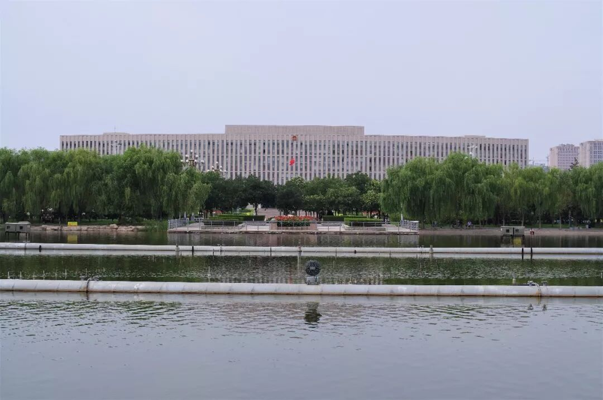

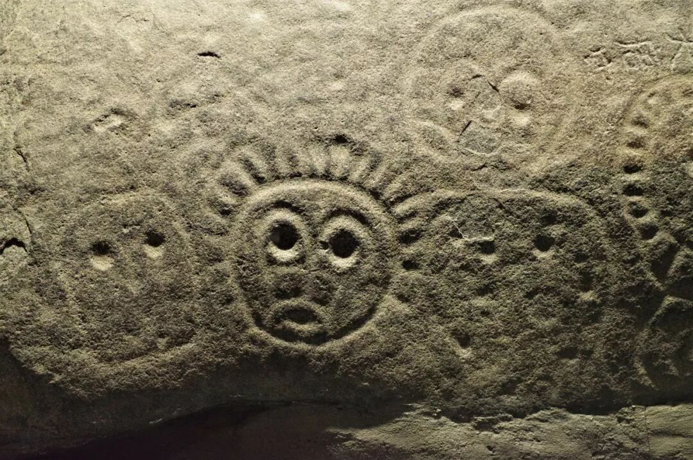

（河套岩画）

（1）

排骨豆角焖面

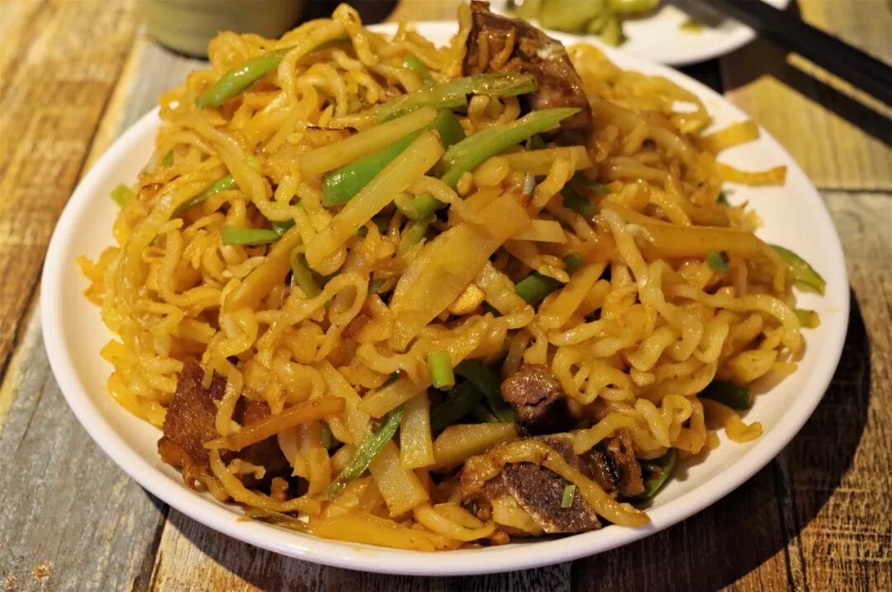

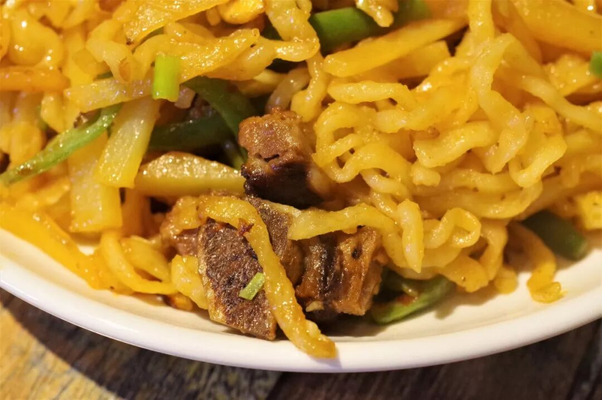

巴盟焖面在内蒙古家喻户晓，而这些焖面中最经典的便是排骨豆角焖面。好的焖面一定是铁锅焖制的，最好是一口铁锅端上桌持续焖持续吃，但是迫于最小分的铁锅焖面也至少需要两三人才能吃完，只得以盛在盘里的一盘面将就之了。

排骨、豆角、土豆与面条，这个组合本身就协调合理，让人心生期待。焖面上桌，一股热腾腾的香气扑鼻而来，是种混合着肉面之味而又带着油香的味道。虽然看上去油大，实际上只是一层薄薄的油包裹着面条与其他食材，不至使人油腻又有充分的油润感。焖制的面条比起煮制的面条更加绵软，但又不失精韧之感，贴着锅底的面条还会带上一些焦糊，令口感更加丰富。而猪肉、豆角、土豆也被焖制的油香满溢，让人停不下嘴。

不过，焖面完全没有水分，多吃容易干口与腻口，配上一碗汤水或是一叠酸辣爽口的小凉菜，会更加适口。

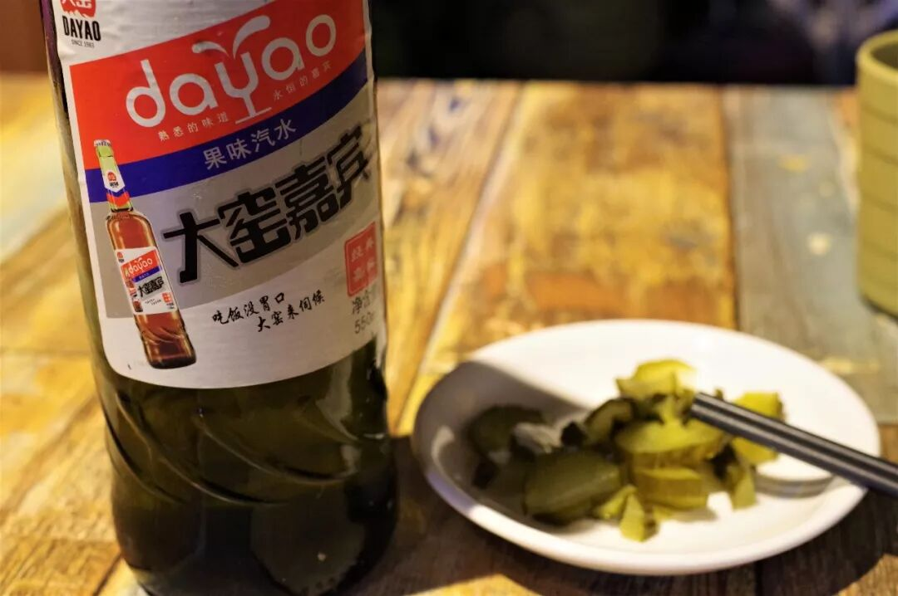

（在内蒙，家家餐厅都有大窑嘉宾与大窑橙诺）

（2）

猪肉烩酸菜

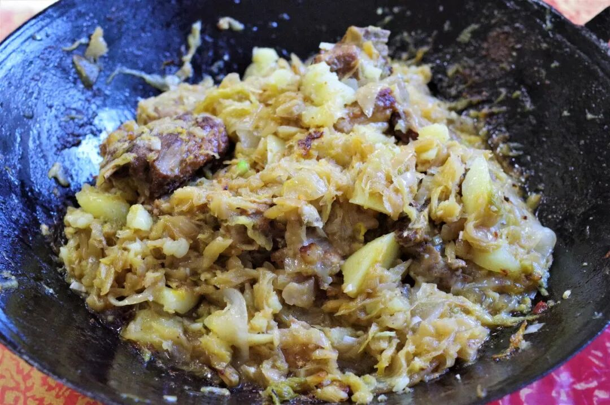

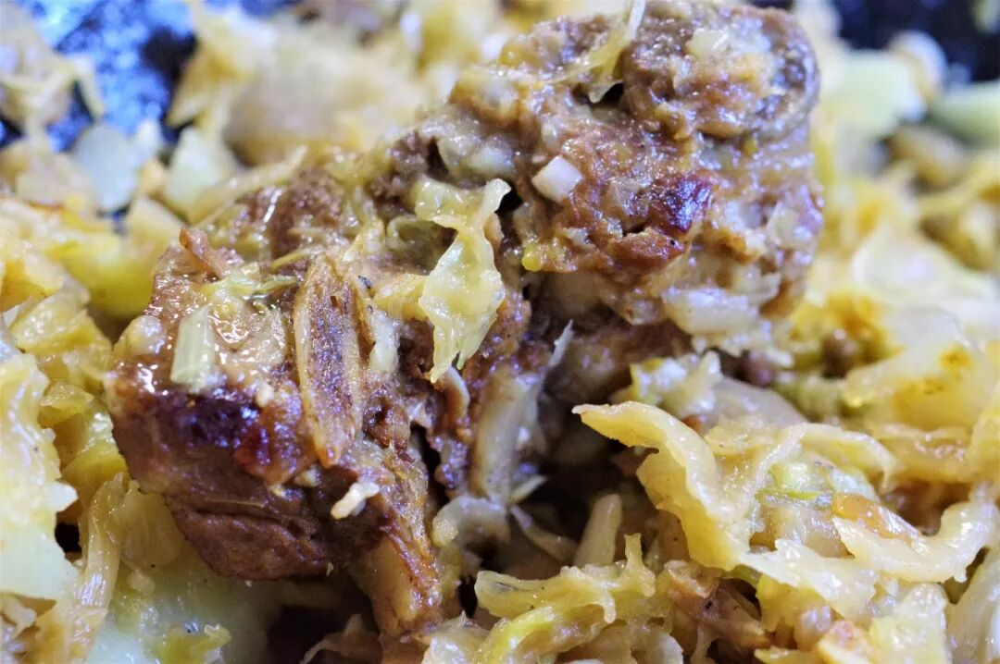

与巴盟焖面能够在知名度与地位上一争高下的，还有巴盟烩菜。巴盟烩菜中最经典的菜式，则是猪肉烩酸菜。

这道猪肉烩酸菜，颇有东北菜式那种大锅大量、胡炒胡炖的态势，像是河套版的“大乱烩”，猪肉、酸菜、土豆、粉皮在铁锅中粉碎交融，彼此之间已不太分明。从卖相上，这道菜一定拿不了高分，但举起筷子来上一口，酸菜土豆粉皮已彻底融为一体，不管你怎么吃，它们都会同时出现在你的口腔里。而猪油也在这三种素食的混沌包围之中，每一口都如此丰满，再加上时而出现的焦脆部分，更丰富了口腔体验。整道菜酸而不激、咸而不过、油而不腻、滋润开胃，实在是一吃就忘不了的味道。

再来上一盘贴在锅上烀出的饼子，饱吸烩酸菜之味，更让人欲罢不能。

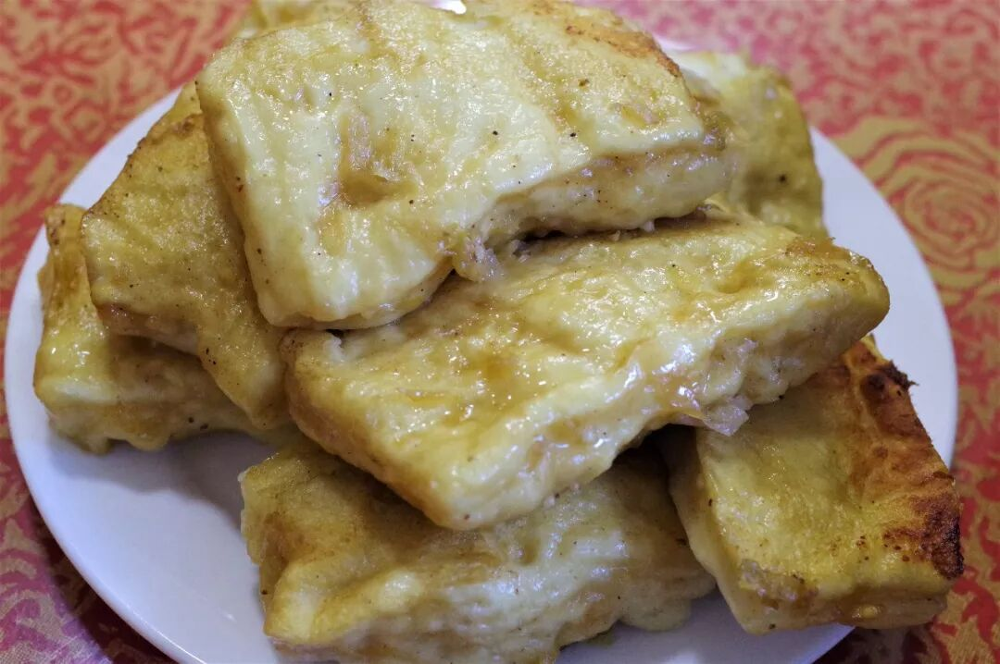

（烀饼子）

（3）

肉焙子

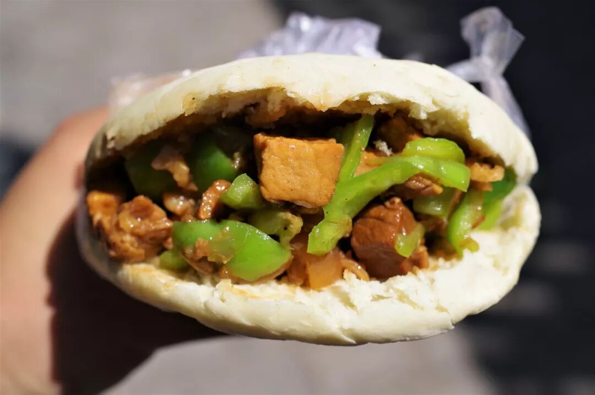

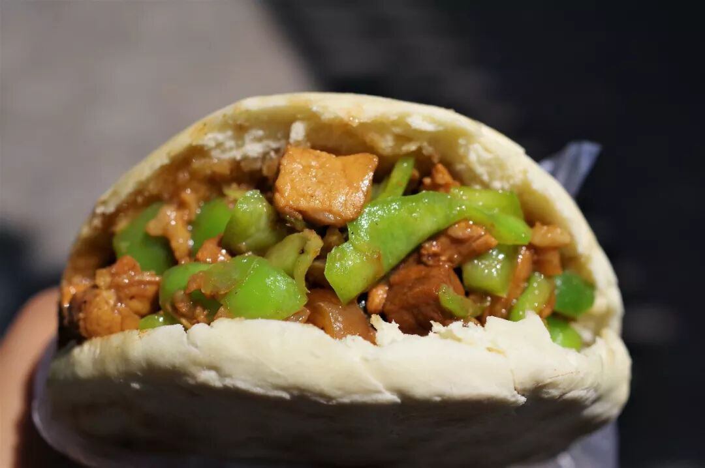

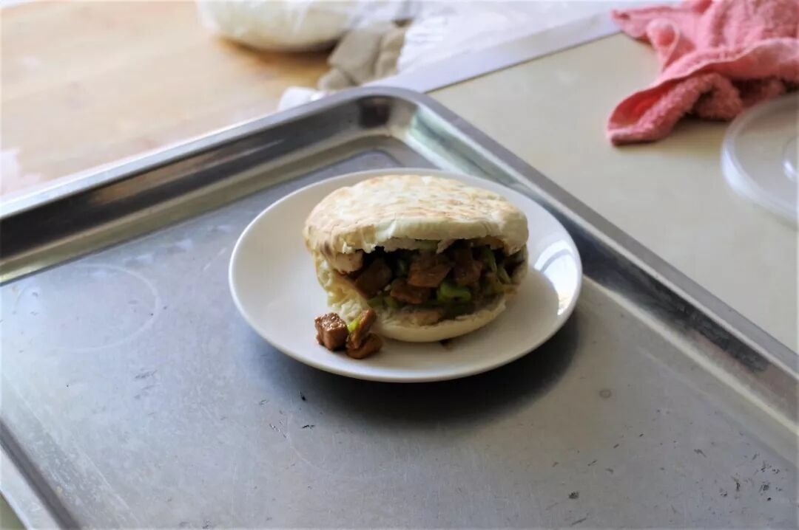

肉焙子即巴彦淖尔版的肉夹馍，也是来到巴盟不得不食的一种小吃。肉焙子使用发面的馍作壳，夹上独具风味的卤肉，然后大大地咬上一口，馍壳的酥、馍身的韧与肉的筋爽被一同感受。何必只认准一方风味呢？肉焙子一样美味。

为中式汉堡喝彩！

（4）

面精

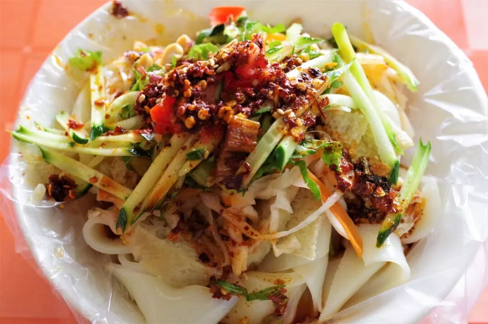

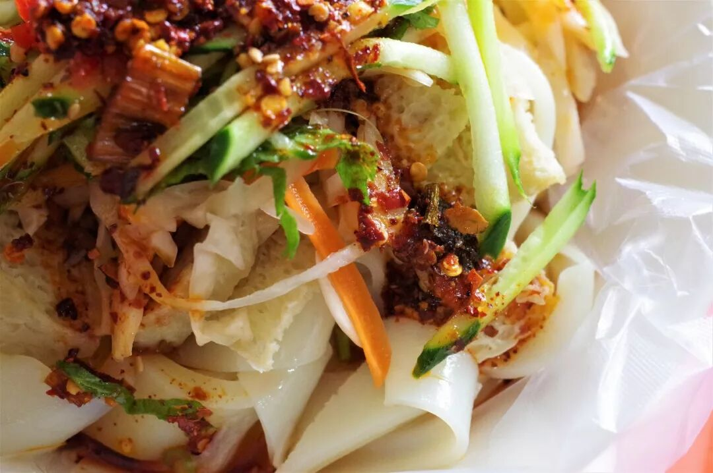

面精其实就是巴彦淖尔的酿皮，这名字实在太过可爱，听起来就如蛇精、虎精一般，仿佛是面粉修炼成精后的产物。巴盟的面精呈晶莹而略微透明的白色，与其他地方常见的黄色酿皮截然不同，这是把面筋完全洗出的证明。加上面筋块、萝卜丝、黄瓜丝调上醋、蒜、辣子，继续感受那爽滑劲道、继续感受这西北味道的延续。

除了以上所提及的食物，巴盟较为著名的食物还有糖麻叶，与宁夏的糖麻丫相同。另外，则是河套地区盛产的蜜瓜和西瓜。相信我，10块钱，车上的西瓜分分钟买三个走。

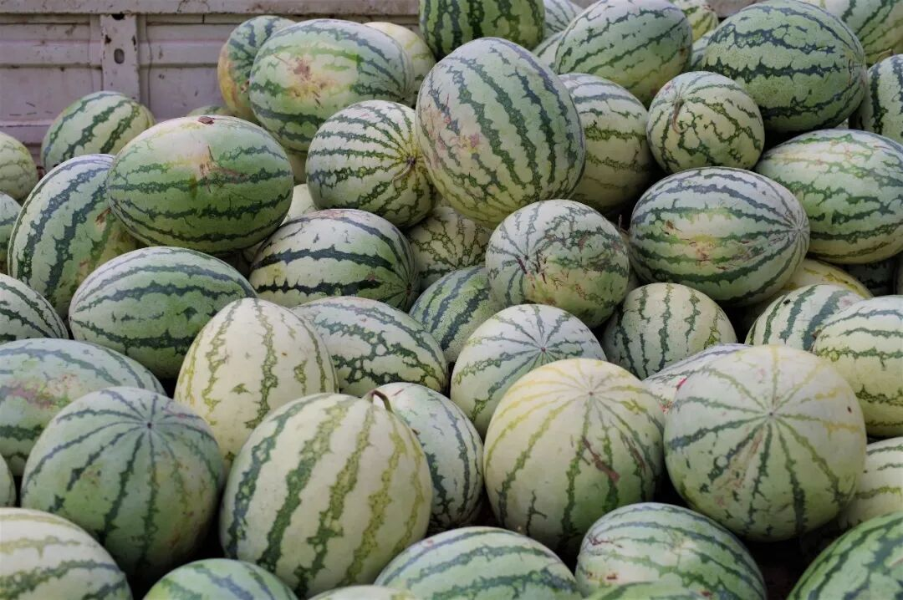

食路匆匆，脚步匆匆，无法与巴彦淖尔有更多的接触，但我相信，以后的它就不会只是一个简单存在于我脑海中的地名了，它将从此与味道捆绑，也将让我从此见名思几味、食味忆一方。

再会巴盟。

想知道我在干啥，请点这个链接：吃货的决心——555天中国饮食探索之行

想知道我要去哪，请点这个链接：555天行程计划（2018-07-26更新）

距离上一次吃猪肉好像已经有三十几天了

（长按识别二维码点击关注哦）

 var first_sceen__time = (+new Date()); if ("" == 1 && document.getElementById('js_content')) { document.getElementById('js_content').addEventListener("selectstart",function(e){ e.preventDefault(); }); }

 if ("0" == 1) { document.addEventListener("keydown",function(e){ if ((e.metaKey || e.ctrlKey) && (e.key === 'c' || e.key === 'C' || e.key === 'x' || e.key === 'X' || e.key === 'a' || e.key === 'A')) { if (e.target.tagName === 'INPUT' || e.target.tagName === 'TEXTAREA') { return; } e.preventDefault(); } }); document.addEventListener("copy",function(e){ var sel = window.getSelection(); var content = document.getElementById('js_content'); if (sel && sel.rangeCount > 0 && content && content.contains(sel.getRangeAt(0).commonAncestorContainer)) { e.preventDefault(); } }); }

预览时标签不可点

微信扫一扫

关注该公众号

知道了 (javascript:;)
