# 【第052天 通辽】大骨抻面统治的内蒙城市

- 原文链接: https://mp.weixin.qq.com/s?__biz=MzA3MTM2Mjk3NA==&mid=2247503808&idx=2&sn=cf4ae4f5c3f55d318ae5de1740cd07b8&chksm=9f2c3f31a85bb6277eba9da2c94d095a3c0535b30c92548a14cf74224693c1b568fc0f6f34e4&scene=21
- 作者: 宇哥食行记
- 发布时间: 未知
- 图片数量: 15

通辽，光是这个名字就足以向人们证明他有多接近东北。从地图上看，通辽也确处于扼东北咽喉之位置。如果这些都不足以证明，不妨在通辽的大街小巷走上一遭，听听那响亮抓耳的东北腔调，若不是街上偶尔出现的蒙餐厅与蒙古特产专卖店，你一定以为它已经落在东三省的某个位置。

2018年8月11日的通辽，雨转阴转雨，无法与它有太多光天化日下的接触，只能更多凭味觉去认识它。然而，这为数不多的通辽之食，竟会给内蒙一周的行程划下如此粗大完整的句号。

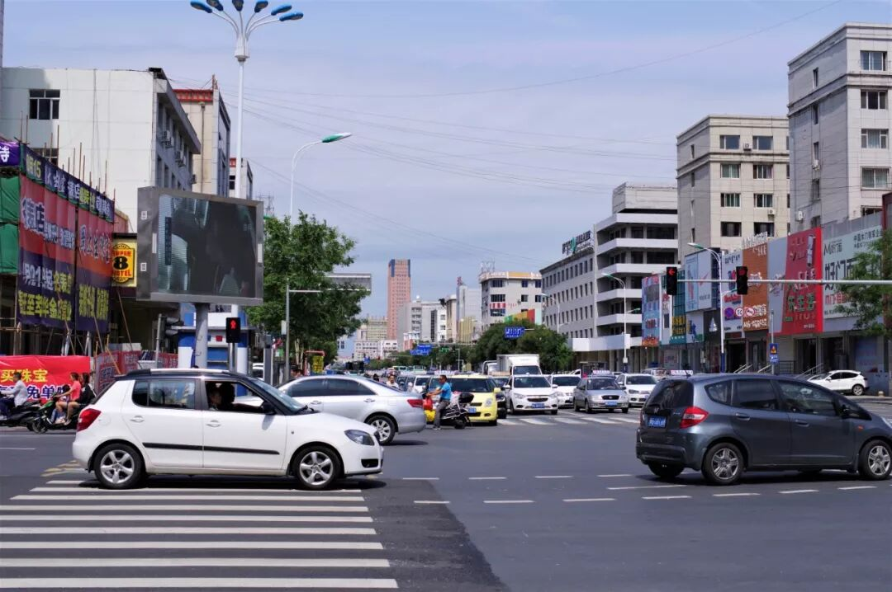

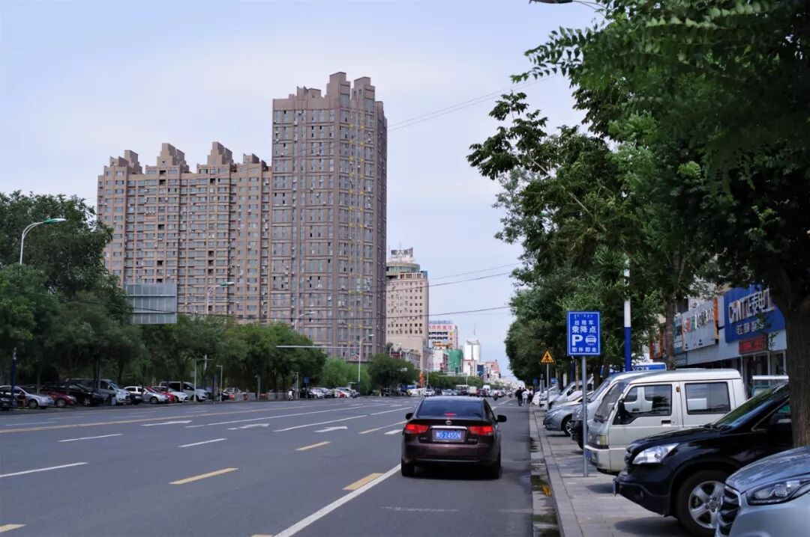

（1）

大骨头、抻面

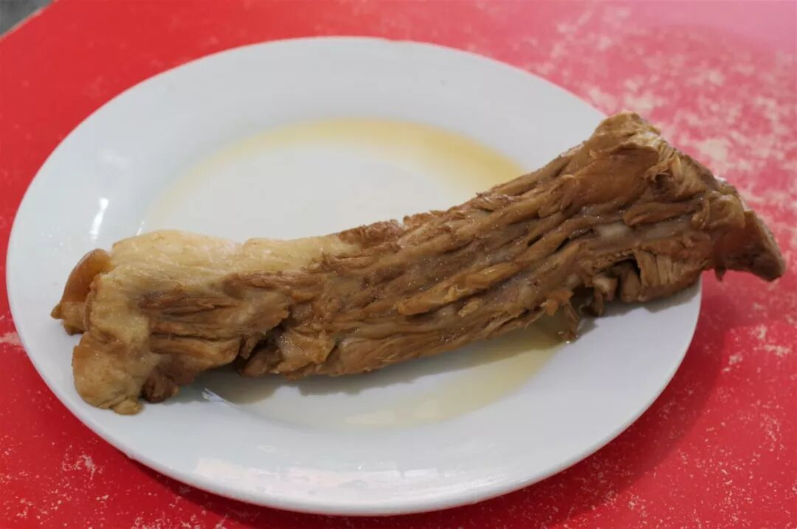

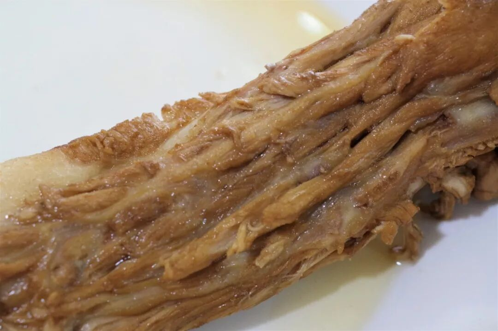

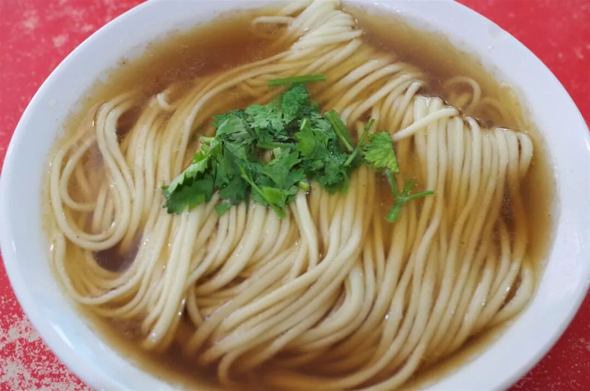

大骨头、抻面，横看侧看它们都是具有浓烈东北印记的食物，只是在通辽，它们总是手牵着手肩并着肩出现在通辽人的早点桌上，也因此成为了通辽最具有地方特色的饮食。

通辽的大骨头分为炖煮的和酱制的两种，从部位上可分为棒骨、脊骨、尾骨、扇子骨等，肉质不尽相同、各有千秋，上图所示的大骨头为脊骨。脊骨肉呈鱼鳞式的条状分布，吃起来丝丝分明，十分细嫩，毫无老柴之感，而每一段脊骨之间又有筋相连接，更使得口感多样。若是口活到家，还能吸出脊骨中长长的骨髓，那爽滑粉嫩无可比拟。

至于抻面，则是东北地区普遍流行的骨汤抻面。没有过多的调味，全靠骨汤吊出咸鲜之味，抻面之中加入了蓬灰，使得口感极为Q弹劲道。一碗简单的抻面，简单却不失态度与风味。

一肉一面，一日饱足时光，这是通辽人以他们自己的方式宣告着自己的味觉属性。狂野不羁，惹人欢喜。

（2）

干锅牛肉

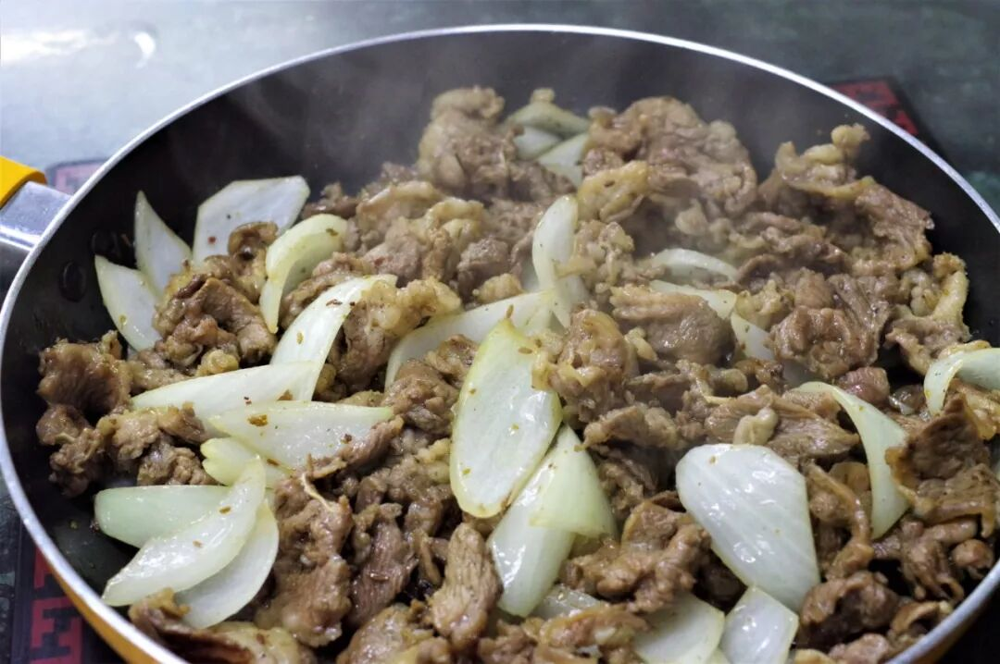

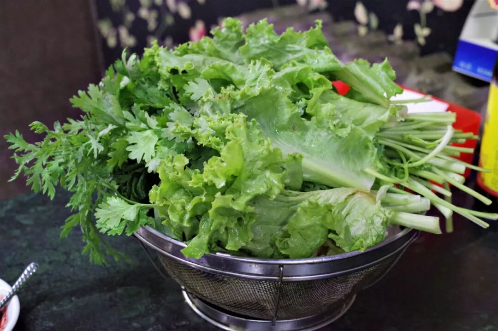

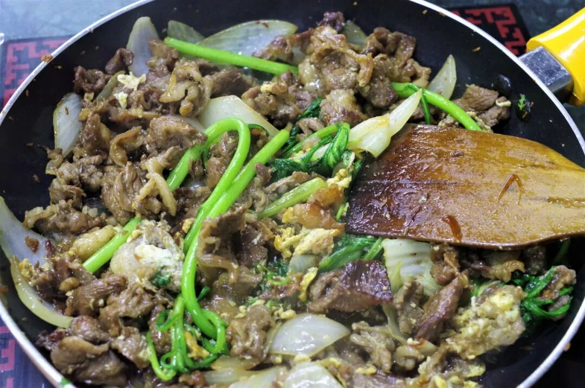

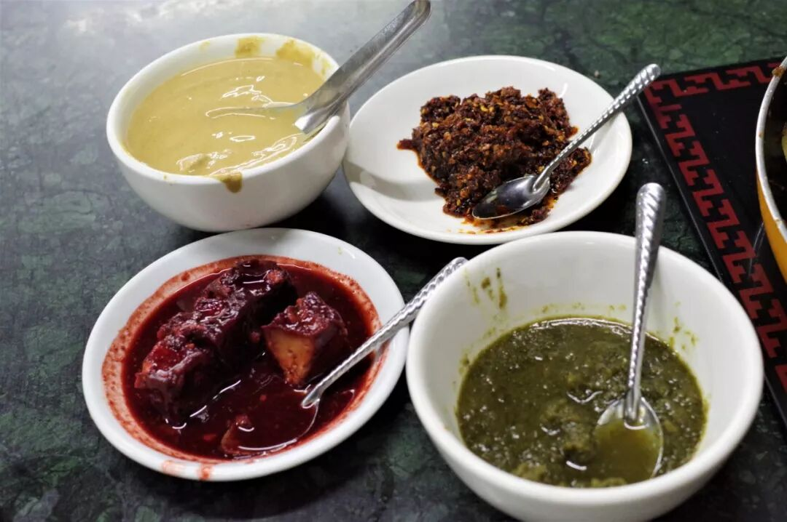

好的食物会被埋没吗？经常发生的事。就像这个食物根本都不在我的计划之中，直到今天来到通辽听起当地人的推荐才决定去一探究竟。干锅牛肉？有什么不一样呢？事实证明，真的不太一样。

一锅牛肉，一篮子新鲜素菜，几个小碗装着调料，这就是通辽干锅牛肉的全部。锅子上桌时锅中牛肉已熟，但这份食物才完成了一般，还需要你随自己的口味往锅中放入素菜与牛肉一起煸炒，一直炒、一直吃。想吃之时夹起一块肉或菜，在味碟中轻轻一点，放入口中，那咸嫩鲜香势不可挡。这种食用方式还有一大特点在于，牛肉从头吃到尾口感在不断地变化——从一开始的肉嫩到不断煸炒后带上的焦酥之感，仿佛是以0.1为梯度感受牛肉从8分到10分熟的全部变化过程，实在是无与伦比的体验。

（3）

仙泉

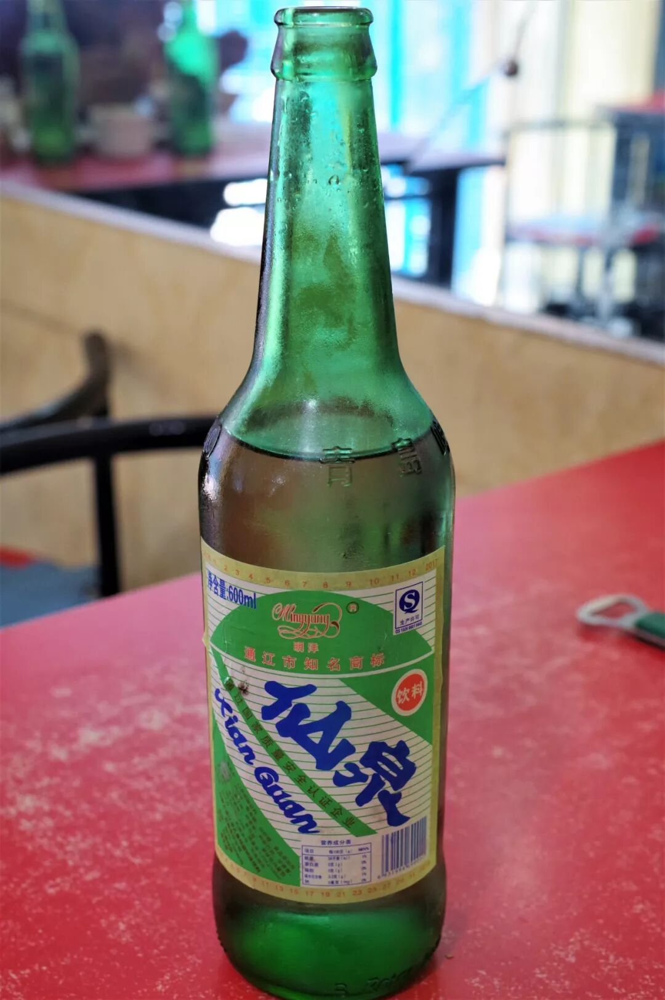

名为仙泉，实为通辽的市井之泉。这是通辽当地特有的一种碳酸饮料，是通辽人常喝的佐餐之饮，其味道并不丰富，是一种简单的甘甜带点微酸，但仍旧足够开胃借口，仍旧能带来一瞬清凉。

中国有多大？你瞧，你听说过这饮料吗？

（4）

牛肉干

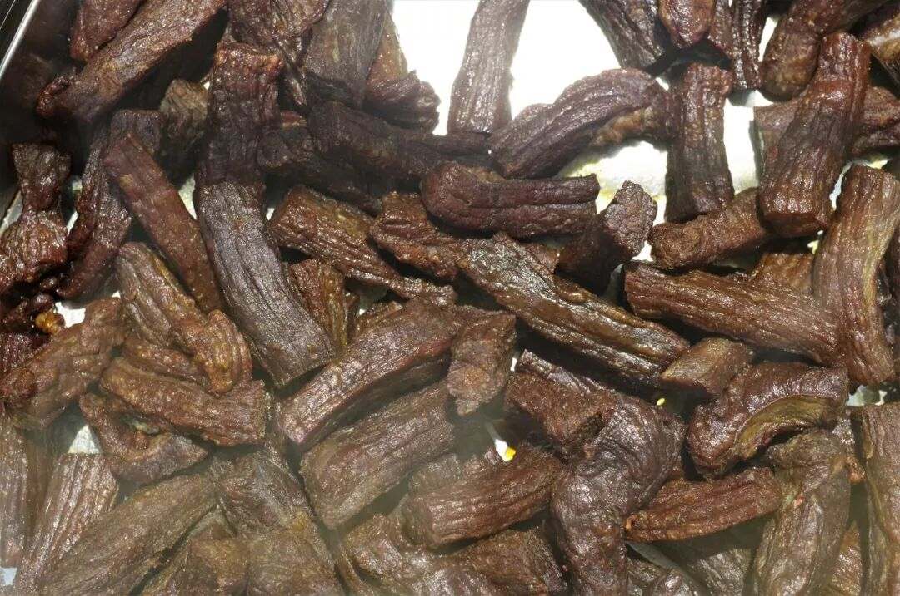

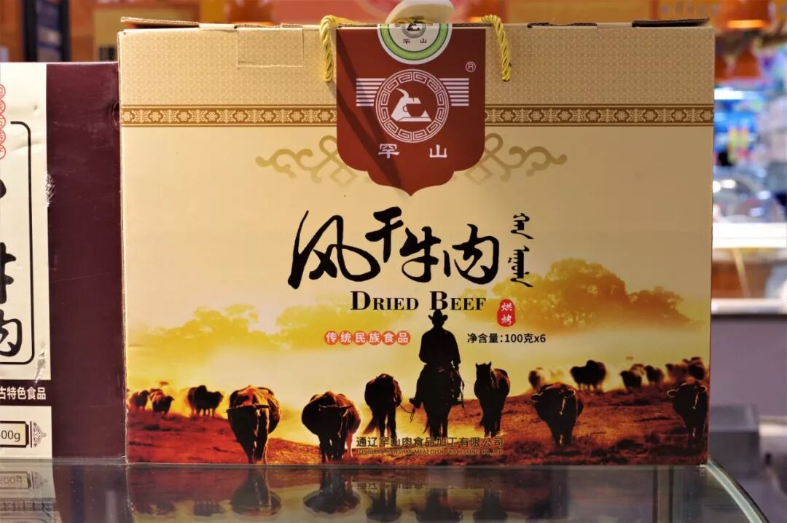

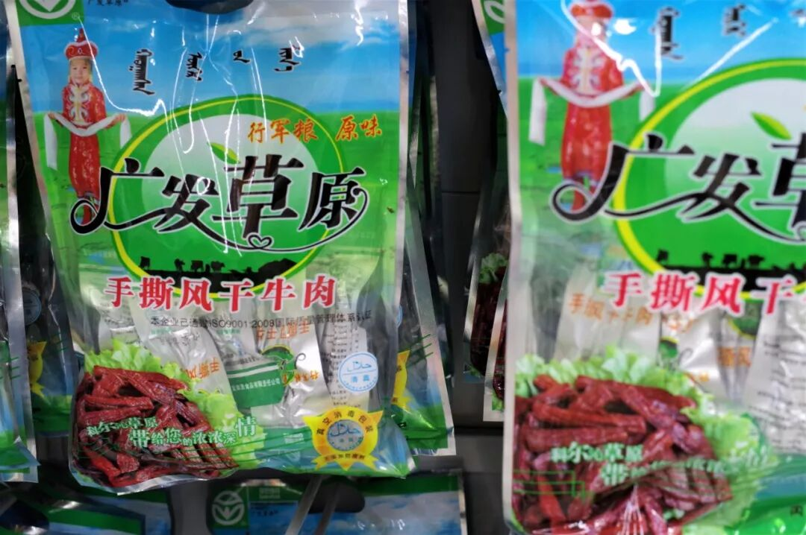

终究要离开内蒙古了，不带上一些牛肉干总觉得还差一个任务没有完成。通辽是内蒙古较为有名的一个牛肉干产地，在这里能买到质量上城的牛肉干。牛肉干常见的做法有烤制、炸制和风干几种，各有风味，全尝一遍总不现实。但无论如何，现做的总是好过包装好的，虽然淘宝已足够发达，要吃到最好的牛肉干，恐怕还是得亲自跑上一趟呢。

同样的，各种奶制品也是造访者最常带走的内蒙食物，也许它们算不得内蒙饮食的精华，但是带上一些，心里总觉得内蒙仿佛还在身旁、在嘴边。

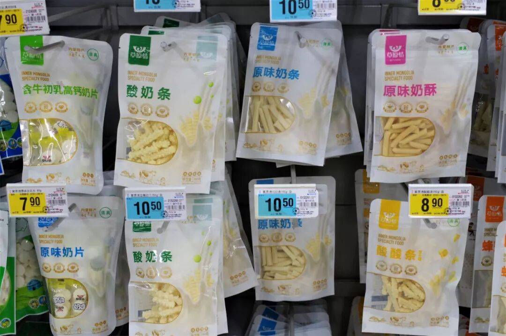

除了以上所呈现的食物，在通辽较为常见的还有各种荞麦面食物，因其下属的库伦旗为著名的荞麦产地，也是值得一试的饮食。不过，这次匆匆一面，只能到此为止了。

科尔沁的天与地，我们来日再见吧。

内蒙篇结语

内蒙七日，相聚短暂。我想我已证明了内蒙之饮食绝不像我们曾盲目设想的那边全是牛羊奶酒，在这里你可以吃蒙餐、可以品清真，还可以用舌尖触碰山西、触碰北京、触碰东北。

下一次，如果新认识一位来自内蒙的朋友，记得先问问看他来自内蒙哪里？否则，叫嚷着和他一起去吃蒙餐，他未必乐意呢。

想知道我在干啥，请点这个链接：吃货的决心——555天中国饮食探索之行

想知道我要去哪，请点这个链接：555天行程计划（2018-07-26更新）

再见长长的内蒙

（长按识别二维码点击关注哦）

 var first_sceen__time = (+new Date()); if ("" == 1 && document.getElementById('js_content')) { document.getElementById('js_content').addEventListener("selectstart",function(e){ e.preventDefault(); }); }

 if ("0" == 1) { document.addEventListener("keydown",function(e){ if ((e.metaKey || e.ctrlKey) && (e.key === 'c' || e.key === 'C' || e.key === 'x' || e.key === 'X' || e.key === 'a' || e.key === 'A')) { if (e.target.tagName === 'INPUT' || e.target.tagName === 'TEXTAREA') { return; } e.preventDefault(); } }); document.addEventListener("copy",function(e){ var sel = window.getSelection(); var content = document.getElementById('js_content'); if (sel && sel.rangeCount > 0 && content && content.contains(sel.getRangeAt(0).commonAncestorContainer)) { e.preventDefault(); } }); }

预览时标签不可点

微信扫一扫

关注该公众号

知道了 (javascript:;)
