# 【第054天 鸡西】冷面二重奏

- 原文链接: https://mp.weixin.qq.com/s?__biz=MzA3MTM2Mjk3NA==&mid=2247503806&idx=1&sn=391b73dd6716cb4049e4ed5955573268&chksm=9f2c3f4fa85bb659c6dc853dd168630de387bb600cf2cac3a86b7beeecce418259d5daa3e1a0&scene=21
- 作者: 宇哥食行记
- 发布时间: 未知
- 图片数量: 16

是什么让我翻山越岭，来到这东北之东的边陲小城，呆上大半天便倏然离去？除了吃还能有什么。但实际上，此次造访鸡西，情感上的因素要大于味觉上的因素，至于情感上的因素为何，接着往下看便知。

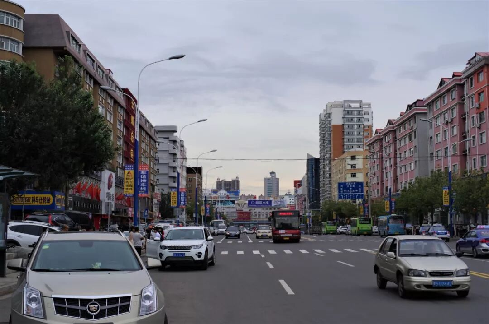

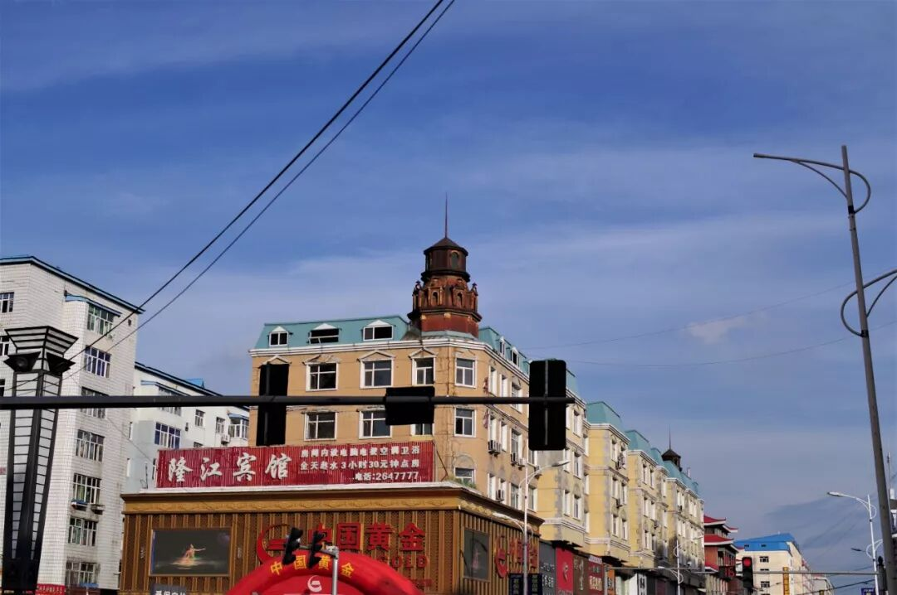

（1）

烤冷面

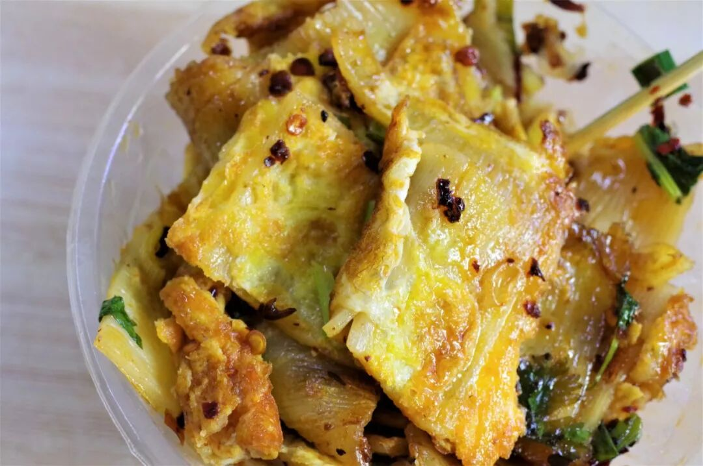

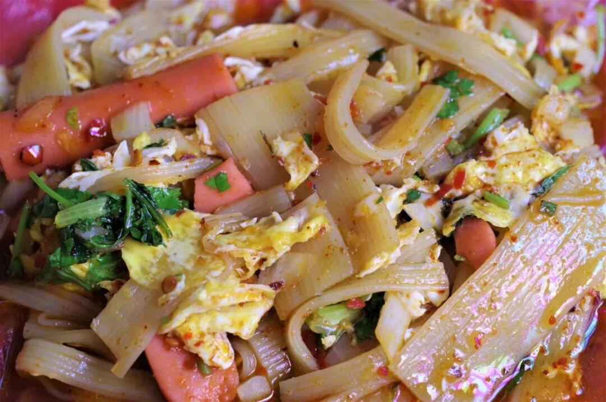

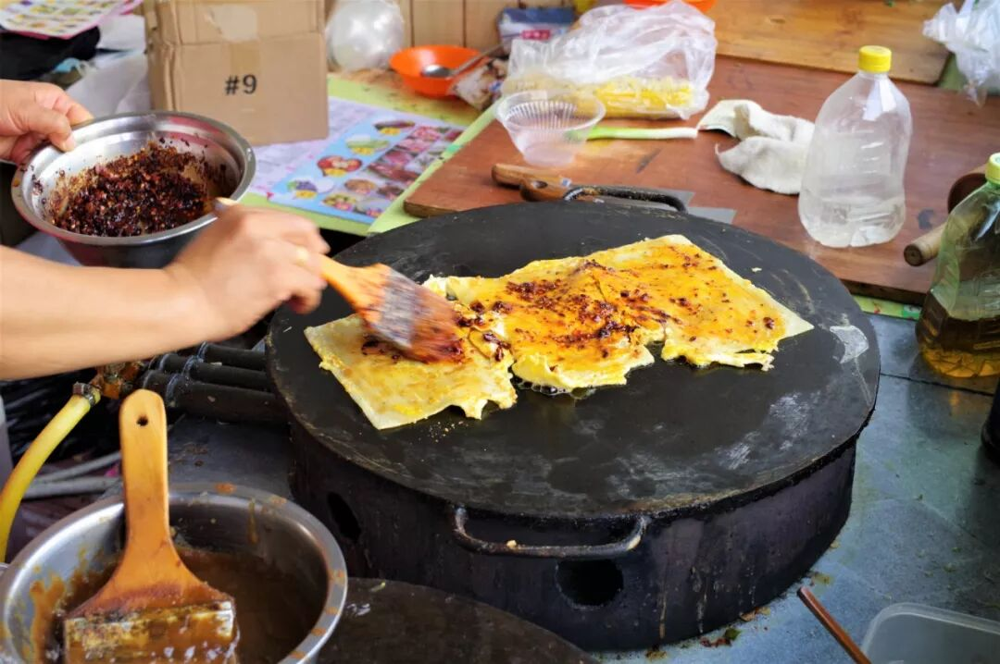

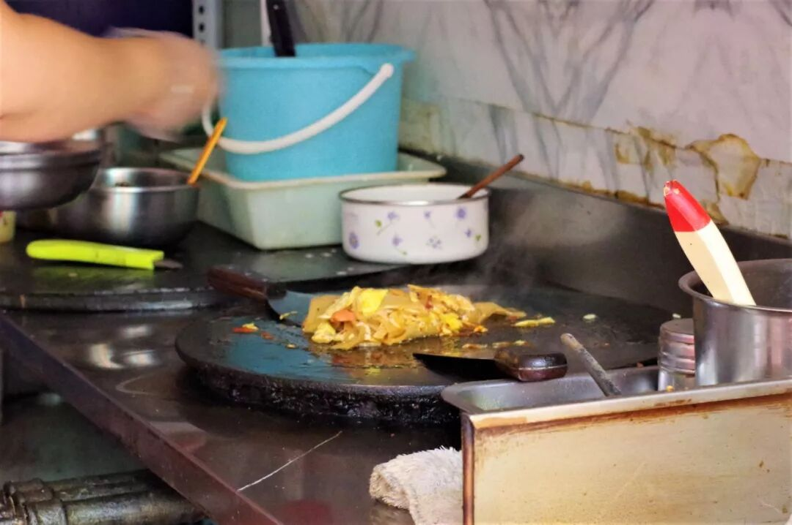

你是否数得清，自己在多少个寒冷饥饿的夜被一碗热气腾腾的东北烤冷面慰藉过？如果要评选中国最有影响力的街头小吃，东北烤冷面必定位列其中。此次来到鸡西，一个重要的原因便是，这里是烤冷面的发源地。确切地说，应当是鸡西下属的县级市密山市。如今烤冷面已传遍了大江南北，在东北它叫哈尔滨烤冷面，在东北以外它叫东北烤冷面，但我更希望，下一次，当你吃着一碗香气逼人的烤冷面时，能够朝着鸡西、朝着密山的方向，就像穆斯林做礼拜时朝着麦加的方向一般。

（2）

冷面

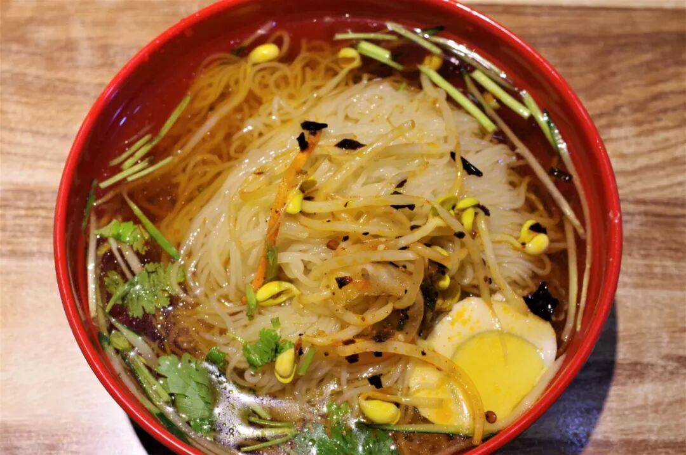

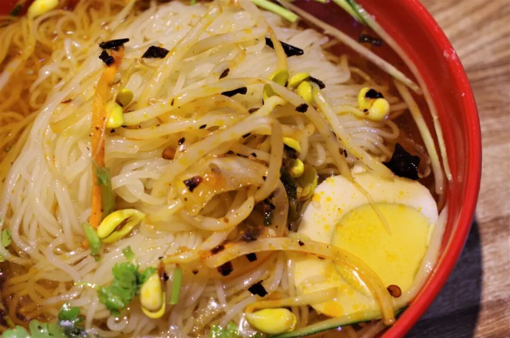

鸡西属于朝鲜族聚居的地区之一，其冷面也是鸡西地区最为流行的食物之一，鸡西大冷面之名在东北十分响亮。酸甜可口的冷面汤，爽滑劲道的冷面条，早已成为了这里人无论寒冬还是酷暑最热衷的主食之一，再配上鸡西特色的辣拌菜，吃上三年五年也难腻。

（3）

辣菜

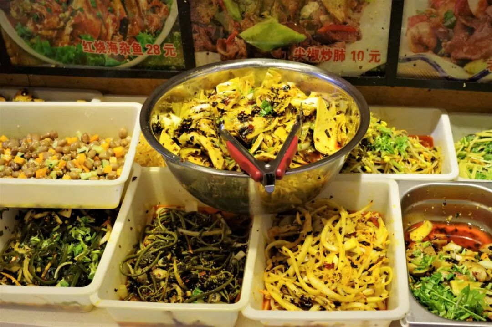

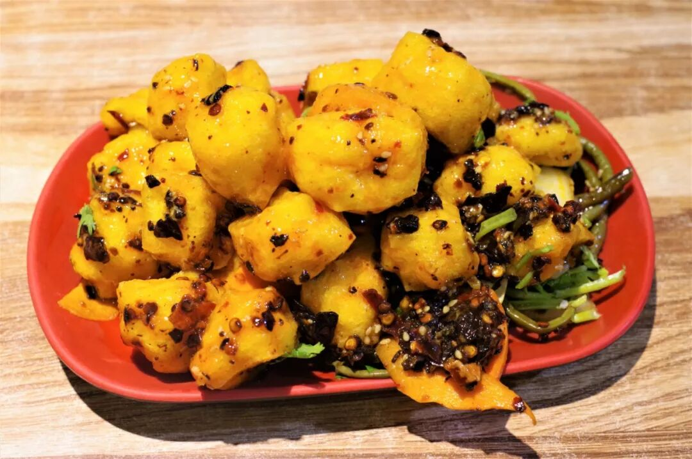

鸡西辣菜多为辣拌菜，常与冷面搭配出现，在朝鲜族传统的几种辣拌菜干豆腐、豆腐泡、桔梗的基础上发展出了好几十个品类，其名声也正是由这丰富的种类而生。鸡西辣菜在品类丰富的基础上也有着多样的口味，尽管都有辣，却因食材的不同而产生甜辣、酸辣、香辣等各种变化，无一例外清口爽利。

（4）

刀削面

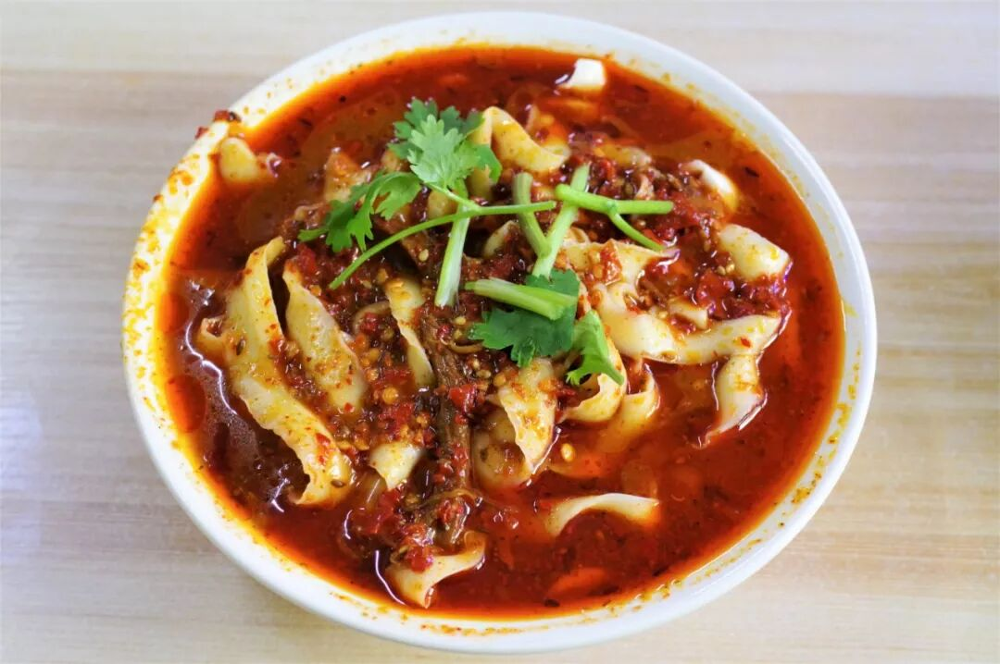

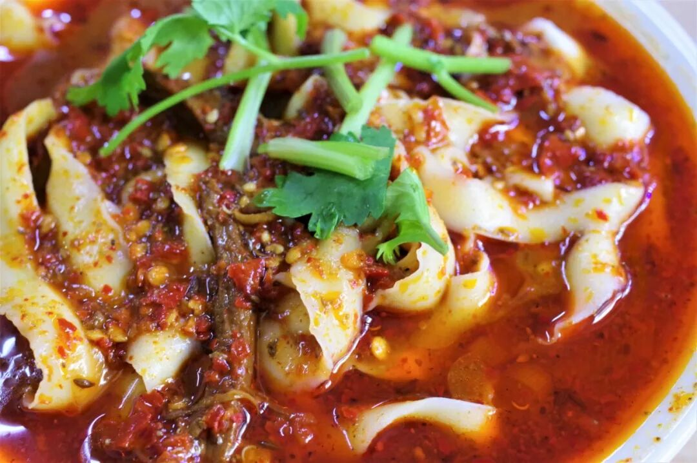

毫无疑问刀削面是山西的传统面食，但是饮食习惯有时就是这么剑走偏锋，来自千里之外的刀削面却在这样一个东北小城遍地开花，并衍生出自己独特的滋味。鸡西刀削面呈现出了一种与东北整体口味并不相匹配的特点，即麻辣。

面一上桌，面对眼下这碗油光发亮、飘着不少辣椒渣的刀削面，竟有一种恍惚回到四川的错觉。吃上一口味道也毫不含糊，牛肉炖煮得足够入味，面条则是必然的劲韧，再配上油香麻辣味十足的面条，让我不禁得出这样的结论：这是一碗在中国较为罕见的，既在面条的质感上有北方式的追求，又在面汤的味道上有南方式的复杂的面条。

点赞。

冷面的二重奏，刀削面的一枝独秀，再加上辣菜的花团锦簇。也许这算不上盛宴，但它们绝不苍白。这种平静而有力的味道，有时却最剑指人心，吃过一次就惦记着第二次，直到成为你再也摆脱不了的味觉习惯。

这一瓶大白梨汽水，敬鸡西！

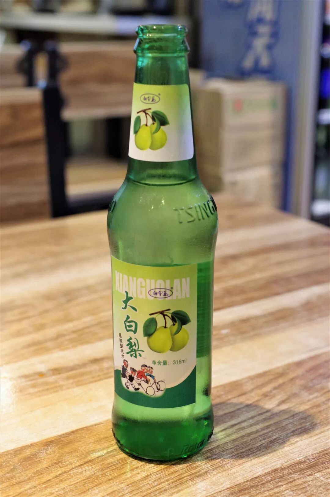

想知道我在干啥，请点这个链接：吃货的决心——555天中国饮食探索之行

想知道我要去哪，请点这个链接：555天行程计划（2018-07-26更新）

是时候再来一份烤冷面了。

（长按识别二维码点击关注哦）

 var first_sceen__time = (+new Date()); if ("" == 1 && document.getElementById('js_content')) { document.getElementById('js_content').addEventListener("selectstart",function(e){ e.preventDefault(); }); }

 if ("0" == 1) { document.addEventListener("keydown",function(e){ if ((e.metaKey || e.ctrlKey) && (e.key === 'c' || e.key === 'C' || e.key === 'x' || e.key === 'X' || e.key === 'a' || e.key === 'A')) { if (e.target.tagName === 'INPUT' || e.target.tagName === 'TEXTAREA') { return; } e.preventDefault(); } }); document.addEventListener("copy",function(e){ var sel = window.getSelection(); var content = document.getElementById('js_content'); if (sel && sel.rangeCount > 0 && content && content.contains(sel.getRangeAt(0).commonAncestorContainer)) { e.preventDefault(); } }); }

预览时标签不可点

微信扫一扫

关注该公众号

知道了 (javascript:;)
