# 【第061天 长春（一）】东北味与老字号

- 原文链接: https://mp.weixin.qq.com/s?__biz=MzA3MTM2Mjk3NA==&mid=2247503799&idx=1&sn=d97b2e0473e288f4e8fc0258fdc51f9e&chksm=9f2c3f46a85bb650b392aa3770b8f4374d242764e6c03b221f9d344506a065b3519c309ddd69&scene=21
- 作者: 宇哥食行记
- 发布时间: 未知
- 图片数量: 18

计划来到长春，其实是抱着一些决心和别样的情感的。在大部分东北人眼见，吉林省除了延边州就再没有其他地区有什么独特、诱人的风味地方饮食了。作为吉林省省会城市的长春，也就成了这样一座在饮食上无足轻重的城市。

但是，在我的整个计划中，任何一个省会城市（除拉萨）都至少计划了两天的时间对其进行饮食上的探索，如果就这么直接舍弃长春或是只计划一天，总觉得会过意不去。其实，换个角度想，就算长春没有什么引以为傲的特色饮食，它也至少是一个东北风味饮食的权威集中地，不是吗？

在你的街巷中奔走两天，我觉得仍是值得的。

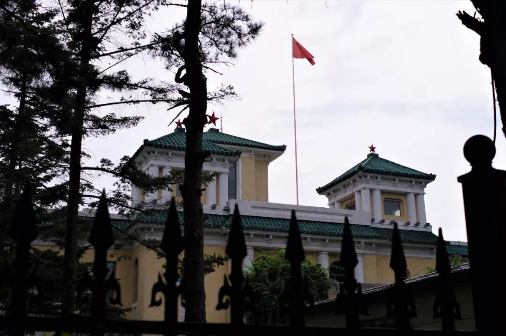

（1）

雪衣豆沙

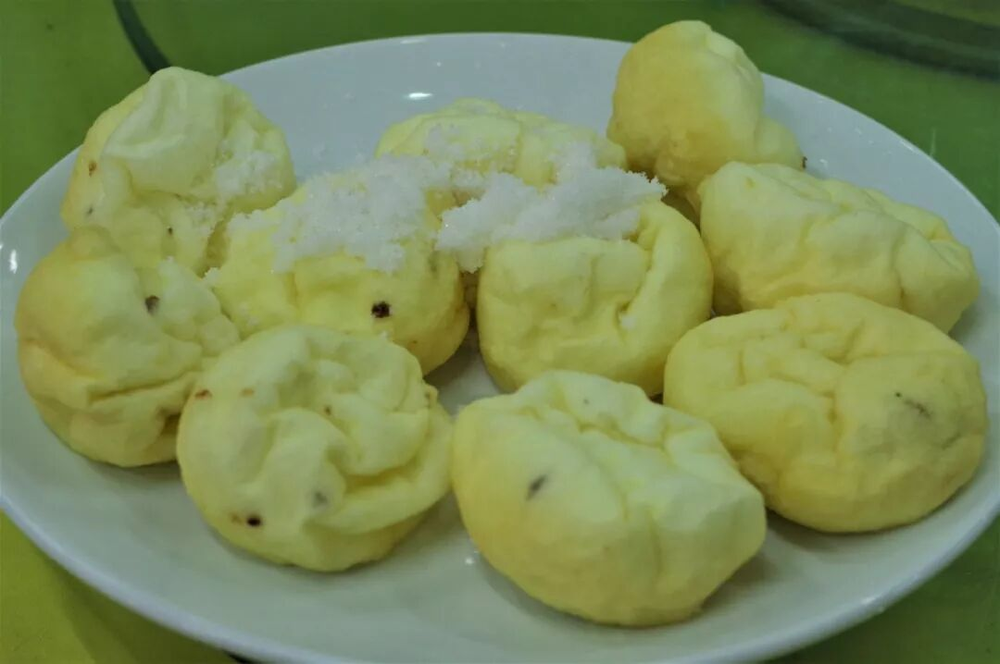

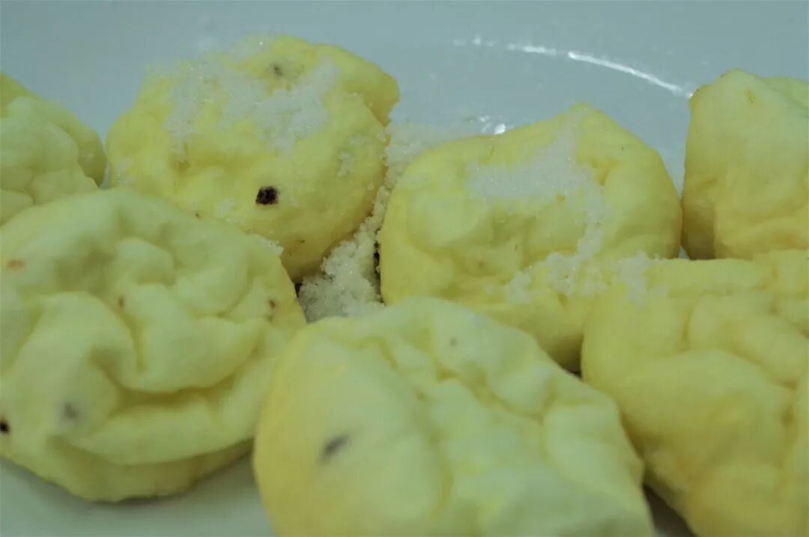

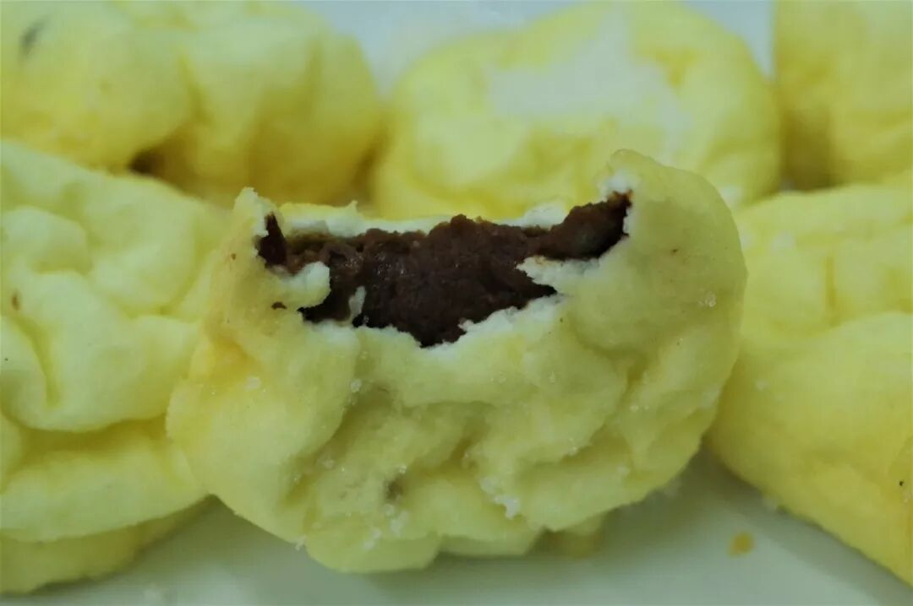

雪衣豆沙属于东北菜中的吉菜分支，在吉林省最为常见，是一道老少咸宜、风味独特的甜品。其制作方法是将豆沙球裹上打发后的蛋白糊放入热油中不停翻炸，捞起沥干油后装盘并撒上白砂糖即可。

制作得当的雪衣豆沙表皮应呈现诱人的金黄色，质地蓬松。轻轻咬上一口，蓬松软绵的表皮口感如蛋挞一般，但是比蛋挞的口感更致密，紧接着是豆沙的粘沙之感与浓郁香甜，宛如一朵饱含花蜜的花蕾在口中炸开一般。

像这样一道简单却足够经验的东北风味甜品，在外地的东北菜馆中几乎不得见，实在是一件相当遗憾的事。

（2）

大拉皮

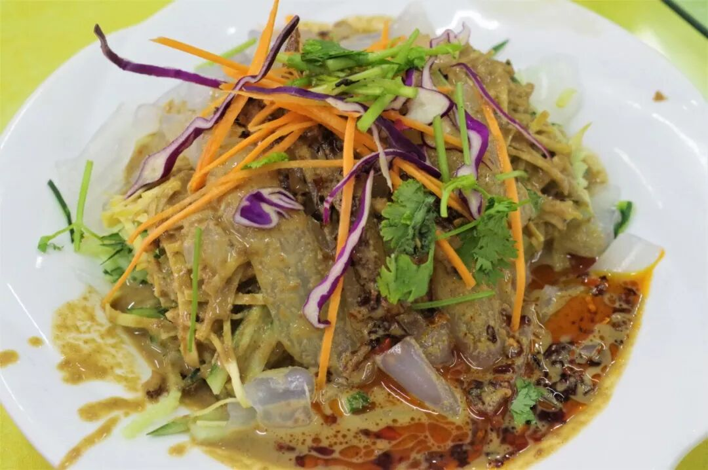

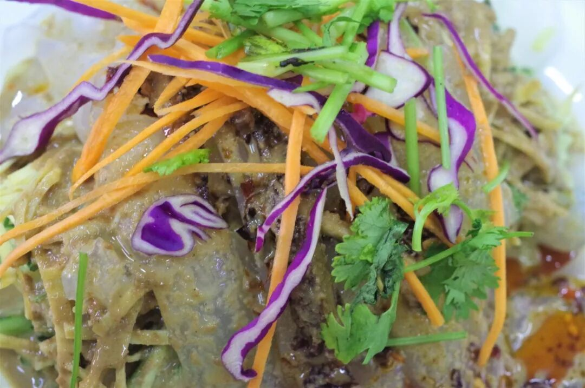

大拉皮又可名东北大拉皮、五彩大拉皮，是整个东北地区最最最受欢迎和追捧的凉菜之一。拉皮并非某种奇异的食物，其实就是用薯类淀粉制作的粉皮，口感爽滑绵韧。制作这道凉菜时，将切成宽条状的拉皮、黄瓜丝、豆腐丝、萝卜丝等放入盘中，加入麻酱、香油、蒜、醋、盐等调料。麻酱的香是主味，酸甜之味辅之，再配上拉皮与各种辅料组成的丰富口感，成就了这道让人一吃便筷不离手，甚至直接将其当饭吃的东北著名凉菜。

（3）

鼎丰真

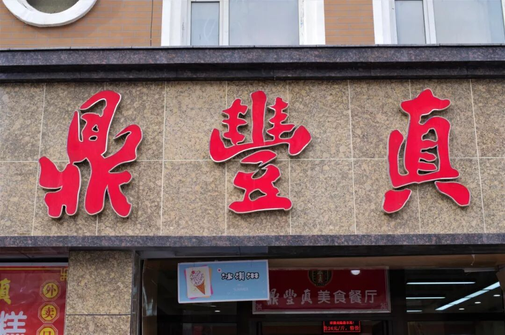

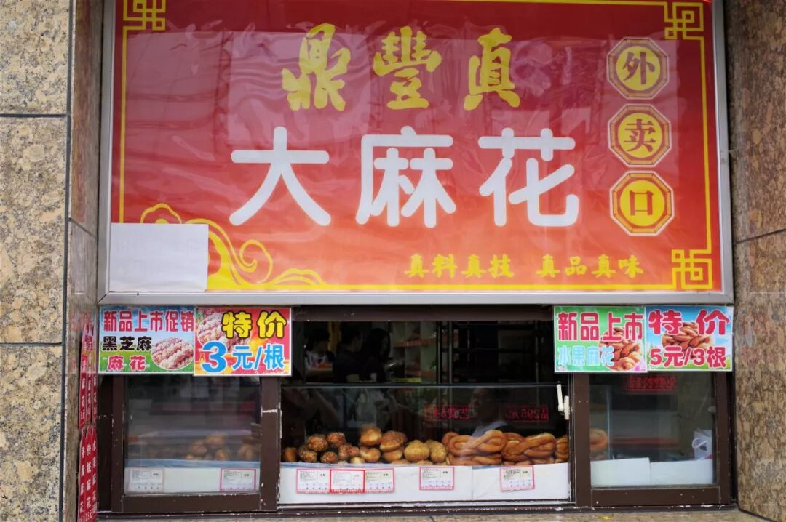

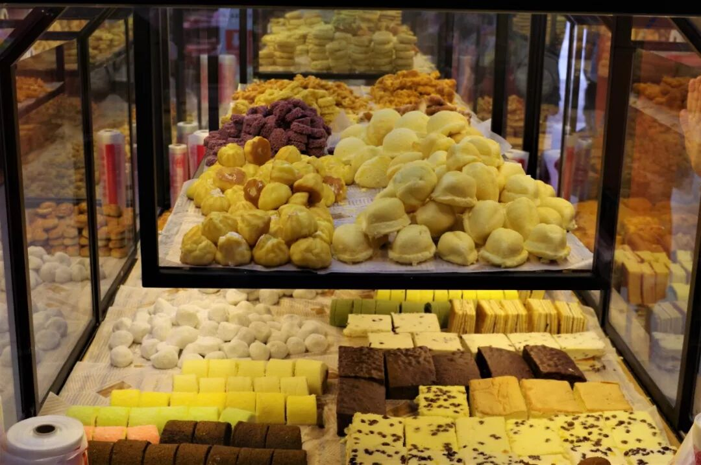

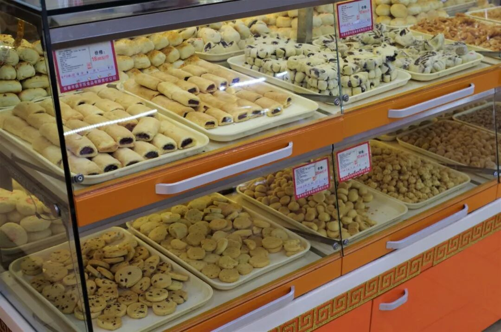

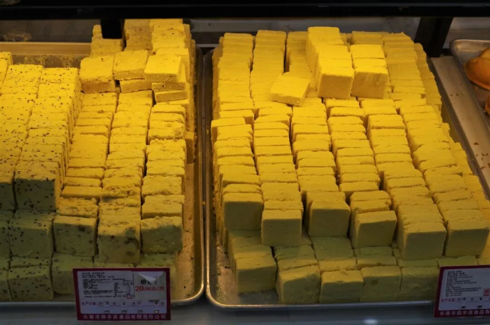

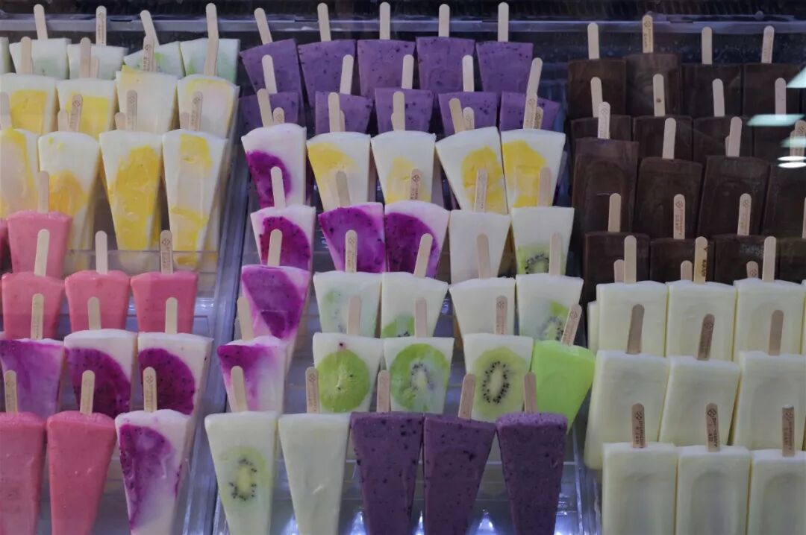

鼎丰真是长春市为数不多的老字号之一，已持续经营超过100年了，主要售卖各类中西式糕点，直到今天，其仍然是被长春市民高度认可的一个餐饮品牌。走进其门店中，可以看到几乎所有北方常见的糕点在此都有售卖，并且有着极其亲民的价格。

很难想象一家店可以在风云变幻的这100年中持续经营下来，还能一直保持高质量的产出和专心制作食物的虔诚心态。这里没有坑，这里也没有熙熙攘攘的怪相，如果你有机会来到长春，不妨走进其中寻觅一番，我相信你一定能找到中意的那一份香甜滋味。

（4）

回宝珍

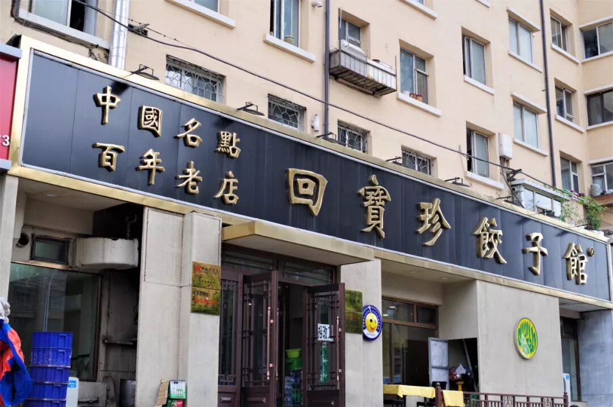

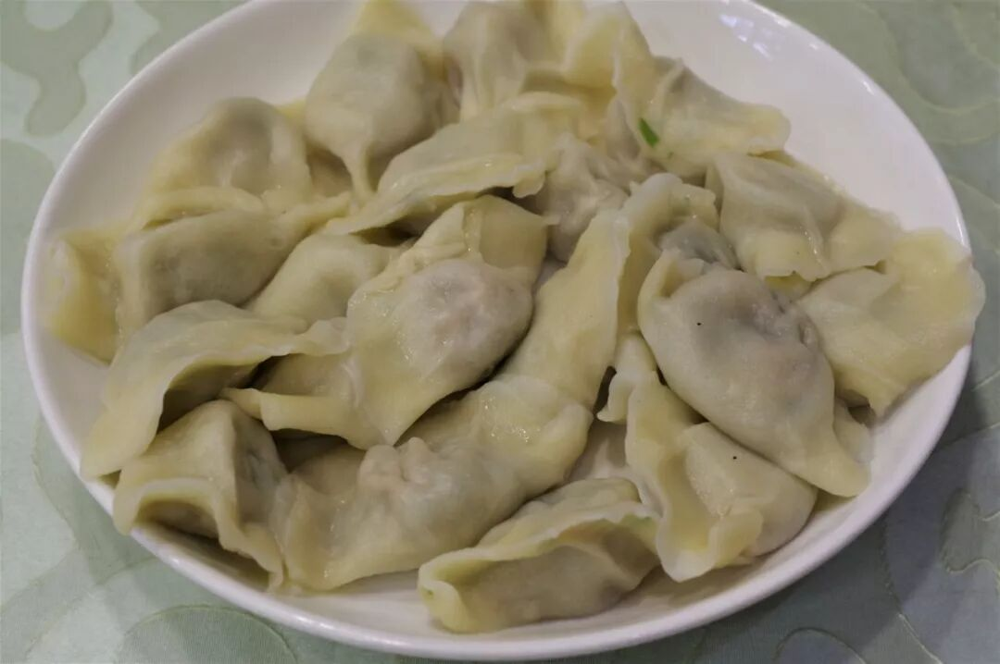

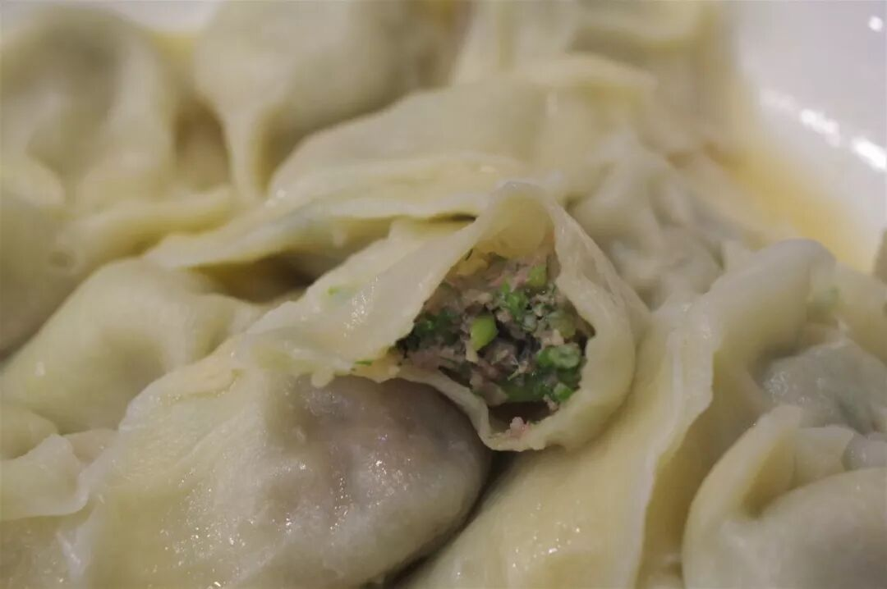

回宝珍饺子馆是长春市又一家已经存续了将近百年的老字号餐饮店，因其属于清真餐饮，所售卖的饺子主要以牛肉馅为主。牛肉茴香饺子是北方较为常见的一种饺子，也是回宝珍最受欢迎的一种馅，皮薄馅饱个大的饺子相当实诚。在猪肉馅占绝对统治地位的东北，也可换换后卫再试试这牛肉馅的饺子。同时，回宝珍店中还有许多从东北菜改良过来的使用牛肉烹制的菜肴，也不妨一试。

从城市建设、基础设施上说，长春已经是一个相当落后的城市了，这毋庸置疑，一看便知。但是从饮食上，长春并不如人们一般所传说的那样一无是处，尤其是对非东三省人而言，来到这里一样可以胡吃海塞吃个痛快呢。

长春，明日继续。

想知道我在干啥，请点这个链接：吃货的决心——555天中国饮食探索之行

想知道我要去哪，请点这个链接：555天行程计划（2018-07-26更新）

在东北，一个人点两盘菜的成就get

（长按识别二维码点击关注哦）

 var first_sceen__time = (+new Date()); if ("" == 1 && document.getElementById('js_content')) { document.getElementById('js_content').addEventListener("selectstart",function(e){ e.preventDefault(); }); }

 if ("0" == 1) { document.addEventListener("keydown",function(e){ if ((e.metaKey || e.ctrlKey) && (e.key === 'c' || e.key === 'C' || e.key === 'x' || e.key === 'X' || e.key === 'a' || e.key === 'A')) { if (e.target.tagName === 'INPUT' || e.target.tagName === 'TEXTAREA') { return; } e.preventDefault(); } }); document.addEventListener("copy",function(e){ var sel = window.getSelection(); var content = document.getElementById('js_content'); if (sel && sel.rangeCount > 0 && content && content.contains(sel.getRangeAt(0).commonAncestorContainer)) { e.preventDefault(); } }); }

预览时标签不可点

微信扫一扫

关注该公众号

知道了 (javascript:;)
