# 【第062天 长春（二）】吃什么？一锅！撸多少？一把！

- 原文链接: https://mp.weixin.qq.com/s?__biz=MzA3MTM2Mjk3NA==&mid=2247503798&idx=1&sn=316c93e6a8c3d779f070989ae4617344&chksm=9f2c3f47a85bb651cb023ce92ff7c70b2ec4133489466a2686f3fb773f9dc53f13ab0031c3eb&scene=21
- 作者: 宇哥食行记
- 发布时间: 未知
- 图片数量: 22

东北的秋天，总归是早于中国的其他地区。早晚的长春街头已凉风习习，几乎耐不住要加上一件单衣。在这样的日子里，吃上些热乎乎的东北食物，岂不能温暖身心？

吃货就是这样，总能为自己的口舌之快找上些无懈可击的理由。

“今天又吃多了吧？”

“废话

”

（1）

酸菜白肉血肠

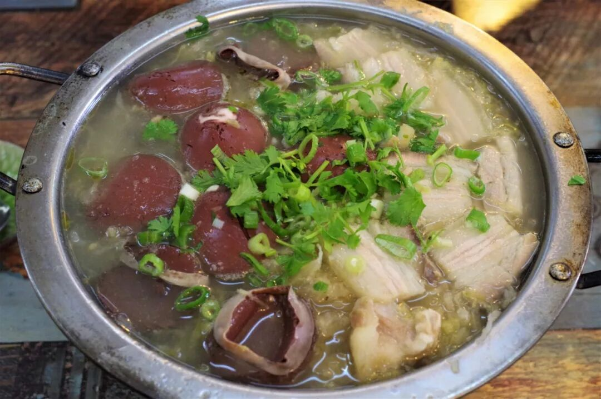

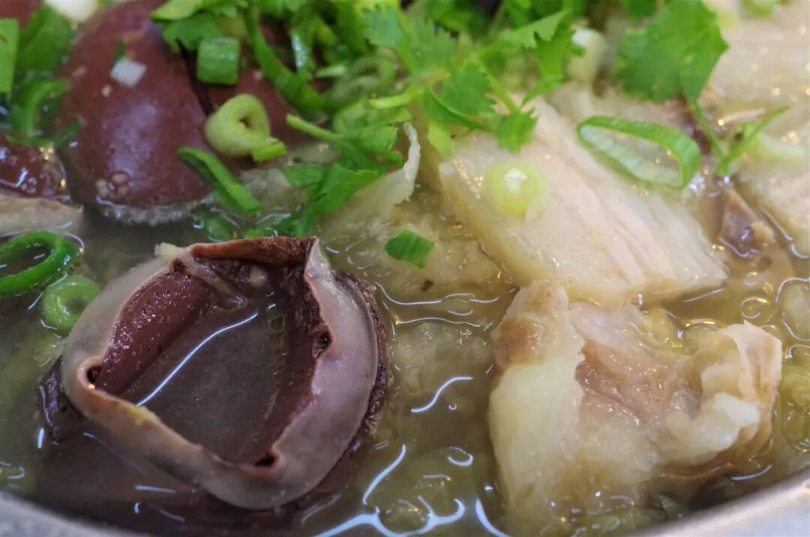

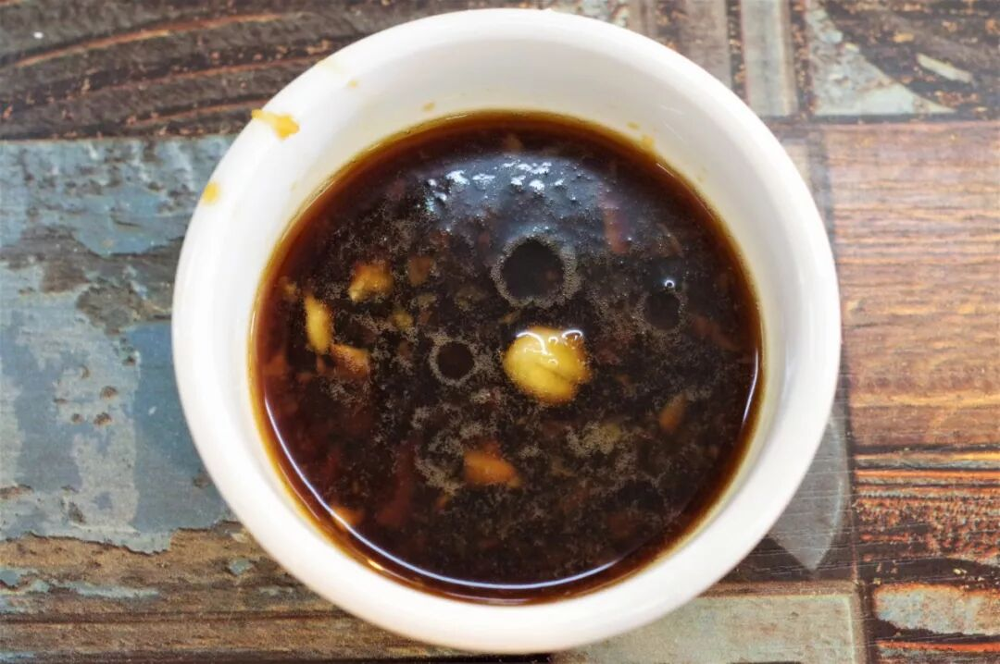

酸菜白肉血肠又可叫做汆白肉血肠，也就是大名鼎鼎的东北杀猪菜（广义上的杀猪菜指的是过年杀猪后使用全猪所制作的所有菜肴，狭义上的杀猪菜就是酸菜白肉血肠）。其制作过程极其简单，将东北酸菜、五花肉切片、血肠切块放于锅中炖煮即可，热气沸腾，咸酸鲜香，食用时蘸上蒜酱。

五花肉肥瘦相间，具有丰富的口感，肥而不腻。血肠除了一层脆韧的肠衣外，与常见的猪血口感并不相同，由于其制作时是将猪血灌入肠衣内直接煮熟，血并没有长时间结块，因此较通常的猪血具有粉嫩化渣的口感。至于这东北酸菜，最地道的应是东北家家户户冬季都会制作或采购的大白菜制酸菜，属于应季产品，现在能在东北地区吃到的酸菜大都是包菜、娃娃菜等，算是一个遗憾。

（2）

一锅出

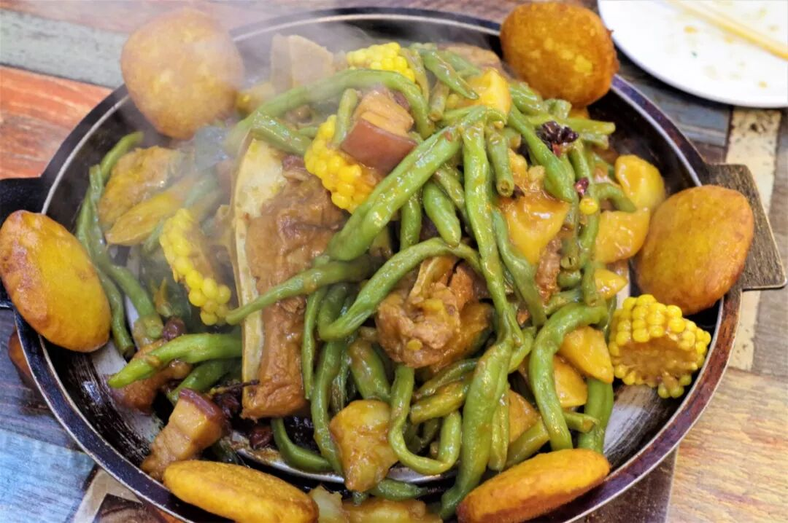

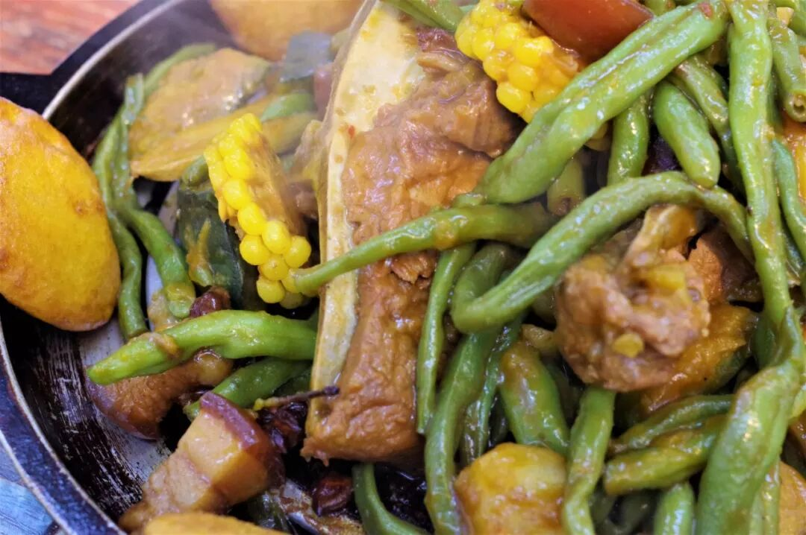

一锅出是典型的东北式菜肴“大而全”特点的代表，又名农家一锅出，体现了其来自草根、来自乡野的平民之气，是一道极其下饭的菜品。一锅出之名最初来源于这道菜菜与主食全在一锅的特征。

锅里炖着排骨、玉米、豆角等，锅边烀着玉米饼子，菜炖得软烂而入味，饼子也因吸收了菜的汁水而变得味道丰富。大口吃肉，大口吃菜，大口吃饼，还可以大口吃饭，一切都在这一锅里，不拘一格而不容小觑。

我想，最好的一锅出大概仍在田野之间吧。我完全可以想象，揭开灶上大铁锅的盖子时，那热气的升腾与滋啦的声响，会让我流下多少口水。

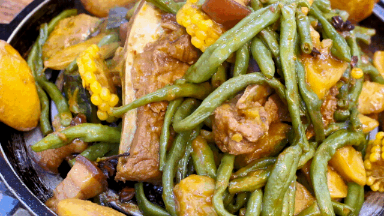

（3）

烤串

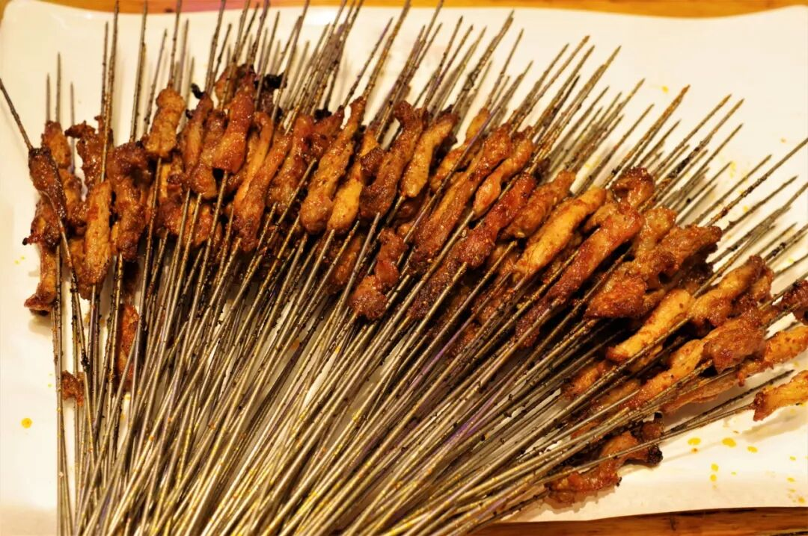

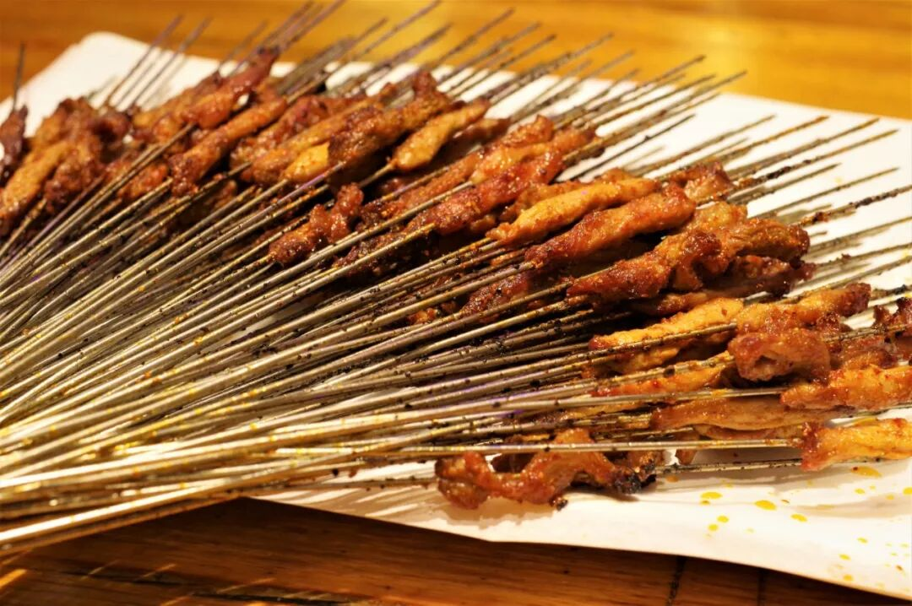

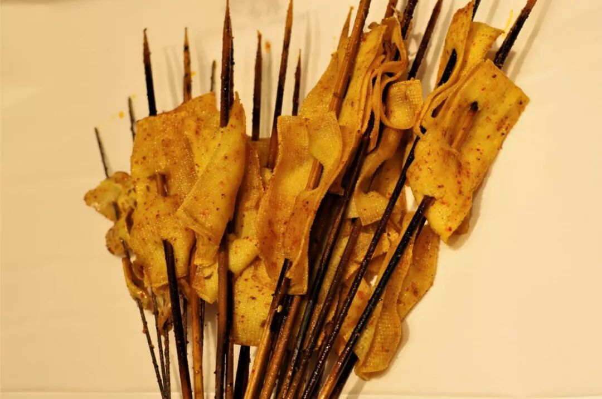

（烤干豆皮）

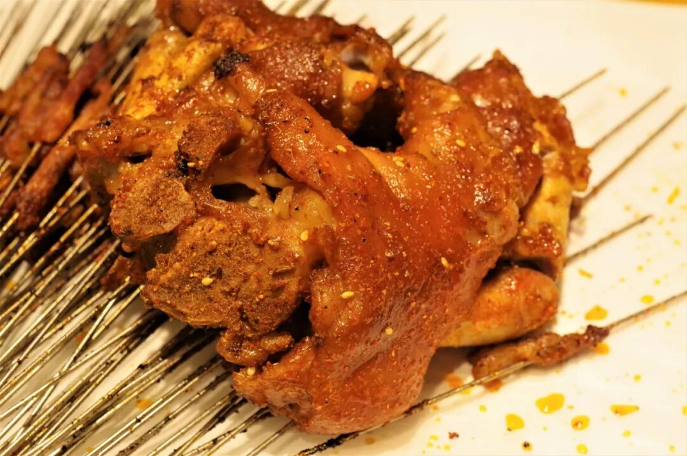

（烤猪蹄）

大约很久以前就听说了，东北人吃烤串都是五十串、一百串地点，从没有三五七八串之说。从那时起，来到东北尝试“一人百串”便成为了一个吃货心中小小的念想，今天终于得偿所愿。

尽管我说不清这到底是不是噱头，一百串肉就这么被放置于眼前的空盘中时，我的内心还是免不了“咯噔”一下，这种对心灵的震慑是不容置喙的。抓起一串，咬下那一口实实在在的肉，仿佛一瞬间开启了“活在自己世界”的开关——手机放下了，思绪平静了，一串一串一串，撕咬撕咬撕咬，着了魔一般。这个念想终于不再是念想，而成为了我无论以后走多远，也总要回到东北来再撸一顿、再撸一顿的牵挂。

我才不要人生一串，我要的是一人百串。

（4）

炒粉

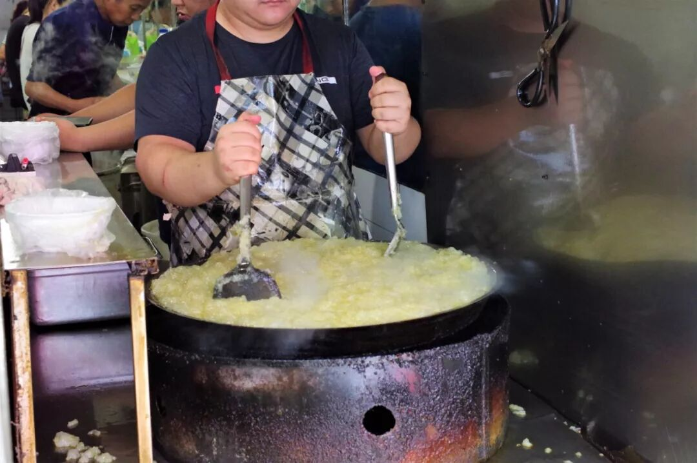

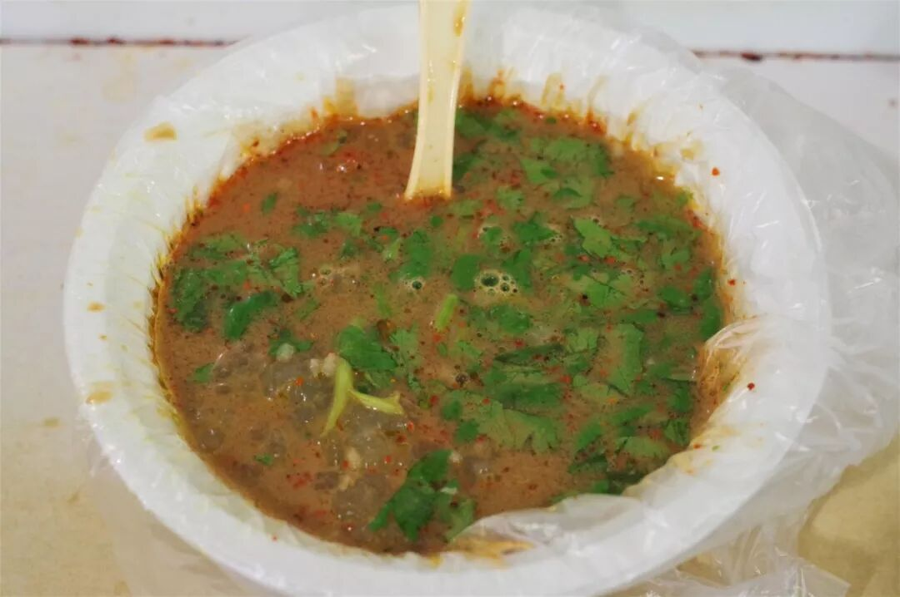

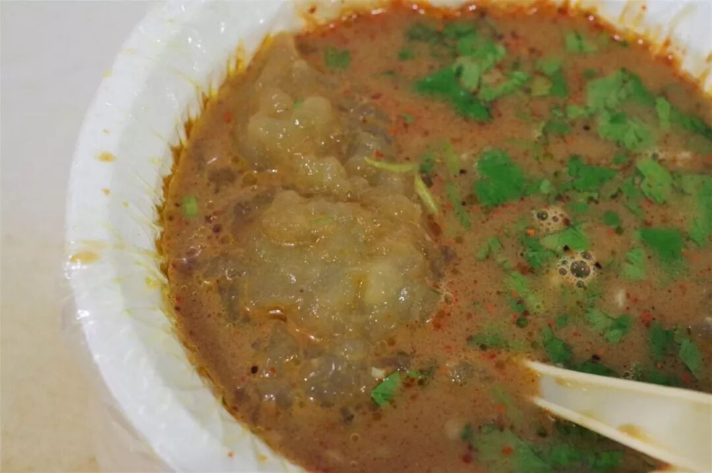

如果硬要说长春有什么特色小吃的话，能够推出来的应该就只有炒粉了。所谓炒粉并不是炒米粉、炒粉条之类的食物，而是将淀粉（玉米淀粉为主）加水于锅中不停地翻炒，炒得越烂越好。食用时盛出炒粉，浇上芝麻酱、醋、蒜、辣椒油等混合而成的汁即可。Q弹软糯的粉配上酸辣咸香的汁能在一瞬间唤醒你的味蕾，吃一遍就难以忘却。

吉林市的小吃炒粉和大连地区的小吃焖子与长春炒粉本质上是相近的，但是在粉的处理方式和调味上大相径庭，各具特色。

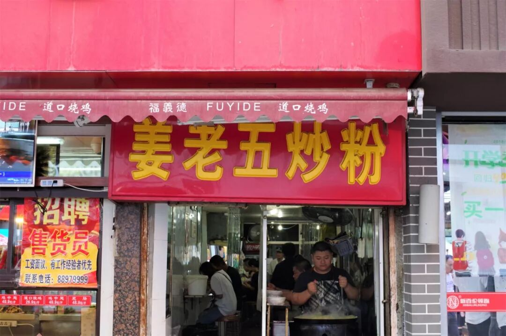

（5）

宏宝莱

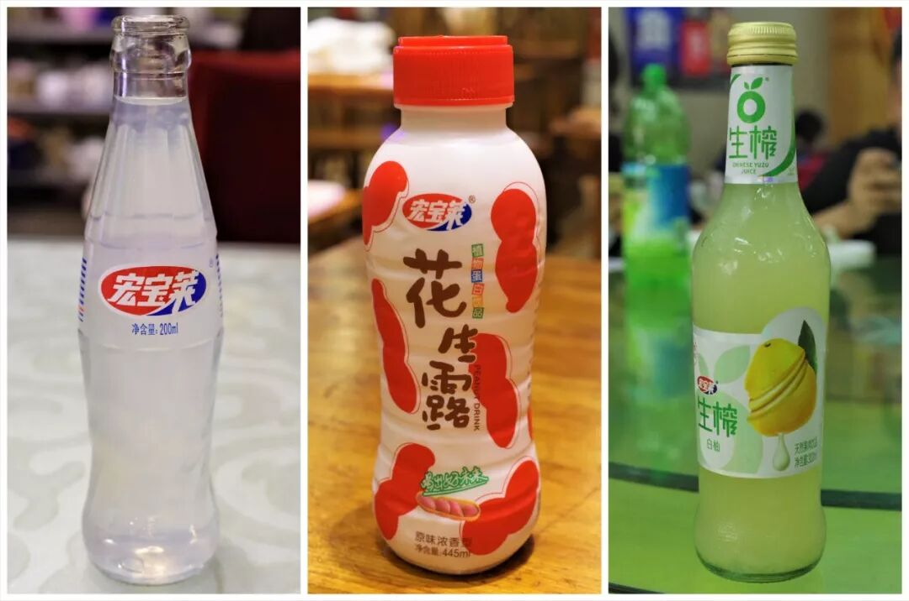

（宏宝莱家族）

宏宝莱是吉林省四平市著名的饮料品牌，其产品在吉林省及周边地区具有极高的市场占有率。在长春的大大小小的餐厅吃饭，除了啤酒、可乐、雪碧等，最常见的饮料就要属宏宝莱了。其中，白色的宏宝莱汽水是最经典的宏宝莱饮品，酸甜可口，现在也能见到花生露、生榨果汁等其他饮品。若是来到长春及周边地区，“饮”这个需求，不妨交给宏宝莱试试？相信我，不会失望的。

（6）

香瓜

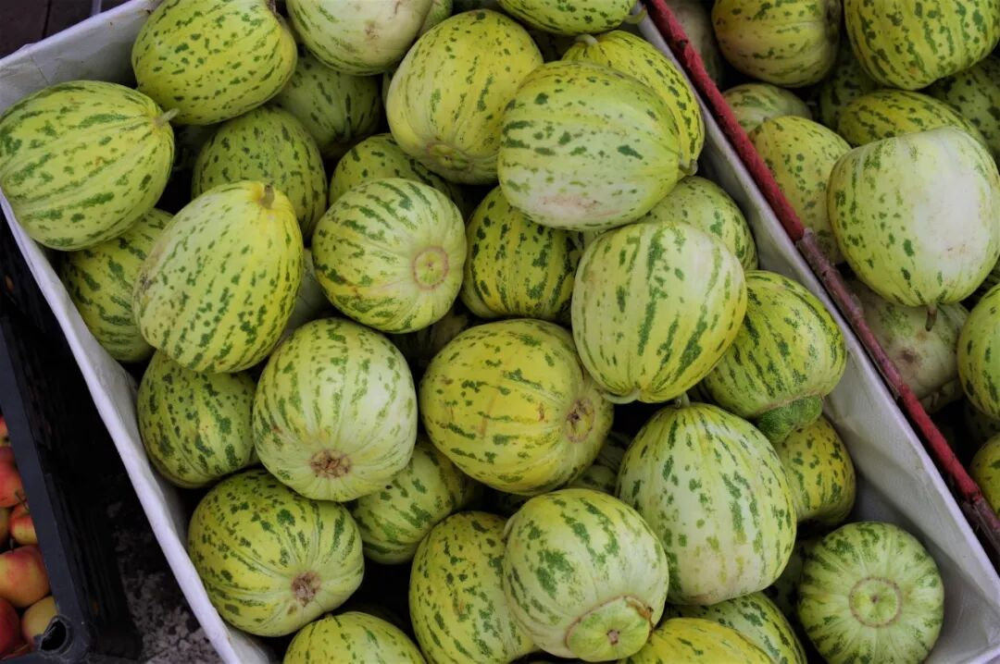

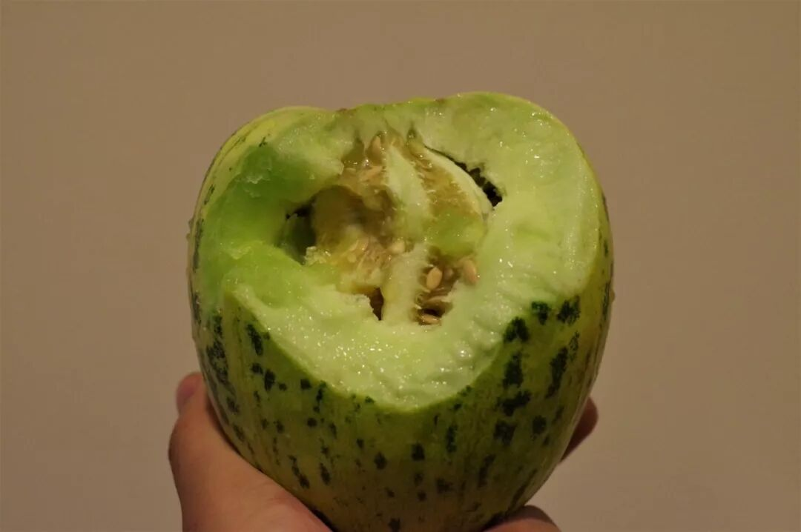

香瓜是又一种遍布整个东北地区、极具东北特色的水果，现在正是香瓜大量上市的季节，几乎不用刻意寻觅，也许在下一个转角就是一个正在售卖香瓜的小贩。东北香瓜的一大特点便是香，隔着一两米便能闻到那诱人的果香味，据说更是有“八里香”“十里香”这样的香瓜品种，虽然夸张，却足见这香气之浓郁。其另一大特点便是软，因此地道的东北人吃香瓜总是用手掰开便吃。如果你看到街头有人正在吃着一个形状极不规则的香瓜，不必怀疑，多半是东北人，多半是徒手破开的。

长春的两天就这样了。这里的吃食当然远不止于此，所有常见的东北食物在这里都可轻易获得，再加上长春所独有的那一些食物和饮食店，任谁都没有理由再说长春是一个在饮食上一无是处的城市了。

不管别人怎么想，我人生的第一个一百串是在长春撸的。光是这，我就能记一辈子。

想知道我在干啥，请点这个链接：吃货的决心——555天中国饮食探索之行

想知道我要去哪，请点这个链接：555天行程计划（2018-07-26更新）

我还会再来的。

（长按识别二维码点击关注哦）

 var first_sceen__time = (+new Date()); if ("" == 1 && document.getElementById('js_content')) { document.getElementById('js_content').addEventListener("selectstart",function(e){ e.preventDefault(); }); }

 if ("0" == 1) { document.addEventListener("keydown",function(e){ if ((e.metaKey || e.ctrlKey) && (e.key === 'c' || e.key === 'C' || e.key === 'x' || e.key === 'X' || e.key === 'a' || e.key === 'A')) { if (e.target.tagName === 'INPUT' || e.target.tagName === 'TEXTAREA') { return; } e.preventDefault(); } }); document.addEventListener("copy",function(e){ var sel = window.getSelection(); var content = document.getElementById('js_content'); if (sel && sel.rangeCount > 0 && content && content.contains(sel.getRangeAt(0).commonAncestorContainer)) { e.preventDefault(); } }); }

预览时标签不可点

微信扫一扫

关注该公众号

知道了 (javascript:;)
