# 【第071天 营口】失落的海滨味道

- 原文链接: https://mp.weixin.qq.com/s?__biz=MzA3MTM2Mjk3NA==&mid=2247503788&idx=1&sn=918a5ad4446a692b751c1c779e262aaf&chksm=9f2c3f5da85bb64be049789cdec7f311fdde6cc3ba6f2f54e724a97d9140653c2117472e203a&scene=21
- 作者: 宇哥食行记
- 发布时间: 未知
- 图片数量: 19

走过的东北城市越多，越不禁感慨城市的兴衰与人的命运起落是何其相似。作为中国最早开放的城市之一，曾经的营口一度走在最前列，到了今天，或许很多人都已经不知道东北有这样一个城市了。走在营口老市区的街头，略有些破败，也略有些冷清，但那多种零星分布的中西元素，确确实实又在彰显着这个城市的过去。

城市或有失落，可它的味道仍让人期待。向海而吃，一如既往。

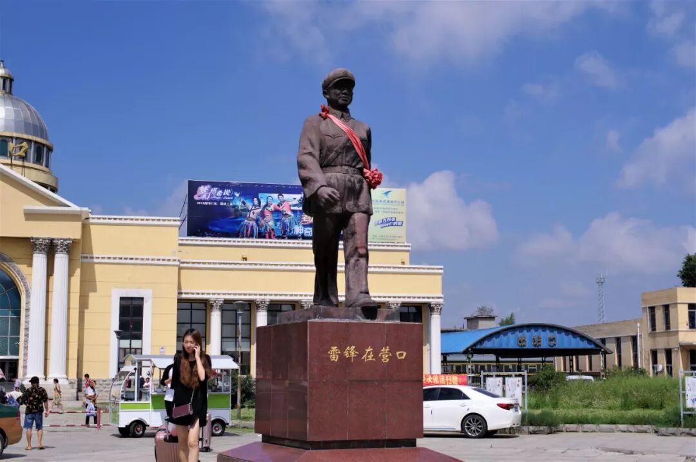

（1）

海鲜饺子

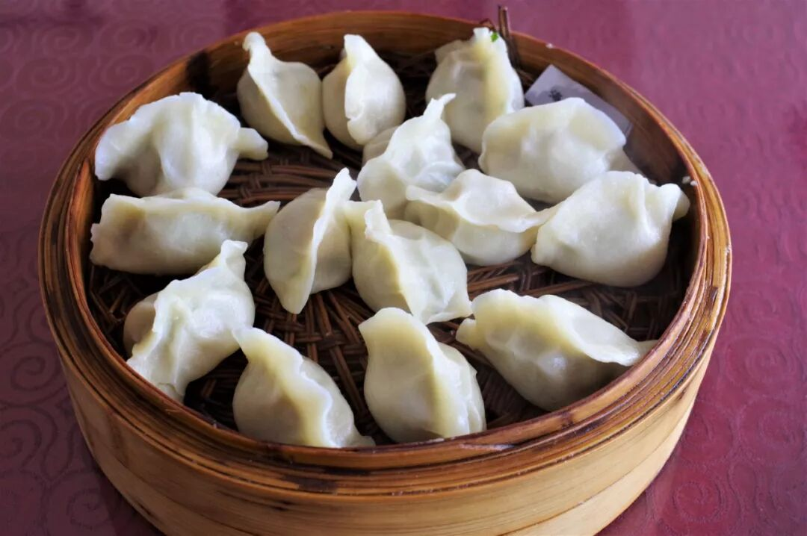

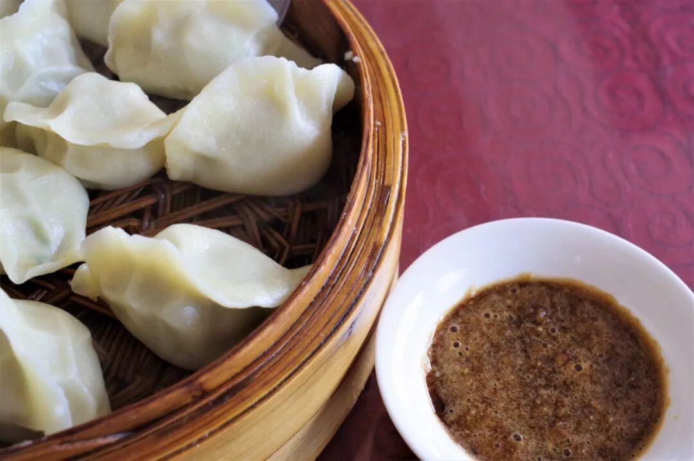

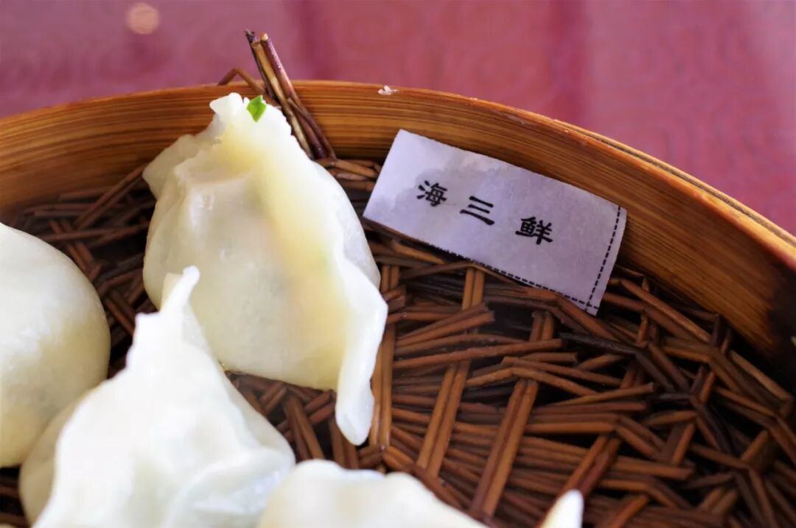

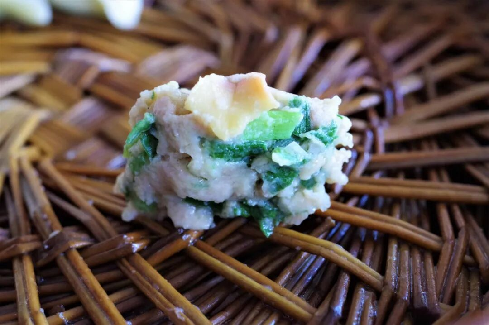

要说饺子就是东北人的命，可能一点儿也不过分，如酸菜、猪肉之类的馅在东北各地均可轻易吃到。但是到了营口，关于饺子你便有了更多带着大海滋味的选择。虾仁、鱼肉（鲅鱼为主）、螺肉、蛤肉等均可入馅，各具不同的口感与滋味。蘸上一些酸醋汁，将饺子一口塞入嘴中，汁水丰盈、肉馅紧实，再一次真实地体验“好吃不过饺子”这句北方人饮食生活中的箴言。

说句题外话，营口有一个市辖区叫老边区，与沈阳的老边饺子馆竟撞名了，让我一度以为老边饺子是从营口走出的。不过今天的老边饺子馆已然成为了游客专属老字号，与其去那里吃，还不如来老边区吃海鲜饺子呢。

（2）

托氏琩螺

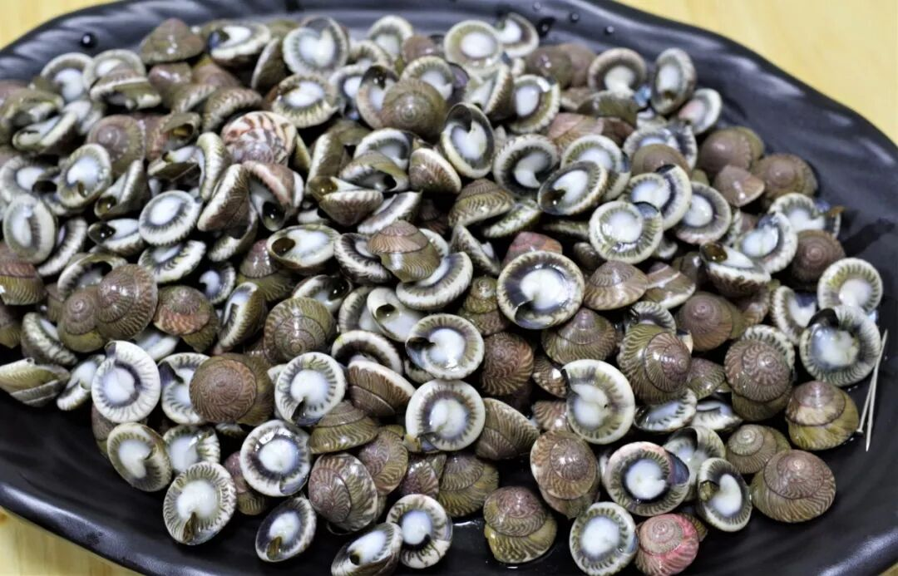

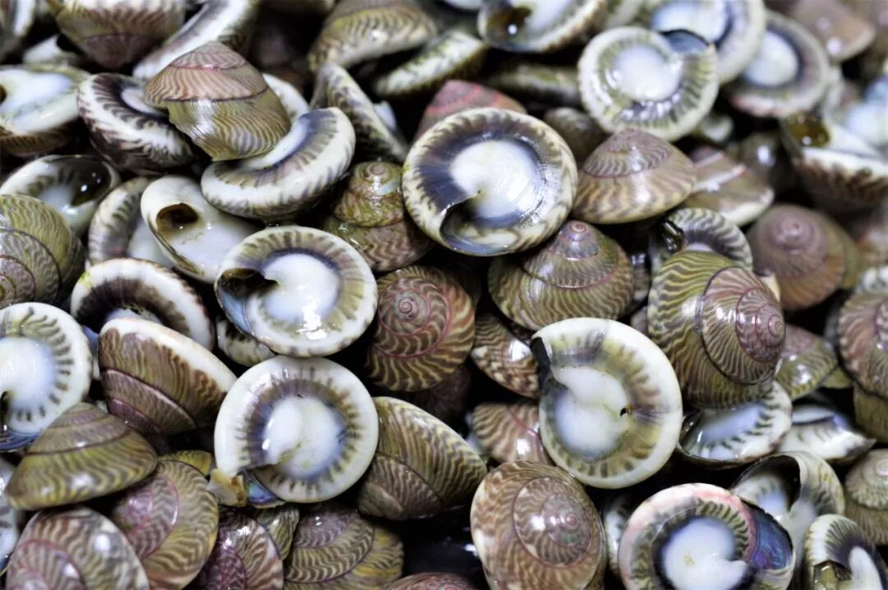

营口作为沿海城市，自然有着丰富的海鲜供给，大部分常见的海鲜在营口都可以获取，但有一种小海鲜仅在营口地区出产，那便是图片所示的托氏昌螺，当地人更习惯叫它“牛子”。

托氏昌螺呈低矮的扁圆锥型，表面有波纹状的螺纹，个头较小。由于其外形美丽，古代曾被当做钱币食用。煮熟后的托氏昌螺可食用，由于其开口极小，需用大头针挑食，使得这一食用过程具有相当的趣味性。费好大劲结果挑出一丁点肉，这种“吃力不讨好”的饮食行为或许并不为所有人认可，但托氏昌螺这样的食物本就是为打牙祭、消磨时间而存在，不承担“大口吃肉”的重任。一盘螺，二三人，四五啤酒，唠嗑就能唠上一整碗了吧。

（3）

盖州小串

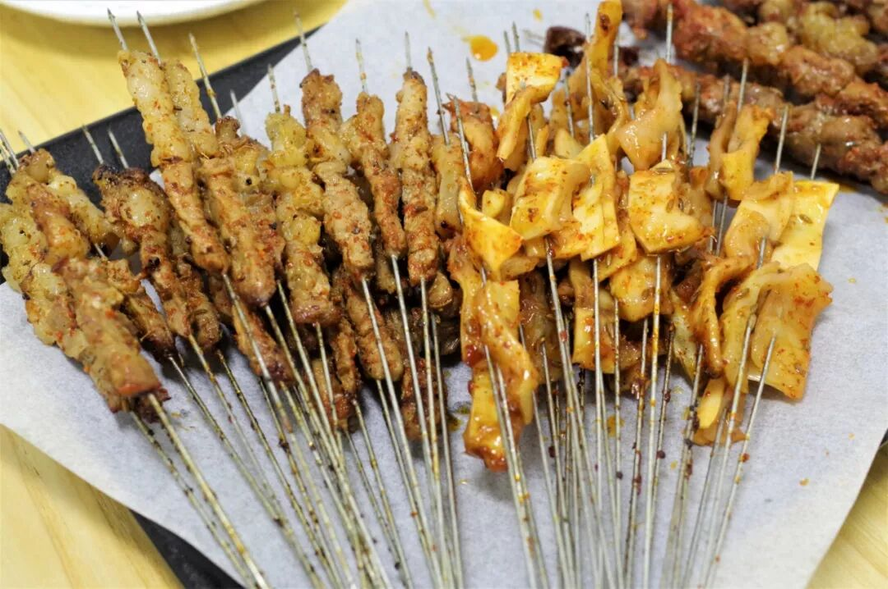

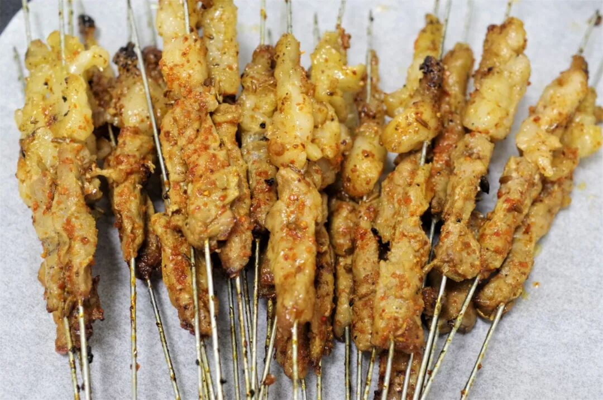

东北烧烤的第一代表毫无争议，那一定是锦州烧烤，但这并不意味着其他城市在烧烤这件事上完全没有自己的名号。至少，营口的盖州（盖县）小串，依然在周边县市有着相当高的认可度。实际上，盖州在做烧烤、吃烧烤这件事上的阵势可能完全不输于锦州，但是迫于锦州烧烤实在名气过于巨大，盖州小串目前仍只能在辽东半岛地区打下自己的一片天地。

要知道，整个东北烧烤的平均水平本就处于全国的上游，能够在东北地区还能取得区域性认可的烧烤，一定不容小觑。来到营口，盖州小串，值得一试！

（4）

锡纸金针菇

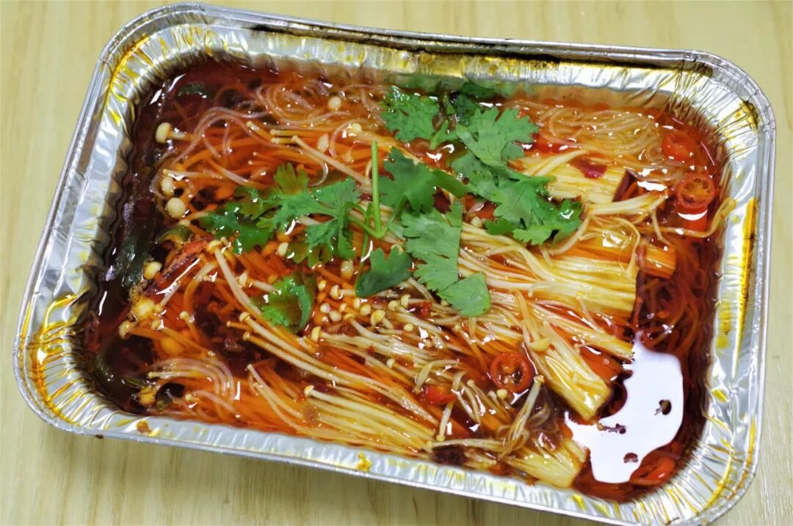

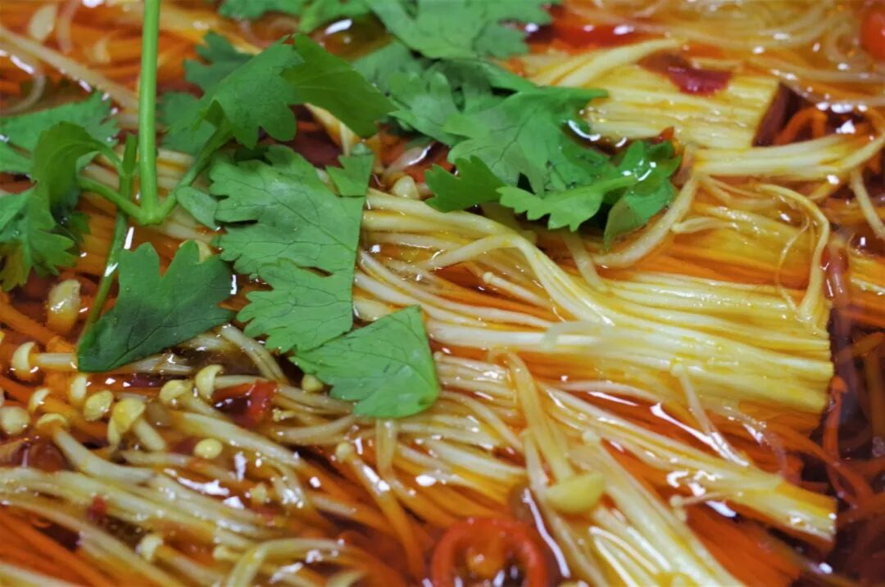

锡纸金针菇这样的食物很难说得上是东北特色，可走过这么多东北城市后，我发现它几乎从未在任何一家烤肉店或者任何一个夜市上缺席过，东北人对这份锡纸食物的热爱可见一般。

其实，只要你不是一丁点儿辣都不能食，几乎很难拒绝这份食物。咸香酸辣的汤汁，爽滑脆嫩的金针菇，加热时咕噜咕噜冒着热气，无论炎夏寒冬，总能唤起你一时间对一阵重口味的期待。

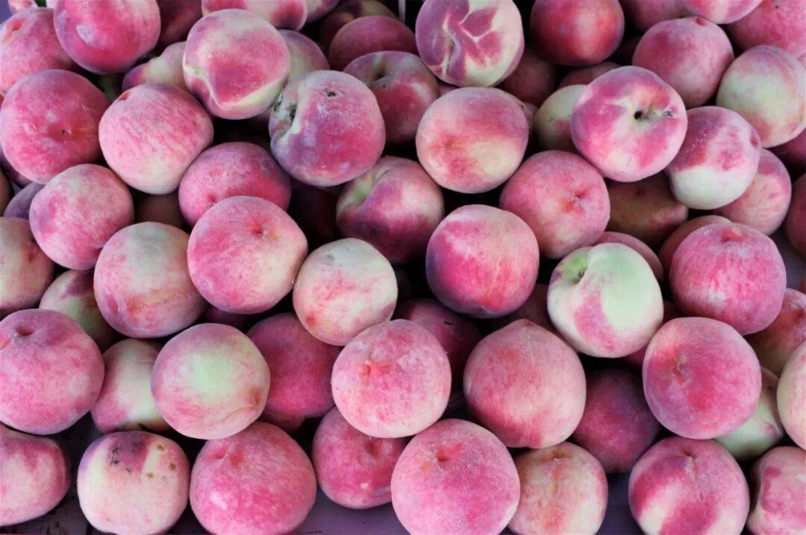

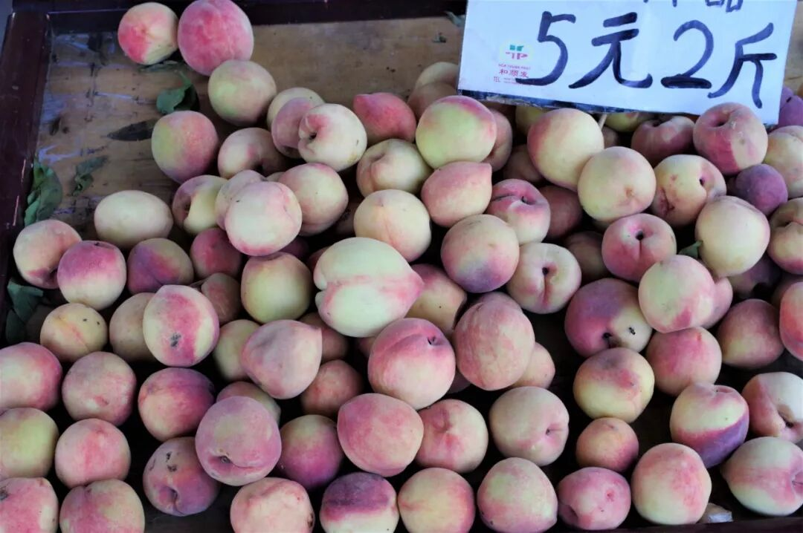

（营口盖州地区是也著名的蜜桃产区）

仅仅为饮食而来营口呆上大半天，终究是有些怠慢这个城市了。下次过来，我要慢一些，再慢一些。

为了拍一张辽河的黄昏，腿上被辽河的蚊子亲吻了十几下。真的好气。

想知道我在干啥，请点这个链接：吃货的决心——555天中国饮食探索之行

想知道我要去哪，请点这个链接：555天行程计划（2018-08-28更新）

吃了一个小时也没有吃完一盘螺。

（长按识别二维码点击关注哦）

 var first_sceen__time = (+new Date()); if ("" == 1 && document.getElementById('js_content')) { document.getElementById('js_content').addEventListener("selectstart",function(e){ e.preventDefault(); }); }

 if ("0" == 1) { document.addEventListener("keydown",function(e){ if ((e.metaKey || e.ctrlKey) && (e.key === 'c' || e.key === 'C' || e.key === 'x' || e.key === 'X' || e.key === 'a' || e.key === 'A')) { if (e.target.tagName === 'INPUT' || e.target.tagName === 'TEXTAREA') { return; } e.preventDefault(); } }); document.addEventListener("copy",function(e){ var sel = window.getSelection(); var content = document.getElementById('js_content'); if (sel && sel.rangeCount > 0 && content && content.contains(sel.getRangeAt(0).commonAncestorContainer)) { e.preventDefault(); } }); }

预览时标签不可点

微信扫一扫

关注该公众号

知道了 (javascript:;)
