# 【第077天 承德（一）】热河的味道

- 原文链接: https://mp.weixin.qq.com/s?__biz=MzA3MTM2Mjk3NA==&mid=2247503781&idx=1&sn=2e330b673859ce81f5dd7a38bd66bb0b&chksm=9f2c3f54a85bb642cec421c028b297bfd0ce432b61aee7532a02231af198bd08313caaf2870e&scene=21
- 作者: 宇哥食行记
- 发布时间: 未知
- 图片数量: 16

河北篇引言

无论从什么角度看，河北都是一个相当没有存在感的省份了。这些年，能够将河北带入其他人视野里的事物，恐怕也就只有雄安新区与雾霾。就连河北人自己，仿佛都早已破罐子破摔，开始无止尽地进行自黑。

可河北又从来都是一个相当复杂的地方，京津两市像一把利刃直接在河北的咽喉部位开了一个大口子，将河北分割成截然不同的南北两部分。可即使往南看，太行山区与华北平原区仍是泾渭分明。更别提，也许大多数人都会忽略，河北还是个沿海省份呢。

一个如此复杂的省份，怎能让人相信它的特色美食仅一个驴肉火烧呢？我是不相信的。也因此这一次，我要用16天的时间亲自看看、亲自尝尝，那些被忽略、无视、冷落的河北吃食。说不定，又是一片灿烂繁星。

正文

承德的确对得起它避暑胜地的美誉，至少在我下火车的那一瞬间，第一次感受到了秋日的瑟瑟凉意。

承德北接内蒙，自然少不了各种牛羊肉的吃食；又东临辽宁，满大街的抻面、炖菜仿佛让人以为还在东北；而北京饮食对承德地区的影响更是自不必说，大部分常见的北京小吃或菜肴，在承德都能不太费劲地找到。

尽管承德的吃食看起来异常丰富，但真正占据当地人日常三餐的还是相对有限，这两天仍将以呈现这一部分为主。

（大美承德市！）

（1）

荞面饸饹

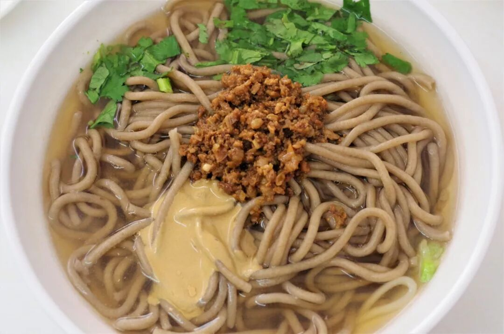

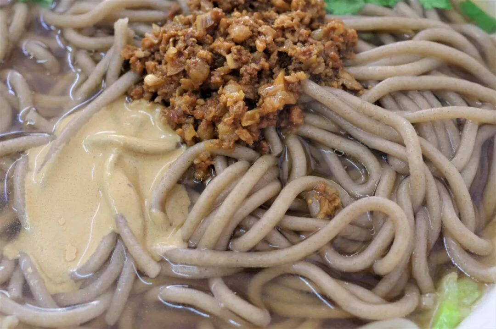

从承德这一站开始，荞面饸饹将不定期地反复出现，作为中国北方分布范围最广的面食之一，它的地位举足轻重。

荞麦面硬度较大，无法通过手工擀制或拉制而成，想要将其做成面，就必须使用一种叫饸饹床子的工具来压制。一锅沸水开着，饸饹面从圆眼中漏入锅中，定型煮熟。尽管各地制作饸饹面的方式一致，但在调味的选择上则具有明显的差异。承德地区常见的饸饹面以骨汤打底，加上一些肉臊子和芝麻酱即可，咸香的汤汁配上劲道强韧的苗条，口味独特。

（2）

松枝包子

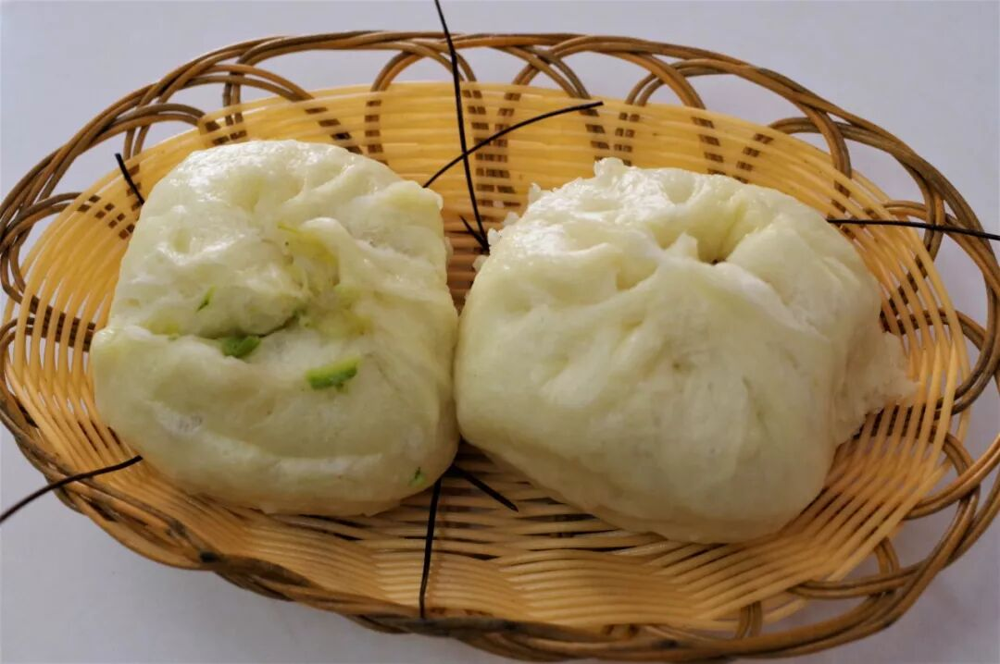

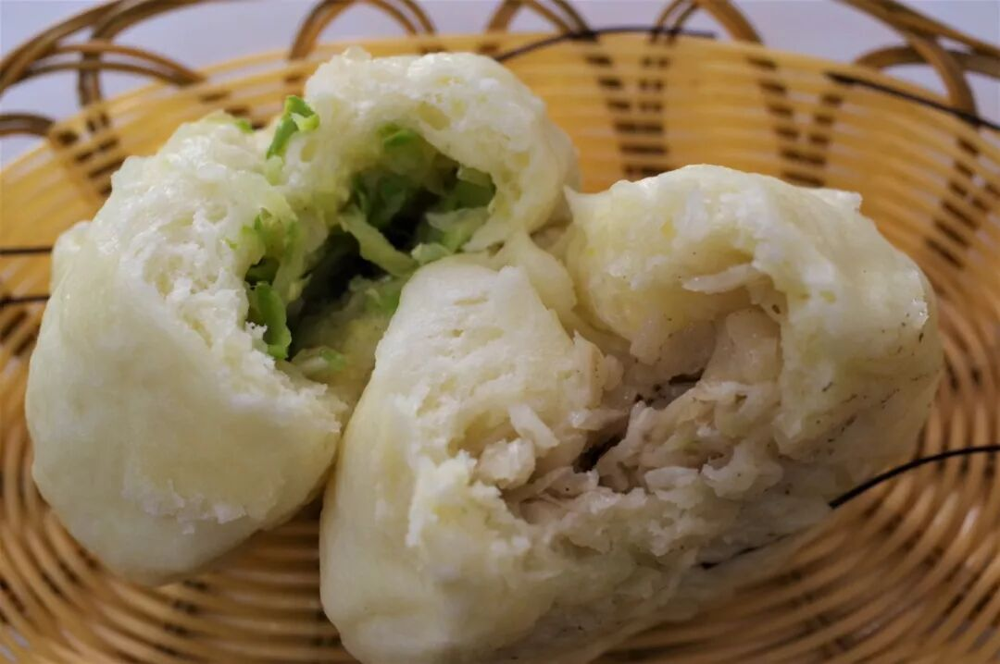

松枝包子，这是一个极其容易让人产生误解的名字。以松枝做馅儿？非也。其实所谓松枝包子，是蒸包子时在蒸笼下方放上一层松枝（松针），其名由此而来。松针本身并无明显的味道，垫上一层松针也并不会明显改变包子的味道。不过，由于松针的药用价值，这种蒸制包子的方式确实也能让人获得超越味觉感受的一些摄入。再加上这种制作方式确实稀罕，能够成为承德的一种特色饮食，也就不足为奇了。

（3）

柳条豆腐

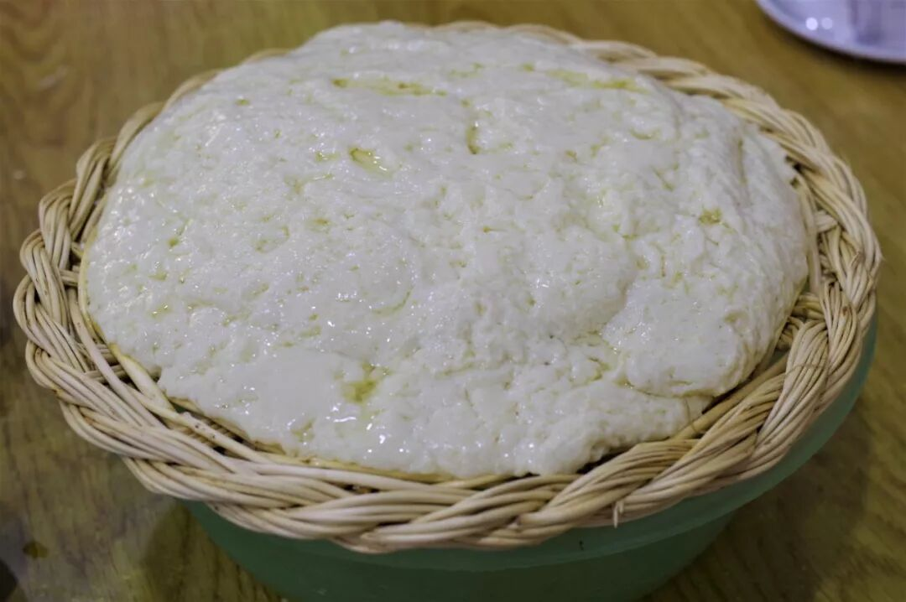

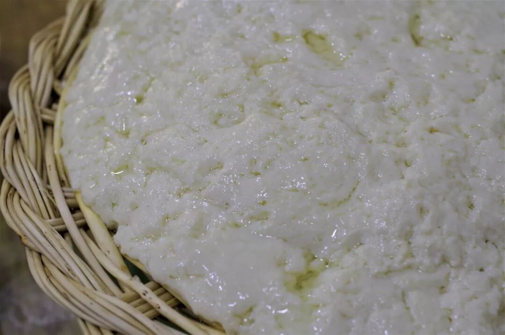

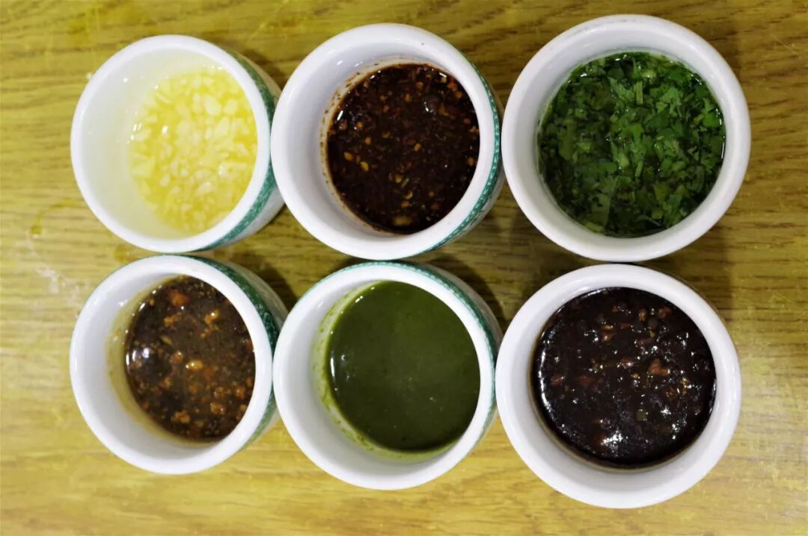

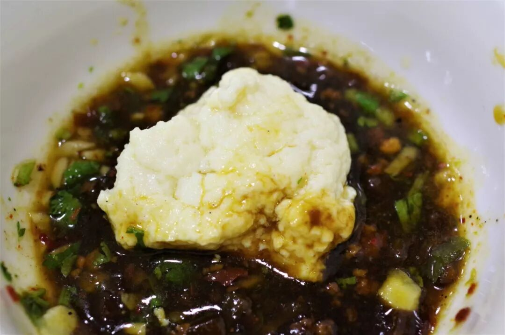

豆腐是承德地区极为普遍食用、入菜的一种食材，也许由于承德地区优越的水质，点出的豆腐有种独特的清甜之味。柳条豆腐是当地比较特别的一种豆腐吃法，将新鲜点出的豆腐之间放于柳条编织的垫子之上，再配上各色华北地方常见的调料，自由搭配组合。用筷子夹起一块细嫩至极的豆腐（已相当类似川渝地区的豆花），蘸上一些调料，然后再来上一大口米饭，别提有多痛快。

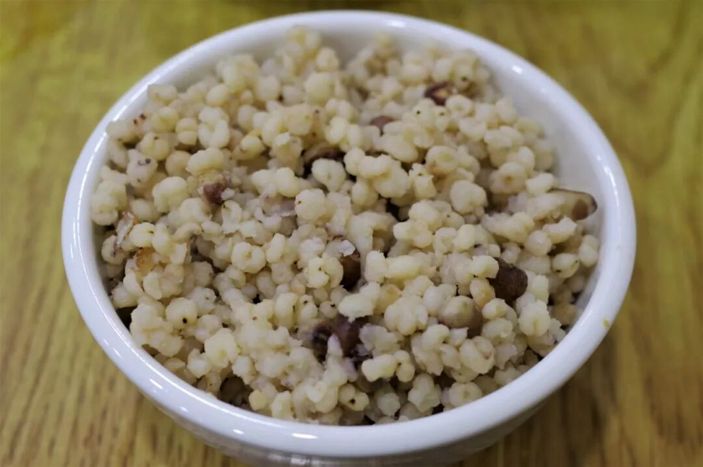

（今日已不多见的高粱米粉）

（4）

煎血肠

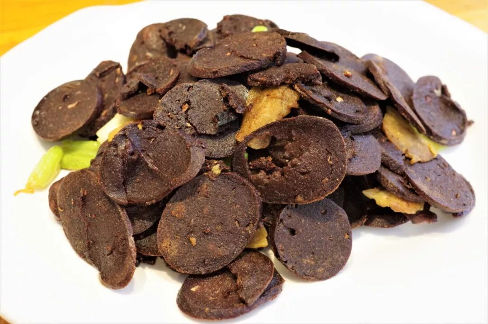

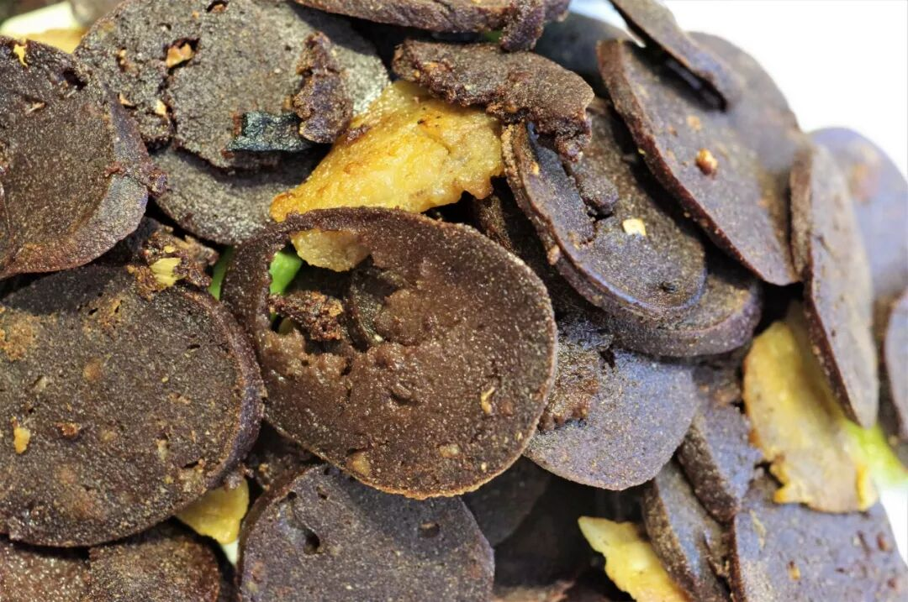

血肠是极具东北特色的一种食物，在承德地区也被广泛食用，足见其在饮食上与东北地区的共通性。将血肠切成薄片状，放于油锅中煎制，最后的成品酥脆难挡，中间未焦糊的部分仍保留着粉渣状的口感，猪血的特殊香气也在口中弥漫开。算得上是一道极好的下酒菜了。

太阳一落山，承德的温度便骤降。我想，是时候回到屋内裹上被子了。这个秋天来得有点太仓促了。

呵，热河，一点儿也不热。

想知道我在干啥，请点这个链接：吃货的决心——555天中国饮食探索之行

想知道我要去哪，请看今日推送副文

是时候祭出长裤了

（长按识别二维码点击关注哦）

 var first_sceen__time = (+new Date()); if ("" == 1 && document.getElementById('js_content')) { document.getElementById('js_content').addEventListener("selectstart",function(e){ e.preventDefault(); }); }

 if ("0" == 1) { document.addEventListener("keydown",function(e){ if ((e.metaKey || e.ctrlKey) && (e.key === 'c' || e.key === 'C' || e.key === 'x' || e.key === 'X' || e.key === 'a' || e.key === 'A')) { if (e.target.tagName === 'INPUT' || e.target.tagName === 'TEXTAREA') { return; } e.preventDefault(); } }); document.addEventListener("copy",function(e){ var sel = window.getSelection(); var content = document.getElementById('js_content'); if (sel && sel.rangeCount > 0 && content && content.contains(sel.getRangeAt(0).commonAncestorContainer)) { e.preventDefault(); } }); }

预览时标签不可点

微信扫一扫

关注该公众号

知道了 (javascript:;)
