# 【第078天 承德（二）】不妨来点山野味

- 原文链接: https://mp.weixin.qq.com/s?__biz=MzA3MTM2Mjk3NA==&mid=2247503780&idx=1&sn=8fe8bfd54b3dc14d16324e7dfceba731&chksm=9f2c3f55a85bb643413868cf85d7bbf7681a58c91e3b14d5813642d2403f30a200ca4d8c6aae&scene=21
- 作者: 宇哥食行记
- 发布时间: 未知
- 图片数量: 20

山水交错、楼宇参差的承德，大概是怎么都看不够的。再配上初秋的凉意，走在承德的街头，是一种暑气全然不再的惬意。

这些许的寒意让我不禁加快了脚步，想着该用一碗什么热乎乎的食物来烘暖躯体，当然得是一碗羊汤了。其实这一路大夏天没少喝羊汤，但凡想吃，总是有一万个理由可以说服自己。论自我催眠，吃货的修为是一顶一的。

（1）

羊汤、烧饼

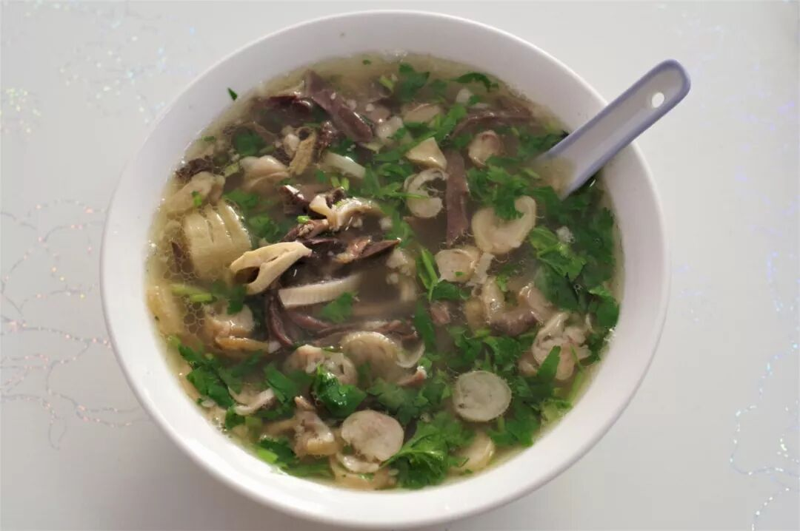

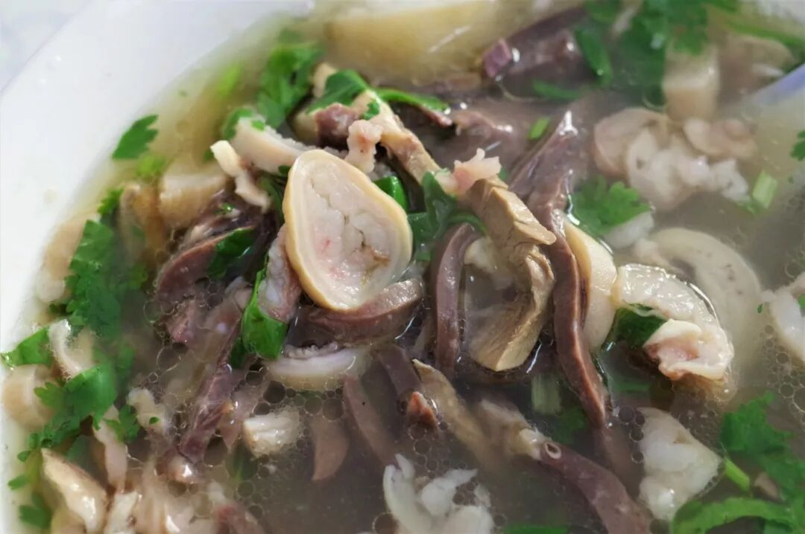

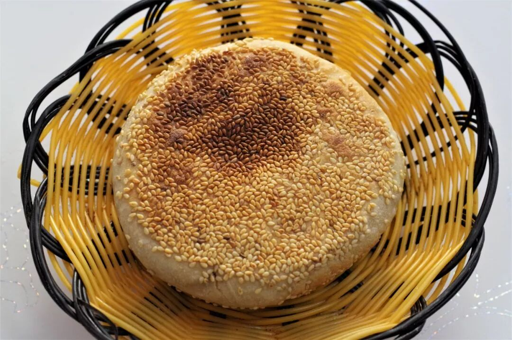

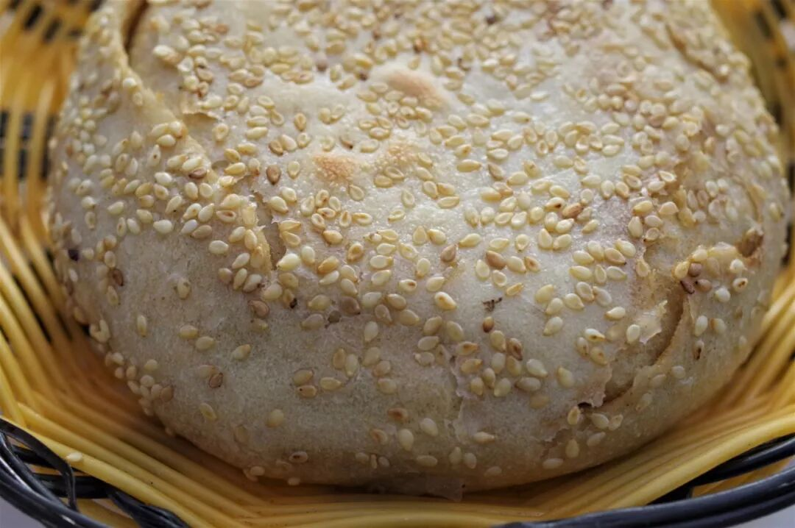

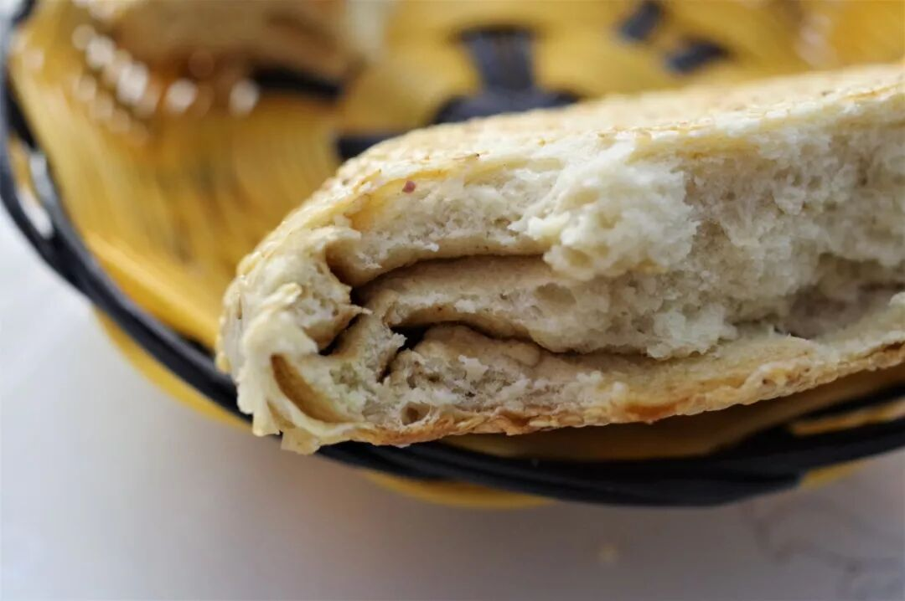

要说这承德的羊汤，当家的自然是大名鼎鼎的平泉羊汤了，这可是被列入河北省非遗系列的食物。平泉与辽宁省凌源市隔着两省边界相邻，在羊汤这事儿上共同分享成就、互相学习实在是再正常不过的事了，最终一个在辽宁打出一片天地、一个在河北揽下羊汤霸主的地方。虽然同为羊汤，其实在用料上仍有不小差距，承德平原的羊汤用上了心、肺、肚、肝、肠几乎每一种可以使用的羊杂，最终呈现出一碗选料丰富，口感爽脆为主、粉嫩为辅、交错层叠，口味咸鲜清香的羊汤，无论大口喝汤或是大口吃下水，都是一件过瘾的事。

一碗羊汤、一个烧饼，也是承德地区喝羊汤的标配。看到这满是芝麻的大烧饼，怎能不勾起你的食欲呢？

（2）

莜面窝窝

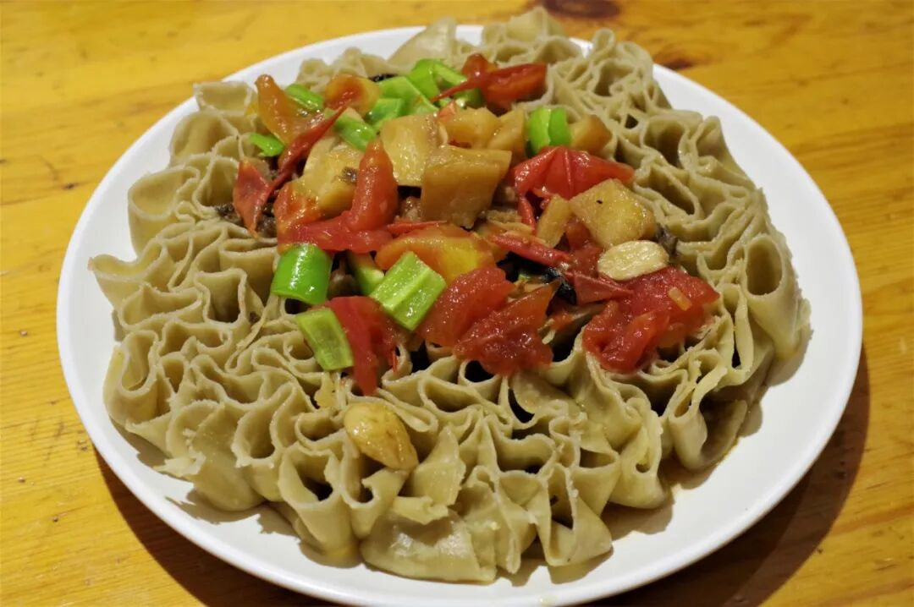

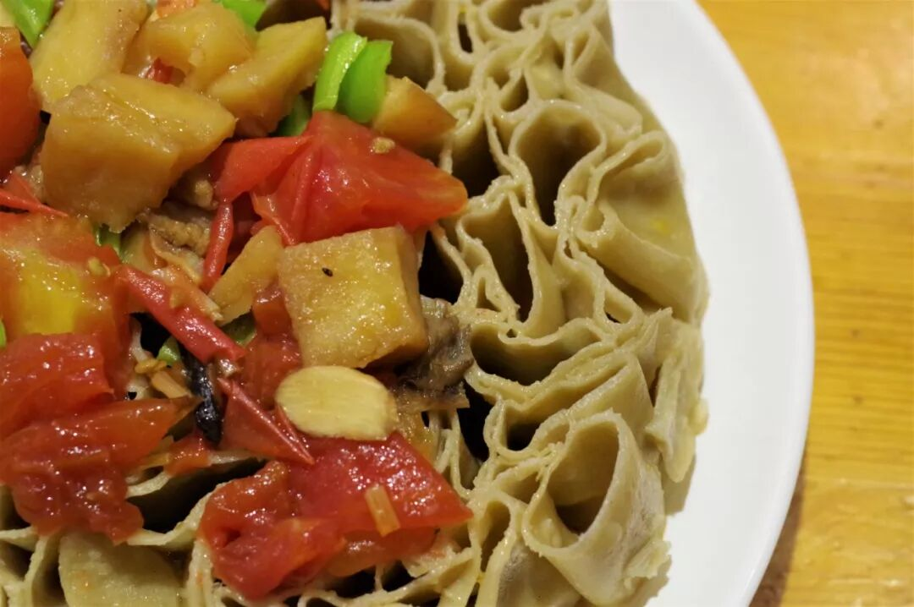

你也许不知道莜面窝窝，但你大概听说过莜面栲栳栳，它们本质上其实是一样的东西。在河北承德、张家口两市，因盛产莜麦，莜面制作的面食也成为当地较为普遍的主食。

所谓莜面窝窝即是将莜面用手卷成圆筒状放于盘中蒸熟而成，与山西地区的莜面栲栳栳不同，冀北地区的莜面窝窝主要是浇卤食用，而非蘸汁食用。蒸熟的莜面卷口感十分柔韧，在口中反复咀嚼仍有相当好的嚼感，再配上咸香味的卤子，确实算得上一份极好的主食。

（3）

乾隆饺子

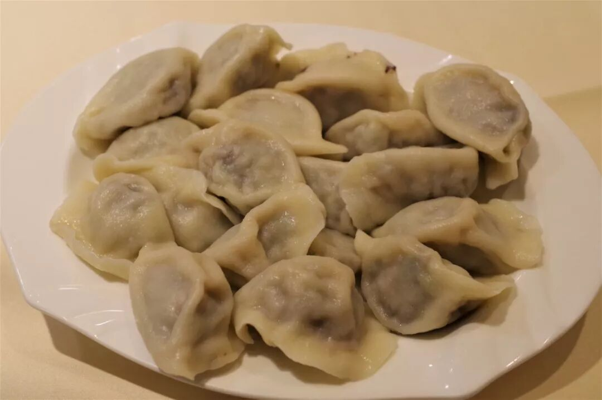

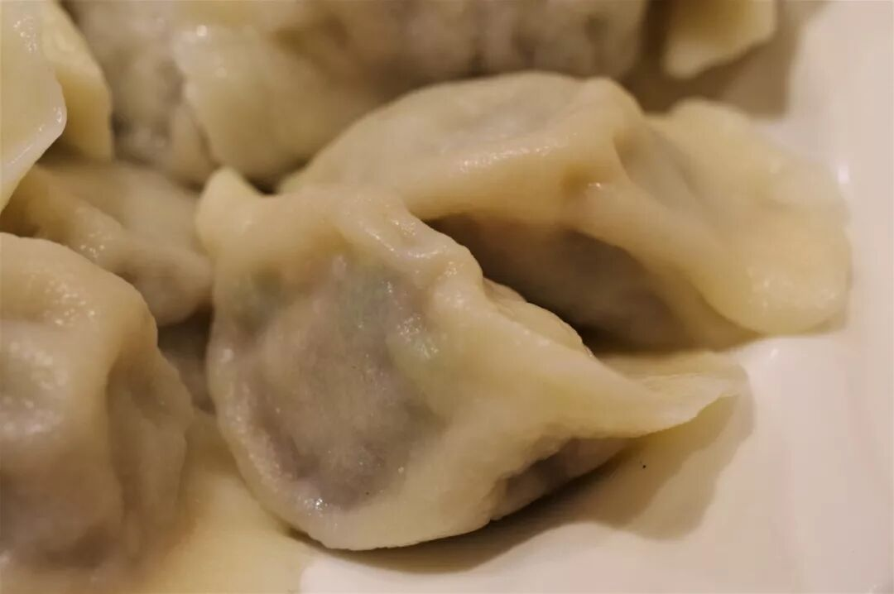

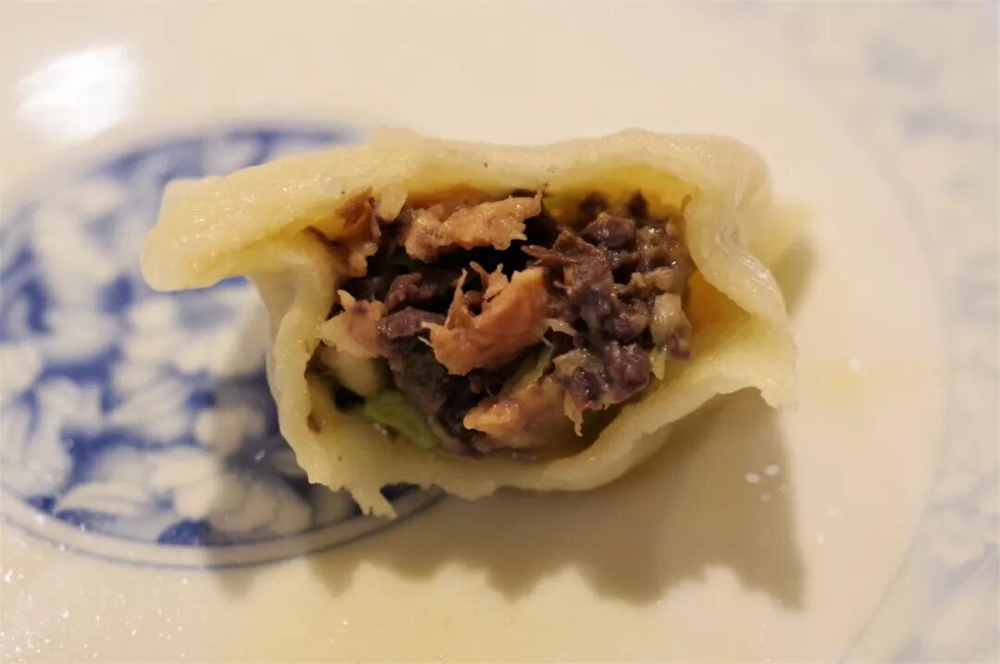

乾隆皇帝绝对算得上中国历史上最有名的一位吃货君主了，在中国南北大地留下了数不尽的与他有关的饮食传说。不过，以他的名字命名的食物相对少见，此次在承德寻得一盘“乾隆饺子”，也算是稀罕。倒不是图个新鲜，选择这样一盘食物确有我的目的所在，因为它的馅儿是由两种极具承德特色的山野味组成的——鹿肉与肉蘑。

其实鹿肉远没有我们想象的那么怪异，它是人类最早开始食用的几种肉类之一，只是近些年，它已经成为了一种高级野味，离我们的日常生活有些遥远了。鹿肉肉质极为细嫩，少肥膘和纤维，在承德地区可以找到以各种方式烹饪的鹿肉，不过它们大都价格不菲。而肉蘑则是另一种仅产于承德部分山区的菌类，大都呈鲜艳的深红色，晃眼一看就如同肉一般，味道极其鲜美，是相当稀贵的野味。

作为游人，无论是来上一盘乾隆饺子尝尝鲜，或是点上一份专门的鹿肉、肉蘑菜肴，都是相当值得的。毕竟，此味一出承德，便不复寻了。

（4）

承德特产

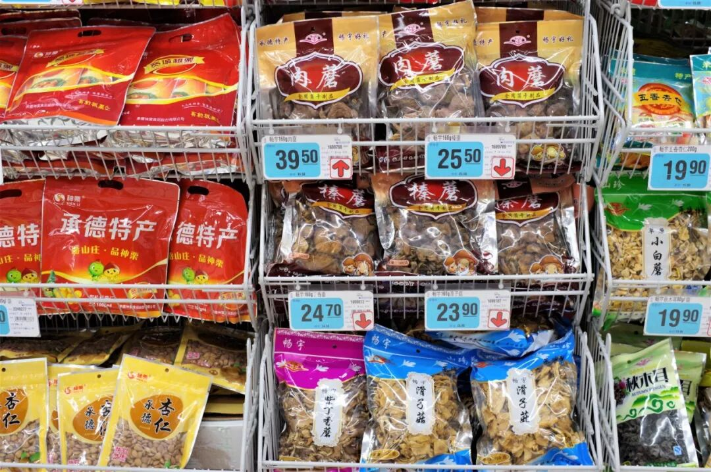

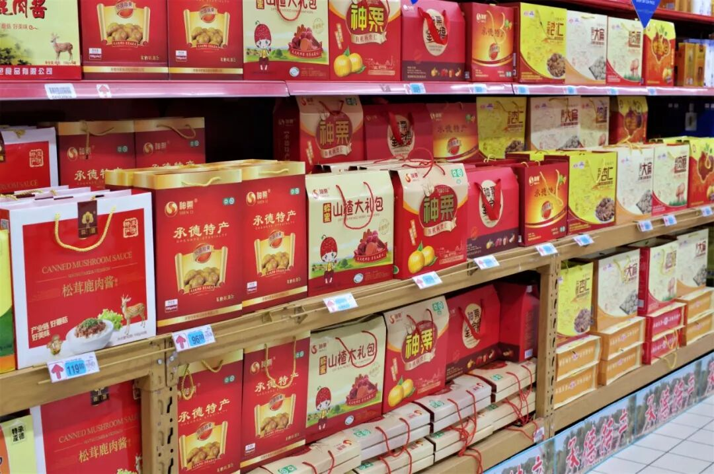

要说承德的特产，名气最大名声最响的自然是杏仁露了，在中国北方具有相当的市场。除了杏仁露外，各种杏仁、榛子、栗子、野生菌也是承德地区大量出产的食物，充满山野之味。若不是要一直赶路，真想买上一堆呢。

实话实说，承德作为一个旅游城市，并没有那种强烈的由当地人自有自享的、相对丰富的地域饮食文化，它们大都难以和“游客专供”的标签脱离开来。不过，换一个角度想，它也确确实实拥有一些独一无二的味道，仍值得你我亲自品尝一遭。

承德的凉夜，没太多声响。

想知道我在干啥，请点这个链接：吃货的决心——555天中国饮食探索之行

想知道我要去哪，请点这个链接：555天行程计划（2018-09-07更新）

热河的秋来了

（长按识别二维码点击关注哦）

 var first_sceen__time = (+new Date()); if ("" == 1 && document.getElementById('js_content')) { document.getElementById('js_content').addEventListener("selectstart",function(e){ e.preventDefault(); }); }

 if ("0" == 1) { document.addEventListener("keydown",function(e){ if ((e.metaKey || e.ctrlKey) && (e.key === 'c' || e.key === 'C' || e.key === 'x' || e.key === 'X' || e.key === 'a' || e.key === 'A')) { if (e.target.tagName === 'INPUT' || e.target.tagName === 'TEXTAREA') { return; } e.preventDefault(); } }); document.addEventListener("copy",function(e){ var sel = window.getSelection(); var content = document.getElementById('js_content'); if (sel && sel.rangeCount > 0 && content && content.contains(sel.getRangeAt(0).commonAncestorContainer)) { e.preventDefault(); } }); }

预览时标签不可点

微信扫一扫

关注该公众号

知道了 (javascript:;)
