# 【第085天 石家庄（二）】“国际庄”寻味记2

- 原文链接: https://mp.weixin.qq.com/s?__biz=MzA3MTM2Mjk3NA==&mid=2247503773&idx=1&sn=7473ffabca56a9dcceed8963f0faf17f&chksm=9f2c3f6ca85bb67af53f44b2c4f7863823a7c9c750c626a54c6c7f30406a54b5a94f1b7ae9b6&scene=21
- 作者: 宇哥食行记
- 发布时间: 未知
- 图片数量: 18

我确实尽力了。

出门未带伞，却在远离住处后下起了雨，随即在便利店买了一把伞，撑了五分钟，伞坏了。那时我就感觉，今日的觅食之路不会太顺畅。果不其然，在饥肠辘辘之时连续吃了三次闭门羹，再加上两次进店后指着菜单上的一种食物，却被店家告知“今天没有”。

我想，这是活脱脱的“水逆”吧。

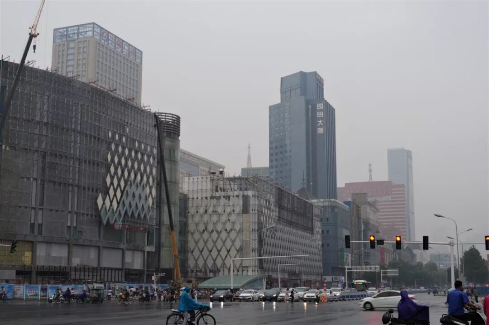

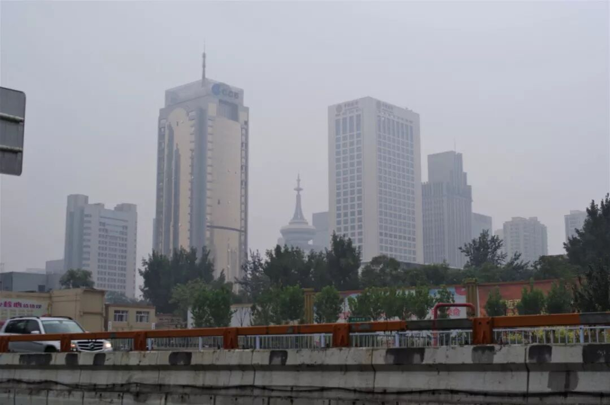

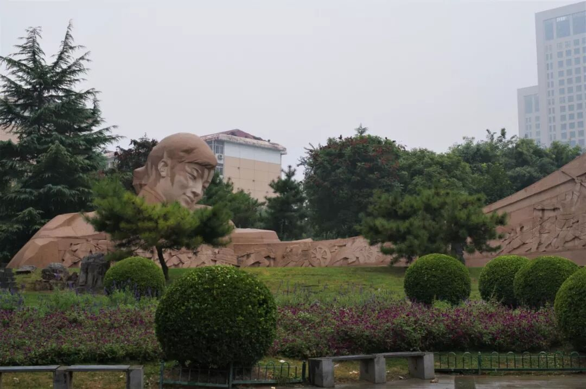

（1）

缸炉烧饼

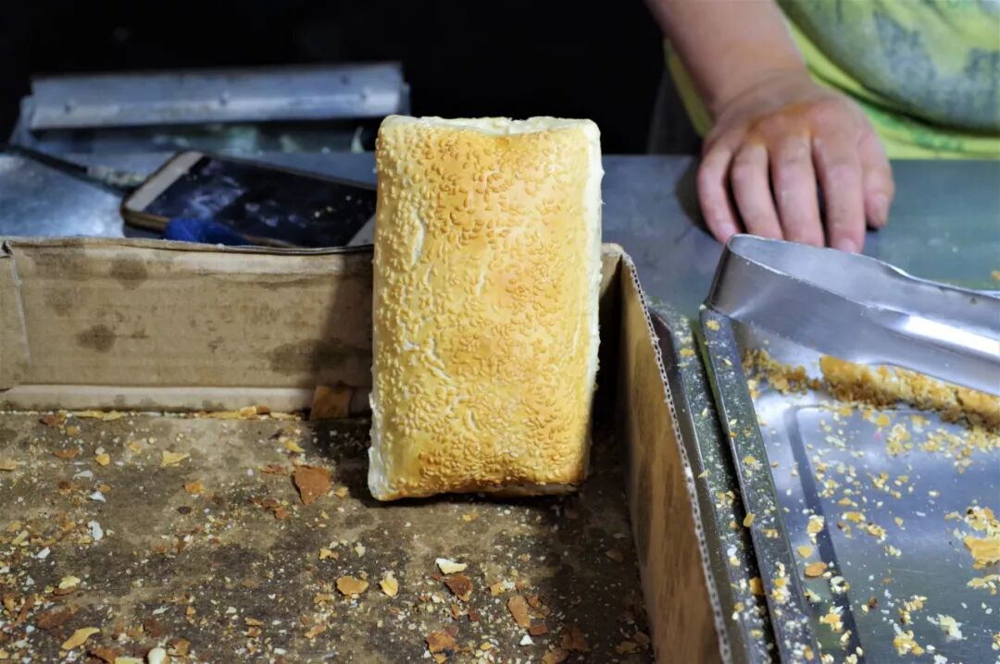

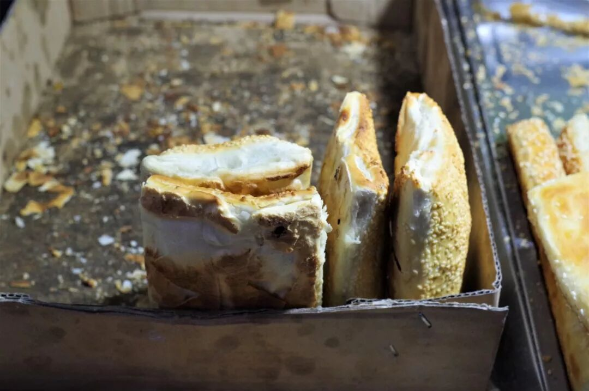

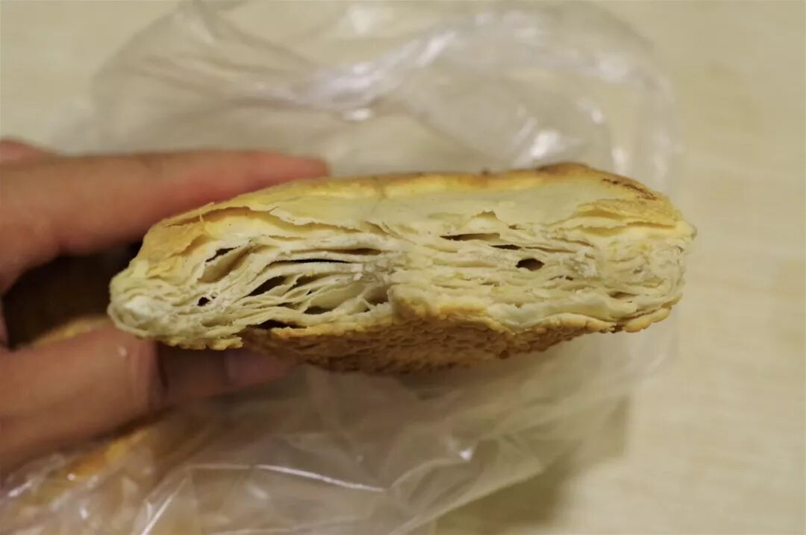

昨天有石家庄的朋友在文章后面留言，说缸炉烧饼大概是石家庄唯一能摆上台面来说的地方特产了，我不敢说这是种自谦还是什么，但确实应该好好介绍一番。

严格意义上说，缸炉烧饼属于整个华北地区较为普遍、常见的食物，但石家庄地区尤其具有代表性。该地区的缸炉烧饼形状呈方形，烧饼中间往外鼓出，表层布满了密密麻麻的芝麻，将其掰开后清晰可见分为相当多层的内里。咬上一口，这种外在的印象便会更加深刻，酥脆的表皮，一层层内里叠加所带来的紧致而又分明的口感，特色十分鲜明。

（2）

扒糕

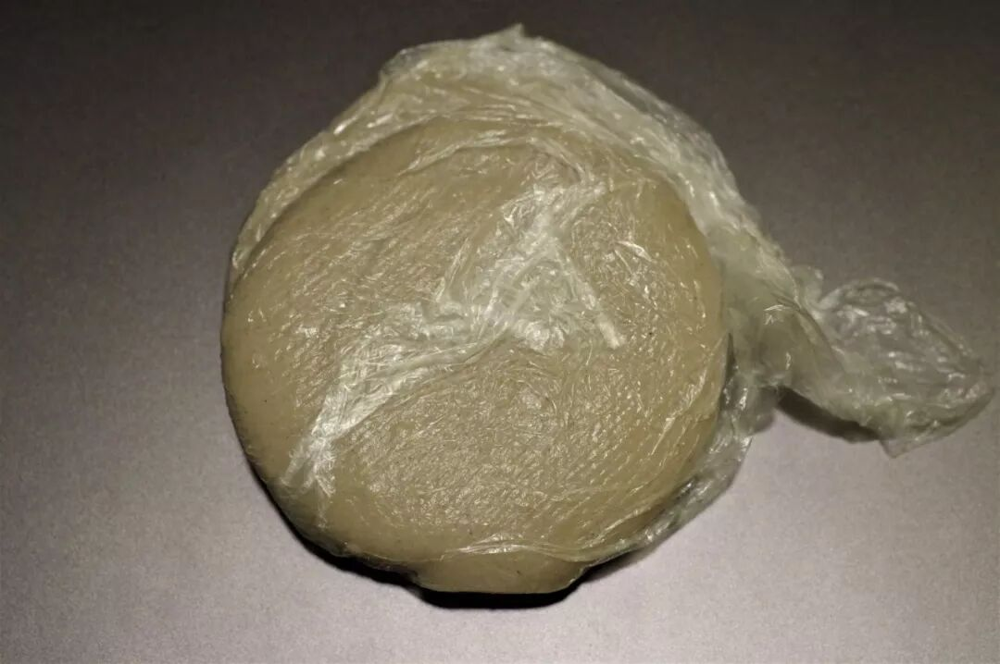

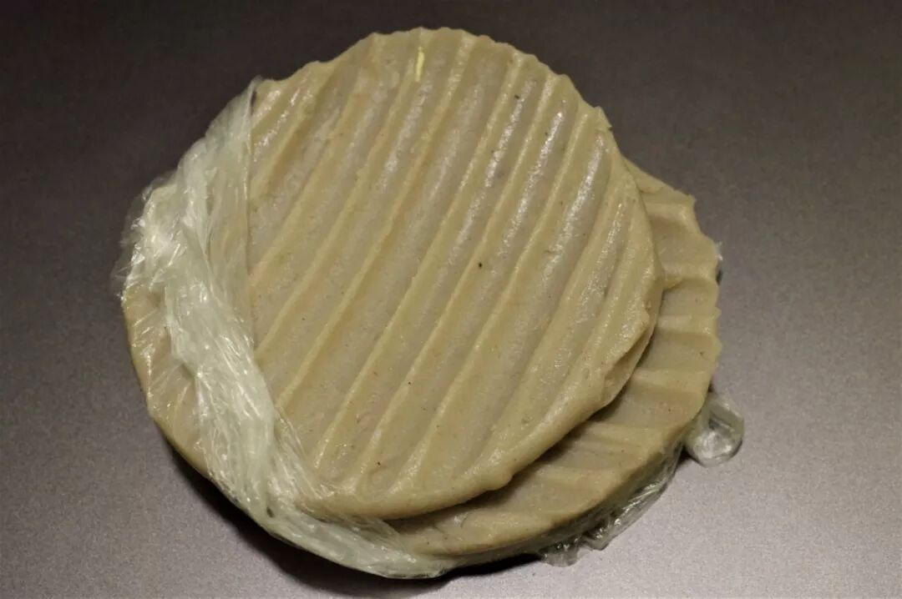

这边是我在开头提到的，两次被告知没有的食物——扒糕。只不过，在餐厅里它多半会以“蒜泥扒糕”的形式出现，而不是如这般不加修饰、素面朝天。毕竟，这是我在菜市场里买到的。

所谓扒糕，其实是一种十分类似荞面凉粉的食物，由荞麦面加水熬煮冷却定型而成，往往制作成小圆饼型在市场上出售。在夏季，扒糕最通常的食用方法便是凉拌，而蒜泥扒糕则是典型。由于条件限制，此次只能品尝一番扒糕最原始的味道。

极富弹力的扒糕，咬下一口却是软、糯的口感，但仍保留着一分劲道。荞面的香甜之味十分浓烈，而制作扒糕时所放入的香辛料也能明显品尝到。我完全可以想象，将其拌入凉菜中时，会是一种多么香嫩的滋味。

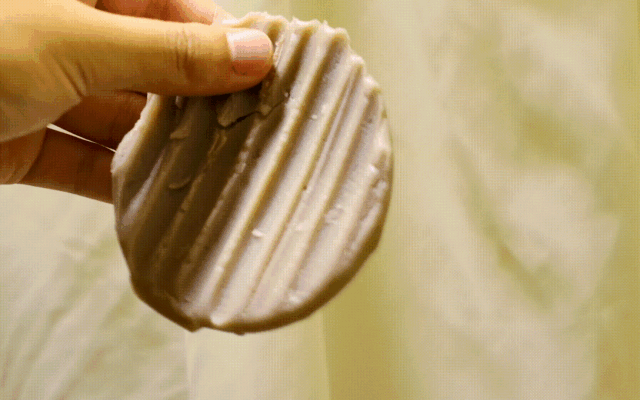

（感受一下扒糕的弹力）

（3）

一些河北菜

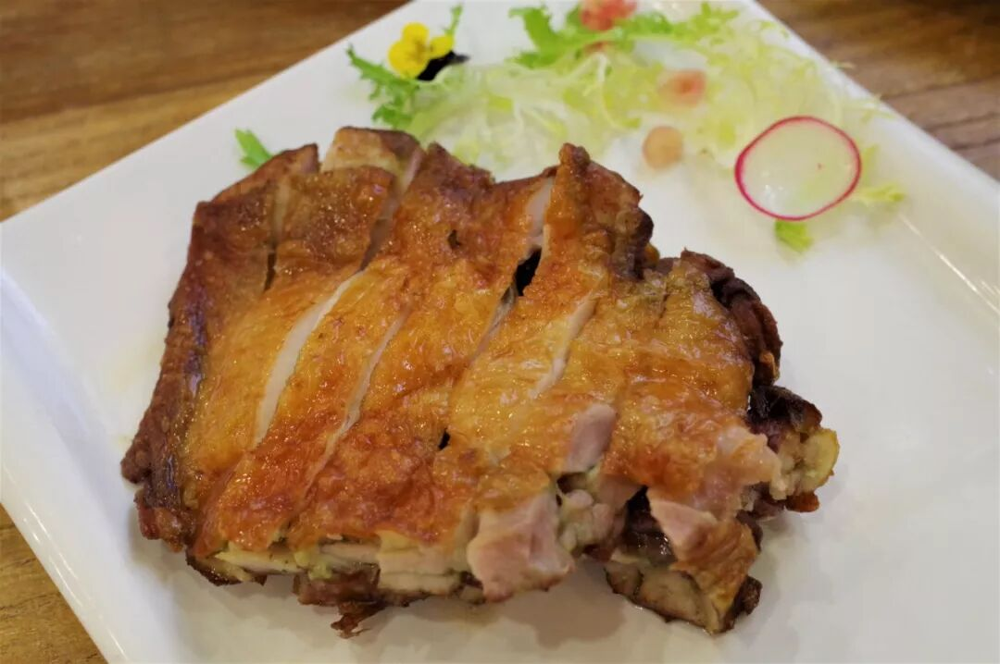

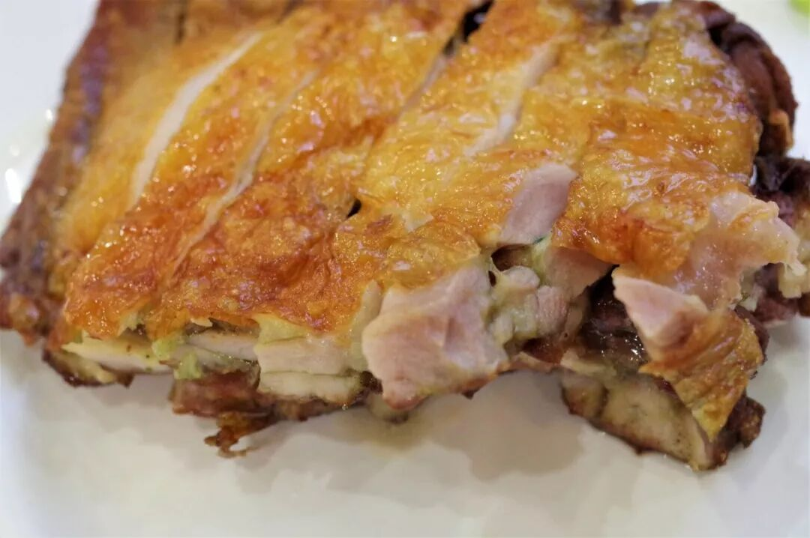

（神仙鸡）

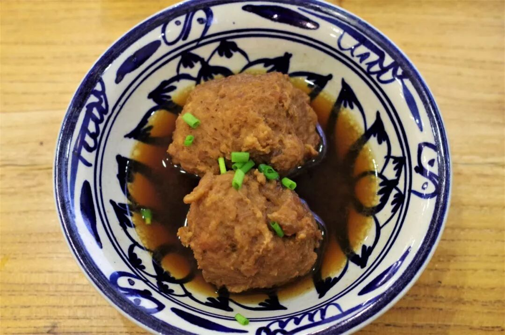

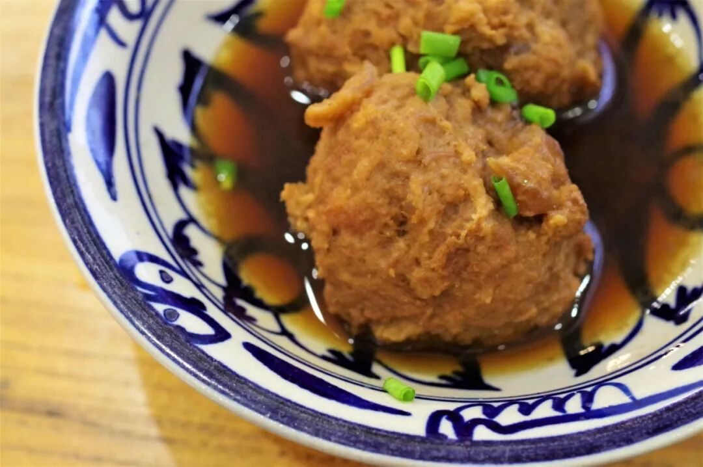

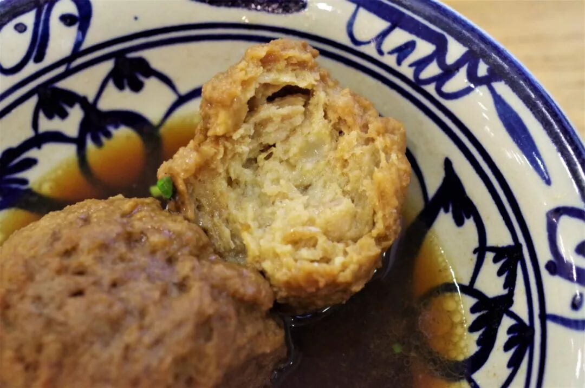

（骨渣丸子）

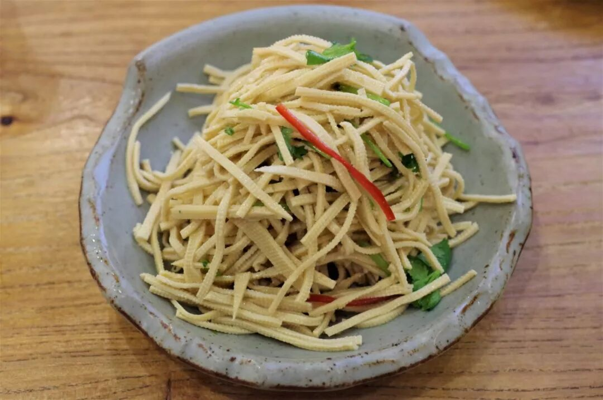

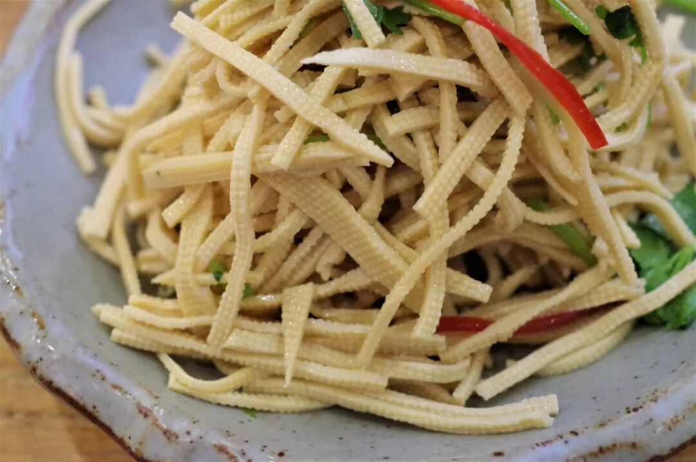

（高碑店豆腐丝）

在经历了一番风吹雨打觅食未果的折腾后，最终托着疲惫的身躯走进了一家河北菜馆。此时或许要专门吃什么已经不重要了，只想有一顿足够硬的餐食来安慰一下自己。这些食物并非石家庄特色，但是能在一家专营河北菜的餐厅吃上一顿饭，也不算太偏题吧。

关于石家庄之食，确也到此为止了。

石家庄两天，比我之前待过两天及以上的城市都要艰难许多。一方面我竭力想要去挖掘、去展示、去证明石家庄并非人们传闻的一无是处，但另一反面又在不断的惊喜与打脸之中交替。或许最终我能得出的结论只能是，不必对它期望过高、也不必对它嗤之以鼻。

一个及格线，我觉得它是能够着的。

想知道我在干啥，请点这个链接：吃货的决心——555天中国饮食探索之行

想知道我要去哪，请点这个链接：555天行程计划（2018-09-07更新）

再见国际庄

（长按识别二维码点击关注哦）

 var first_sceen__time = (+new Date()); if ("" == 1 && document.getElementById('js_content')) { document.getElementById('js_content').addEventListener("selectstart",function(e){ e.preventDefault(); }); }

 if ("0" == 1) { document.addEventListener("keydown",function(e){ if ((e.metaKey || e.ctrlKey) && (e.key === 'c' || e.key === 'C' || e.key === 'x' || e.key === 'X' || e.key === 'a' || e.key === 'A')) { if (e.target.tagName === 'INPUT' || e.target.tagName === 'TEXTAREA') { return; } e.preventDefault(); } }); document.addEventListener("copy",function(e){ var sel = window.getSelection(); var content = document.getElementById('js_content'); if (sel && sel.rangeCount > 0 && content && content.contains(sel.getRangeAt(0).commonAncestorContainer)) { e.preventDefault(); } }); }

预览时标签不可点

微信扫一扫

关注该公众号

知道了 (javascript:;)
