# 【第087天 邯郸（一）】晋南千年古城之味1

- 原文链接: https://mp.weixin.qq.com/s?__biz=MzA3MTM2Mjk3NA==&mid=2247503771&idx=1&sn=d7969ebcd9e430a9ec303794e11a0ca5&chksm=9f2c3f6aa85bb67cdbb1d6382c2dc92cdffe860b58fc2ffd6f30b53acf2662a0407011743c18&scene=21
- 作者: 宇哥食行记
- 发布时间: 未知
- 图片数量: 18

邯郸，是一座三千年来未更改名字的城市。难以想象要将它的历史完整地呈现出来，该需要一张多么长的画卷？可今天的邯郸出现在人们的视野里，除了一个人人皆知却极少被使用的成语（邯郸学步），剩下的估计就得是每年在全国城市空气质量排名中垫底的位置了，多少有些令人唏嘘。

邯郸的饮食在河北而言相对自成一派，属于冀南饮食的代表城市，而由于临近河南，又多多少少受一些河南的影响。这一次，暂且不顾那些灰暗面，让我们一起看看今天的邯郸，都吃什么。

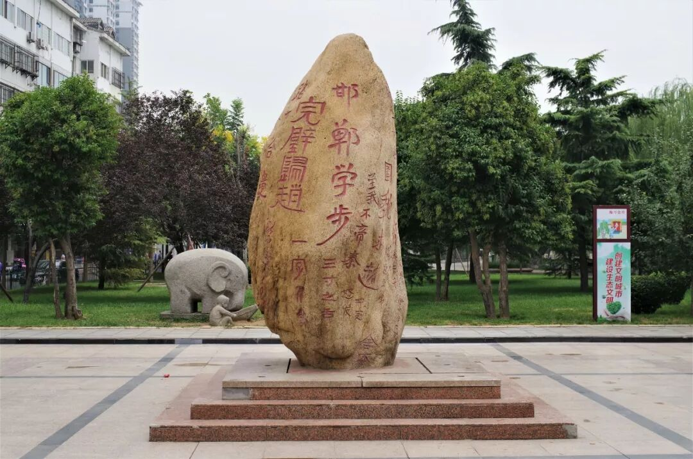

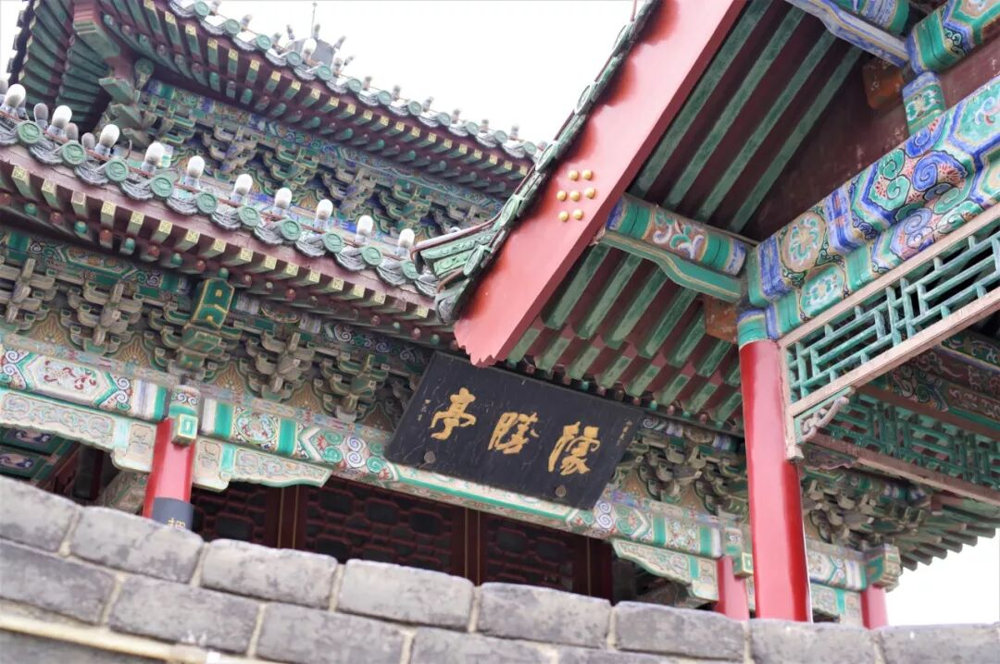

（1）

豆沫

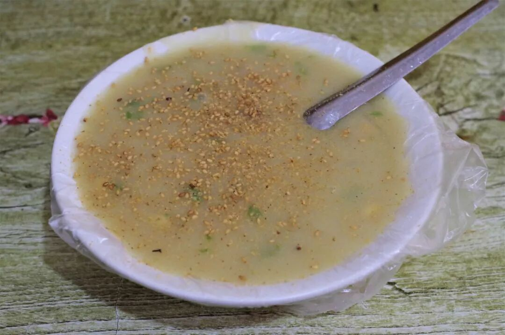

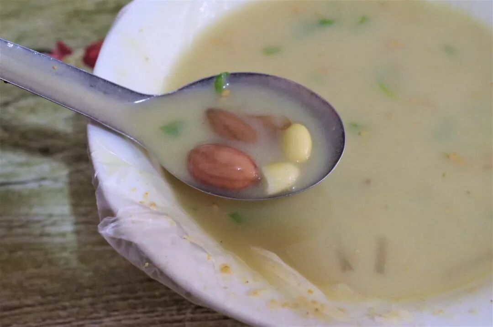

豆沫是一种起源于邯郸的小吃，今天主要流行于冀南和豫北地区，主要使用小米加花椒、茴香等香料泡发后加水熬煮成糊状，然后加上花生仁、黄豆粒、芝麻等辅料即可。在其流行地区，豆沫主要在早点摊上出现，常与油条、烧饼等搭配食用。

一勺豆沫入口，滚烫顺滑的口感首先袭来，紧接着是谷物浓烈的香气溢满口腔，再加上散布其中的各种颗粒，使得单调的流食口感变得丰富起来。若是能在寒冷的冬日来上一碗热气腾腾的豆沫，一定能让身子温润一整天吧。

（2）

磁县拽面

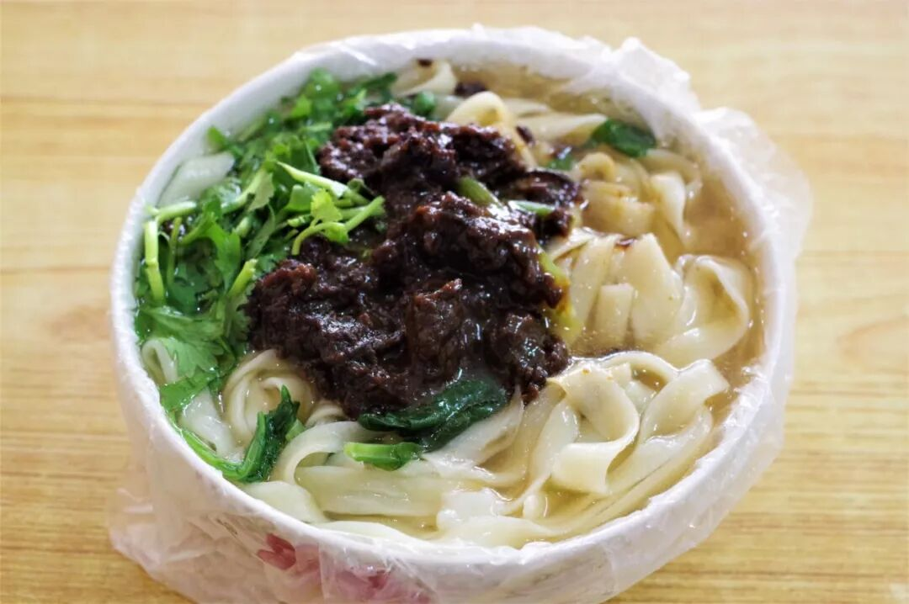

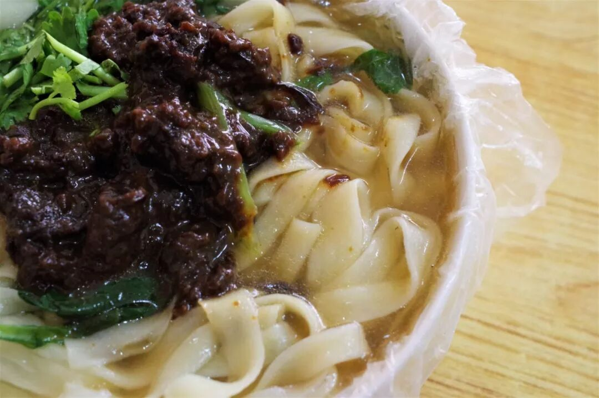

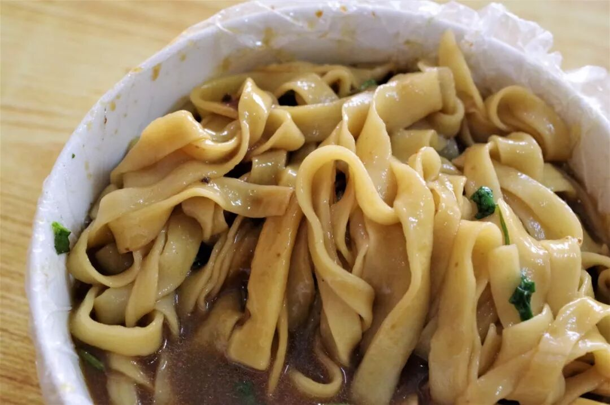

拽面，光是这个名字就霸气十足，令人顿生好奇。在邯郸街头，凡售卖拽面的店铺大都打着磁县拽面的招牌，或许在这里，磁县就是拽面最权威的代名词。

其实所谓拽面，从制作技艺上与拉面并无本质区别，也许是最终不必像拉面那般精细，所以换个略带粗犷王霸之气的“拽”字名之。

拽面的地道食用方法是打卤，除了面条本身的质地为，卤子的好坏也将决定一碗拽面的最终品质。一勺咸香味恰到好处而又足够浓郁的卤子，再配上拽出来的如河粉宽的、超级爽滑劲道的面条，一碗优良的拽面，来也。

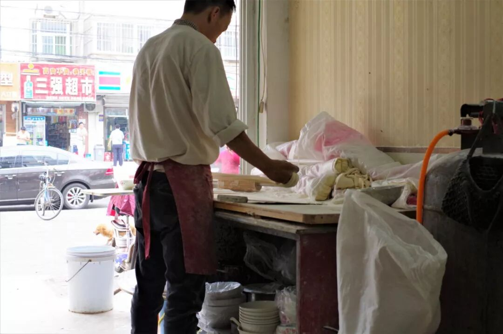

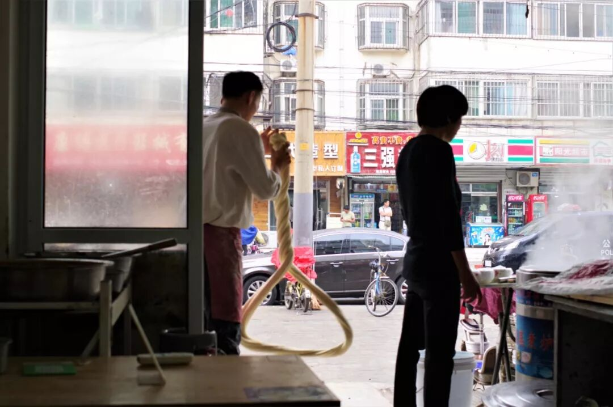

（3）

南沿村拉面

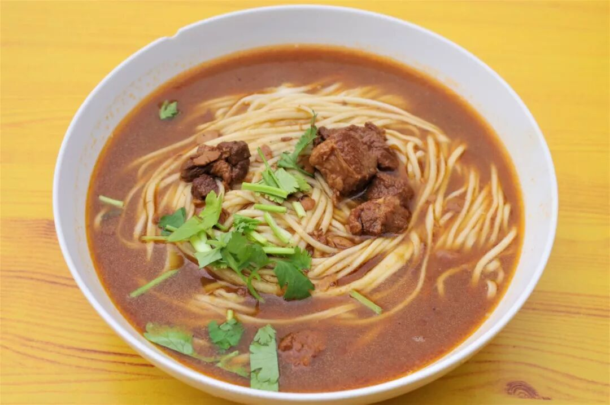

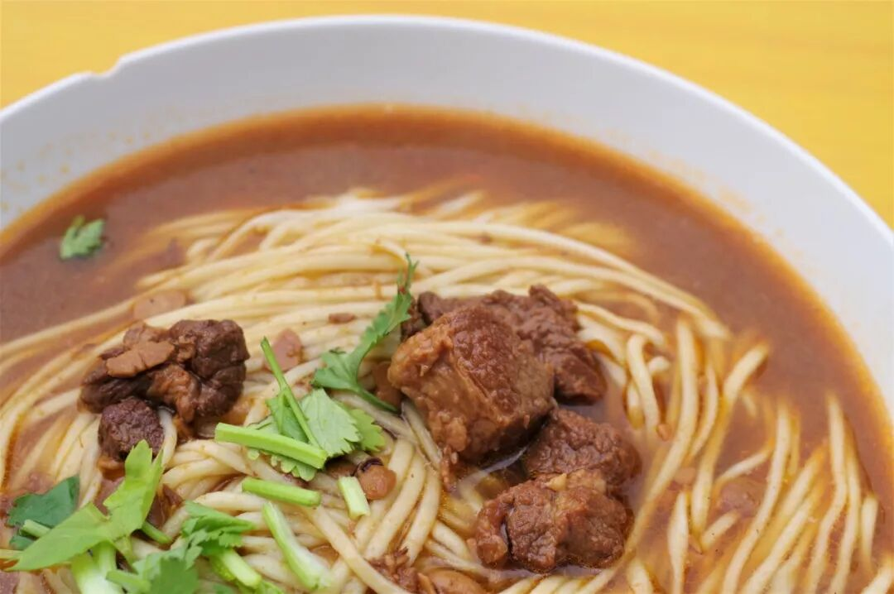

在邯郸，真正的街头一霸既不是兰州拉面，也不是沙县小吃，这个地位属于极富地方色彩的南沿村拉面。如果你想要来上一碗，根本无需可以寻找，因为它无处不在。

南沿村拉面不算是特别讲究的面条，除了拉面本身的常规要求外，其汤料和浇头均来自一锅加入各味香料炒制的牛肉。但是这碗快速、便捷，而又味道丰富浓郁的面条，实实在在地俘获了邯郸男男女女老老少少的味觉，让其成为当地午餐晚餐的不二选择。

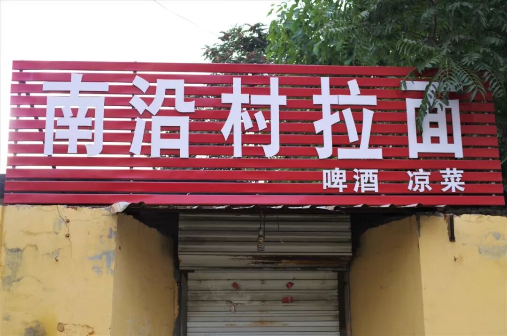

（4）

驴肉香肠

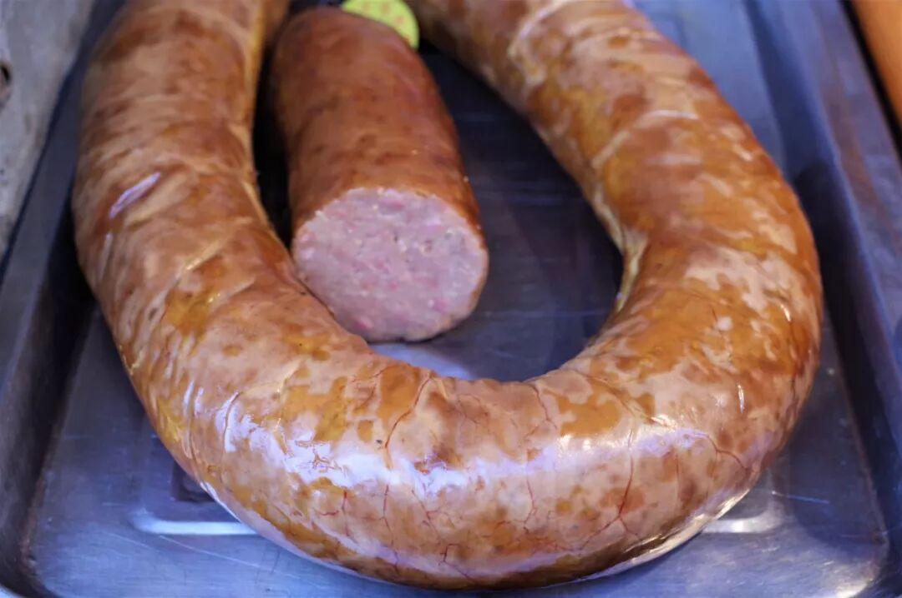

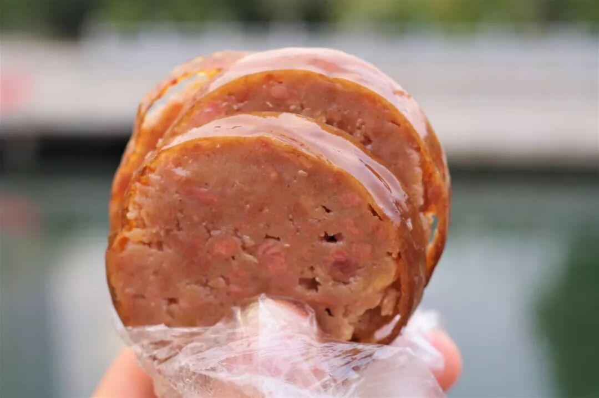

如果要问邯郸最值得推荐的特产是什么？答案多半会是驴肉香肠。最好的驴肉香肠在哪里？答案则毫无疑问是永年县。虽不能为最好的而去，也至少应该买上一些尝试一下这大概的滋味。

从外形上看，驴肉香肠的最大特点便是大，至少是一般肉肠的两到三倍粗。仔细观察其横截面，可以看到粉红色的点（瘦肉）、白色的点（肥膘）和黄色的点（肉筋）点缀其中。咬上一口，首先给人带来冲击的一定是这驴肠衣，厚度远大于常见的猪肠衣，却仍然有极好的脆感和韧劲。淀粉、肉粒与肠衣组成一种极其美妙的口感组合，再加上驴肉肠的油气较大，吃得那是一个嘎嘣脆爽、满嘴流油。

古城太好逛，三万步收场。

睡个小懒觉，明天继续闯。

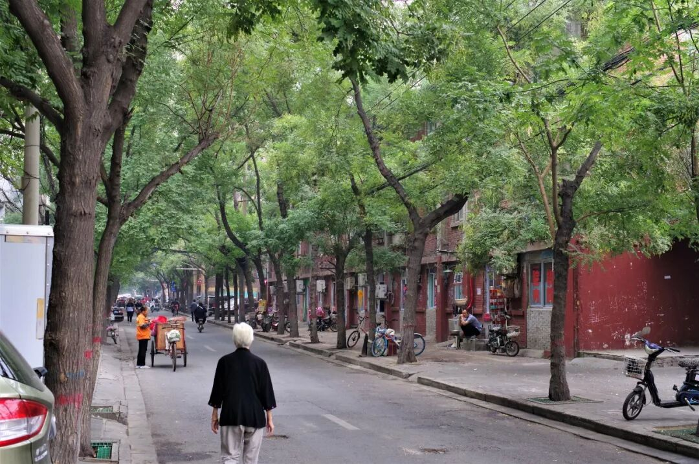

想知道我在干啥，请点这个链接：吃货的决心——555天中国饮食探索之行

想知道我要去哪，请点这个链接：555天行程计划（2018-09-07更新）

所谓邯郸学步，在我这儿是邯郸刷步吧

（长按识别二维码点击关注哦）

 var first_sceen__time = (+new Date()); if ("" == 1 && document.getElementById('js_content')) { document.getElementById('js_content').addEventListener("selectstart",function(e){ e.preventDefault(); }); }

 if ("0" == 1) { document.addEventListener("keydown",function(e){ if ((e.metaKey || e.ctrlKey) && (e.key === 'c' || e.key === 'C' || e.key === 'x' || e.key === 'X' || e.key === 'a' || e.key === 'A')) { if (e.target.tagName === 'INPUT' || e.target.tagName === 'TEXTAREA') { return; } e.preventDefault(); } }); document.addEventListener("copy",function(e){ var sel = window.getSelection(); var content = document.getElementById('js_content'); if (sel && sel.rangeCount > 0 && content && content.contains(sel.getRangeAt(0).commonAncestorContainer)) { e.preventDefault(); } }); }

预览时标签不可点

微信扫一扫

关注该公众号

知道了 (javascript:;)
