# 【第098天 张家口（二）】作别京津冀，跨山向西去

- 原文链接: https://mp.weixin.qq.com/s?__biz=MzA3MTM2Mjk3NA==&mid=2247503760&idx=1&sn=53582bbf7adac05b694eb9673757938b&chksm=9f2c3f61a85bb6771c45c70f51a366685d188e3251fcdd38e112d1171d6ee64e13139f13a951&scene=21
- 作者: 宇哥食行记
- 发布时间: 未知
- 图片数量: 19

这是张家口的第二天，也是京津冀的最后一天。

张家口是一座被戏称为“风口”的城市，而今天我也真切感受到了强风带来的寒冷，从北京的短打到这里的包裹全身，一百多公里的距离却分割出了两个季节。也许骤降的温度，终于能让我理直气壮地贴秋膘了吧。

张家口的饮食是融合的，昨日仿佛京味的延续，而今天，则是提前感受山西之味了。那一笼一笼，吊起了我的万千食欲，似乎有些，迫不及待了。

（1）

莜面窝窝

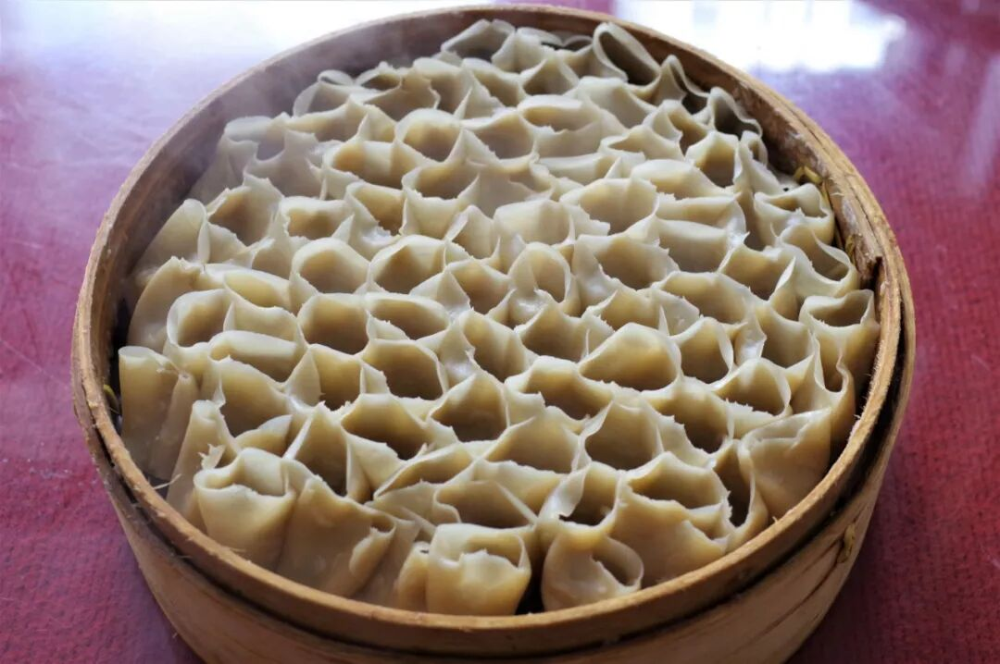

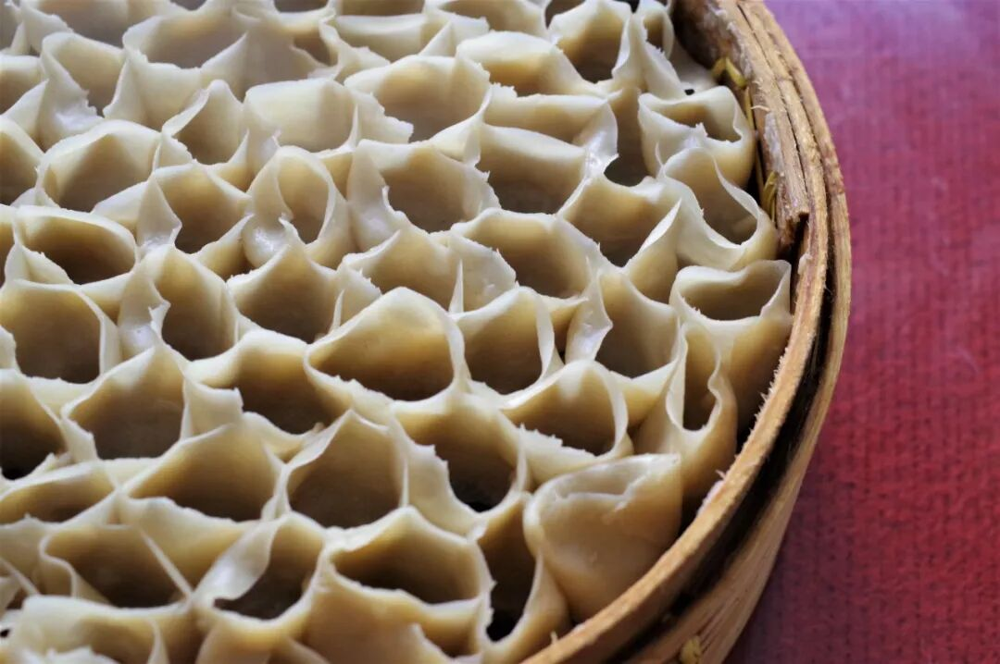

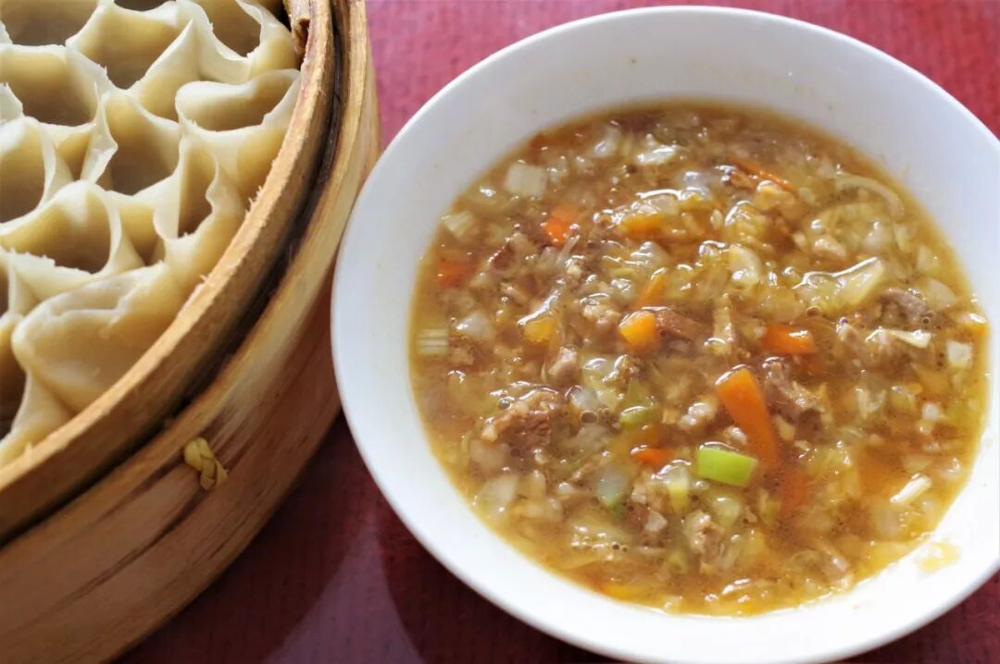

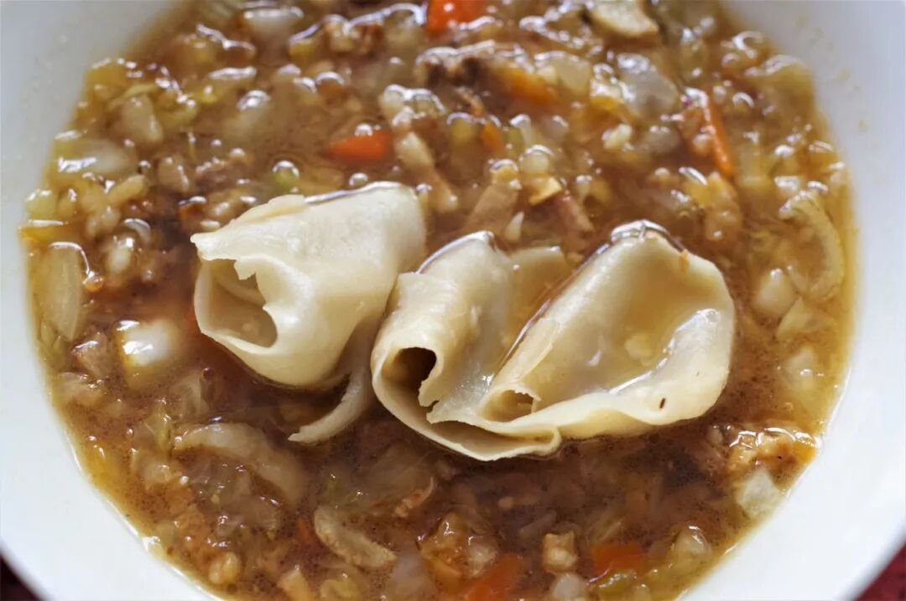

莜面窝窝，这已经不是它在河北的第一次亮相了。在河北省的第一站——承德，它便以一种浇卤的姿态出现过，只不过到了张家口，它成为了更加普遍的吃食，大街小巷随处课件，且姿态更加接近其山西原版——莜面栲栳栳。

莜面栲栳栳发源于山西忻州地区，在内蒙古、河北与山西交界的地区也广泛食用，被叫做“莜面窝窝”。将莜面推平卷成圆筒状，挨个放于蒸笼中蒸熟，再蘸上负责挂味的汤汁食用即可（以羊肉蘑菇汤为经典，实际上多种多样）。蒸熟的莜面窝窝软嫩劲道，再配上咸香适口的汤汁，送入口中只觉饱满充实，越嚼越香，食欲大开。

除了莜面窝窝外，莜面鱼鱼、凉拌莜面、炒莜面等也是张家口十分常见的莜面食物，与山西类似。

（2）

山药鱼

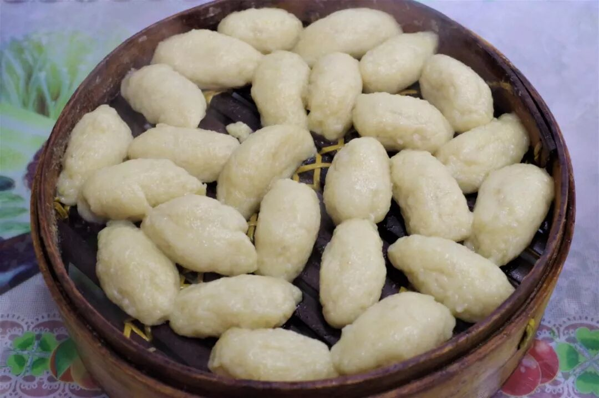

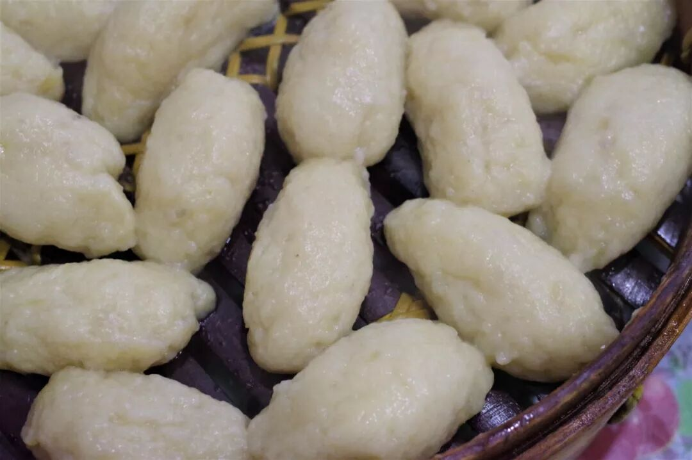

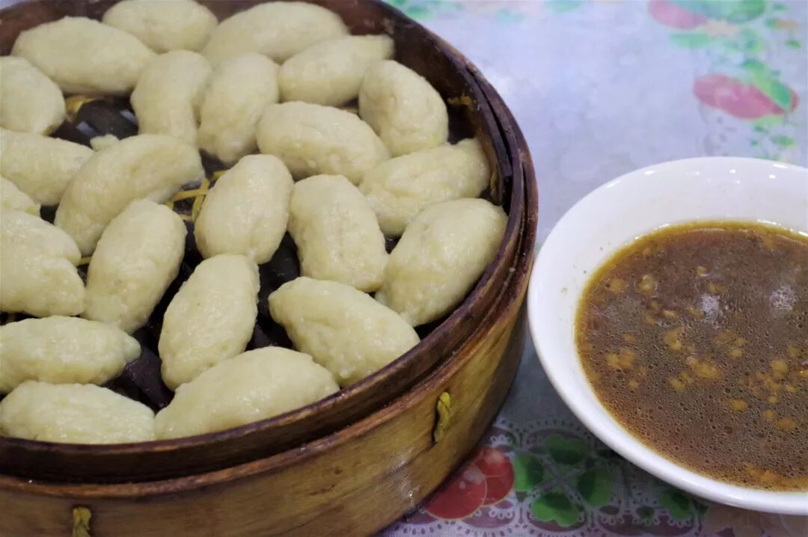

如果说莜面窝窝还算得上是山西风味的延续，同样的说法对山药鱼就不太妥帖了，要严格说起来，山药鱼当算是曾经的察哈尔省饮食的传承，而这正好对应了今天的晋冀蒙交接地区，尤其是内蒙古乌兰察布和河北张家口两市。

所谓山药鱼，其实是将土豆泥与莜面面混合，捏成1~2寸长的团，因形如小鱼儿而得名。其食用方法与莜面窝窝相同，蒸熟后蘸汤食用，不过其滋味则大不相同。山药鱼口感十分软糯，但是仍有三分韧劲，吃在口中土豆的清香味相当浓郁，与莜面窝窝相比可以说各有千秋、各有风骚。

（3）

牛窝骨

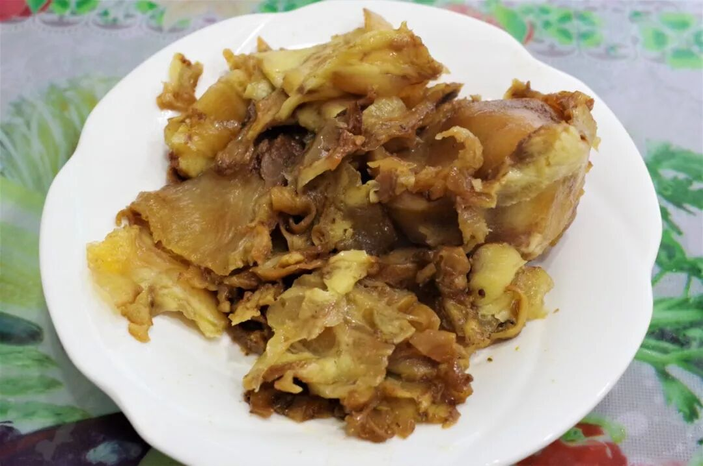

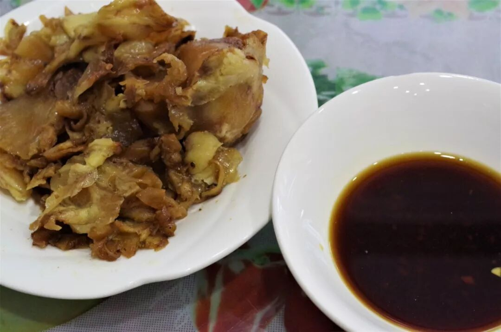

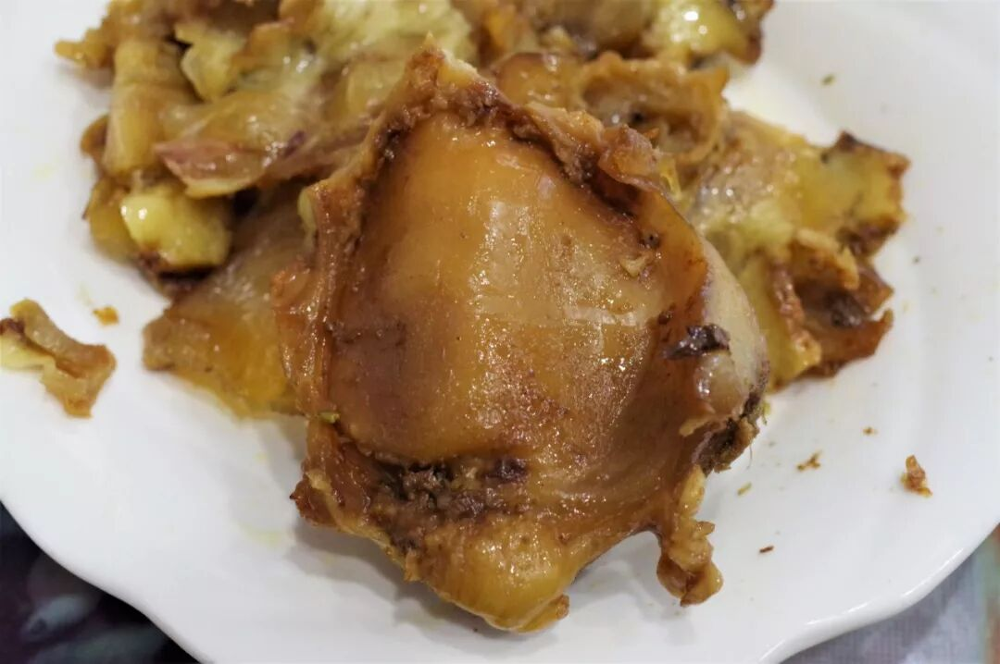

在张家口售卖粗粮面食（即莜面等）的餐厅，往往也售卖一种在其他地区较为少见的食物——牛窝骨。牛窝骨其实就是牛的膝盖骨，大量的筋连接着这一部位，吃牛窝骨其实吃的就是这些筋。与众所周知的牛蹄筋相比，牛窝骨筋少了些软糯和粘连之感，更加爽脆、不费口，可以说是有过之而无不及。

用一句比较通俗的话来说就是：一定要吃！不喜欢算我输！

（4）

柴沟堡熏肉

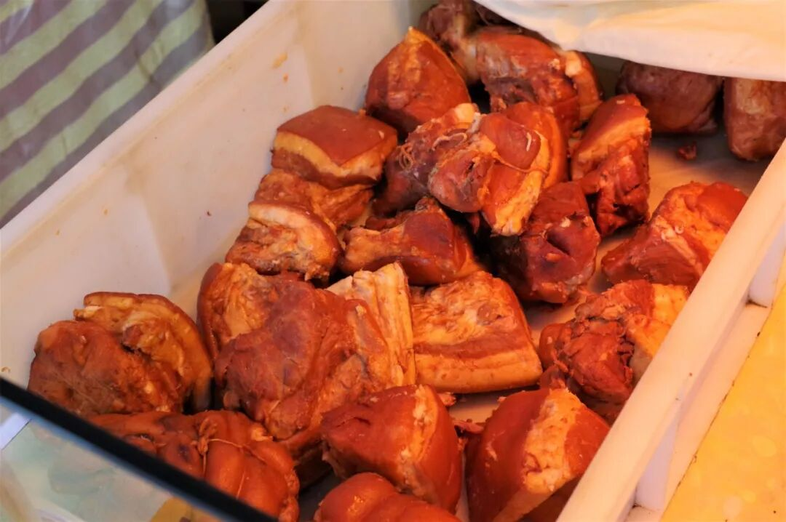

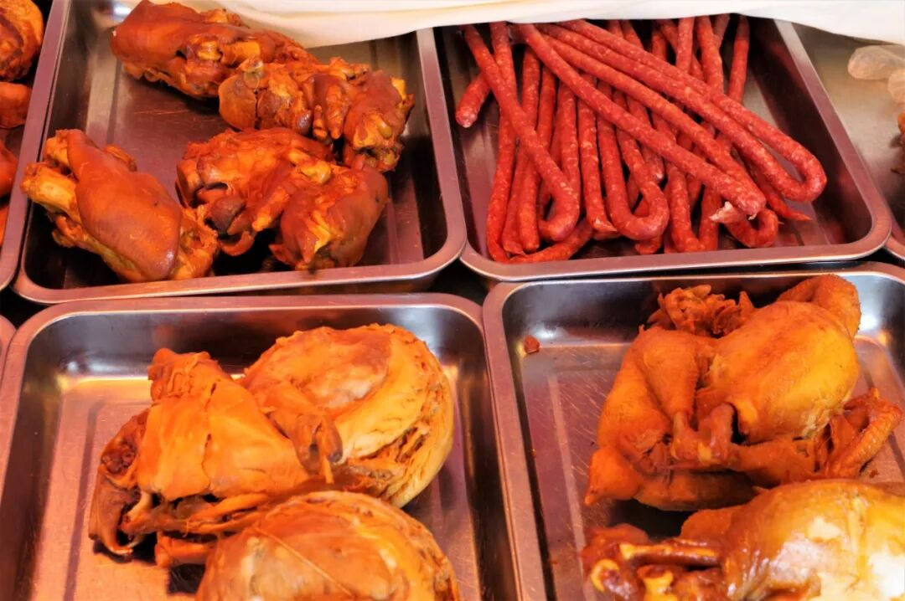

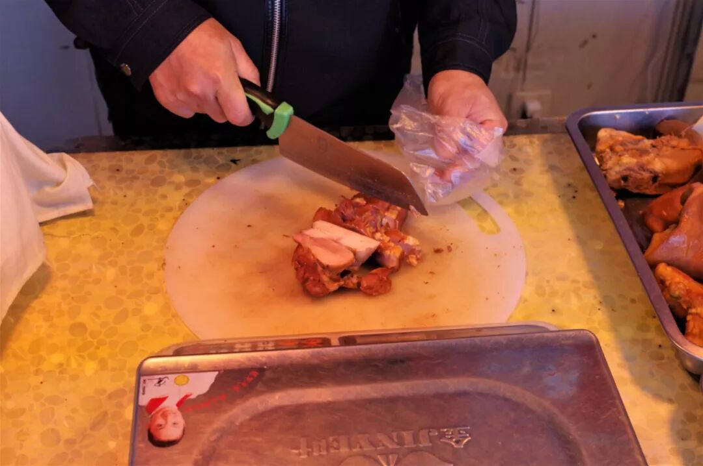

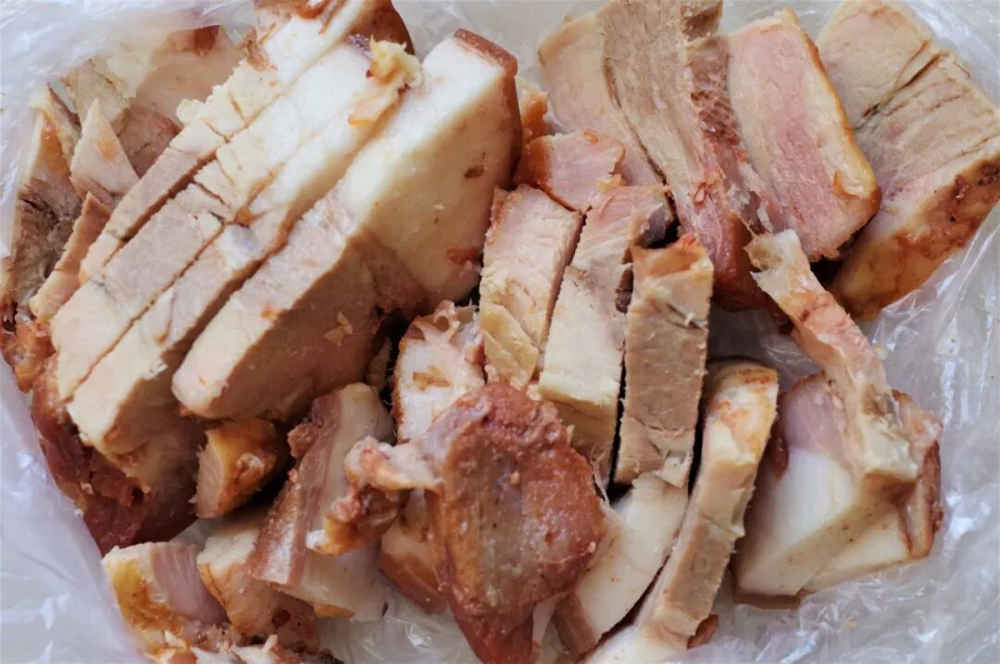

柴沟堡（bǔ）熏肉是张家口怀安县有着两百多年历史的熟食产品，是熏猪五花、熏猪头、熏猪下水、熏猪排、熏兔、熏鸡等一些列产品的统称，特色在于使用柏木熏制。

以猪五花为代表尝试了一番，瘦肉嫩、肥肉润，油而不腻，咸香适口，更重要的是那独特的熏制香味，虽无法确切形容但是能被味蕾轻易感知到。以后如果有机会，希望能将其他品种也统统品尝一遍。

第一次了解张家口的吃，还是因为《舌尖》中出现的一道“烩南北”（南为江南竹笋，北为塞北口蘑），真正来到张家口才发现，这不过是张家口一家酒楼里的一道菜，如何能代表张家口真正的日常吃食呢？口蘑倒算是张家口常见的食材，不过其不菲的价格大概也让其难以进入一日三餐。

都无所谓了。张家口也好，河北也好，已在身后。而前方，是中国无可争议的面食王国——山西。

河北篇结语

河北16天，结束得很快。尽管中间插入了津京的6天，但这并不妨碍我以一个还算完整的视角，结束对河北的短暂饮食探索。

不违背本心地说，河北的16天给我的是一半惊喜、一半失落。惊喜在于这一过程确确实实刷新了我对河北饮食的认知，让我看到除了驴肉火烧、烧饼之外的更多令人兴奋的存在，甚至于像保定牛套皮、沧州火锅鸡这样从未耳闻、但就此以后必将长久挂念的食物。失落则在于，整个河北省统一呈现出一种本地饮食相当弱势的局面，而非本土饮食当道、外来饮食为辅，这无疑给寻找食物的过程带来了许多麻烦；同时，有些太过于普通的食物竟也荣登各类“河北名吃榜”“XX市非物质文化遗产名录”，确实让人觉得有些凑数之嫌。

不过，16天的探索总算不上深入，我相信河北还有许多以点状形式分布于各县乡里的特色饮食，它们还需要更多人的发掘与曝光。

河北，来日再见。

 var first_sceen__time = (+new Date()); if ("" == 1 && document.getElementById('js_content')) { document.getElementById('js_content').addEventListener("selectstart",function(e){ e.preventDefault(); }); }

 if ("0" == 1) { document.addEventListener("keydown",function(e){ if ((e.metaKey || e.ctrlKey) && (e.key === 'c' || e.key === 'C' || e.key === 'x' || e.key === 'X' || e.key === 'a' || e.key === 'A')) { if (e.target.tagName === 'INPUT' || e.target.tagName === 'TEXTAREA') { return; } e.preventDefault(); } }); document.addEventListener("copy",function(e){ var sel = window.getSelection(); var content = document.getElementById('js_content'); if (sel && sel.rangeCount > 0 && content && content.contains(sel.getRangeAt(0).commonAncestorContainer)) { e.preventDefault(); } }); }

预览时标签不可点

微信扫一扫

关注该公众号

知道了 (javascript:;)
