# 【第164天 周口】无晴无情无逍遥

- 原文链接: https://mp.weixin.qq.com/s?__biz=MzA3MTM2Mjk3NA==&mid=2247503694&idx=1&sn=4ee30a142f7392b61886eb3560af5303&chksm=9f2c3fbfa85bb6a9c09b166d703ca7fc6edc12660202e2fe34bc3ae6f9a0572df4198410609c&scene=21
- 作者: 宇哥食行记
- 发布时间: 未知
- 图片数量: 20

今日不太平。

清晨6点半，窗外仍漆黑。飞速地洗漱收拾完毕，背上大包赶去车站，买上一张8点平顶山发往周口的过路大巴票。本还有一趟8点半的车直接开往周口汽车站，却想着能早半小时是半小时，高速路口下也无所谓。汽车在市区晃晃悠悠近一小时终于来到高速路口，却堵在了进高速的匝道上，“前方大雾（霾），高速封路，几时放行，谁也不知”。经历了近两小时的漫长等待，大巴终于驶上高速，而我的心已凉，胃已不知缩成何样，最绝望的是当我到达周口收费站时，那辆8点半发的大巴从我眼前缓缓驶过，而我却要在高速路口下车，打一个车才能进城，此时已将近中午1点。吃完午饭，天降大雨，湿透了鞋只得返回酒店，大约在3点钟想着午睡一个小时，一头扎进被窝后愣是完全无视了闹钟，直到6点才缓缓醒来。

这是周口的一日。

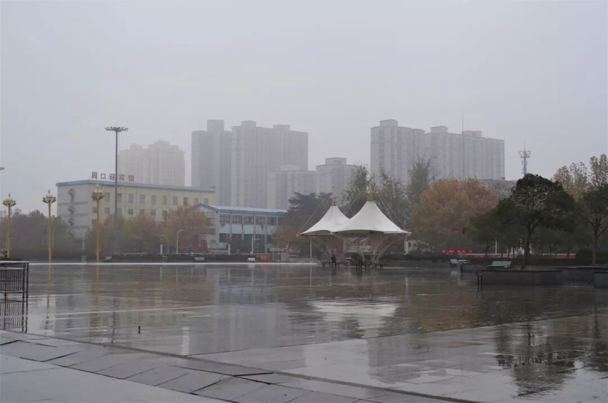

（1）

逍遥镇胡辣汤

胡辣汤作为河南最普遍的早点，当地人一定心知肚明，想要在中午12点后寻找一碗胡辣汤是什么概念。即使真的有这样的一家直到中午还在售卖胡辣汤的店，也多半只是想通过延长营业时间来弥补味道上的不足，真的吃上又有什么意义。

老天爷不赏饭吃，这碗属于周口的逍遥镇胡辣汤今日是没有福分享用了，但至少仍要在这里为其留一位置，让更多人知道这逍遥镇究竟在哪里。不过，话说回来，在今天的河南，其实大没有必要专门跑来周口吃一碗逍遥胡辣汤，心里执意要吃，更多是出于一种形式上的尊重吧。

（2）

手擀捞面

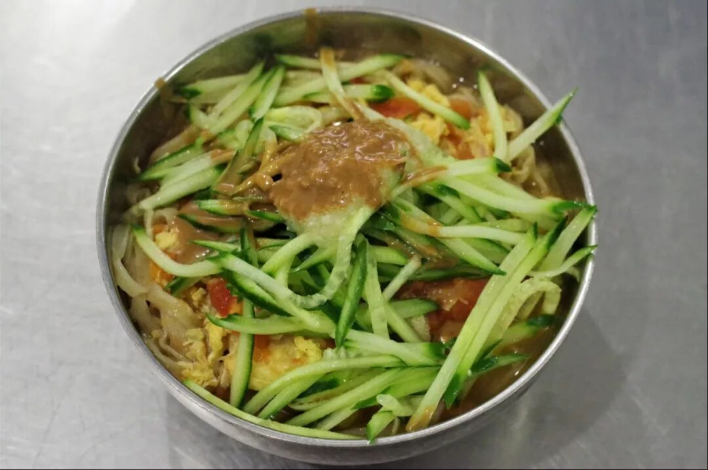

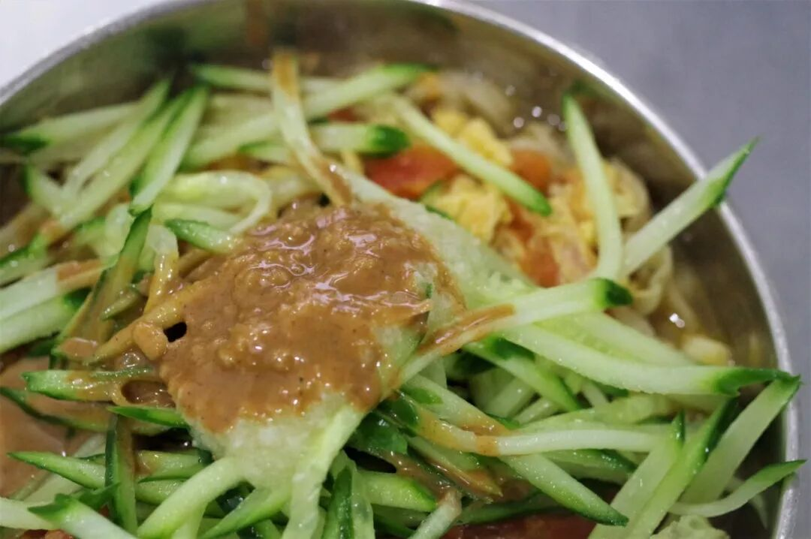

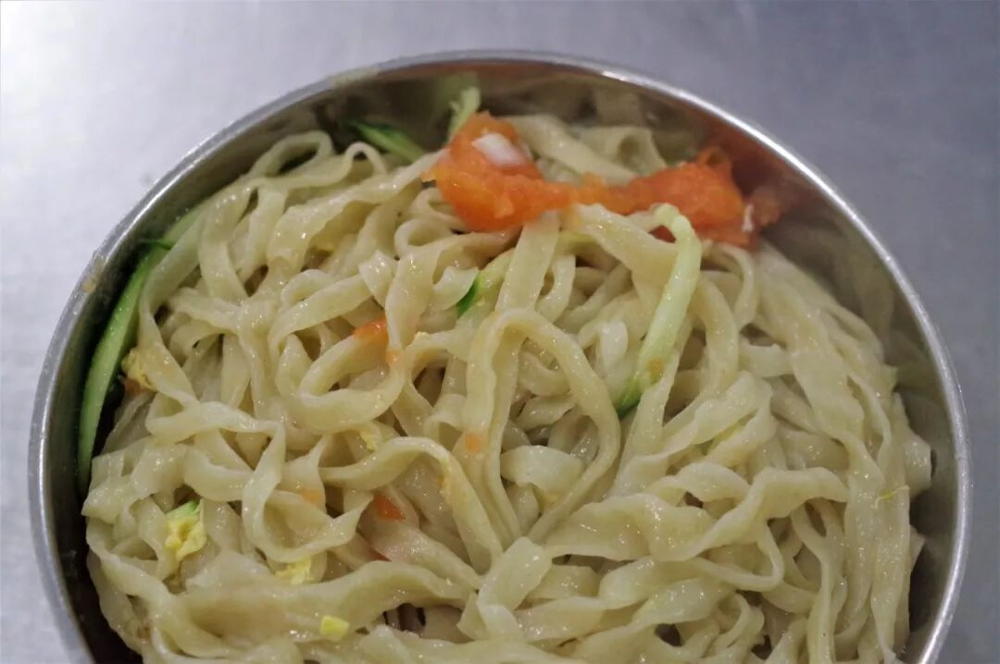

河南是烩面的天下，其他面条其实也算种类丰富，但大多默默无闻。我想即便是河南人，知道这碗手擀捞面的也并不多。

周口的手擀捞面源于商水县固墙镇，因而常以“固墙手擀（捞）面”的名号示人。手擀面条有着机器面条永远无法取代的劲道魂，而有这种核心优势存在时，一碗手擀面往往也不再需要过于复杂的调味。就像这碗手擀捞面，无非就是西红柿鸡蛋汤面，再加上些黄瓜丝、蒜泥和芝麻酱，滋味简单，却在那第一口就将你的魂勾了去，根本注意不到自己发出的呲溜声以及反复咀嚼时脸上露出的满足感。我只记得，在忍受了一上午的饥饿后，开动这碗面时，我已经是半个王境泽了。

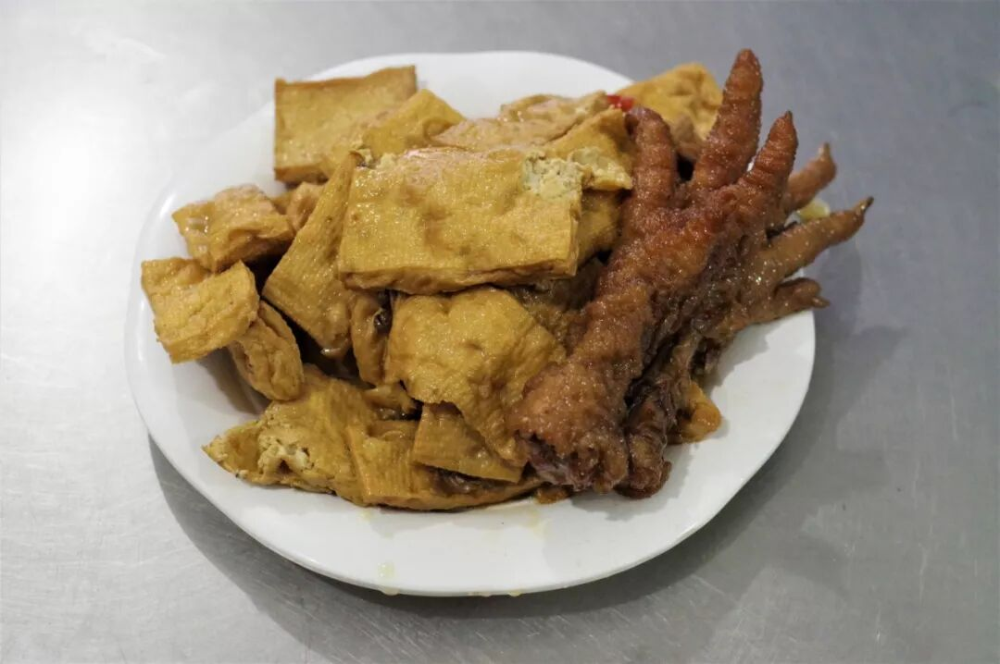

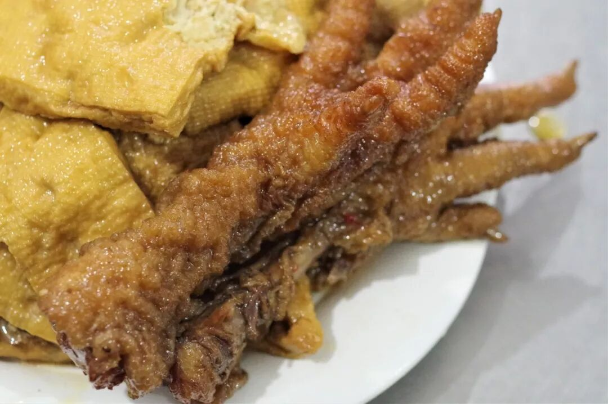

那般饥饿之下，一碗面又怎能顶饱呢。再来上一份卤制得咸香多汁的豆干和两个鸡爪，除了不停冒出的“真香”“真香”，再找不到其他赞美了。

（3）

邓城猪蹄、砂锅烩面

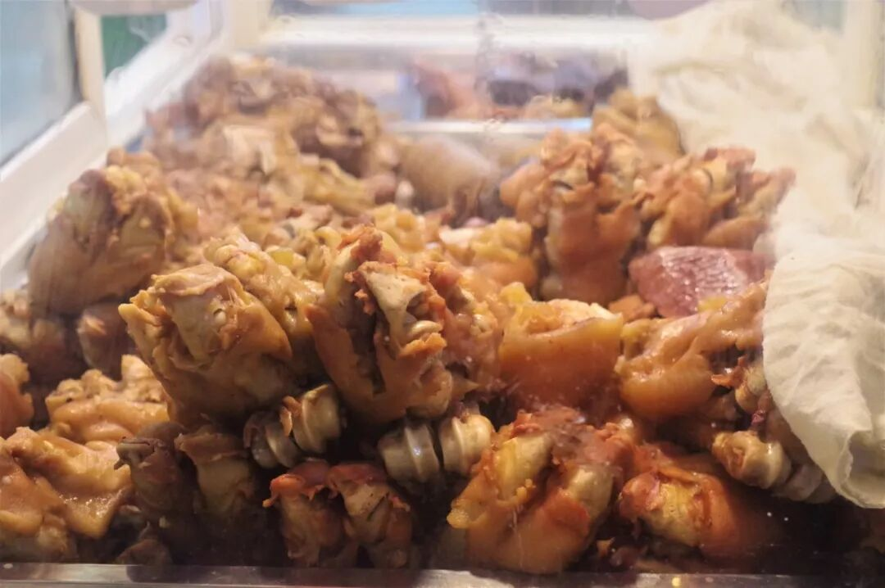

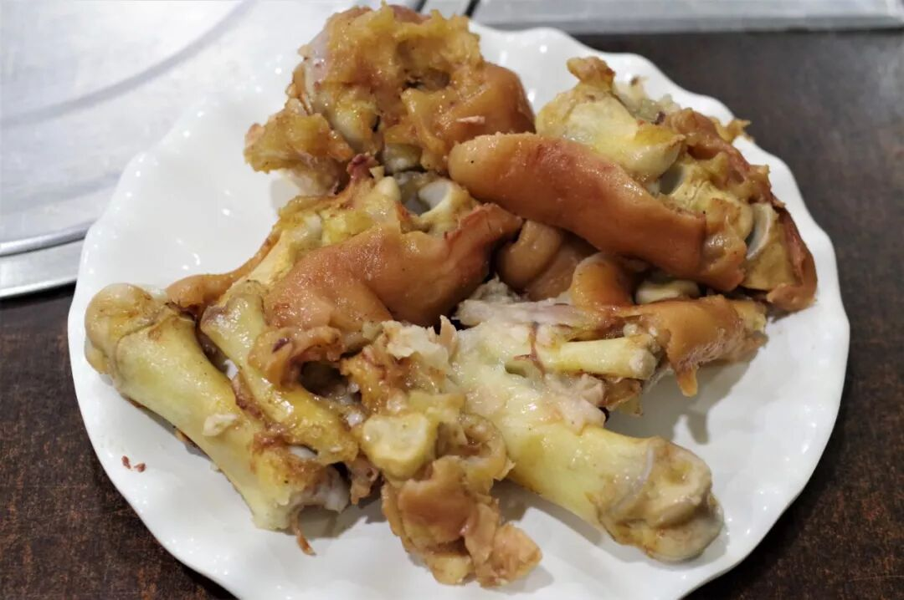

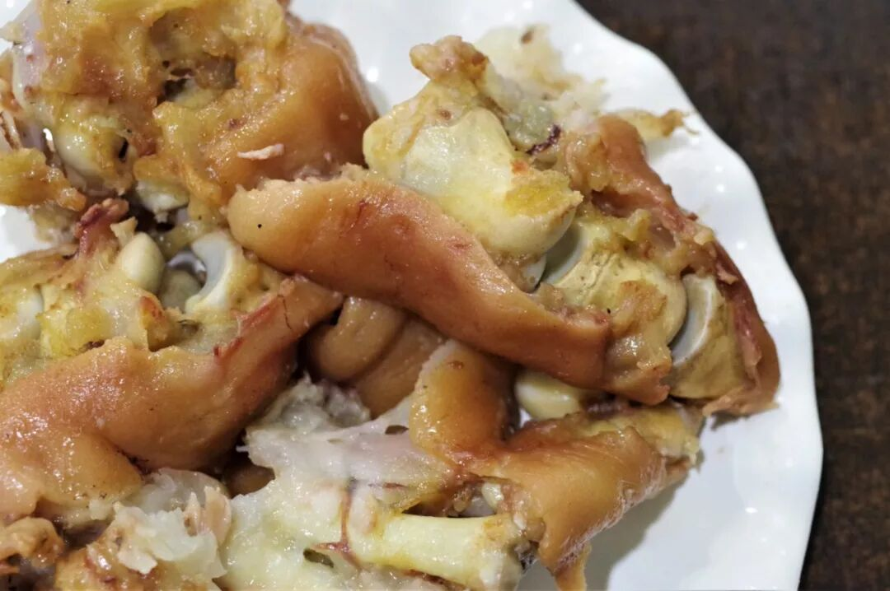

一觉醒来已过6点，雨渐小而未停，湿透的鞋袜依旧冰凉。庆幸的是未走两步便发现一家售卖邓城猪蹄的店，开心得像个两百斤的胖子一般。

邓城猪蹄乃商水县邓城镇的一方特产，实际上就是卤猪蹄。本想着卤猪蹄又能特别到哪里去，戴上手套刚吃上一口才发现还真就有些不一样。从小到大卤猪蹄吃过不少，但如这份猪蹄一般能将咸淡控制得恰如其分并不多见，就算不配任何饭菜，单吃这份猪蹄也绝不会腻口或齁咸。再加上够软够烂的肉质，吃起来也不费太多力，越嚼越香，回味无穷。

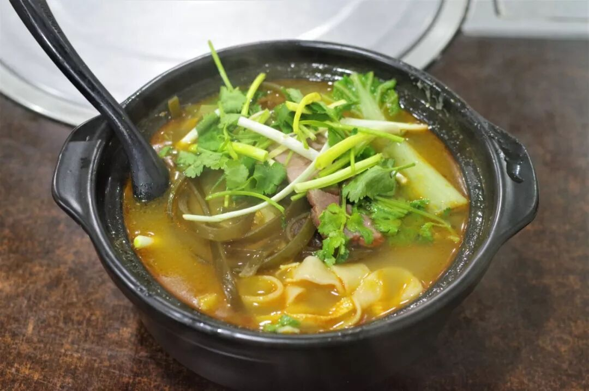

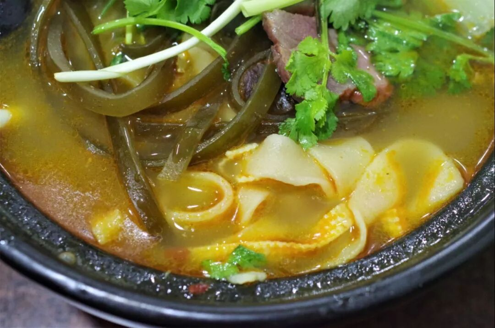

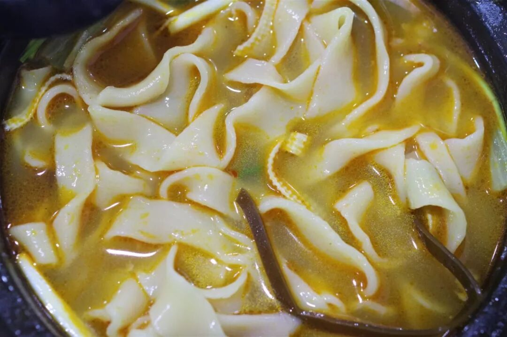

单吃一份猪蹄自然还够不上一顿晚饭，便又来上了一碗砂锅烩面。砂锅烩面属于一般烩面的变体，本身也没有一个标准配置，一般而言用料会比普通烩面更加丰富。喝上一口热汤，来上一口烩面，寒意去了，肚也饱了。

当一个业余驴友这么多年，深知旅程中意外的不可预不可控，抱怨难免，过了也就过了。我自然会记得周口这不太平的一天，更希望下次，你能以风和日丽迎接我。

Promise me.

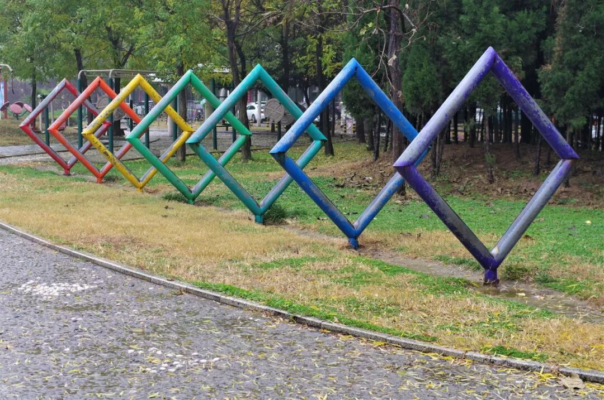

想知道我在干啥，请点这个链接：吃货的决心

想知道我要去哪，请点这个链接：555天行程计划

雨过，天就会晴。

欢迎关注欢迎转发ღ( ´･ᴗ･` )

 var first_sceen__time = (+new Date()); if ("" == 1 && document.getElementById('js_content')) { document.getElementById('js_content').addEventListener("selectstart",function(e){ e.preventDefault(); }); }

 if ("0" == 1) { document.addEventListener("keydown",function(e){ if ((e.metaKey || e.ctrlKey) && (e.key === 'c' || e.key === 'C' || e.key === 'x' || e.key === 'X' || e.key === 'a' || e.key === 'A')) { if (e.target.tagName === 'INPUT' || e.target.tagName === 'TEXTAREA') { return; } e.preventDefault(); } }); document.addEventListener("copy",function(e){ var sel = window.getSelection(); var content = document.getElementById('js_content'); if (sel && sel.rangeCount > 0 && content && content.contains(sel.getRangeAt(0).commonAncestorContainer)) { e.preventDefault(); } }); }

预览时标签不可点

微信扫一扫

关注该公众号

知道了 (javascript:;)
