# 【第211天 连云港（一）】沙光鱼的滋味，猫跟我都想了解

- 原文链接: https://mp.weixin.qq.com/s?__biz=MzA3MTM2Mjk3NA==&mid=2247503647&idx=1&sn=f356bf431b8789c96ee24b2a23d42c89&chksm=9f2c3feea85bb6f8bef346763eb881861b10d2feb70e30924119700cf2bd6bc8e12de8fa78c2&scene=21
- 作者: 宇哥食行记
- 发布时间: 未知
- 图片数量: 25

港城连云港，位于中国的陇海线、世界的亚欧大陆桥的最东端，即使你从未来过这里，多半也曾在某个场合听说过它。

冬日的连云港，没有了游人的光顾，显得格外冷清。只有大街上偶尔出现的孙悟空猪八戒形象，还在提醒着我这里有一座花果山。这种冷清还体现在吃饭这件事上，即使是这周末的晚间饭点，绝大部分餐厅也不过只有稀稀拉拉三两桌食客坐于其中。

那就慢悠悠、静悄悄地吃上两日吧，少些匆忙与热闹也未必是件坏事。

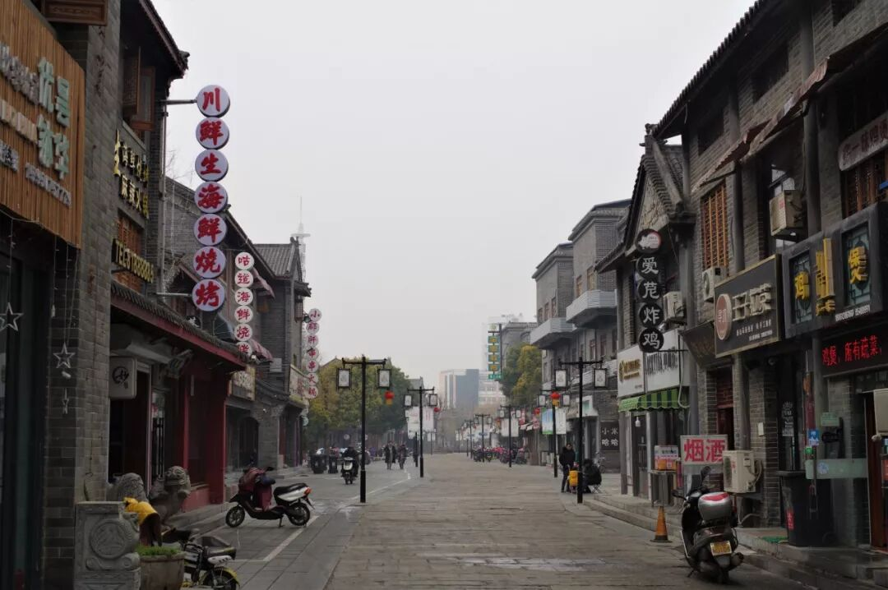

（1）

红烧沙光鱼

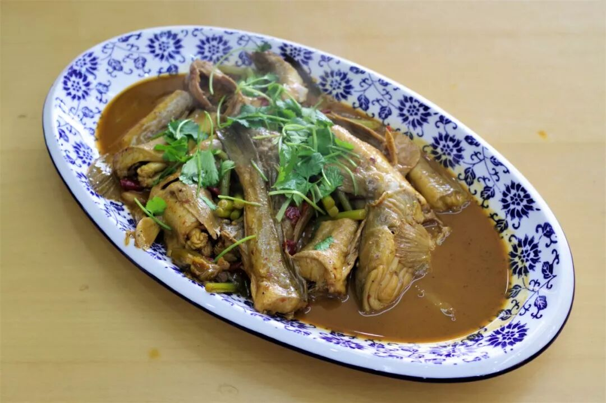

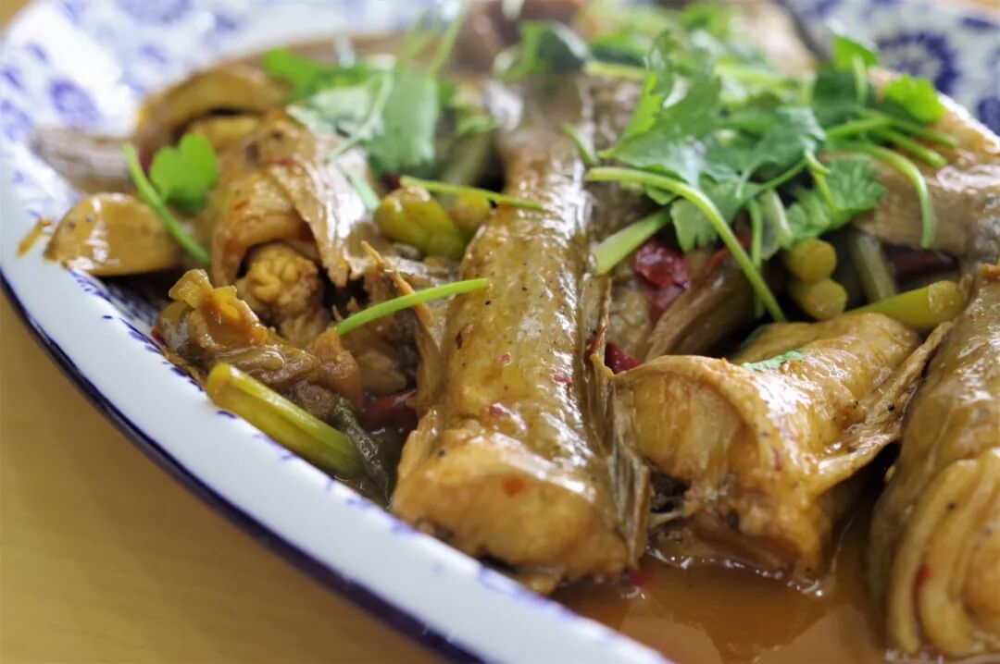

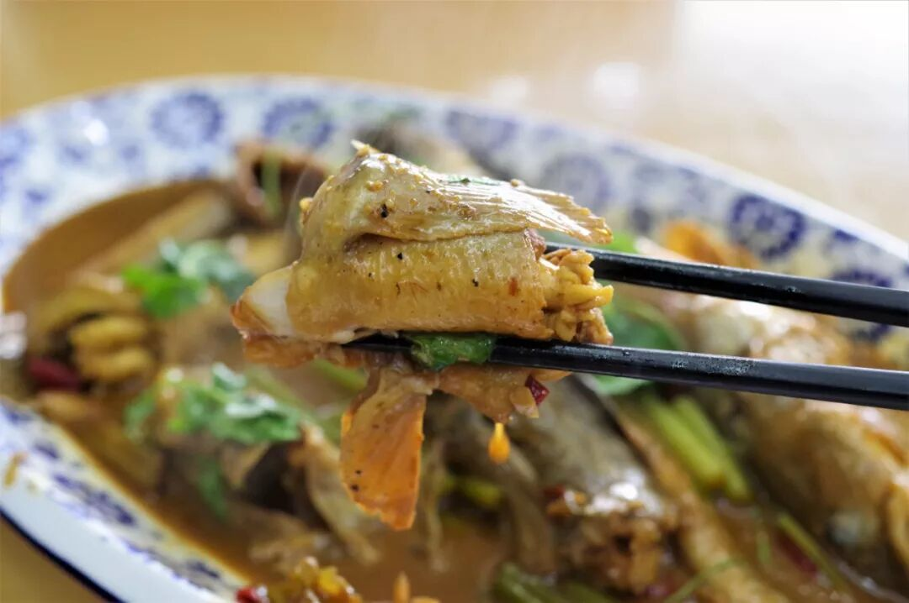

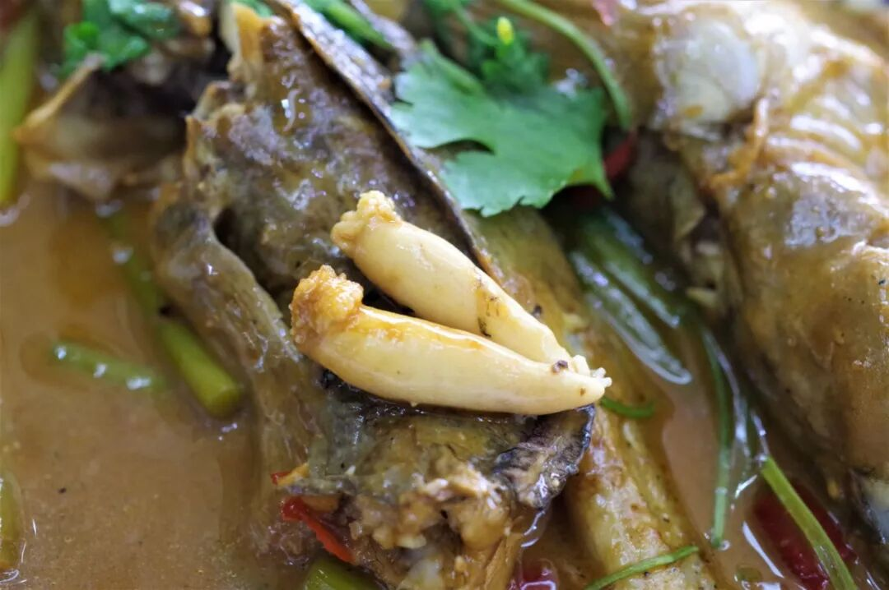

作为一座海滨城市，连云港有着物美价廉又品类众多的海洋产品，大同小异的海鲜遍布海岸线，可有一种鱼，却是实实在在的港城独一味，这边是沙光鱼。沙光鱼主要产于中国黄海海域，又绝大部分集中于连云港，使得其成为来此首推的海鲜。

港城沙光鱼，最经典也最家常的做法便是红烧了。沙光鱼鱼肉肉质极其细嫩，只需一吸一抿便可咽下，再配上红烧出的咸香醇厚之味，瞬间胃口大开不由地狼吞虎咽起来。配上一碗米饭，消灭掉这一整盘鱼，根本不在话下。若是接受鱼子，还能从鱼身中剥离出多快完整的鱼子，那鲜香无比的颗粒口感，定能使你更加心满意足。

（2）

小鱼煎饼

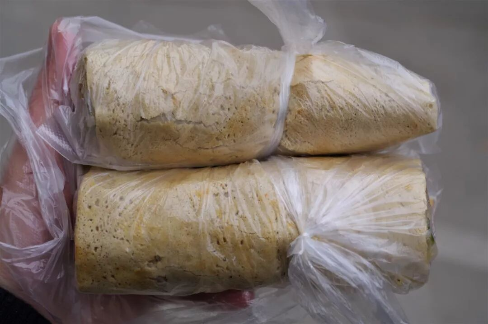

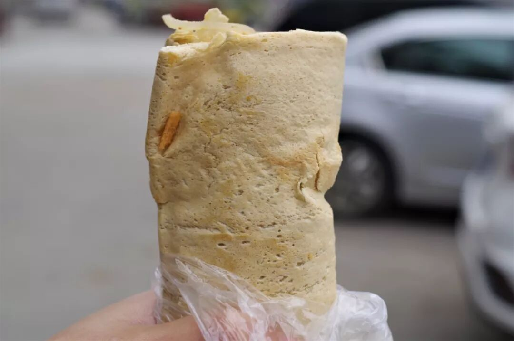

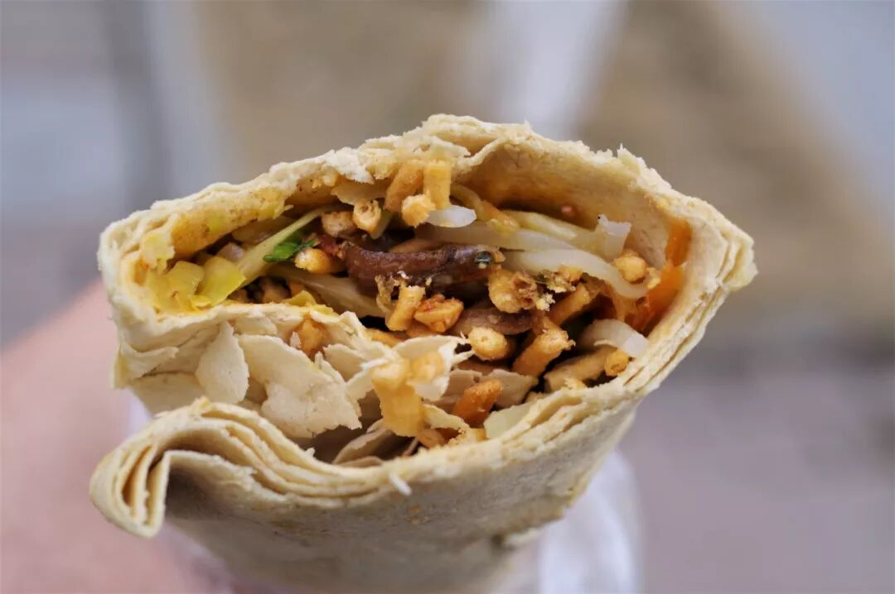

或许是因为靠近临沂日照，煎饼也成为了连云港当地颇受欢迎的小吃之一。如果仅仅如此，自然是没必要刻意提及，在连云港，一种带有海洋色彩的煎饼被创造出来，成为港城特有的味道，这就是小鱼煎饼。

煎饼本身与山东煎饼基本一致，但其所包的东西则变成了腌小鱼、土豆丝、炸土豆条和辣椒等，整体口感外韧里脆，最有特点的自然是那小鱼所带上的海洋滋味，越嚼越是回味无穷。

（3）

板浦凉粉

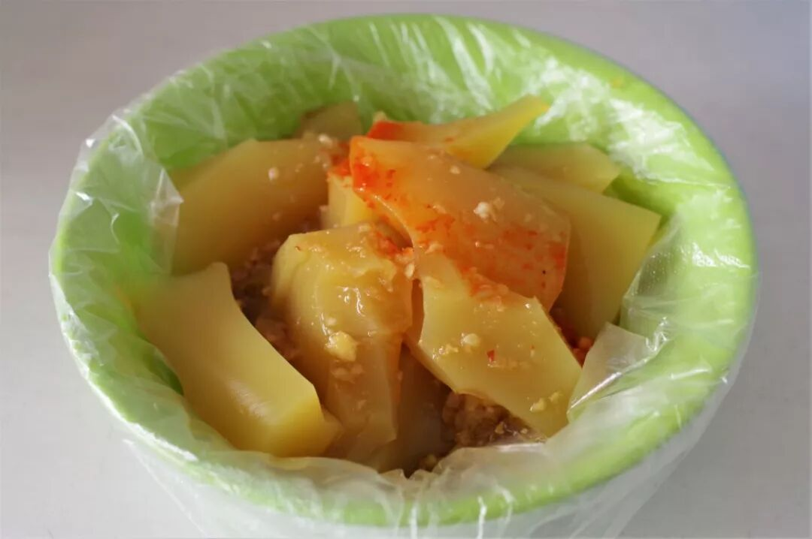

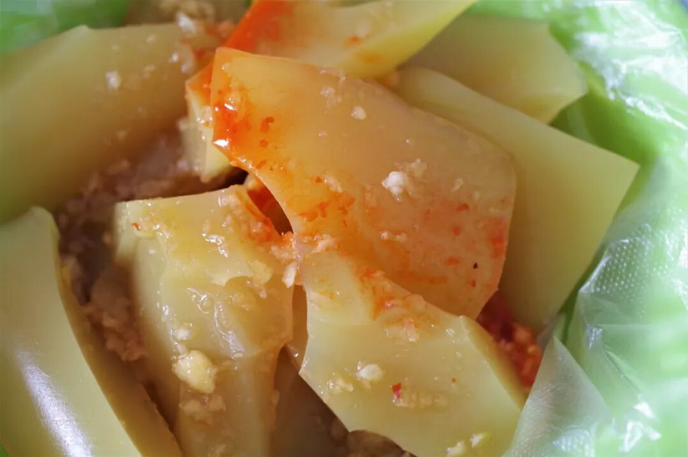

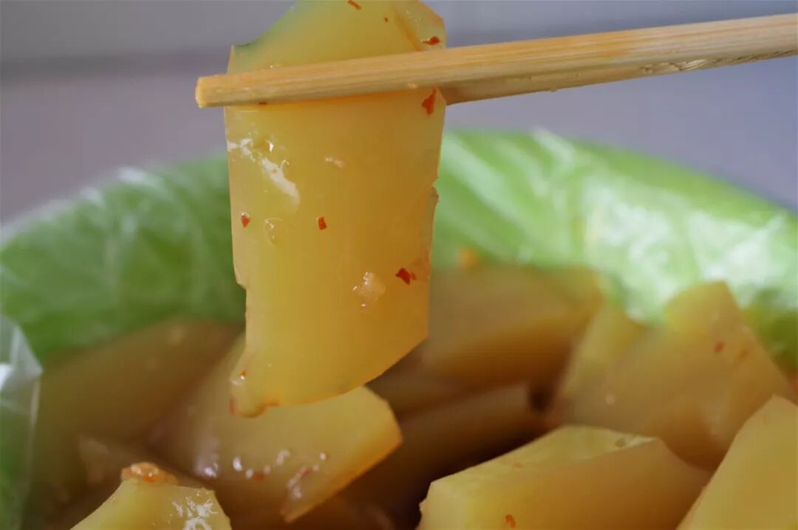

连云港是一座热爱凉粉的城市，它也拥有一种独特的凉粉——板浦凉粉。板浦凉粉乃连云港板浦镇的传统小吃，使用绿豆淀粉制作而成，颜色淡黄、晶莹发亮，将其切块后加上醋、蒜泥和辣椒即可。虽然从文字描述看，调料的使用与众多凉粉并无巨大差异，可吃上一块你的味蕾就会告诉你，这泛着独特香气的酸辣味，就是不同于你在其他地方吃过的。凉粉本身依旧爽滑细嫩，配着这独一无二的滋味，一旦吃过恐怕就很难忘记了。

顺带说件有趣的事，今天向老板娘点完凉粉后，她反复问了我三次要不要炕热再食用，我执着地说就凉吃。虽然这寒冬腊月不宜食冰凉之物，但我偏要强行感受一下这凉粉“本应”有的夏日之感，她一定觉得我是个怪人吧。

（4）

大白菜牛肉

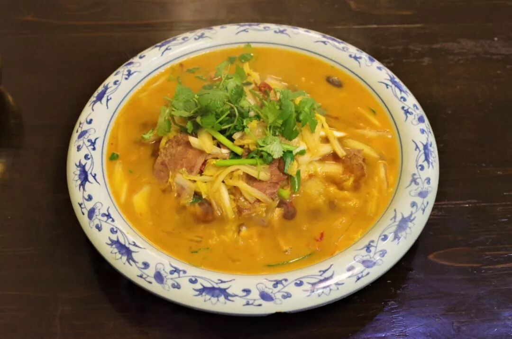

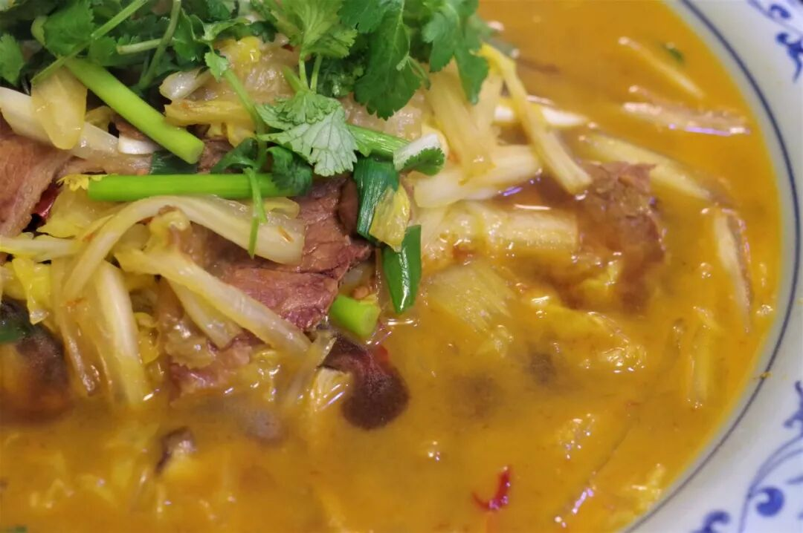

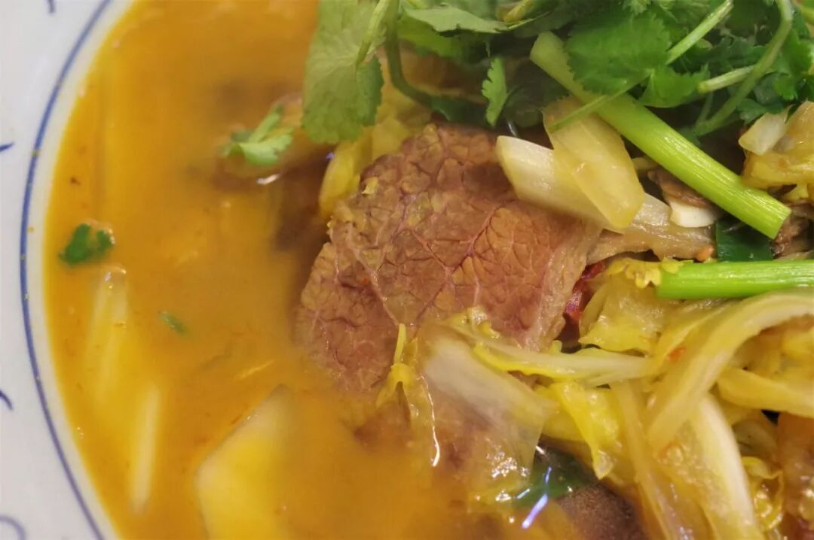

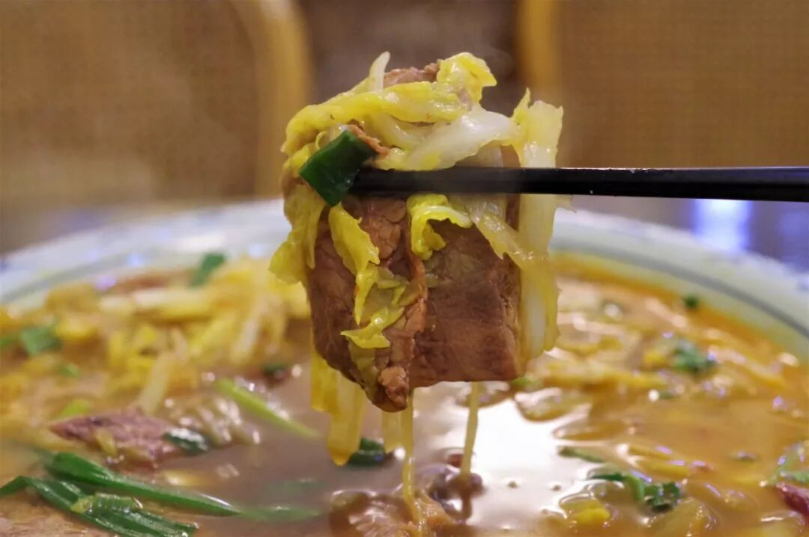

大白菜烧牛肉，光听菜名你或许很难想象这是连云港人吃得最多的家常菜之一。不必怀疑，走进一家当地菜馆，这道菜十有八九出现在比海鲜更靠前、或更显眼的位置。

一大盘菜端上桌，这种分量在无声地提醒着我，连云港还是座北方城市。汤水色泽橙黄、泛着热气，白菜与牛肉在其中累成了山，光是看一眼就让人忍不住抽筷子拆餐具了。夹起一筷子白菜，就着丰富的汤水入口，咸香微辣的滋味恰如其分，足够开胃又不会腻口，那一瞬间便能确定吃完一整盘这件事。其中的牛肉则是熟牛肉，本身已带些滋味，再裹上这汤汁，柔韧耐嚼、香溢满口。情不自禁地又配上了两碗米饭，除了剩些汤汁，算得上是光盘了。

东边总是黑得很早，本就冷清的街更有些萧瑟感。不过好在肉足饭饱，就算刮上一阵寒风，也不会令我烦扰。

想知道我在干啥，请点这个链接：吃货的决心

想知道我要去哪，请点这个链接：555天行程计划

沙光鱼的滋味，我比猫先了解了。

欢迎关注欢迎转发ღ( ´･ᴗ･` )

 var first_sceen__time = (+new Date()); if ("" == 1 && document.getElementById('js_content')) { document.getElementById('js_content').addEventListener("selectstart",function(e){ e.preventDefault(); }); }

 if ("0" == 1) { document.addEventListener("keydown",function(e){ if ((e.metaKey || e.ctrlKey) && (e.key === 'c' || e.key === 'C' || e.key === 'x' || e.key === 'X' || e.key === 'a' || e.key === 'A')) { if (e.target.tagName === 'INPUT' || e.target.tagName === 'TEXTAREA') { return; } e.preventDefault(); } }); document.addEventListener("copy",function(e){ var sel = window.getSelection(); var content = document.getElementById('js_content'); if (sel && sel.rangeCount > 0 && content && content.contains(sel.getRangeAt(0).commonAncestorContainer)) { e.preventDefault(); } }); }

预览时标签不可点

微信扫一扫

关注该公众号

知道了 (javascript:;)
