# 【第228天 镇江（一）】三怪迎新春

- 原文链接: https://mp.weixin.qq.com/s?__biz=MzA3MTM2Mjk3NA==&mid=2247503630&idx=1&sn=aaf3da58132206d23f2c5d3912d099db&chksm=9f2c3fffa85bb6e99c30e2879c53142c9010deab52c04f1702fc592a7a4baf8c9d8d8b794cd1&scene=21
- 作者: 宇哥食行记
- 发布时间: 未知
- 图片数量: 22

首先祝所有的大小宝贝儿新年快乐，猪年大吉！

告别了农历18年最后三天的南京，迎来了19年正月初一二的镇江。如果说在南京还能勉强吃上一些撑到腊月二八二九的小店，那镇江、常州两地，则基本是与这样的小饭馆无缘了，真正的觅食风险，这几天才是完全暴露。

身在镇江，先说镇江。敢将其放于大年初一二，一方面对于足够具有镇江特色的食物其实只消安排一天时间，二是与扬州一江之隔的镇江，也有着相当长久而强烈的早茶文化，也同样有春节不打烊的茶楼饭店，所以我实在不担心，在镇江无饭可食。

镇江这座城市，由于经济原因，在苏南五市中是显得最为弱势的那一个。但无论是水漫金山、还是茅山道士，都在向世人昭示着它绝不弱势的内在。谈到吃上，镇江更是有名震江南的三怪——香醋摆不坏、肴肉不当菜、面锅里面煮锅盖。吃在镇江，总是要从这三怪说起。

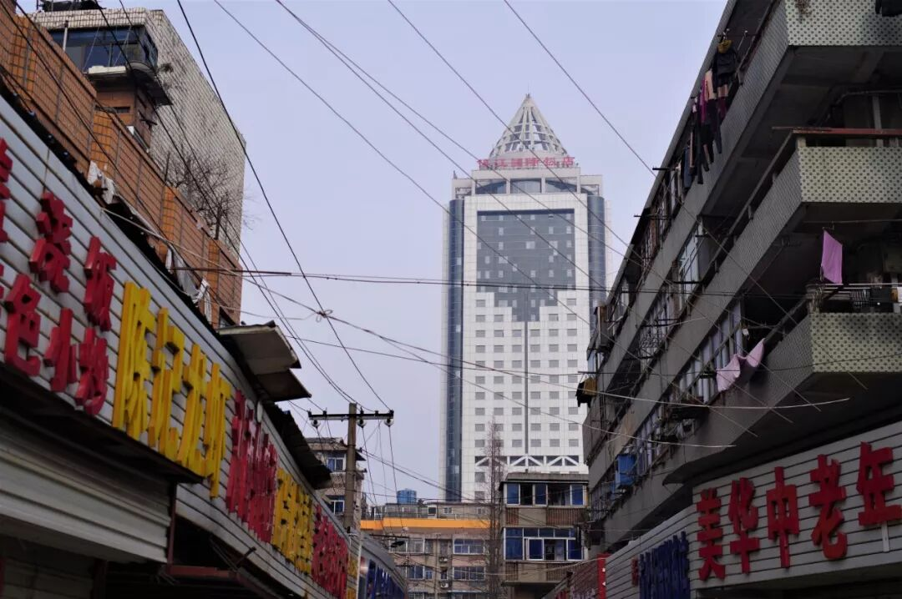

（1）

锅盖面

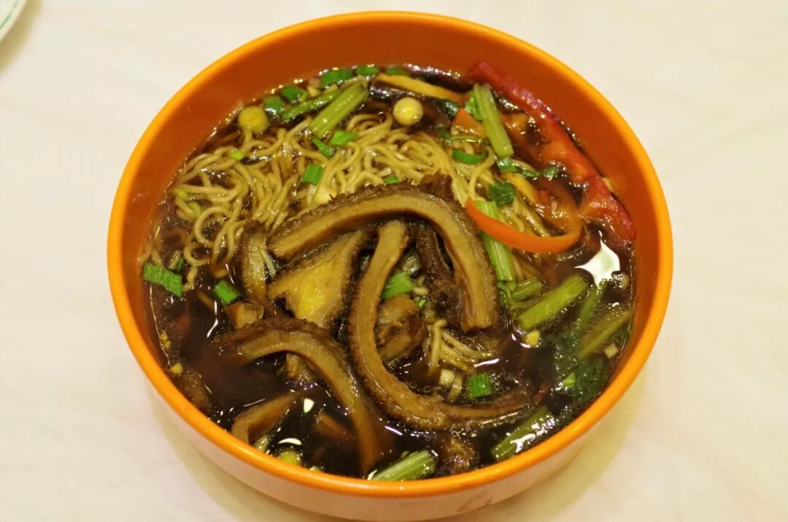

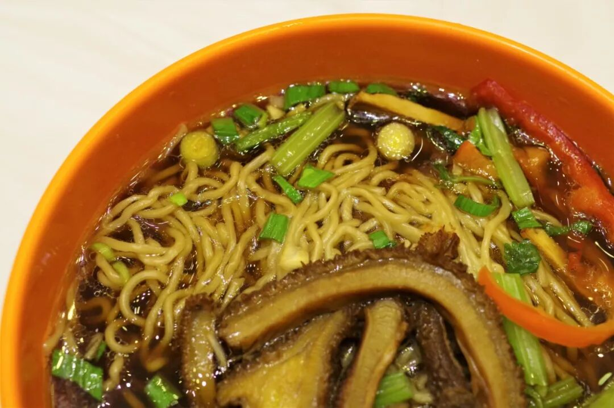

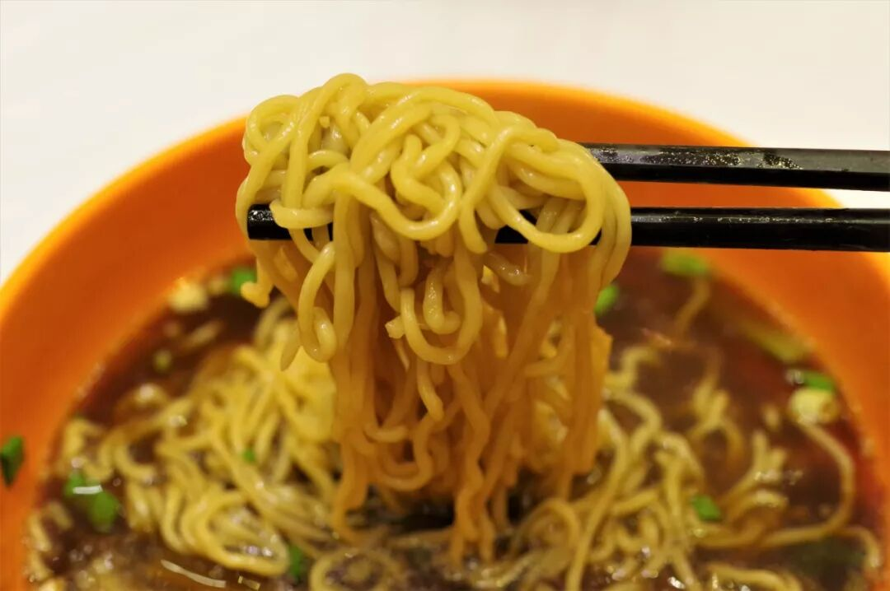

（上为红烧牛肚浇头）

先说说三怪中的锅盖面，这种面条可以说是江南各式面条中制作过程最“怪异”的一种——在煮面的锅中还要漂上一个锅盖（木质），据说这最初仅仅是种巧合，久而久之却成为惯例沿袭了下来。至于什么乾隆皇帝命名说，也不过是没有实证支撑的民间传说，当个故事听听即可。

最好的锅盖面自然还是要去到街巷里的小面馆中，大过年不得已只能选择去大饭店解决，好在这已是我第三次来到镇江，锅盖面也早已吃上几次。锅盖面是一大类面条的总称，在镇江并没有一碗面会在菜单上写着“锅盖面”。按汤底分，锅盖面可分为白汤与红汤，与苏式汤面类似，配上各式浇头食用（一般为肴肉、大排、肥肠、腰花、牛肚、牛肉、雪菜肉丝等），而面条则是使用的跳面，与淮安杠子面相同。红汤的调味与扬州阳春面接近，主要以酱油猪油等吊味，突出咸鲜油香口，而面条则具有相当的弹力和韧劲，吃在口中相当爽滑而Q弹。

（2）

肴肉

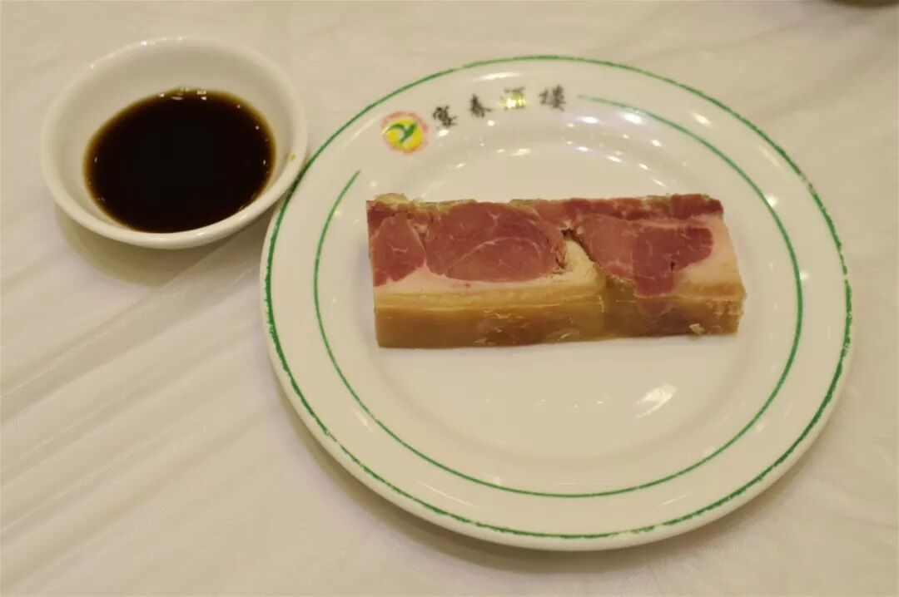

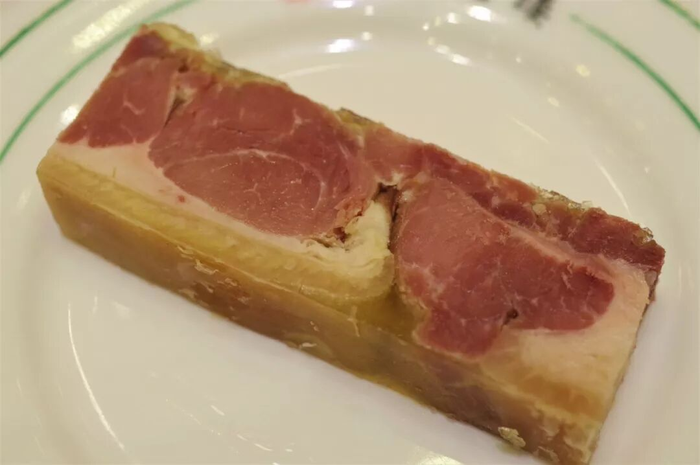

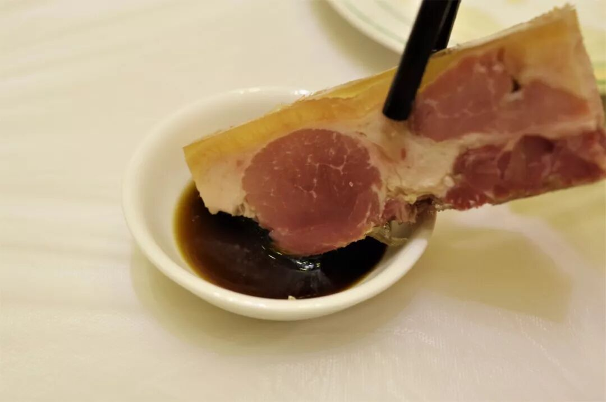

肴肉，又名水晶肴肉、水晶肴蹄，是镇江著名的一道传统冷菜，尽管在扬州一带也被普遍食用，终究要输镇江三分。肴肉以猪前蹄为主要原料，加盐和硝研制而成，猪皮金黄透明、肥膘百润如玉、瘦肉粉红光亮，食用时切成厚块，一般蘸香醋配以姜丝而食。

浅尝辄止，一块足以。夹起厚厚的肴肉，在这镇江的第三怪香醋中轻轻一点，然后送到嘴边咬下一口，皮韧而弹，肉干润相间、松而不散，冰凉的温度配上恰到好处的咸与醋的酸香，那种爽口滋味无与伦比。若是配上姜丝，更添一点辛辣爽脆之味，不过一块肴肉实在不必单独叫一份姜丝，便作罢了。

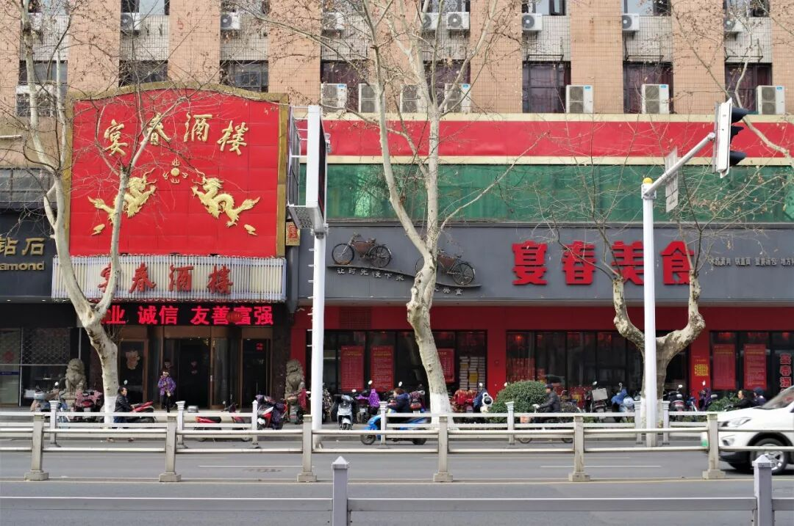

（3）

糖醋带鱼

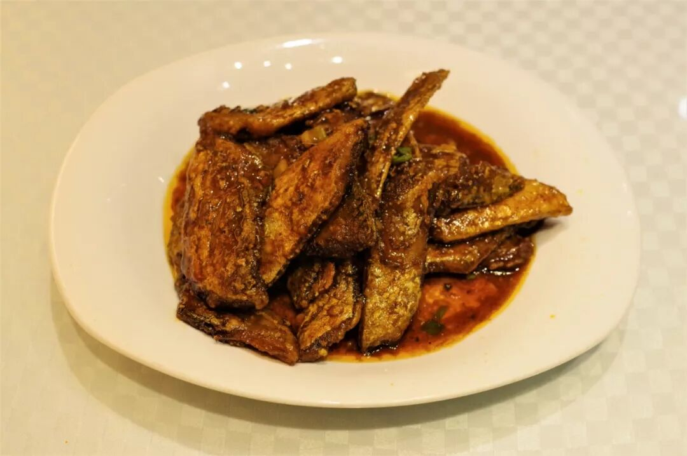

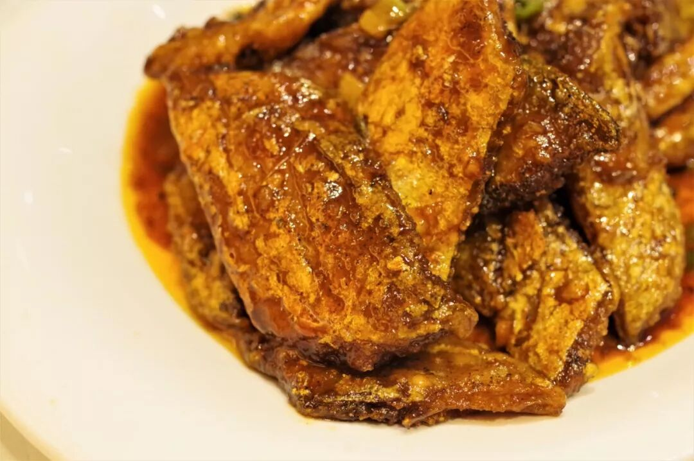

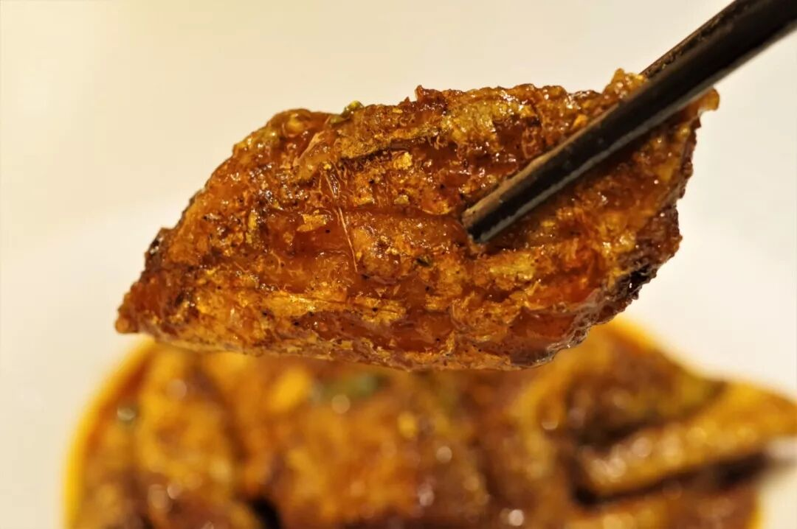

以出产和食用香醋而闻名的镇江，很合理地有了一系列糖醋口味的菜肴，其中最具代表性的要属镇江醋排（糖醋排骨），可今日看了一眼价格心里有些纳闷，便退而求其次另点了一道糖醋口的菜肴。微微焦脆的鱼皮加上细嫩的鱼肉，被包裹在浓稠的酸甜酱汁中，实在令人不禁感叹，到底有谁能拒绝糖醋口的食物啊！

（4）

桂花糯米藕

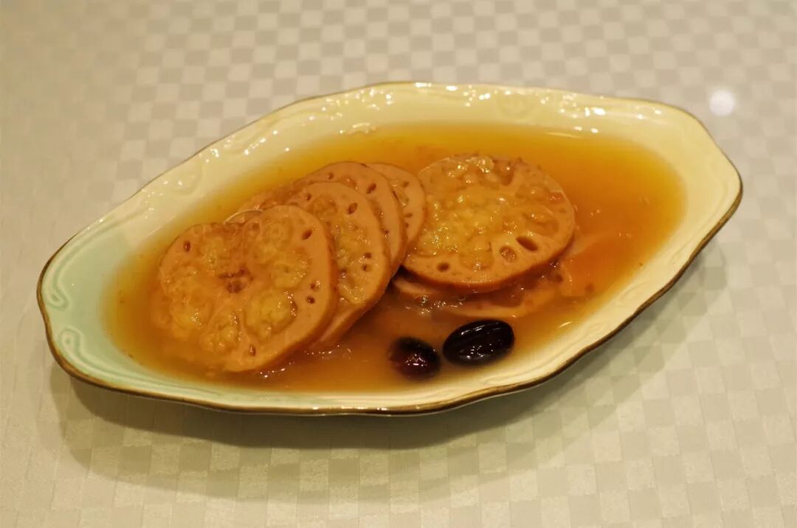

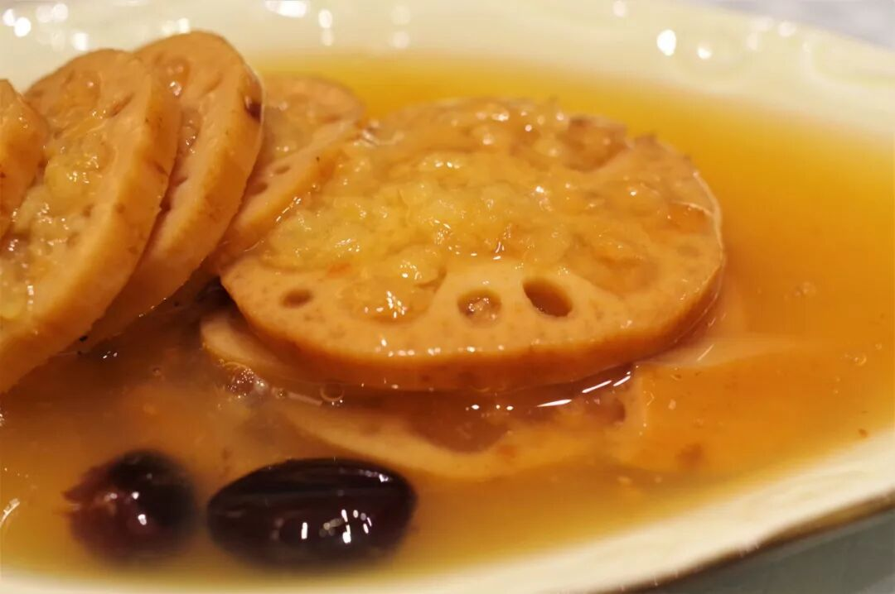

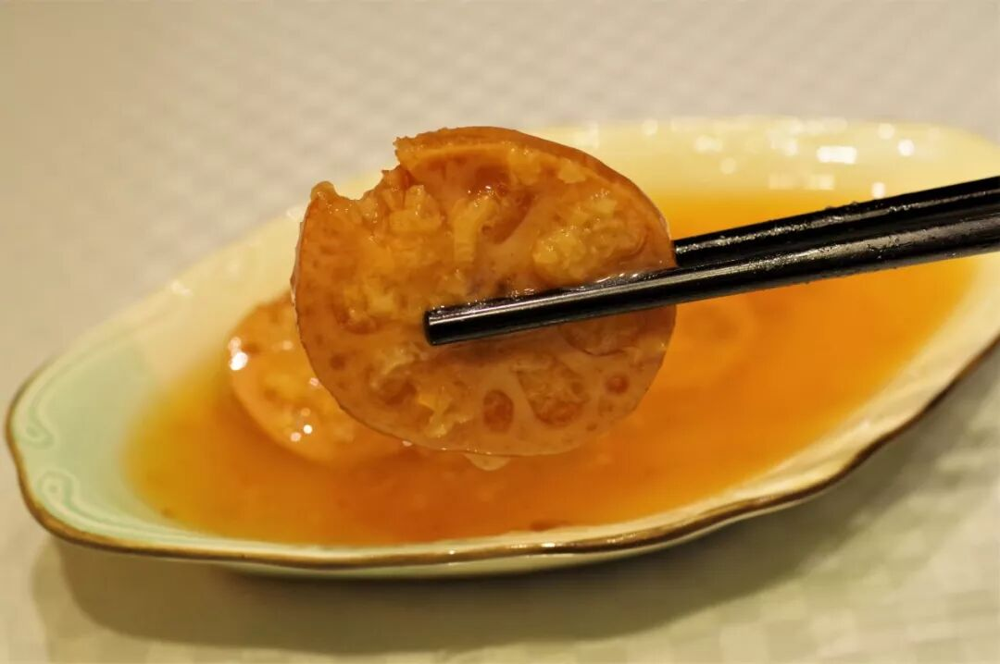

从进入江苏起，想单点一份桂花糯米藕的欲望便从心中升起，原计划在南京吃一份却不知怎地就忘记了。不过人在江南，无论各地，无论大小饭店，想吃上这道凉菜不费吹灰之力。

将糯米灌入莲藕中煮熟切块，再淋上桂花酱和蜂蜜即可，从制作上说属于家家户户均可的家常小菜，但玄乎也玄乎在，你大概很难吃上味道完全相同的两份桂花糯米藕，哪怕是同一家餐厅。吹毛求疵毫无意义，只要那藕足够软烂、只要那糯米足够粘糯、只要那汁水甘甜芬芳而又不过，这份桂花糯米藕，我便能汁都不剩地吃给你看。

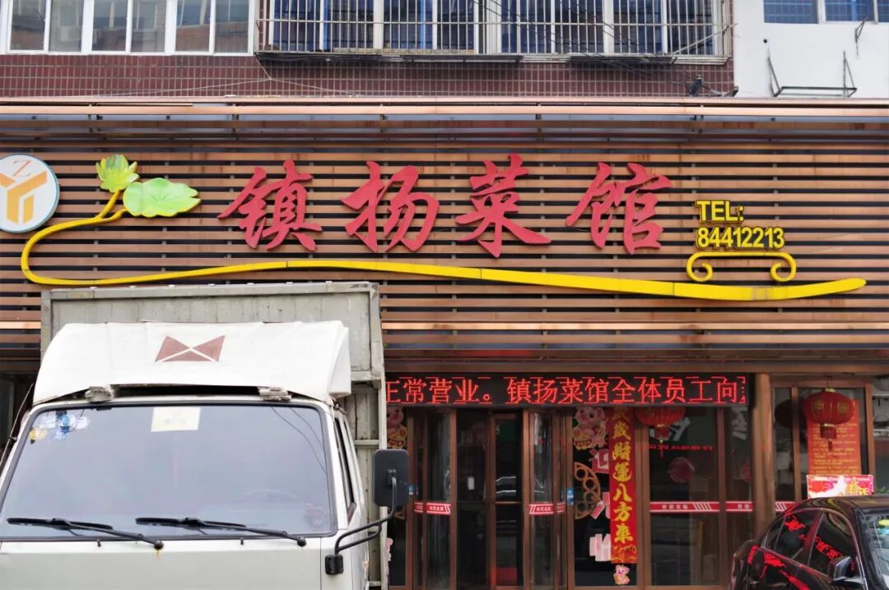

走在大年初一的镇江街头，人行道、车道都没了往日的热闹，还以为大家都在家里睡懒觉。一走进商场，才发现那人山人海简直是圣诞节、情人节不可比拟的热闹。也挺好，这才是过年。

想知道我在干啥，请点这个链接：吃货的决心

想知道我要去哪，请点这个链接：555天行程计划

给各位拜年啦！

欢迎关注欢迎转发ღ( ´･ᴗ･` )

 var first_sceen__time = (+new Date()); if ("" == 1 && document.getElementById('js_content')) { document.getElementById('js_content').addEventListener("selectstart",function(e){ e.preventDefault(); }); }

 if ("0" == 1) { document.addEventListener("keydown",function(e){ if ((e.metaKey || e.ctrlKey) && (e.key === 'c' || e.key === 'C' || e.key === 'x' || e.key === 'X' || e.key === 'a' || e.key === 'A')) { if (e.target.tagName === 'INPUT' || e.target.tagName === 'TEXTAREA') { return; } e.preventDefault(); } }); document.addEventListener("copy",function(e){ var sel = window.getSelection(); var content = document.getElementById('js_content'); if (sel && sel.rangeCount > 0 && content && content.contains(sel.getRangeAt(0).commonAncestorContainer)) { e.preventDefault(); } }); }

预览时标签不可点

微信扫一扫

关注该公众号

知道了 (javascript:;)
