# 【第325天 衡阳（二）】今朝有酒今朝醉

- 原文链接: https://mp.weixin.qq.com/s?__biz=MzA3MTM2Mjk3NA==&mid=2247503530&idx=2&sn=1701fc8cbc334a1c91e48e1450e34f22&chksm=9f2c3e5ba85bb74d8bd62f033d32a4c0cc1246bfeea68cf84bfd8f7386a8c23c2f47bff0808c&scene=21
- 作者: 宇哥食行记
- 发布时间: 未知
- 图片数量: 26

这本应是一篇在昨日发出的图文，却最终因为自己不胜酒力以及衡阳人民的熊熊热情而不得不在今日补上。想起上一次发生这样的情况已是将近三百天前从新疆坐火车前往青海的那一晚，因为没有网络而不得不延至第二天。

言归正传。衡阳的第二日，依然以一碗粉作为起点。

（1）

筒骨粉

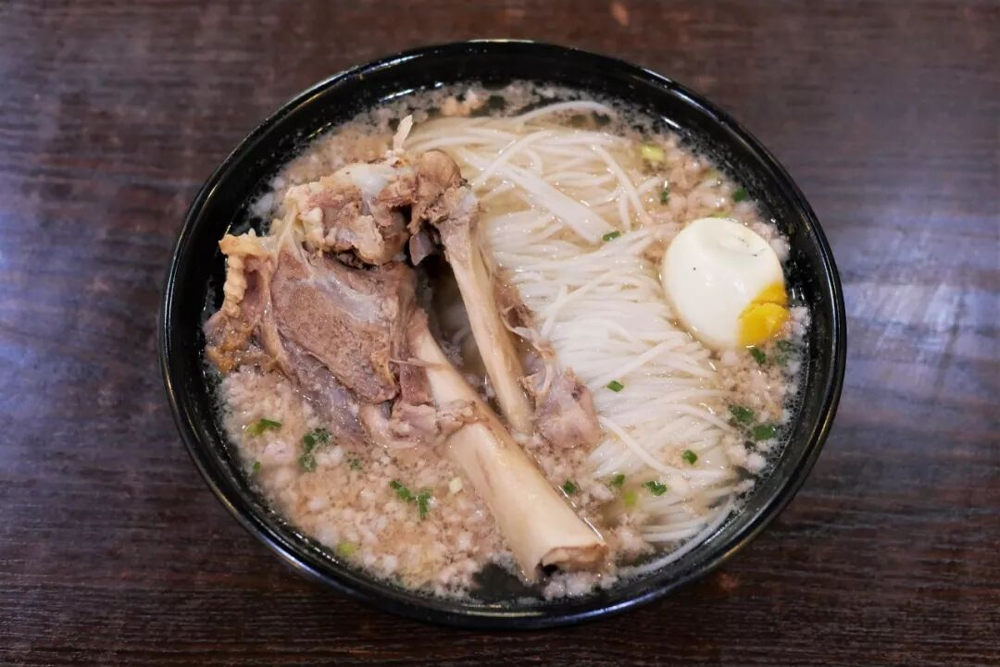

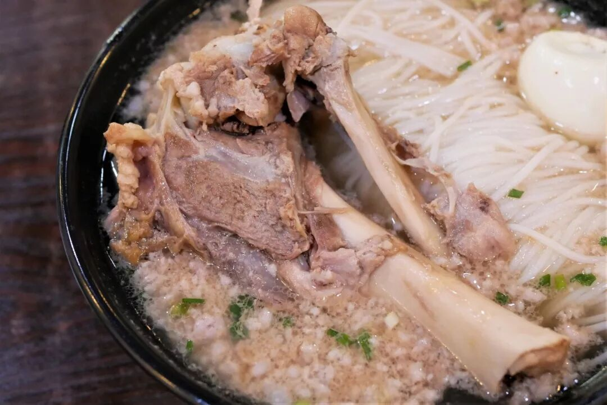

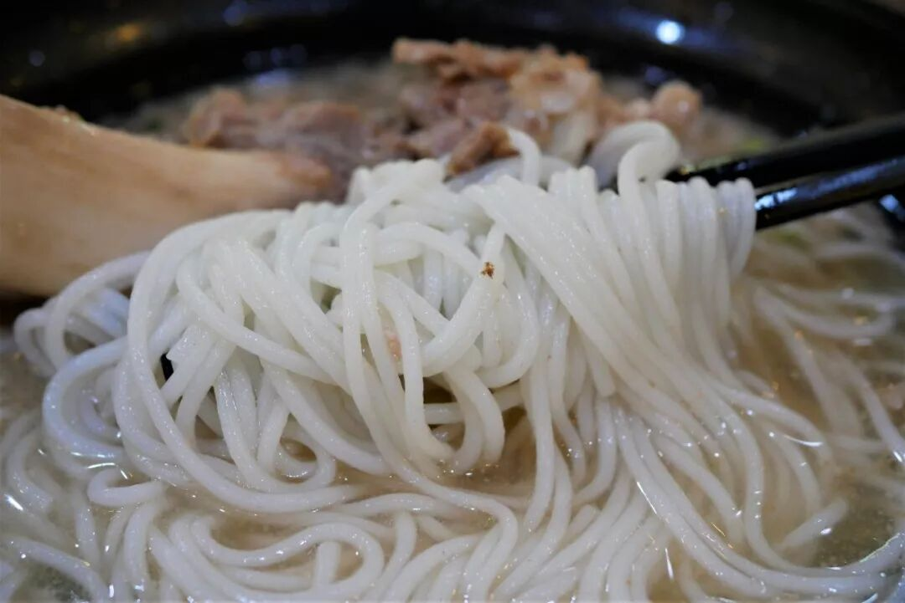

要说具有衡阳特色的粉，鱼粉与卤粉过后就该让筒骨粉登场了。筒骨粉显然不是仅存在与衡阳，在我之前到过的几站也偶能在街上看到一些售卖筒骨粉的店铺，但在衡阳，筒骨粉是更有影响力的存在。

筒骨粉的构成并不复杂，大骨熬出的高汤作汤底，盛入米粉、添上葱花碎肉，最后也是最核心的一步，便是加上一根扎实的筒骨。即使没有吃过这种粉也很容易就能揣摩出它的味道，毕竟谁还没喝过大骨熬的汤呢，真正让我惊喜又惊讶的地方在于，作为日常早餐的选择之一，能让食客在一大早就这么有些“放肆”地嗦粉啃肉，实在是令人激动。同时，就如同鱼粉一样，筒骨粉味道咸鲜清淡，一定程度上也在颠覆一般认为的湖南米粉必带辣的印象，起码对衡阳人而言，单纯鲜味的力量已足够强大。

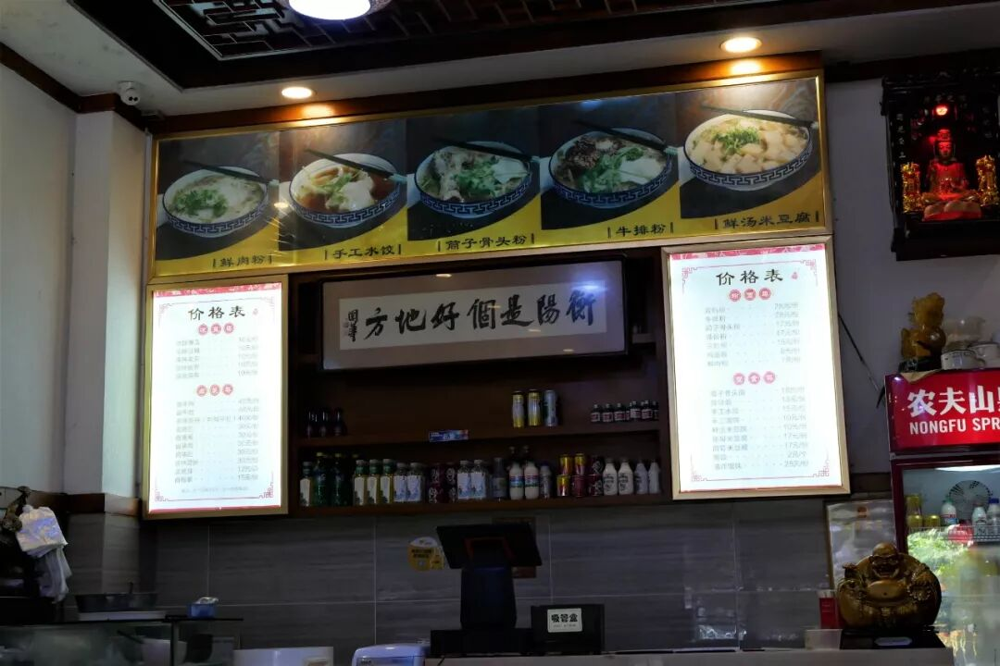

（2）

凉拌猪尾

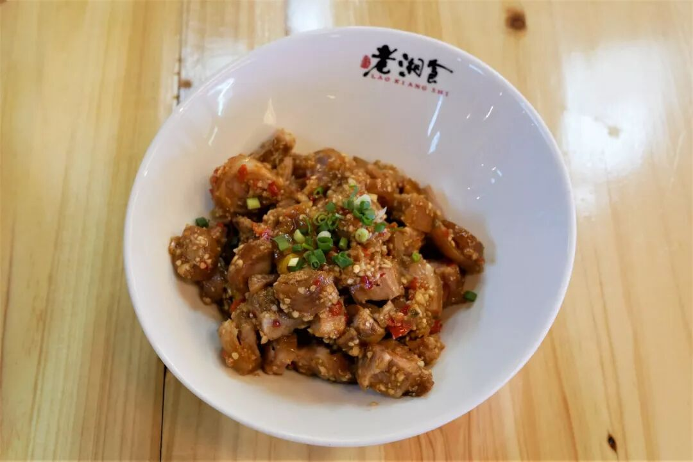

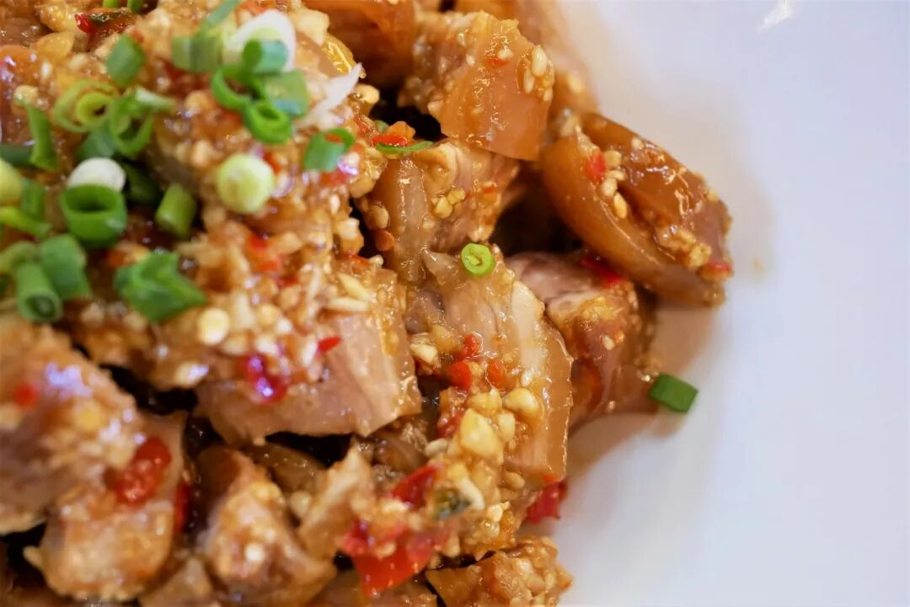

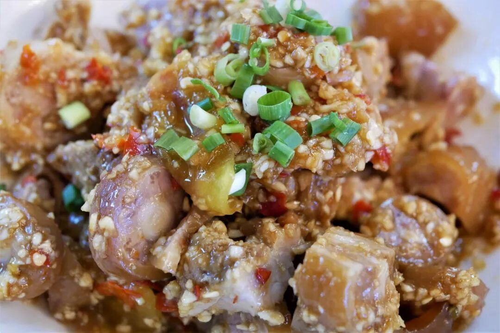

凉拌猪尾不算是衡阳城市意义上的特色菜，只是今日午餐正好选在一家衡阳资历比较老的湘菜馆中，而这道菜是该店的招牌菜。

一道凉拌菜能成为一家大餐厅的招牌菜，一定有着足够的底气和实力在背后支撑。菜品上桌，光是瞥一眼已让人垂涎三尺，切成小块的猪尾被粘稠的酱汁包裹着，蒜末、剁椒附于其上。吃上第一口，咸甜酸香辛辣的滋味一同涌出，虽然口味复杂却并不过，到达了一种差不多的丰富和爽口，再加上猪尾本身的弹韧胶质口感，作为凉菜已无可挑剔。

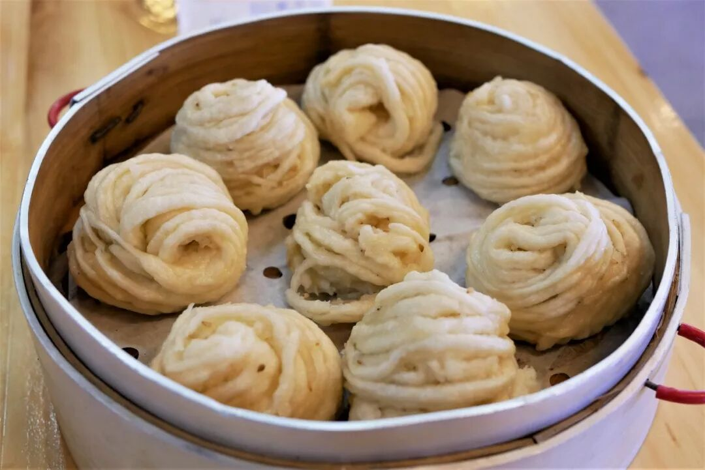

点了猪尾之后另要了一笼银丝卷（即甜花卷），下单的阿姨非常疑惑地问我不需要点个下饭的菜吗？作为一个精神北方人，凉菜配主食完全就是日常操作，没一点儿毛病。

（3）

小龙虾、嗦螺、炒麻拐

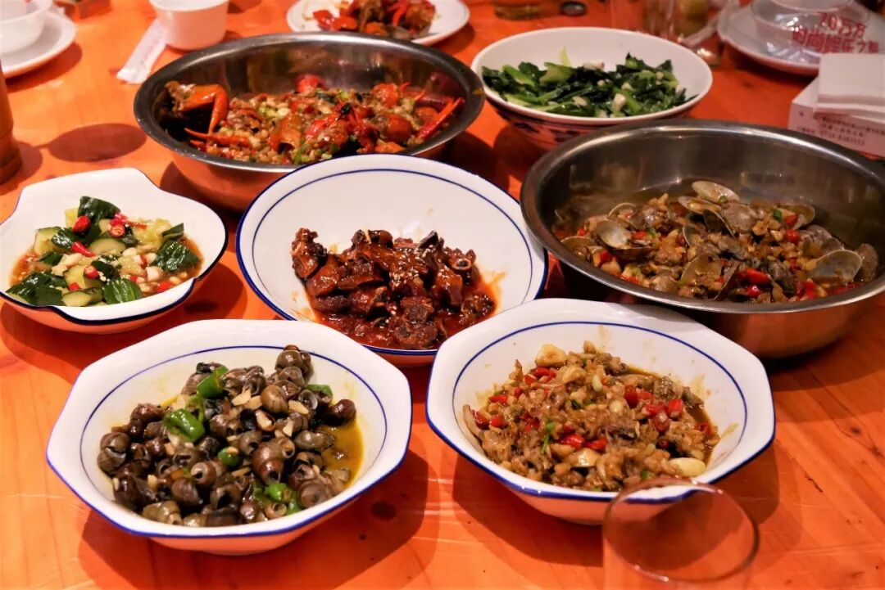

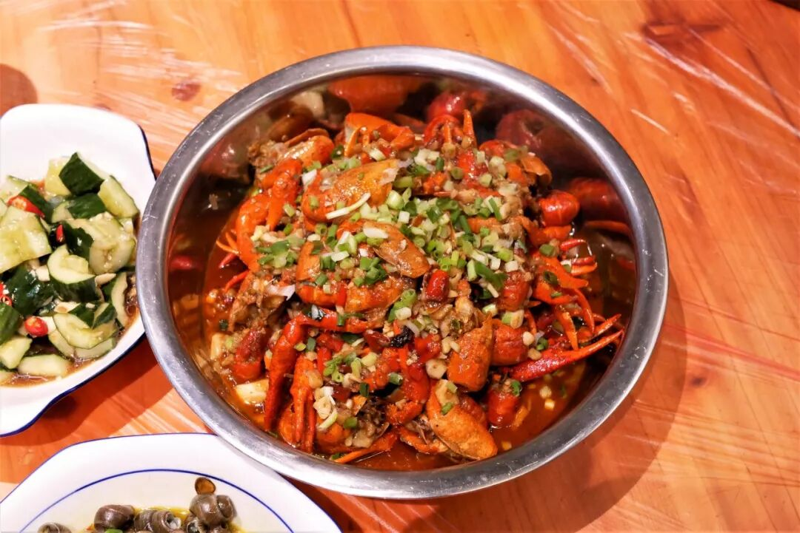

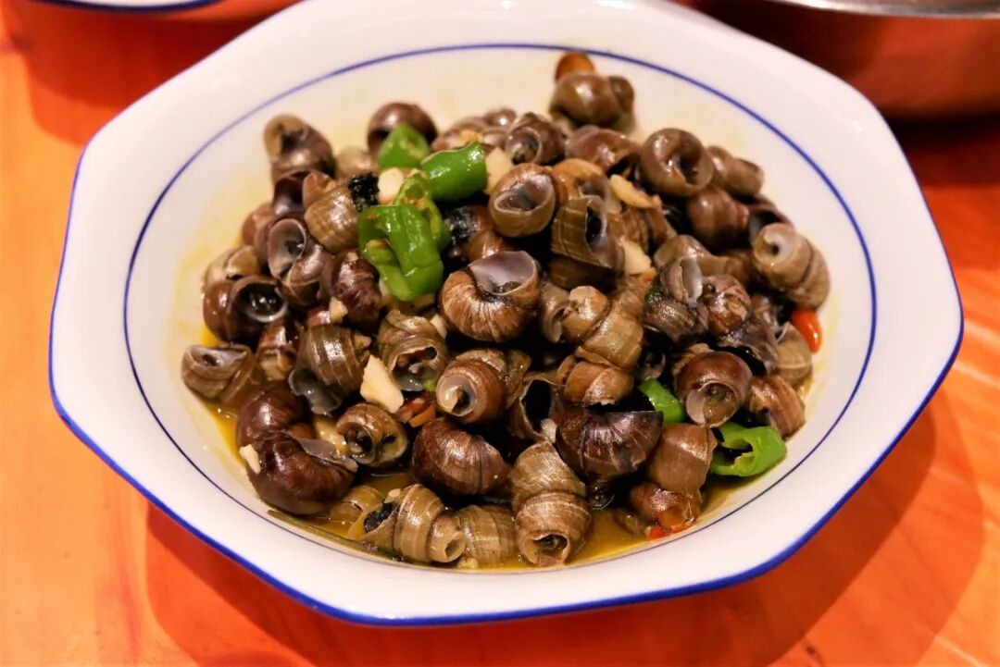

感谢衡阳朋友的邀请，可以在一顿饭中将当地人平时正餐或宵夜中常点的几样食物一次性吃上，如小龙虾、嗦螺和炒麻拐等。滋味上基本体现了经典的湘菜做法，香辣味重。倒是这嗦螺另有风格，浓鲜的汤汁仅带淡淡的辣，就着汤将螺肉嗦（吸）出满口鲜香。

其实有酒上桌，食物本身也就有些退居其次了。匆匆忙忙排了两张照片便开始举杯畅饮、谈天说地，从夕阳正红到夜半三更。最后的结果已无需再提，发完醉酒警告后便轰然躺下进入梦乡。

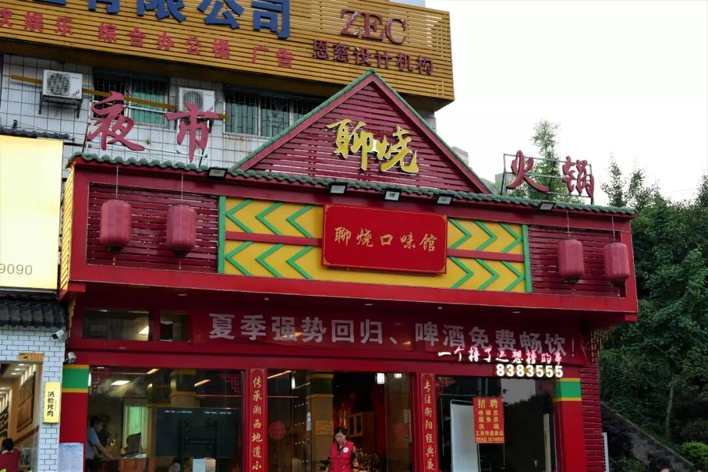

其实在衡阳有一个遗憾，那就是没有尝上酥薄月这一特产，本已标记好的店铺不知怎地就变成了上面这番模样。

他们说的没错，我一定会记住这一天。

想知道我在干啥，请点这个链接：吃货的决心

想知道我要去哪，请点这个链接：555天行程计划

下次再会，这片热土

要不转发一波关注一波？

 var first_sceen__time = (+new Date()); if ("" == 1 && document.getElementById('js_content')) { document.getElementById('js_content').addEventListener("selectstart",function(e){ e.preventDefault(); }); }

 if ("0" == 1) { document.addEventListener("keydown",function(e){ if ((e.metaKey || e.ctrlKey) && (e.key === 'c' || e.key === 'C' || e.key === 'x' || e.key === 'X' || e.key === 'a' || e.key === 'A')) { if (e.target.tagName === 'INPUT' || e.target.tagName === 'TEXTAREA') { return; } e.preventDefault(); } }); document.addEventListener("copy",function(e){ var sel = window.getSelection(); var content = document.getElementById('js_content'); if (sel && sel.rangeCount > 0 && content && content.contains(sel.getRangeAt(0).commonAncestorContainer)) { e.preventDefault(); } }); }

预览时标签不可点

微信扫一扫

关注该公众号

知道了 (javascript:;)
