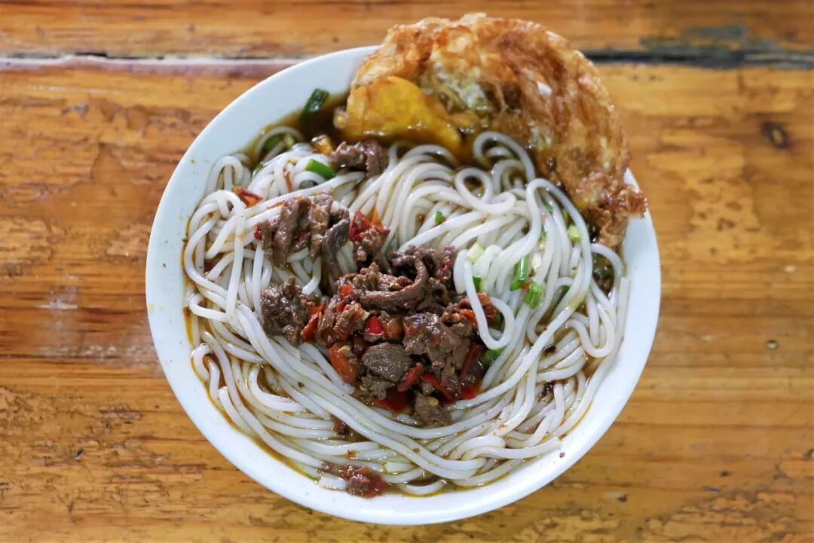
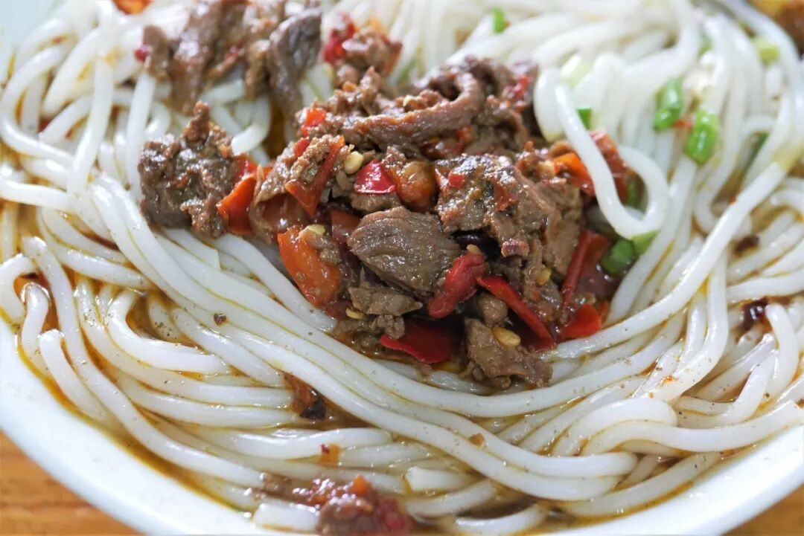
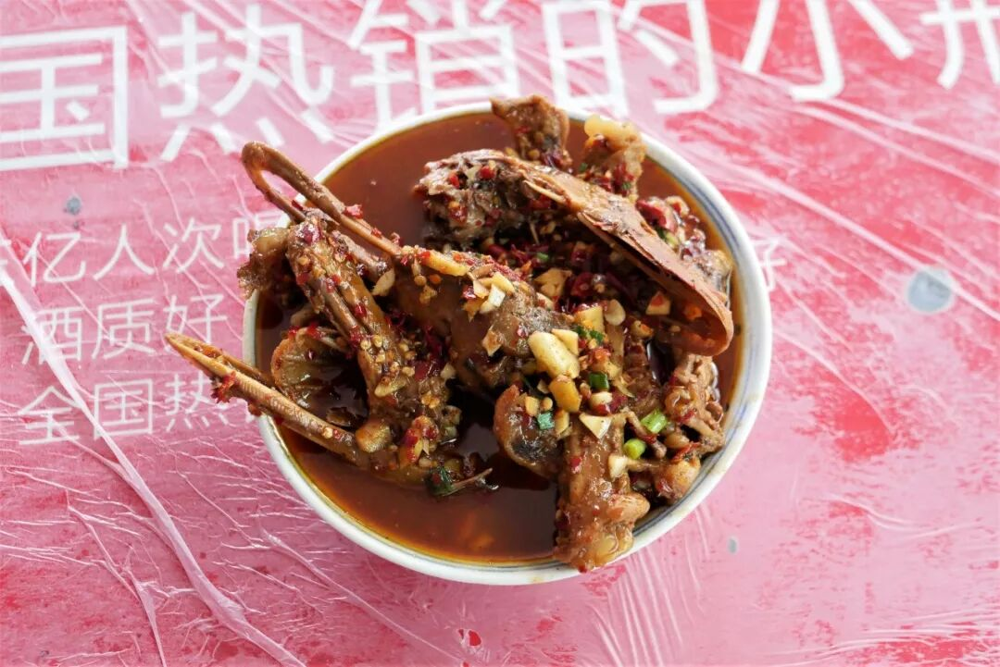
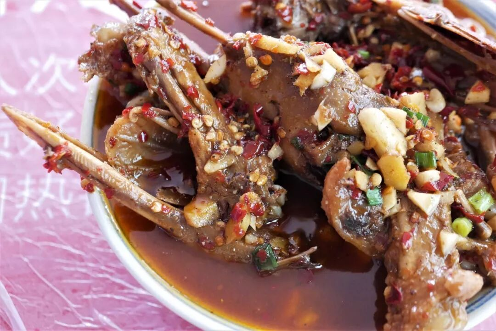
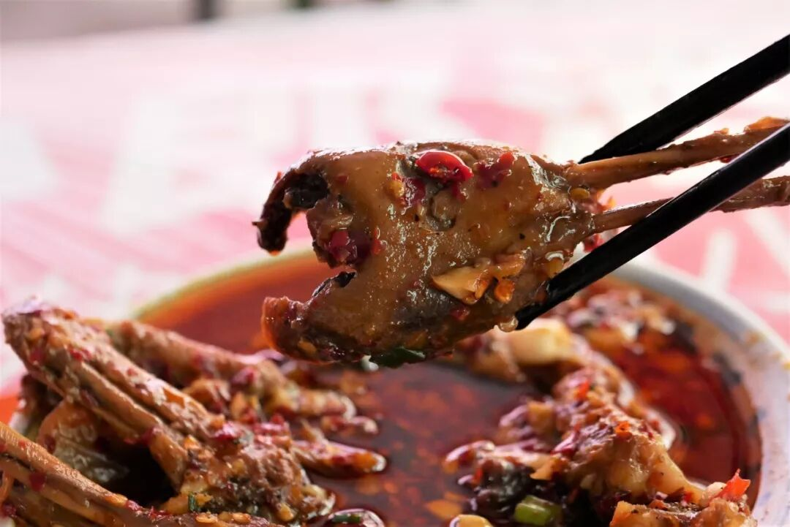
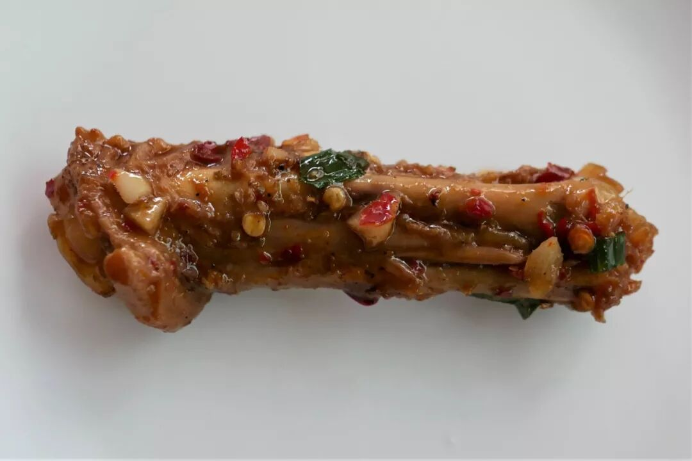
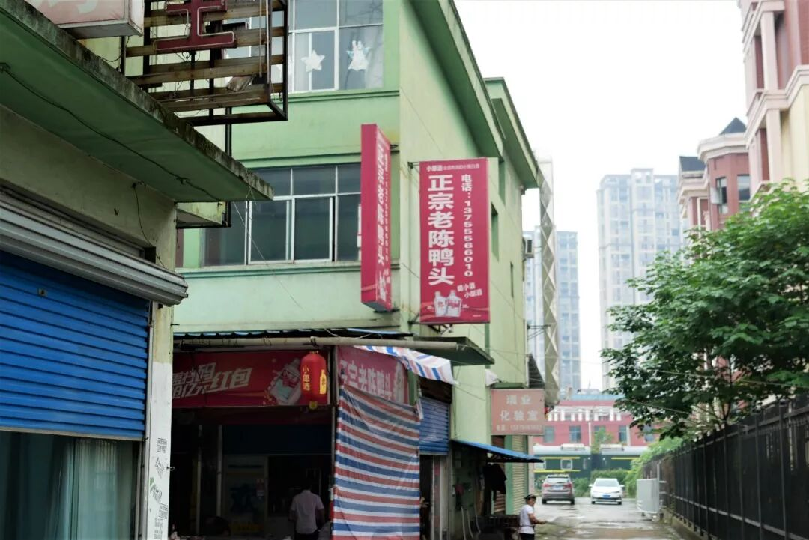
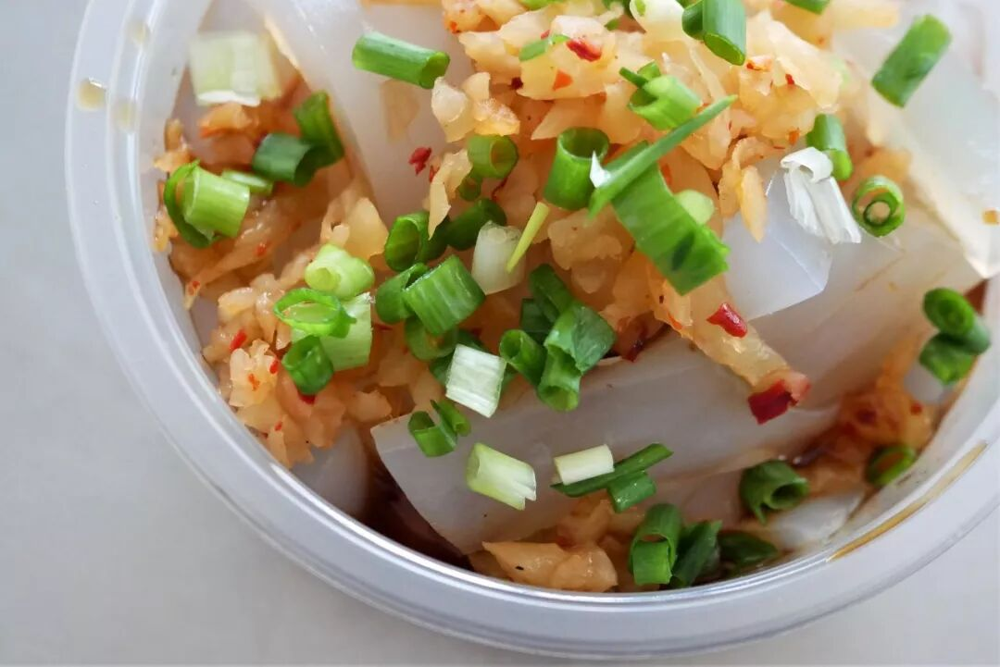
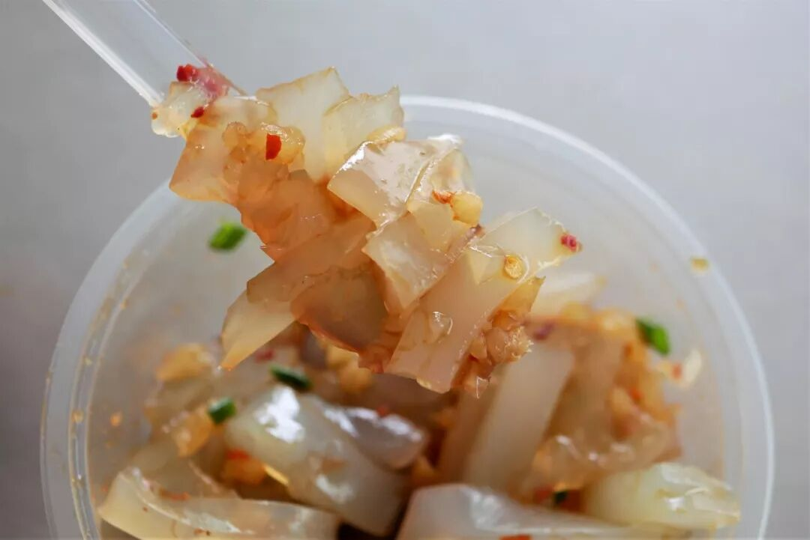
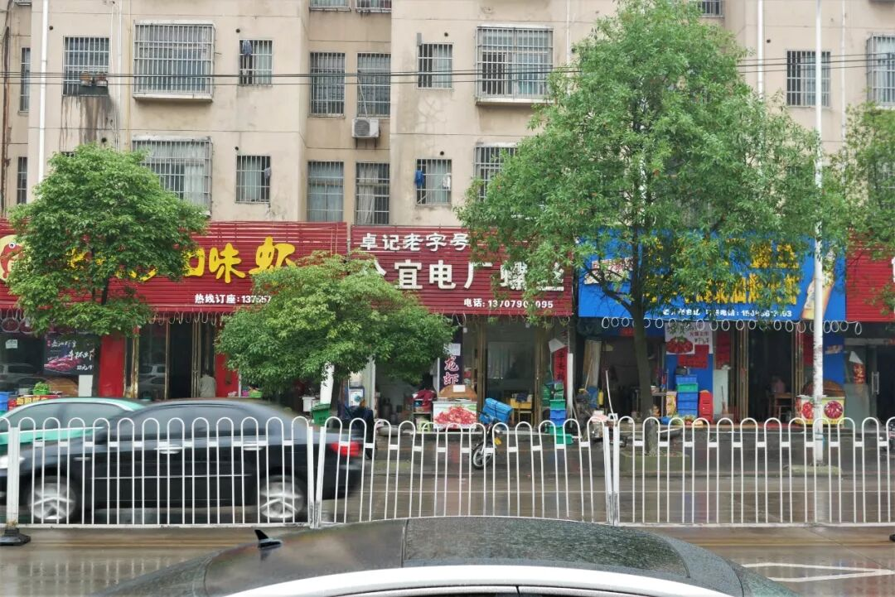

# 【第333天 新余】麻麻辣辣尝一遭

- 原文链接: https://mp.weixin.qq.com/s?__biz=MzA3MTM2Mjk3NA==&mid=2247503523&idx=1&sn=d79ba02f3ed9ec3f4db00b18c599cf4a&chksm=9f2c3e52a85bb7444c1a7c46824f800a54272a6cd4651077f18e2ab0d7d2cc3e173360b9bfde&scene=21
- 作者: 宇哥食行记
- 发布时间: 未知
- 图片数量: 26

在本就存在感弱的江西省，新余几乎是最不太可能被省外人知道的那一个城市。它是江西省最小的地级市，仅辖一区一县，人口不过百万出头，本身亦没有知名度极高的传播点。不过，这个没什么名气的小城，却有着江西省最高的人均GDP，比省会南昌还要高出一截。

新余是一座典型的工业城市兼移民城市，因钢铁而发展，今天的新余居民大多在最近几十年由外地迁入，使得今天的新余在语言也好在饮食也罢都呈现出强烈的融合性。当涉及到特色美食时，新余便很难拥有那种独一无二的类型，更多是不特别的种类被覆上了独属于新余的味道。

在确定行程前其实纠结了许久是否要加上新余这一站，最终还是抱着“来都来了”的心态，又寻思着正好顺路，干脆在此待个半天吃上几口吧。

（1）

汤粉

新余人最日常的早点与其他江西城市并无二致，基本是一碗粉，汤粉、拌粉（也偶见叫腌粉）或是炒粉，种类大同小异。尽管种类上不存在特别之处，但在新余也确确实实有这样的店铺，凭借自己的秘方成为了最被认可的粉店之一。这碗汤粉便出自其中。

这样的汤粉本质上与湖南的盖码粉没有太大区别，最大的差异还是在码子和汤底的调味上，都说江西比湖南口味还要重，从这碗粉其实就可见一斑。码子的鲜辣味非常足，与汤和粉混合后让汤底也变得更加浓重，挑起一筷子粉吸下稍不注意便要被呛到。不过，整体的咸香鲜辣非常到位，习惯了辣以后，味道是无可挑剔的。

（2）

麻辣鸭三件

要问新余当地最有名气的特色菜，答案多半就是这麻辣鸭三件，其中的三件指的是鸭头、鸭翅、鸭掌，倒是令我想起了衢州的“三头一掌”，有些异曲同工之妙。

麻辣鸭三件与传统的赣菜几乎没有关系，它是由某一家店发明最终传开成为今天的新余特色菜，并没有太长的历史。既名为麻辣，这道菜多半与川渝厨师脱不了干系吧。鸭三件乃烧制而成，用料上重油重辣，各种辛香料使用丰富，最终呈现出的口味是一种十分复合的香辣味，麻味其实很弱，与正统的川式麻辣不能相提并论。对于习惯重口的人，这种复杂的香辣几乎是难以抗拒的，一块接着一块，强烈的味道刺激和啃食带来的快感确实让人印象深刻。

（3）

麻辣冻粉

听闻新余有一种特色小吃叫做麻辣冻粉，抱着好奇的心态一试，见到实物时忍不住排了一下自己的脑袋，“可不就是凉粉嘛，改名成冻粉也还是凉粉啊”。其实这种凉粉在江西并不算流行，在川渝尤其常见，合理地推测应该仍是由外地移民带入。短条状的冻粉调配上萝卜丁、葱花和辣椒水，爽滑带弹的口感配上香辣爽口的调味，相当到位。只是对我这个从小吃这样的凉粉长大的人而言，算不上新鲜罢了。

由于已乘坐下午的火车前往南昌，像电厂螺丝、水北豆腐之类的食物就实在没有几乎继续品尝了，若下次有机会路过，我想我不会错过。

若无风雨阻挠，逛逛这小城也该是惬意之事一件。

想知道我在干啥，请点这个链接：吃货的决心

想知道我要去哪，请点这个链接：555天行程计划

真的别下雨了，要疯了

要不转发一波关注一波？

 var first_sceen__time = (+new Date()); if ("" == 1 && document.getElementById('js_content')) { document.getElementById('js_content').addEventListener("selectstart",function(e){ e.preventDefault(); }); }

 if ("0" == 1) { document.addEventListener("keydown",function(e){ if ((e.metaKey || e.ctrlKey) && (e.key === 'c' || e.key === 'C' || e.key === 'x' || e.key === 'X' || e.key === 'a' || e.key === 'A')) { if (e.target.tagName === 'INPUT' || e.target.tagName === 'TEXTAREA') { return; } e.preventDefault(); } }); document.addEventListener("copy",function(e){ var sel = window.getSelection(); var content = document.getElementById('js_content'); if (sel && sel.rangeCount > 0 && content && content.contains(sel.getRangeAt(0).commonAncestorContainer)) { e.preventDefault(); } }); }

预览时标签不可点

微信扫一扫

关注该公众号

知道了 (javascript:;)
