# 【第346天 吉安（二）】炒粉家乡味，萝卜爽透心

- 原文链接: https://mp.weixin.qq.com/s?__biz=MzA3MTM2Mjk3NA==&mid=2247503510&idx=1&sn=23fe62dbd11870d20dd8541f136b5ce9&chksm=9f2c3e67a85bb771adab6d88fa0176ebb1a933508854589f65912f4e004aa39dc3f95742359a&scene=21
- 作者: 宇哥食行记
- 发布时间: 未知
- 图片数量: 28

一觉醒来，窗外传入的依旧是啪嗒啪嗒，水未退，去白鹭洲或是去湿地公园的计划只得彻底作废。天公不作美，人又能何为，吉安注定要在我心中留下个看不分明、模模糊糊又湿哒哒的印记了。

如果不是为一碗炒粉，我可能连床都不想起。

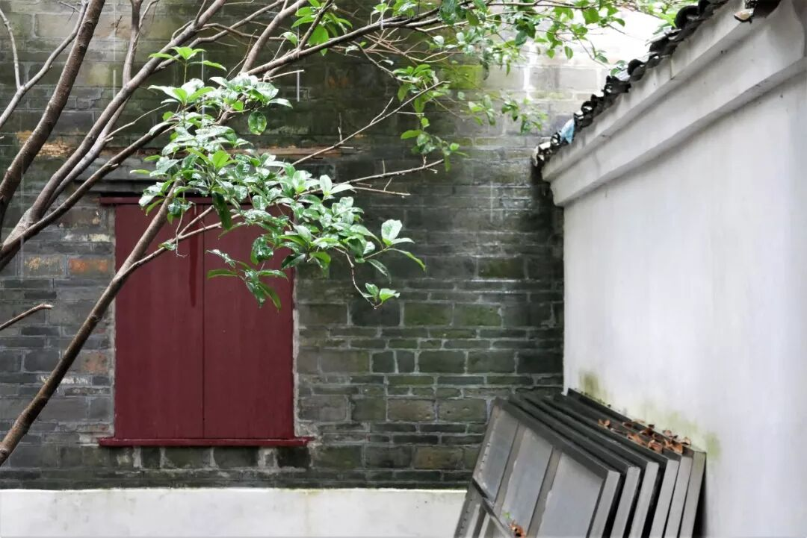

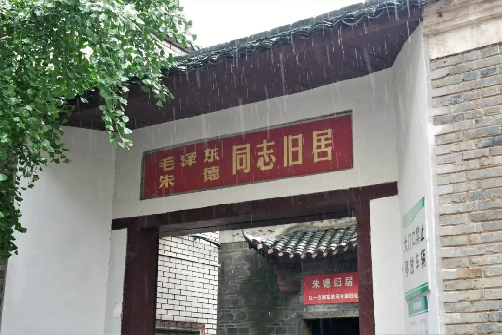

（1）

炒粉

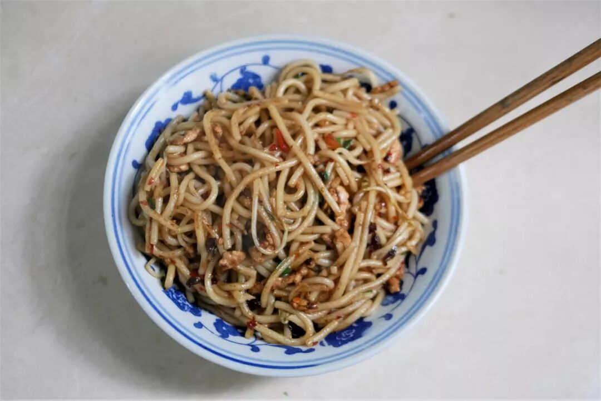

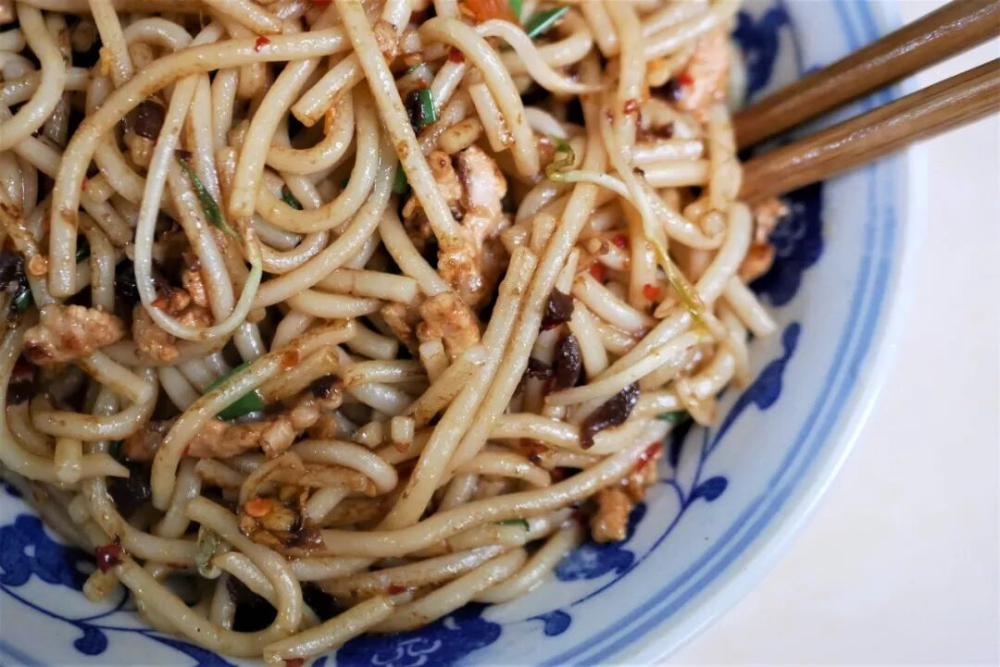

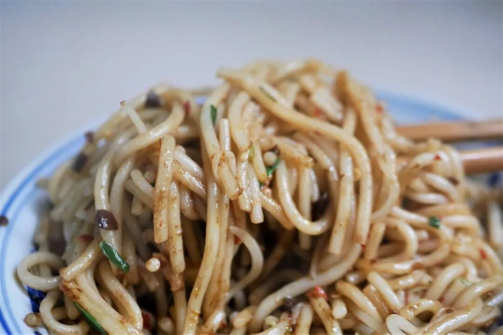

炒粉城城有，吉安尤其多。对吉安人而言，炒粉不止是一种可有可无的米粉种类，而是实实在在代表了家乡口味的特色小食。

吉安炒粉一般使用以峡江米粉为代表的一类粉，粗细适中、口感偏软糯，炒粉主要分为素炒粉、蛋炒粉、肉炒粉这样几种，基本的制作方法与一般炒粉无疑。真正让吉安炒粉带上地方色彩的因素，还是在其调味之上——除了油、盐、酱油、辣椒等必不可少的调料外，还会加入少量吉安特产冬酒（属于黄酒），让炒粉除了咸香油辣，还带上一抹淡淡的酒香甜气，食之愉悦。

（2）

干挑面

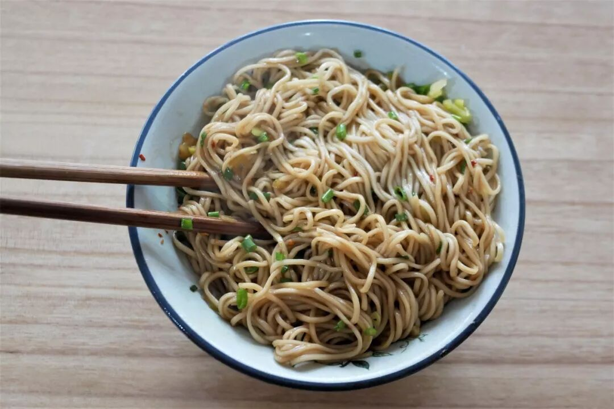

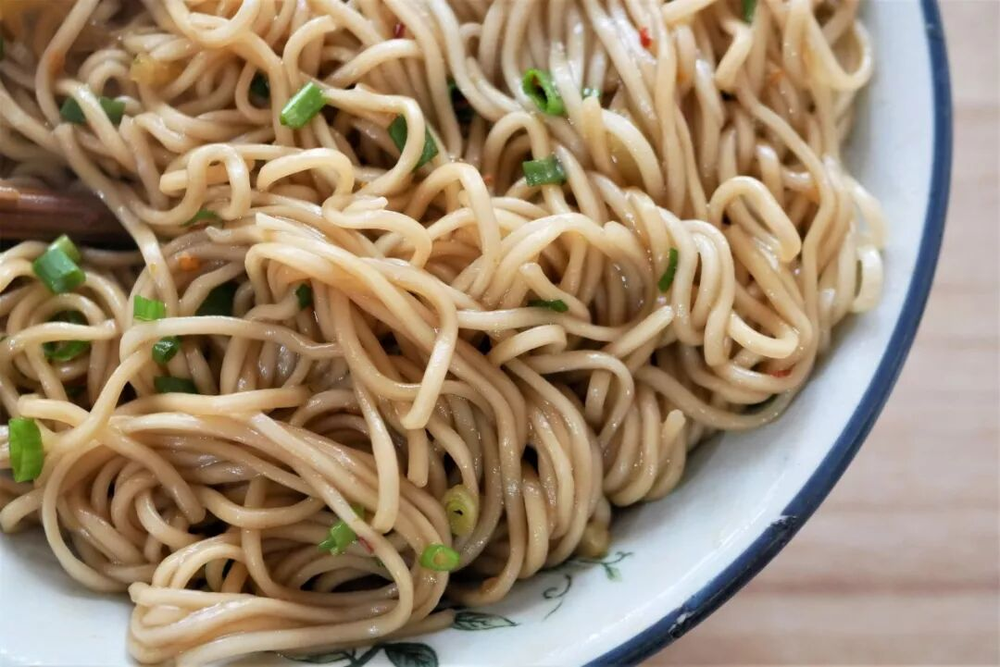

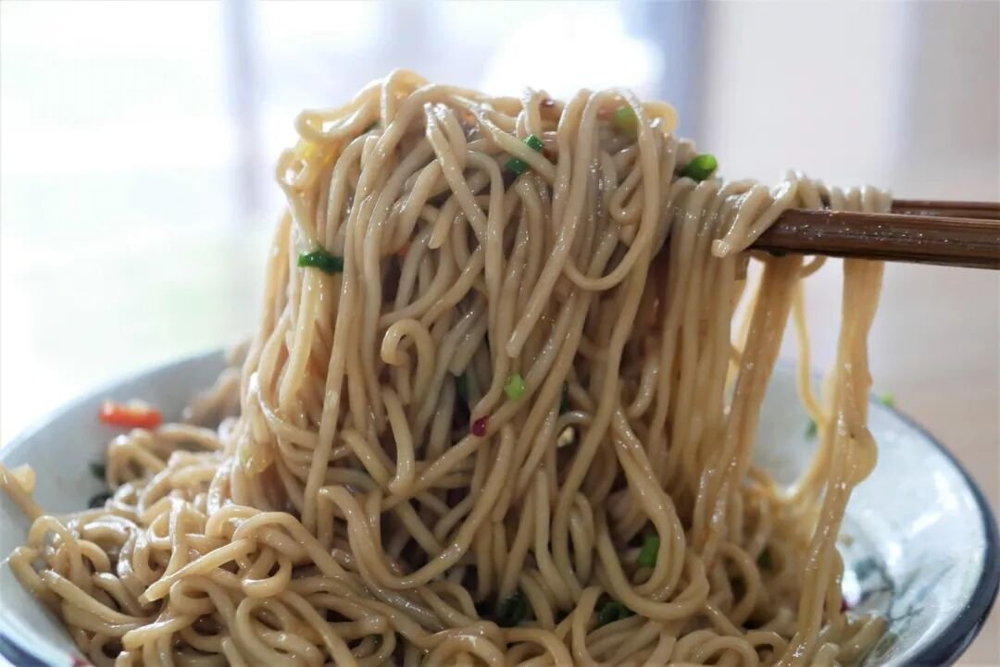

除炒粉外，吉安市里最常见的另一种早点便是干挑面。吉安干挑面在选材制作上有着明显不同于其他地方的特点：首先面条要使用细而圆的湿面，水分丰富，吃起来软而润，与干碱面有较大差异；调味相对简单，加适量盐、猪油、酱油、辣椒、葱花及咸菜即可。咸鲜油辣搭配上湿润的面条，这种滋味足够家常，满足一顿不太挑剔的日常早餐足矣。

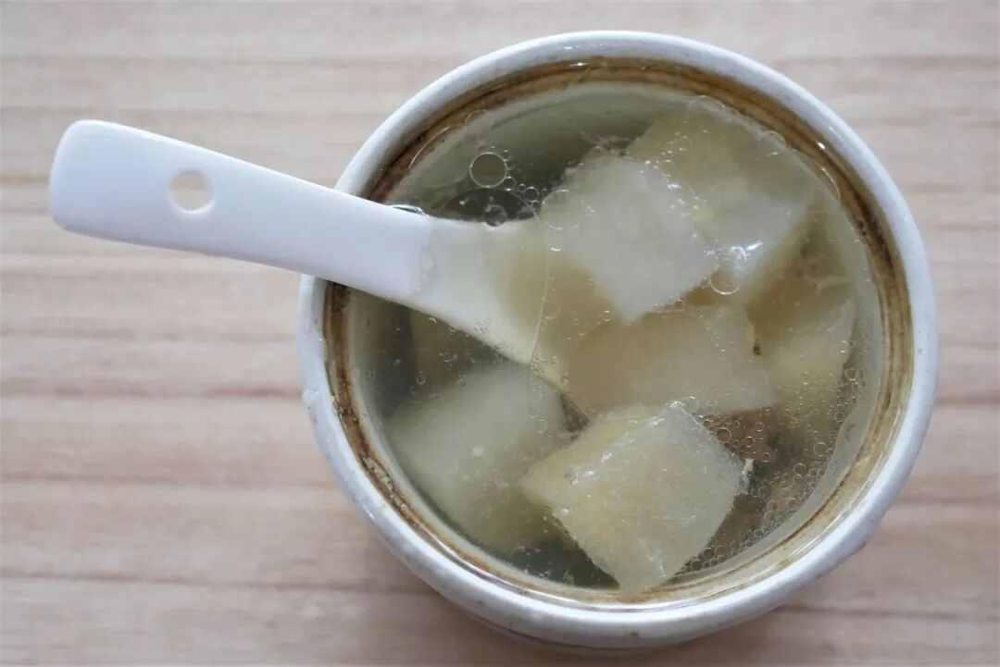

吃一碗炒粉或一碗干挑面，配一碗汤基本是大多数时候的选择。汤的种类自然是比不了南昌，价钱甚至还要高出两三块，但是当一碗6块钱的肉饼汤能捞出一大块肉饼时，真的实际上比4块钱一碗却只有一小颗肉圆的肉饼汤贵吗？

（3）

泰和萝卜

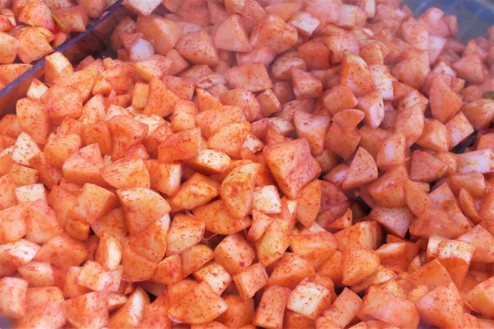

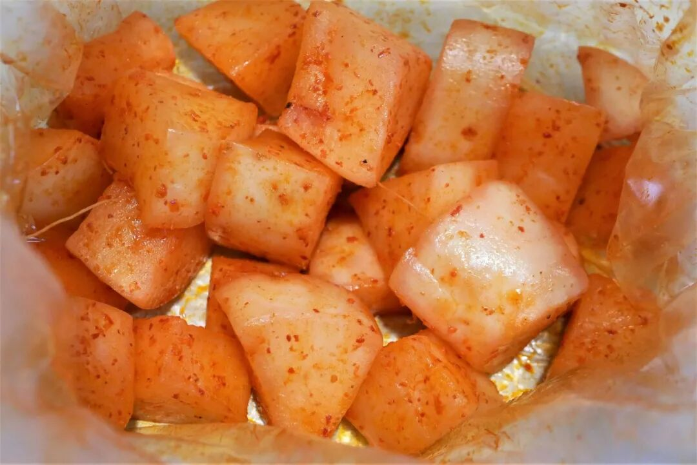

泰和萝卜，是源自吉安泰和县的一种特色腌萝卜，主要以食盐、醋、辣椒、白糖和甘草为调料腌制而成，成品通体橙黄带着点点艳红，一看便不是省油的灯。

光看外表很难推断其具体滋味，尝上一块瞬间被惊到——爽脆多汁的口感无可挑剔，更特别的是那直爽到胃里的酸甜滋味，一触碰到口腔便让唾液发疯似地涌出，那绝对是惊为天人的爽口。嘴上一爽便开始控制不住进食的量，一块一块吃下渐渐感觉辣的后劲满满渗出，直吃到合不拢嘴、手掌狂扇。真可谓辣并快乐着。

（4）

小南瓜炒牛肉

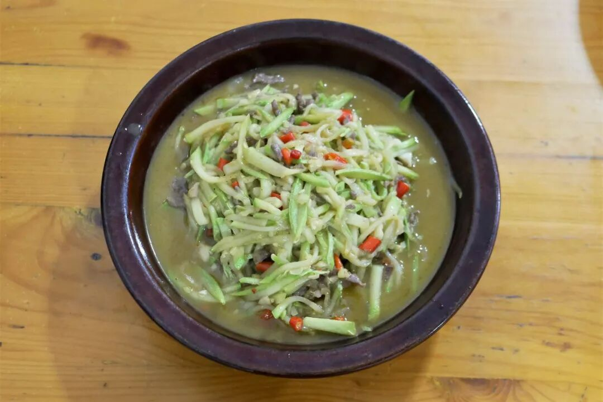

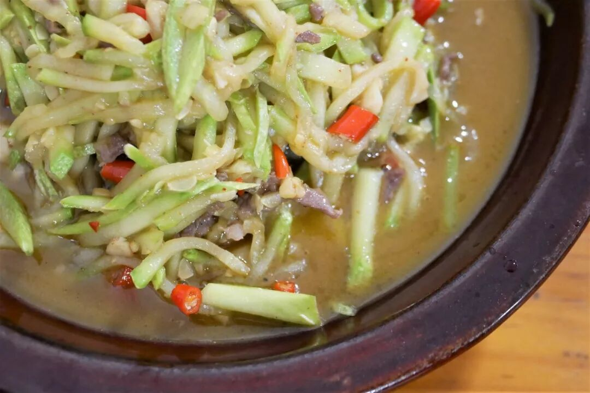

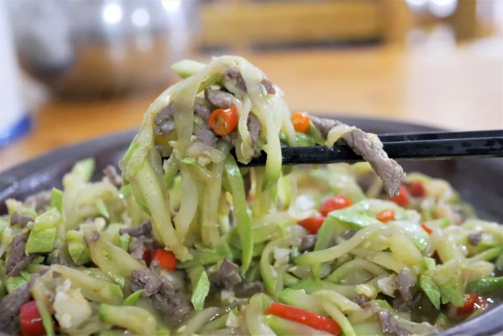

没有特定的目标，随便点上一道家常菜，吃罢便可离开。看到牛肉便挪不动腿的我，最终还是没忍住点了一盘牛肉相关的炒菜。

小南瓜炒牛肉是江西十分常见的家常菜，小南瓜切丝与牛肉丝同炒，本应是一道十分清鲜的菜，但是对于无辣不欢的江西人而言，不加些鲜红椒一起炒怎能成菜。不过好在，少量辣椒在增鲜的同时只是增添了少许辣感，与一般的江西菜相比这已是十分温和、可以为吃辣水平较弱的人所接受的那一类。

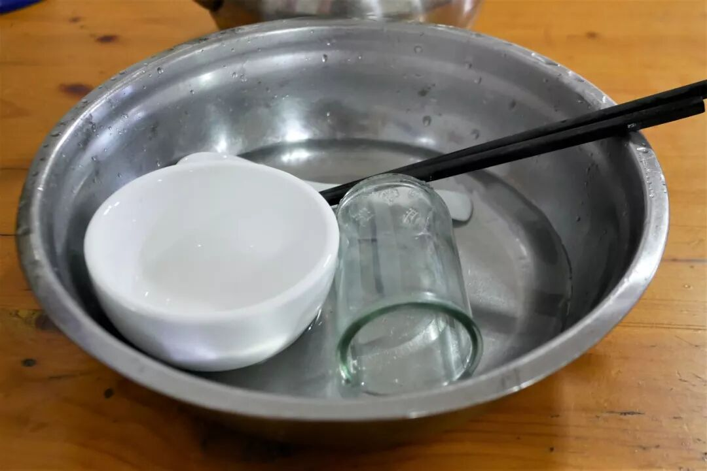

湖南和江西已完整地学习了广东涮碗的习惯，以后可千万别以为只有在广东吃饭才会有这一步骤了。

乘坐下午的火车离开吉安前往江西的最后一站赣州，离开前雨已止、透过层云甚至能隐隐看到蓝天，再看看后几日的天气预报，长舒了一口气。

我心里清楚吉安的山山水水有多丰富精彩，也知道更多真正的好味道存在于那不易到达的山岭之间。如果可以，在那里再见。

想知道我在干啥，请点这个链接：吃货的决心

想知道我要去哪，请点这个链接：555天行程计划

雨过天晴，好戏即将开场。

要不转发一波关注一波？

 var first_sceen__time = (+new Date()); if ("" == 1 && document.getElementById('js_content')) { document.getElementById('js_content').addEventListener("selectstart",function(e){ e.preventDefault(); }); }

 if ("0" == 1) { document.addEventListener("keydown",function(e){ if ((e.metaKey || e.ctrlKey) && (e.key === 'c' || e.key === 'C' || e.key === 'x' || e.key === 'X' || e.key === 'a' || e.key === 'A')) { if (e.target.tagName === 'INPUT' || e.target.tagName === 'TEXTAREA') { return; } e.preventDefault(); } }); document.addEventListener("copy",function(e){ var sel = window.getSelection(); var content = document.getElementById('js_content'); if (sel && sel.rangeCount > 0 && content && content.contains(sel.getRangeAt(0).commonAncestorContainer)) { e.preventDefault(); } }); }

预览时标签不可点

微信扫一扫

关注该公众号

知道了 (javascript:;)
