# 【第549天 内江（二）】油炸耙到酥枣兔

- 原文链接: https://mp.weixin.qq.com/s?__biz=MzA3MTM2Mjk3NA==&mid=2247503332&idx=1&sn=a0b00fcbbd91f4a4a9f5d7250f1cac1b&chksm=9f2c3d15a85bb40321429b1f6499e351cccd715318343fc7e77861d61a4697ebfff13e23723d&scene=21
- 作者: 宇哥食行记
- 发布时间: 未知
- 图片数量: 28

渐入深冬，为新年而备的川式湿冷再度登台，还好行程即将画上句号，否则这样的天里我再撑不住一两月的连续奔波。

今日的吃食，远不像昨日那般在内江街头随处可见，为了它们一天坐了四五趟公交，自己都觉得实在够卖力。

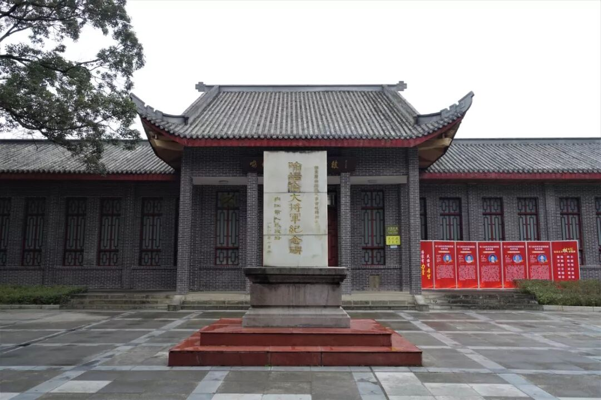

（1）

油炸粑

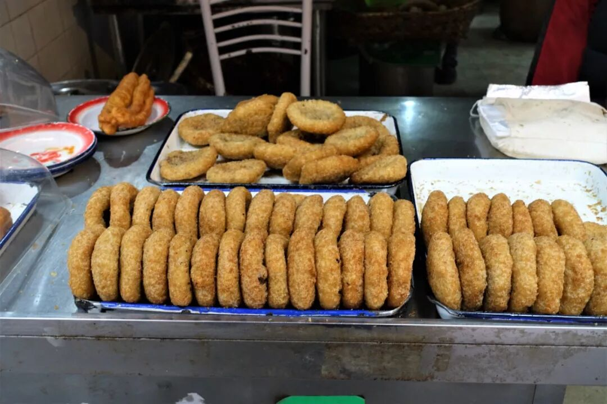

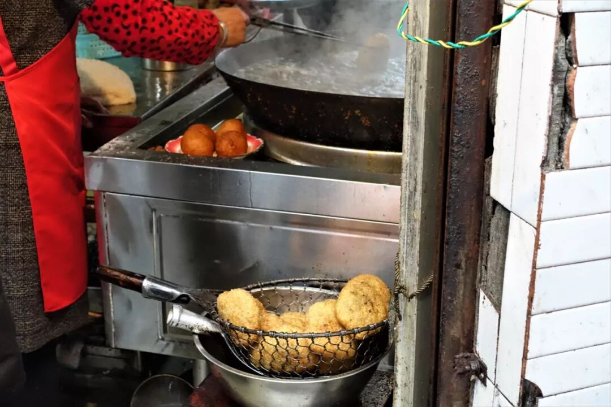

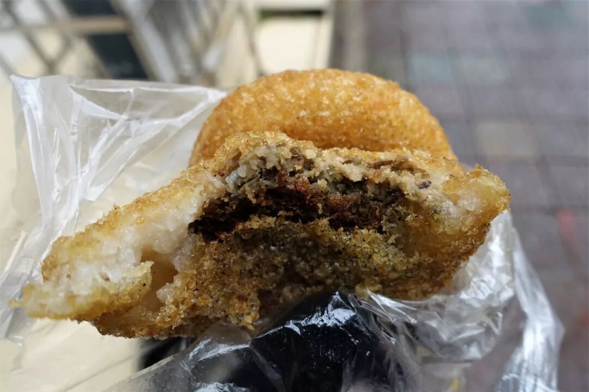

内江的油炸粑，全称板板桥油炸粑，是内江东兴区椑木镇的一道传统小吃。板板桥油炸粑与一般油炸粑确实有着比较明显的不同，它是以糯米饭团包裹烂豌的绿豆泥下油锅炸成，其中加入了椒盐调味。当你咬下一口，在焦脆的外壳、粘牙的内皮之后，本预期着豆沙的香甜立刻补上时，涌出的却是绿豆搭配椒盐组成的特殊咸香。这样的油炸粑，若是配上一碗微微甜的豆浆，定能相得益彰。

（2）

仔姜羊肉

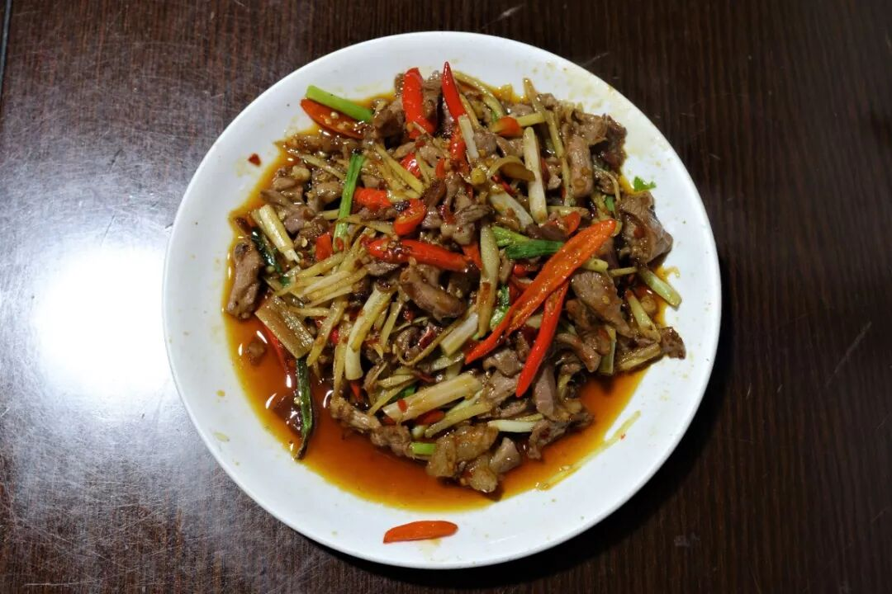

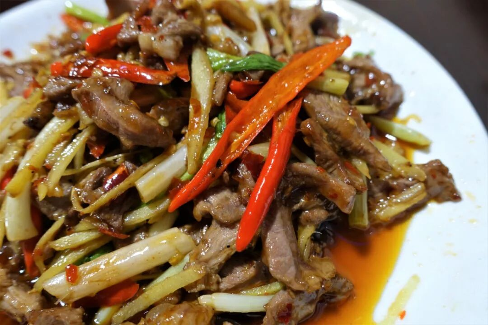

仔姜系列菜是内江地区非常家常的菜，属于盐帮菜中的一支，比如在传统红烧牛肉之外也多见以仔姜牛肉作臊子的牛肉面。明日冬至，四川人的传统习俗就是吃羊肉，当然以羊肉汤最佳，不过此番一人实在喝不动，炒一盘仔姜羊肉也算数吧。

仔姜即嫩姜，比之老姜脆生感强、辛辣味弱，加上豆瓣、泡姜等经典川味源泉炒出一盘仔姜羊肉，浓烈的咸香辛辣别提有多送饭了。但作为一个负责任的吃货，我也必须指出，哪怕这样的重调味，也盖不住羊肉的腥膻味，我的西北魂又开始发威了。

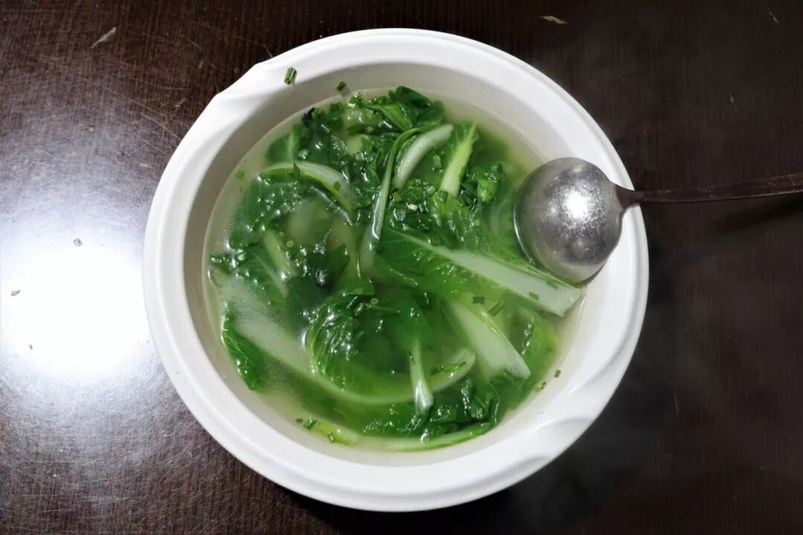

小菜汤，至简、至清，川南正餐里基本少不了它。

（3）

酥枣兔

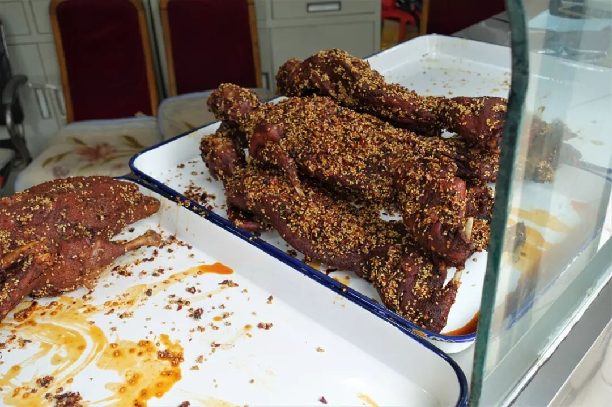

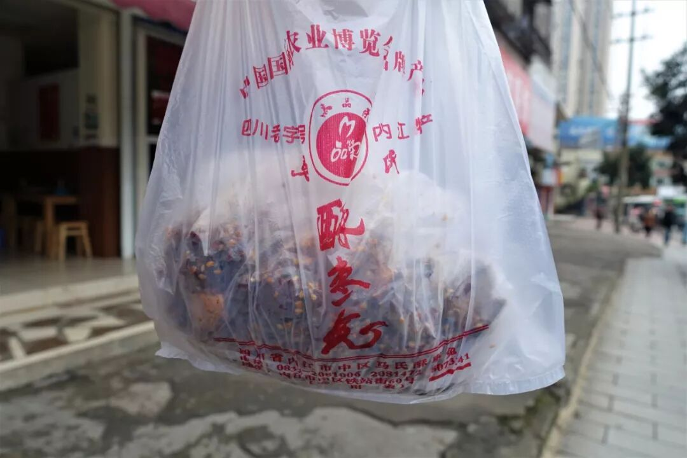

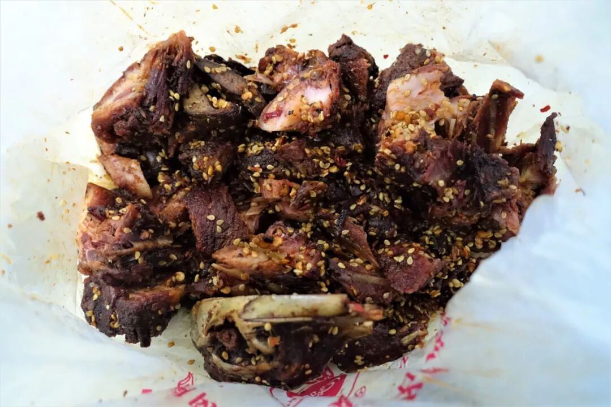

酥枣兔，称得上内江的一块宝，作为一种特产，它不同于那些满大街售卖、良莠不齐的知名特产，整个内江市区仅一家店，你需要专程坐车去寻找、品尝，但这并不妨碍它成为内江人公认的好味道。

酥枣兔得名于酥而脆、红如枣的特点，是将整兔处理干净后先腌制，然后放入特制的卤水中卤入味，再下油锅炸至外部酥脆，最后抹上一层芝麻、辣椒等秘制而成的料。经过油炸的兔肉确实外脆里韧，甚至细小的骨头都无需吐掉直接嚼碎，再加上外料的颗粒质感，整体层次感相当丰富，口味则咸香微辣，老少皆宜。

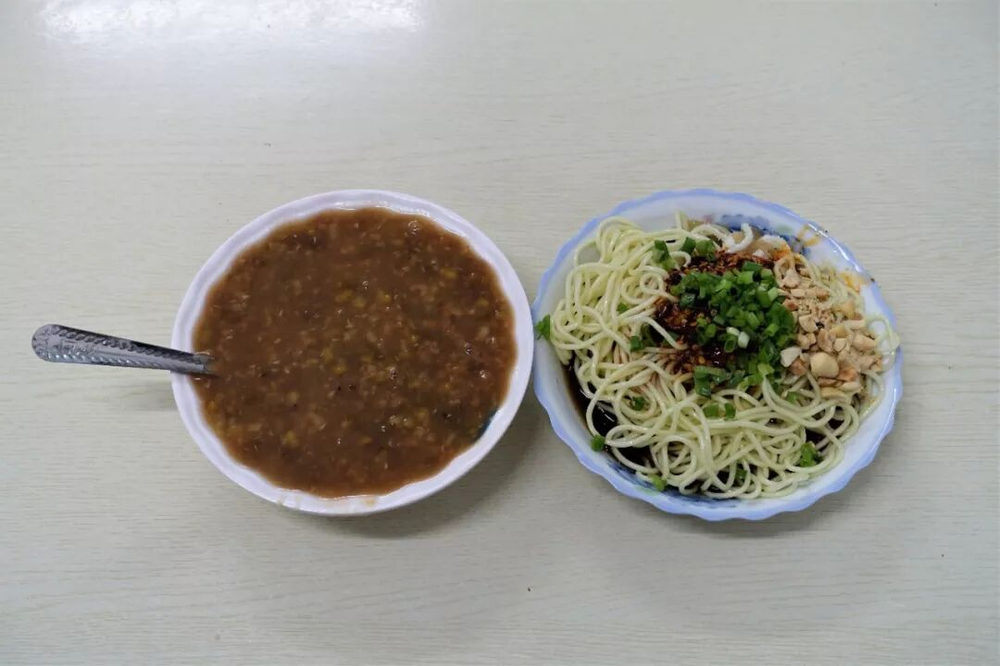

（左为绿豆沙）

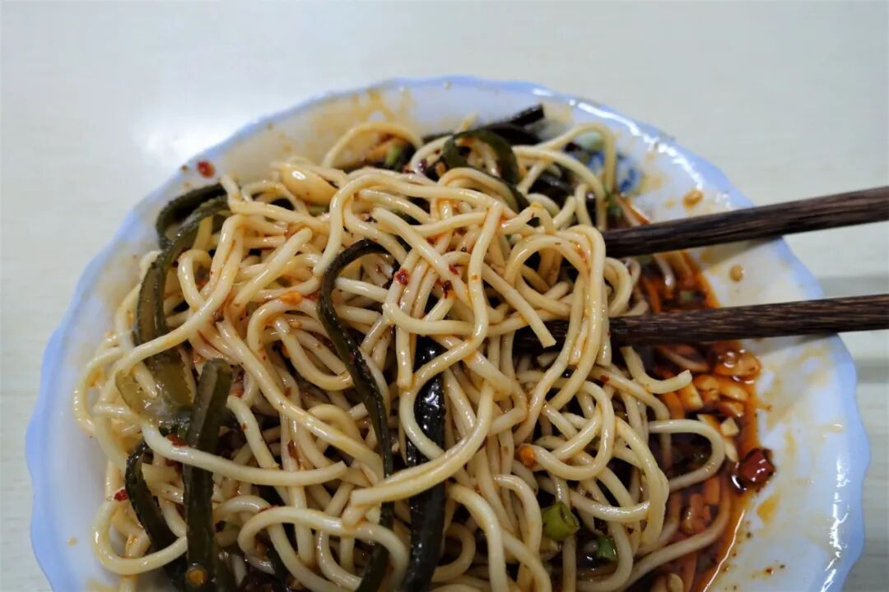

都说内江凉面好，尝了一碗果真名不虚传，甜酸香味突出，没有被过重的咸与辣盖住，吃起来相当清爽。

告别内江，剩下的是回家前最后的口舌狂欢。Go!

想知道我在干啥，请点这个链接：吃货的决心

想知道我要去哪，请点这个链接：我要去哪里

7

👆👆👆

 var first_sceen__time = (+new Date()); if ("" == 1 && document.getElementById('js_content')) { document.getElementById('js_content').addEventListener("selectstart",function(e){ e.preventDefault(); }); }

 if ("0" == 1) { document.addEventListener("keydown",function(e){ if ((e.metaKey || e.ctrlKey) && (e.key === 'c' || e.key === 'C' || e.key === 'x' || e.key === 'X' || e.key === 'a' || e.key === 'A')) { if (e.target.tagName === 'INPUT' || e.target.tagName === 'TEXTAREA') { return; } e.preventDefault(); } }); document.addEventListener("copy",function(e){ var sel = window.getSelection(); var content = document.getElementById('js_content'); if (sel && sel.rangeCount > 0 && content && content.contains(sel.getRangeAt(0).commonAncestorContainer)) { e.preventDefault(); } }); }

预览时标签不可点

微信扫一扫

关注该公众号

知道了 (javascript:;)
