# 【第551天 自贡（二）】有盐有味

- 原文链接: https://mp.weixin.qq.com/s?__biz=MzA3MTM2Mjk3NA==&mid=2247503330&idx=1&sn=1d02990d567354e1938c994de19ebd49&chksm=9f2c3d13a85bb405dadaab82d3966e0e60b0bb3d9f3bdb34c577a7e1a9569a6c70f4beba92ac&scene=21
- 作者: 宇哥食行记
- 发布时间: 未知
- 图片数量: 33

节日一过，周末一终，阳光一去，喧闹的街市果然又变得冷寂，用餐之地大多食客寥寥，不过也正适合独自一人享用热乎乎的汤面以及绝对咸辣够味的盐帮菜。

（1）

鸡婆头

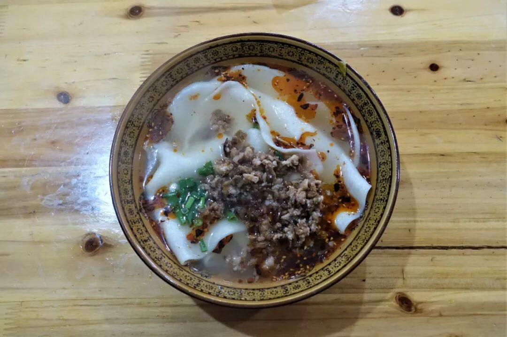

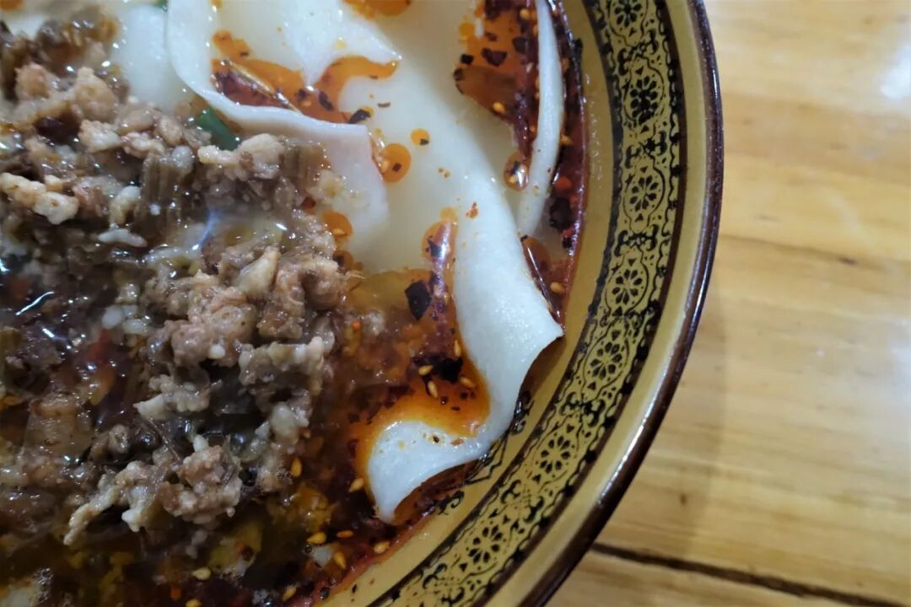

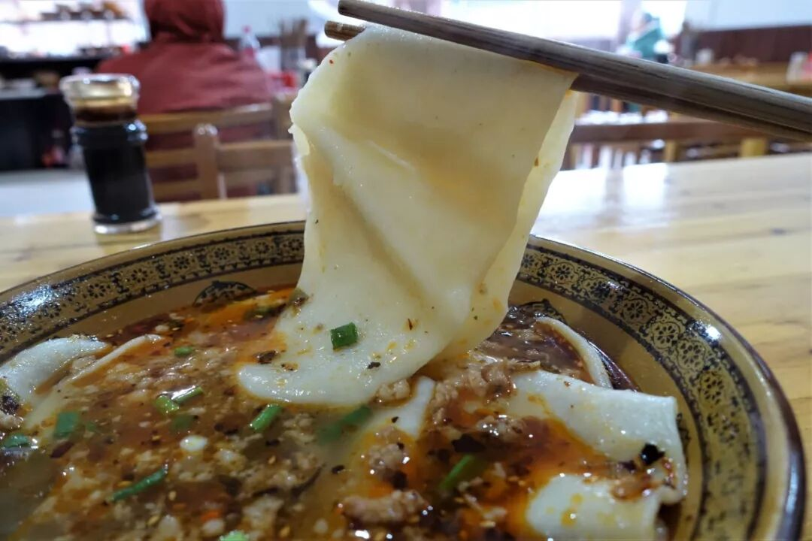

鸡婆头，源自富顺一带的面食，是又一种渐渐式微或许终将走向“灭绝”的传统饮食。鸡婆头与鸡并无关系，它事实上是由面团扯成的大面片，与荣昌铺盖面类似，厚度稍大，因形似旧时妇女裹头发的棉布而得名（四川有些土话里将妇女戏称为“鸡婆”）。

如此宽厚的面吃在口中自然是嚼劲十足、面香充裕。我一直觉得，我能够如此轻易地就适应并爱上北方式的面食，与我作为四川人的身份实在脱不了干系——口味上虽自成一派，却也有如此多的食物拥有南北结合的风格，从昨日的羊肉汤，到今日这口扎实的面，无一不为例证。

（2）

长生面

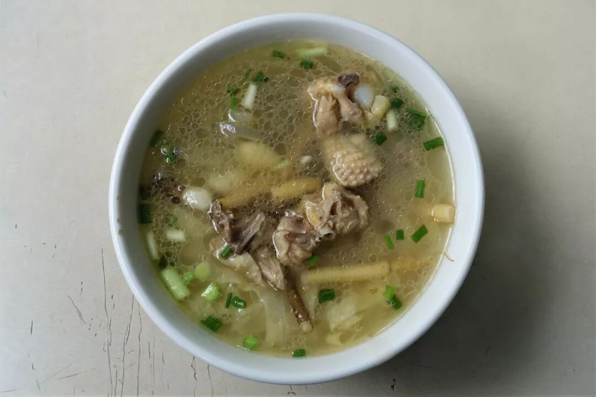

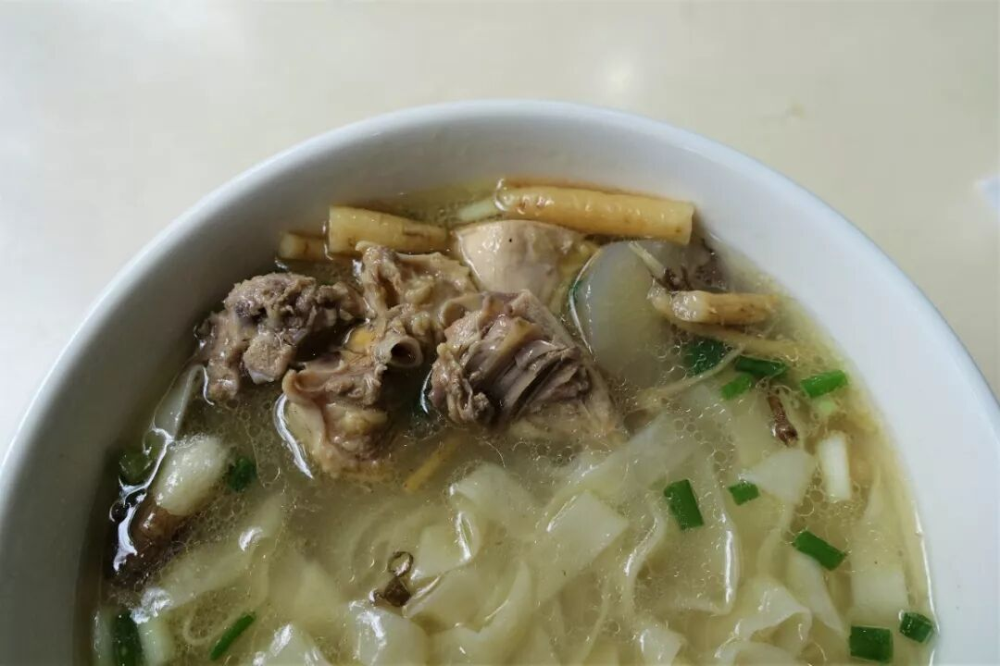

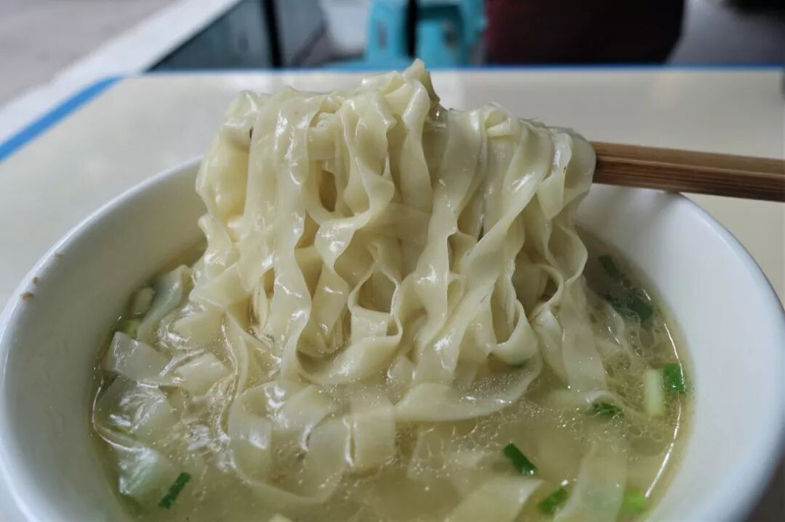

在如此重口的自贡，真的没有一口清淡味可供选择么？当然有，单就早餐而言，你大可来一碗不加辣椒的鸡婆头，或是吃这碗长生面。长生面与长寿面之类的来头并不等同，只是因为创始人名为“长生”，不过面条本身也谈得上滋补养身之效，按字面意思理解或也不差。

长生面说白了就是一碗鸡汤面，除鸡肉外，当归党参白果等中药材也入量充足，鲜香药香味浓郁。所下面条则是店家自制的挂面，宽薄而有弹性，相当爽口。说来有趣，点餐时店家刻意提醒我“这是清汤口味的面条哦”，再一观察周围食客，无一不是吃着牛肉面之类的重口面条，说到底，还是油盐香辣才有市场呢。

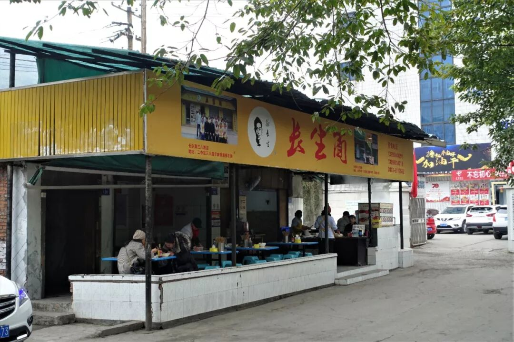

（3）

鲜锅兔

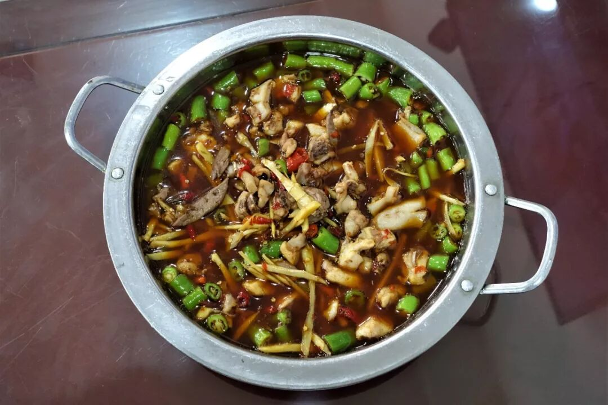

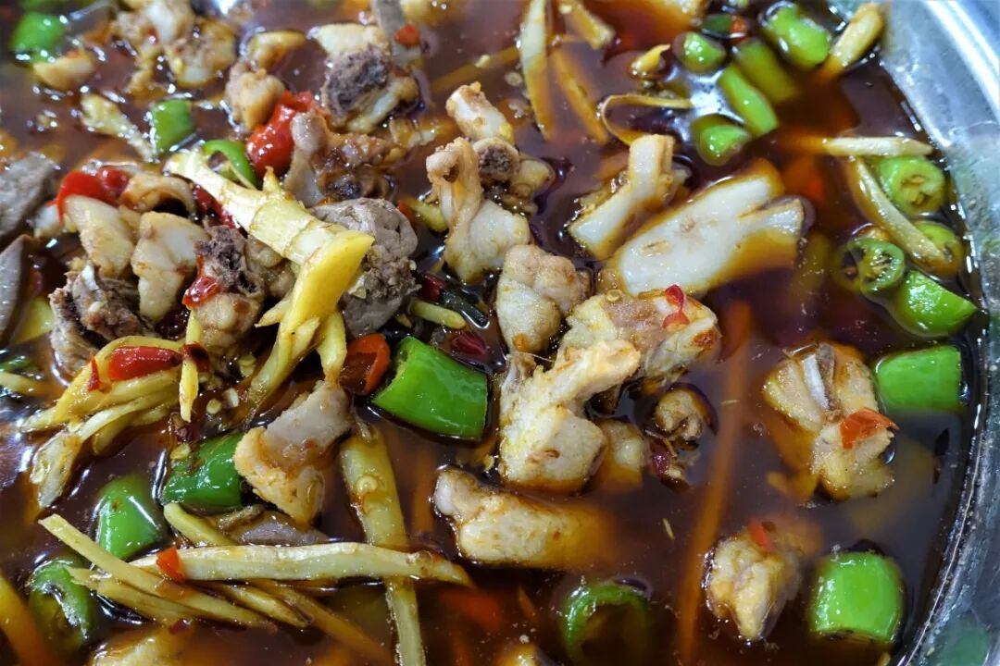

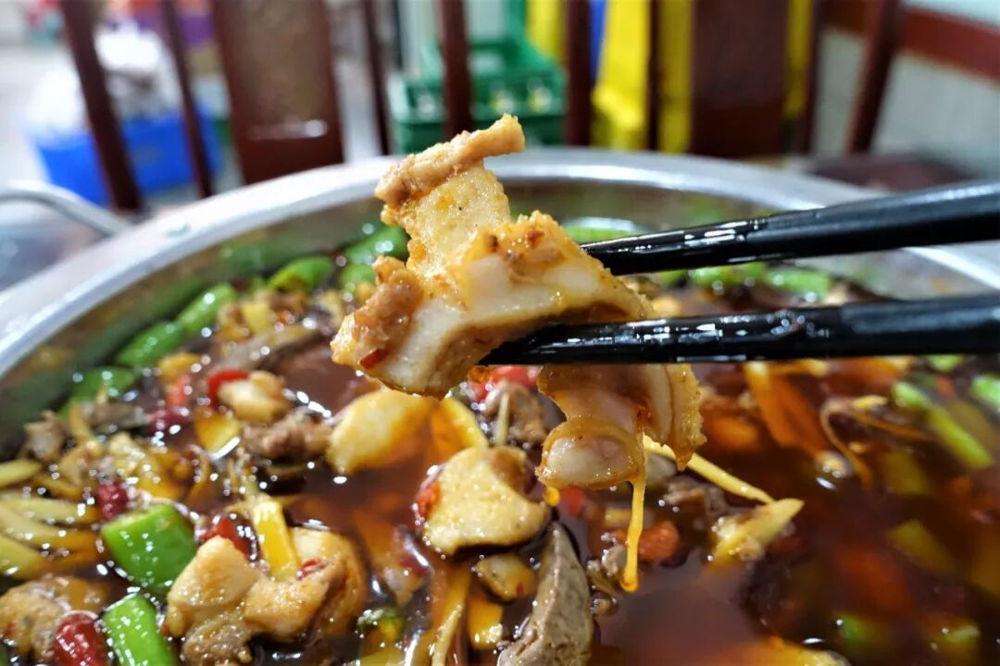

进入大菜环节，先说说兔子。

民间有俗话，“没有一只兔子能活着离开自贡”，此话千真万确。有不少外地朋友（特指川渝以外）第一次来自贡时根本无法直视饭店现场杀兔的情景，可最后吃到嘴里又停不下，让人忍俊不禁。

自贡人吃兔乃出了名的花样多，除了昨天的蘸水手撕兔、冷吃兔，还有盐帮菜里的鲜锅兔、尖椒兔、干锅兔以及菌汤兔（清淡）等，如果只选一样，首选一般为鲜锅兔。鲜锅兔是一道充分展示盐帮菜风格的菜，二荆条、小米辣、姜丝大量使用，而这几种调料正是盐帮菜最典型的可视标志。鲜兔切小块，重油重料炒制，加水煮成一锅，兔肉的鲜与嫩根本无需怀疑。至于你问我辣不辣......那还用问？

（4）

生爆肥肠

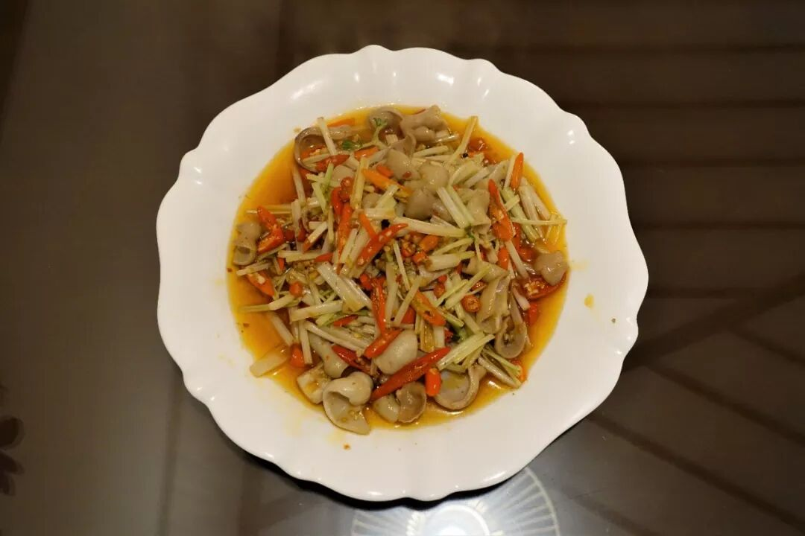

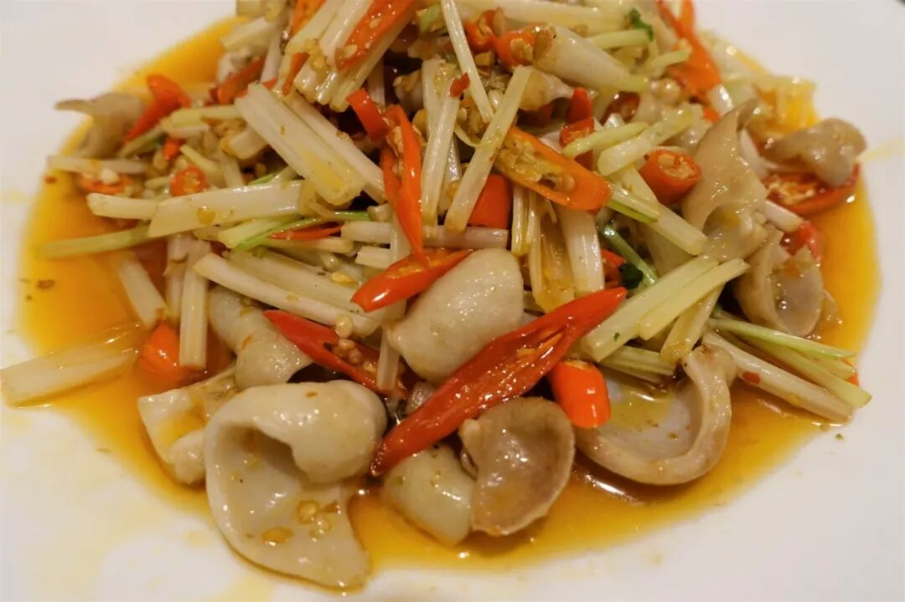

生爆、火爆系列菜是川南几市非常流行的日常菜肴，属于典型的小河帮川菜、盐帮菜。以生爆肥肠为例，肥肠洗净切段后以盐、酒腌制，以二荆条、小米辣、泡椒、豆瓣酱等为调料爆炒而成。肥肠一定要饱满、脆嫩，加上够味的咸酸香辣，妥妥又一道下饭神菜。

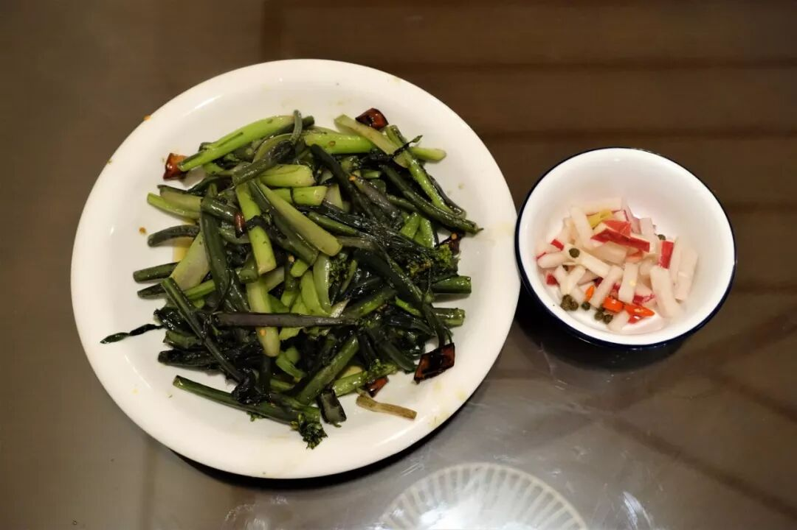

川南一带的炒青菜（炝炒），普遍说来，真的是要放干辣椒的。图为红油菜，也即红菜苔。泡菜在酸爽之余，少不了辣。

庞大的盐帮菜体系，一人两顿的战斗力只能蜻蜓点水般尝两道。经典川菜水煮牛肉便源自盐帮菜，更有跳水鱼、仔姜青蛙、葱葱鲫鱼等一些列经典在等待你我。但需要切记的是，不要过高估计自己的吃辣能力，重油重盐的调味也会劝退清淡口的食客。品味盐帮菜，多少还是要些缘分。

一个在自贡隔壁出生长大的人，竟过了二十多年才第一次亲临它、品味它，还好，终于实现了。

想知道我在干啥，请点这个链接：吃货的决心

想知道我要去哪，请点这个链接：我要去哪里

5

👆👆👆

 var first_sceen__time = (+new Date()); if ("" == 1 && document.getElementById('js_content')) { document.getElementById('js_content').addEventListener("selectstart",function(e){ e.preventDefault(); }); }

 if ("0" == 1) { document.addEventListener("keydown",function(e){ if ((e.metaKey || e.ctrlKey) && (e.key === 'c' || e.key === 'C' || e.key === 'x' || e.key === 'X' || e.key === 'a' || e.key === 'A')) { if (e.target.tagName === 'INPUT' || e.target.tagName === 'TEXTAREA') { return; } e.preventDefault(); } }); document.addEventListener("copy",function(e){ var sel = window.getSelection(); var content = document.getElementById('js_content'); if (sel && sel.rangeCount > 0 && content && content.contains(sel.getRangeAt(0).commonAncestorContainer)) { e.preventDefault(); } }); }

预览时标签不可点

微信扫一扫

关注该公众号

知道了 (javascript:;)
