# 名誉保护投诉指引

- 原文链接: https://mp.weixin.qq.com/s/_2kC-fXw7UjneZSrsC9CVQ
- 作者: 微信公众平台
- 发布时间: 未知
- 图片数量: 14

如你发现平台内存在内容侵犯了你的名誉/商誉/隐私/肖像等合法权益，可以通过手机提交投诉，平台核实后，会限制文章的分享能力，并对被投诉内容进行遮盖/模糊处理。

处理效果可参考下图:

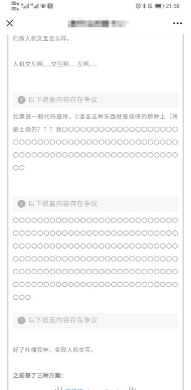

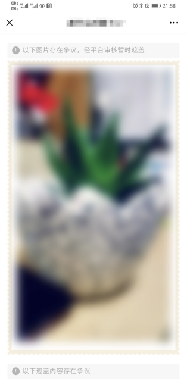

一、投诉入口：

1.进入文章详情页，点击右上方的【...】

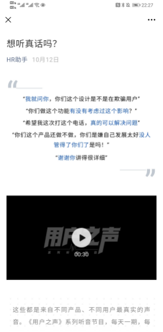

2.选择【投诉】

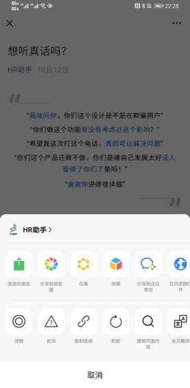

3.选择页面底部的【侵权（冒充他人、侵犯名誉等）

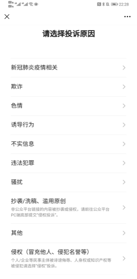

4.选择【内容侵犯名誉/商誉/隐私/肖像】

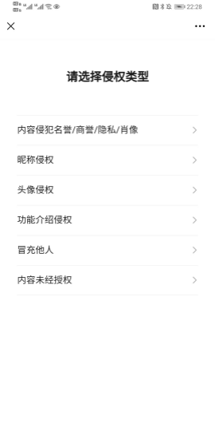

5.被侵权主体选择【个人类型】

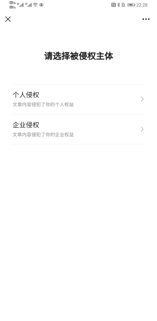

6.投诉范围选择【局部内容投诉】，即可进入投诉流程

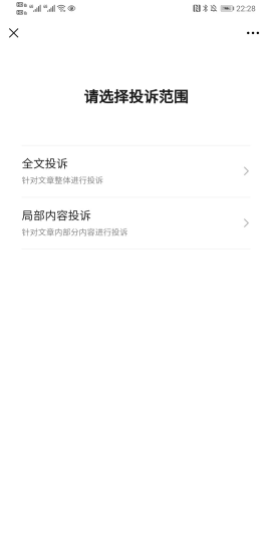

二、投诉流程

1.填写投诉人姓名+身份证号

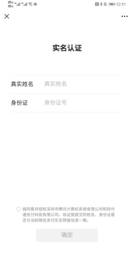

2.选择投诉人身份：权利人/代理人

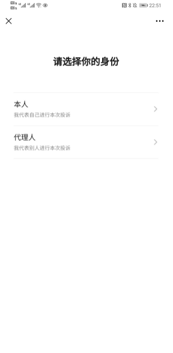

3.上传手持身份证照片

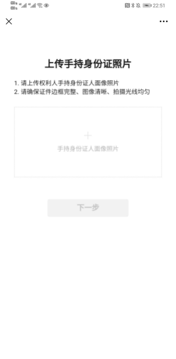

4.长按文字选取投诉内容

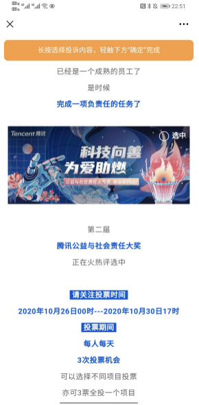

5.在投诉详情页完善相应的投诉信息

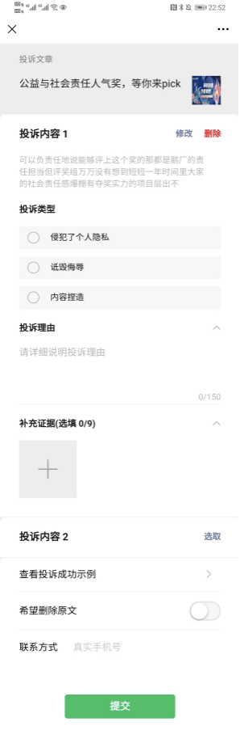

6.完成投诉提交，平台收到后会尽快进行审核

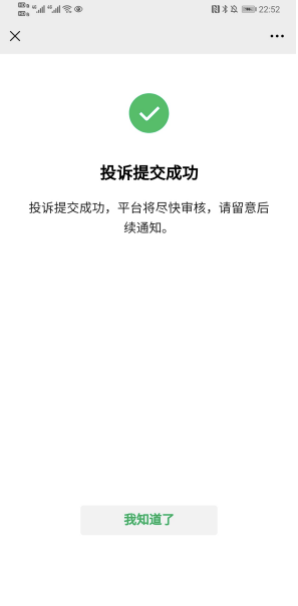

 var first_sceen__time = (+new Date()); if ("" == 1 && document.getElementById('js_content')) { document.getElementById('js_content').addEventListener("selectstart",function(e){ e.preventDefault(); }); }

 if ("0" == 1) { document.addEventListener("keydown",function(e){ if ((e.metaKey || e.ctrlKey) && (e.key === 'c' || e.key === 'C' || e.key === 'x' || e.key === 'X' || e.key === 'a' || e.key === 'A')) { if (e.target.tagName === 'INPUT' || e.target.tagName === 'TEXTAREA') { return; } e.preventDefault(); } }); document.addEventListener("copy",function(e){ var sel = window.getSelection(); var content = document.getElementById('js_content'); if (sel && sel.rangeCount > 0 && content && content.contains(sel.getRangeAt(0).commonAncestorContainer)) { e.preventDefault(); } }); }

预览时标签不可点

微信扫一扫

关注该公众号

知道了 (javascript:;)
